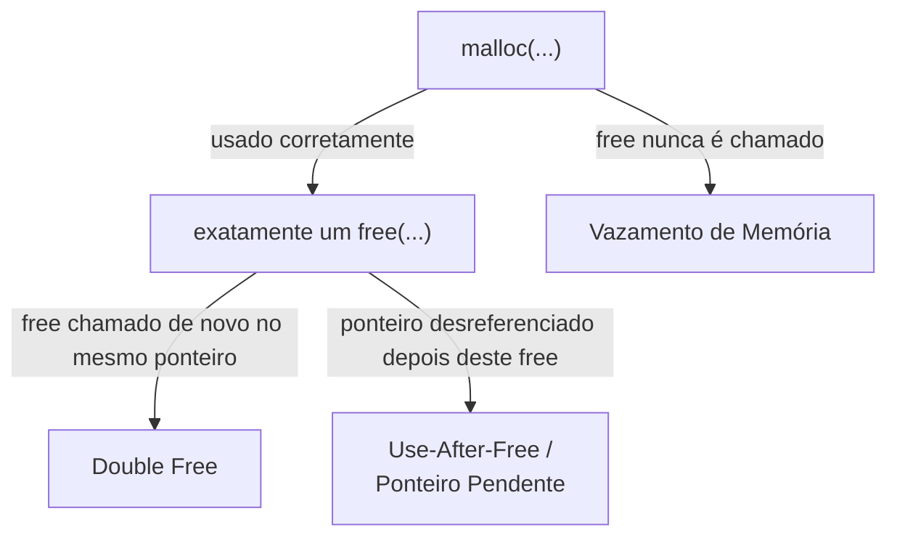

## Objetivos de Aprendizagem

- Distinguir três falhas específicas de gerenciamento do heap (o vazamento de memória, o double free e o ponteiro pendente / use-after-free) por exatamente qual invariante cada uma viola.
- Identificar um vazamento de memória num pequeno exemplo de código e explicar por que um vazamento é um problema de esgotamento de recursos, e não uma falha imediata.
- Identificar um double free e um use-after-free em pequenos exemplos de código e explicar por que ambos são comportamento indefinido, e não apenas "usar dados velhos".
- Explicar por que esses três bugs são uma consequência direta e estrutural de `malloc`/`free` exigirem que o programador acompanhe alocação e tempo de vida à mão.
- Indicar, para cada bug, um hábito defensivo concreto que o previne (casar cada `malloc` com exatamente um `free`, anular um ponteiro depois de liberá-lo, nunca guardar um ponteiro para algo já liberado).

## Contexto e Motivação

`the-heap-and-dynamic-allocation` estabeleceu a única invariante da qual o gerenciamento manual de memória depende por inteiro: todo `malloc` bem-sucedido precisa ser casado com exatamente um `free` (nem zero, nem mais de um), e um ponteiro liberado nunca deve ser desreferenciado de novo. Este conceito é a consequência direta de essa invariante ser violada, em cada uma das três formas distintas em que ela pode falhar. Não são casos extremos obscuros; são a classe de bug mais comum e mais estudada em código C e C++, justamente porque a linguagem não oferece nenhuma imposição automática da invariante nem verificação em tempo de execução quando ela é quebrada.

Entender esses bugs com precisão (não só "bugs de memória acontecem", mas qual regra específica cada um quebra) é o que torna o gerenciamento manual de memória tratável, e não aterrorizante. Um vazamento de memória (esquecer o `free`) é um problema de recursos: o programa continua rodando corretamente, só que com cada vez menos memória disponível ao longo do tempo, até acabar falhando ou sendo encerrado. Um double free (chamar `free` duas vezes no mesmo ponteiro) e um use-after-free / ponteiro pendente (desreferenciar memória depois de liberada) são ambos violações imediatas da própria contabilidade interna do alocador do heap: comportamento indefinido no instante em que ocorrem, e não apenas "ler dados antigos".

O CS:APP trata esses três modos de falha como o vocabulário padrão para raciocinar sobre a correção da memória dinâmica, e a aula dedicada "Managing the Heap" do CS107 de Stanford constrói diretamente exatamente essa taxonomia, não como uma lista de sustos, e sim como as formas precisas e nomeáveis em que a única invariante do conceito anterior pode ser violada.

## Teoria Central

### Vazamento de memória: um `malloc` sem `free` correspondente

Um vazamento ocorre quando um programa aloca memória e perde toda referência a ela (nenhum ponteiro no programa ainda guarda o endereço daquele bloco) sem nunca chamar `free` nela. A memória continua reservada, inutilizável por qualquer outra coisa, enquanto o programa continuar rodando:

```c
void leaky(void) {
    int *data = malloc(100 * sizeof(int));
    /* ... data é usado aqui ... */
}   /* data (o ponteiro, uma variável local/na pilha) sai de escopo aqui,
       mas os 100 ints para os quais ele apontava no heap nunca são liberados */
```

Quando `leaky` retorna, a variável ponteiro `data` (na pilha) é recuperada, exatamente como `the-stack-and-automatic-storage` descreveu, mas a memória do heap para a qual ela apontava não tem nenhuma outra referência em lugar nenhum do programa e nunca é liberada. Chamar `leaky` repetidamente (num laço, ou em muitas requisições num servidor de longa duração) vaza um pouco mais de memória a cada vez, até o processo acabar esgotando a memória disponível e falhar: não de imediato, mas inevitavelmente, se o vazamento nunca for corrigido.

### Double free: liberando o mesmo bloco duas vezes

Um double free ocorre quando `free` é chamado duas vezes no mesmo valor de ponteiro, sem um `malloc` intermediário que o reatribua a um bloco novo e válido:

```c
int *p = malloc(sizeof(int));
free(p);
/* ... algum outro código roda, possivelmente reaproveitando aquele bloco liberado numa nova alocação ... */
free(p);   /* double free: liberando memória que pode já pertencer a outra coisa */
```

O alocador do heap mantém sua própria contabilidade interna sobre quais blocos estão livres e quais estão em uso, e chamar `free` uma segunda vez num bloco já liberado corrompe essa contabilidade, podendo fazer o alocador entregar o *mesmo* bloco duas vezes a duas chamadas de `malloc` sem relação entre si mais tarde, ou travar de imediato, dependendo da implementação interna do alocador. Isso é comportamento indefinido justamente porque nada na linguagem especifica o que acontece; alocadores diferentes, e até o mesmo alocador em execuções diferentes, podem se comportar de formas diferentes.

### Ponteiro pendente / use-after-free: desreferenciando memória liberada

Um ponteiro pendente (dangling pointer) é um ponteiro cujo alvo já foi liberado (ou, conforme `the-stack-and-automatic-storage`, cujo alvo na pilha já saiu de escopo): a própria variável ponteiro ainda guarda o endereço antigo, mas esse endereço não se refere mais a um objeto válido:

```c
int *p = malloc(sizeof(int));
*p = 42;
free(p);            /* a memória é devolvida ao alocador do heap */

printf("%d\n", *p);  /* use-after-free: p está pendente, esta desreferência é comportamento indefinido */
```

`free(p)` não muda, e não tem como mudar, toda outra variável ponteiro que por acaso guarde o mesmo endereço: o próprio `p` ainda contém o endereço antigo depois disso, exatamente como `the-heap-and-dynamic-allocation` já observou. Desreferenciá-lo depois pode ler o valor que estava lá (se a memória ainda não foi reaproveitada), pode ler lixo (se foi reaproveitada para outra coisa) ou pode travar; nenhum desses resultados é garantido, e é exatamente isso que torna este bug intermitente e difícil de reproduzir de forma confiável.



### Por que o gerenciamento manual torna esses bugs estruturais, e não acidentais

Os três bugs remontam à mesma causa raiz: a interface `malloc`/`free` de C exige que o programador acompanhe, inteiramente à mão e ao longo de quantas funções e caminhos de código um programa tiver, exatamente quais blocos estão válidos no momento e exatamente uma chamada de `free` por bloco. Não há verificação do compilador, nem imposição em tempo de execução, nem rastreamento automático de "este ponteiro ainda é válido"; a disciplina descrita em `the-heap-and-dynamic-allocation` (exatamente um `malloc`, exatamente um `free` correspondente) é toda a defesa, e cada um desses três bugs é o que acontece quando um caminho de código específico deixa de mantê-la.

## Exemplos Resolvidos

### Exemplo 1: um vazamento escondido num retorno antecipado

```c
int processFile(const char *filename) {
    char *buffer = malloc(1024);
    if (buffer == NULL) return -1;

    FILE *f = fopen(filename, "r");
    if (f == NULL) {
        return -1;    /* VAZAMENTO: retorna sem liberar buffer */
    }

    /* ... lê e processa o arquivo ... */
    fclose(f);
    free(buffer);
    return 0;
}
```

O caminho de sucesso libera `buffer` corretamente antes de retornar, mas o caminho de retorno antecipado, seguido quando `fopen` falha, retorna sem nunca chegar a `free(buffer)`. Essa é a forma mais comum que um vazamento assume no mundo real: não uma função que nunca libera nada, e sim uma função com *um caminho entre vários* que pula o `free` de que precisava. Corrigir isso significa auditar cada `return` da função, e não só o "principal".

### Exemplo 2: um double free disparado por compartilhar um ponteiro

```c
void cleanup(int *p) {
    free(p);
}

int main(void) {
    int *data = malloc(sizeof(int));
    cleanup(data);
    /* ... mais tarde, outro código, sem saber que cleanup já liberou data ... */
    free(data);   /* double free: data já foi liberado dentro de cleanup */
}
```

`cleanup` libera `data` corretamente, do seu próprio ponto de vista; ela não tem como saber se quem a chamou também vai tentar liberar o mesmo ponteiro depois. O bug não está localizado em nenhuma das funções isoladamente: é uma violação da invariante do *programa inteiro* de que cada alocação recebe exatamente um `free`, quando a posse (qual parte do programa é responsável por liberar um dado ponteiro) não é acompanhada com clareza através das fronteiras entre funções.

### Exemplo 3: um ponteiro pendente sobrevivendo dentro de uma struct

```c
struct Cache {
    int *data;
};

void refreshCache(struct Cache *c) {
    free(c->data);              /* libera os dados antigos */
    c->data = malloc(100 * sizeof(int));  /* aloca dados novos */
}

int readCache(struct Cache *c, int index) {
    return c->data[index];      /* seguro aqui, já que c->data acabou de ser atualizado */
}

/* em outro lugar, um ponteiro diferente que nunca foi atualizado: */
int *stalePointer = someCache->data;   /* guardado antes de uma chamada a refreshCache() */
refreshCache(someCache);
printf("%d\n", stalePointer[0]);        /* pendente: stalePointer ainda guarda o endereço ANTIGO, já liberado */
```

`refreshCache` atualiza corretamente `someCache->data` para apontar para memória nova, mas `stalePointer`, uma variável separada que antes copiou o endereço *antigo*, nunca é atualizada e não tem como saber que a memória à qual se refere foi liberada. É exatamente por isso que "quem mais pode estar guardando uma cópia deste endereço" é a verdadeira pergunta por trás de todo bug de ponteiro pendente: liberar memória só invalida aquela memória; não faz nada com as (potencialmente muitas) outras variáveis que copiaram seu endereço antes.

## Equívocos Comuns e Armadilhas

- **"Um vazamento de memória trava o programa de imediato."** Não trava: um vazamento é um dreno lento de recursos, não uma falha imediata. Um programa com vazamento pode rodar corretamente, às vezes por muito tempo, antes de acabar esgotando a memória disponível e falhar, e é exatamente por isso que vazamentos costumam passar despercebidos em testes curtos e só aparecem no uso prolongado em produção.
- **"Um double free é inofensivo se a memória liberada ainda não foi reaproveitada."** É comportamento indefinido quer a memória tenha sido visivelmente reaproveitada ou não: ele corrompe a contabilidade interna do alocador no momento em que acontece, mesmo que o sintoma visível (uma falha, ou corrupção de dados em outro lugar) só apareça muito depois.
- **"Atribuir `NULL` a um ponteiro depois de liberá-lo corrige todo bug de ponteiro pendente."** Isso só protege *aquela* variável ponteiro. O Exemplo 3 mostra exatamente por que outras variáveis que guardam cópias independentes do mesmo endereço, agora inválido, não são afetadas em nada por anular uma só delas.
- **"Esses três bugs são problemas separados, sem relação, que exigem correções separadas."** Os três são violações exatamente da mesma invariante de `the-heap-and-dynamic-allocation` (exatamente um `free` por `malloc`, nenhuma desreferência depois), abordada por ângulos diferentes: frees de menos (vazamento), frees demais (double free) e uma desreferência depois que o número correto de frees já aconteceu (ponteiro pendente).

## Resumo

Três modos de falha distintos decorrem diretamente da disciplina de acompanhamento manual de `malloc`/`free`: um vazamento de memória (um `malloc` sem `free` correspondente, esgotando silenciosamente a memória disponível ao longo do tempo), um double free (chamar `free` duas vezes no mesmo bloco, corrompendo a contabilidade interna do alocador) e um ponteiro pendente / use-after-free (desreferenciar memória depois que ela já foi liberada, cujo resultado, seja dado velho, lixo ou uma falha, nunca é garantido). Os três são a consequência estrutural de C não oferecer nenhum rastreamento automático de quais blocos do heap estão válidos no momento, deixando toda a invariante "exatamente um `free` por `malloc`, nunca desreferenciado depois" a cargo do programador, ao longo de quantas funções, caminhos de retorno e ponteiros compartilhados um programa real tiver.

## Documentation Links

- [Bryant & O'Hallaron: Computer Systems: A Programmer's Perspective (CS:APP)](https://csapp.cs.cmu.edu/): livro-texto que estabelece vazamentos, double frees e ponteiros pendentes como o vocabulário padrão para raciocinar sobre a correção do heap.
- [Stanford CS107: General Information and Syllabus](https://web.stanford.edu/class/cs107/syllabus): curso cuja aula "Managing the Heap" constrói diretamente essa mesma taxonomia de bugs de gerenciamento do heap.
