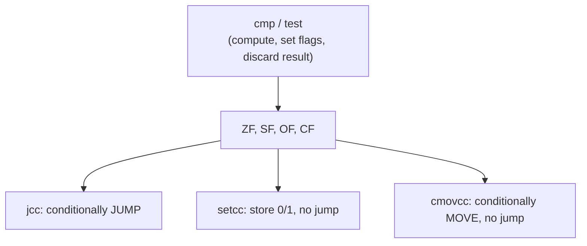

## Learning Objectives

- Name the four condition-code flags used throughout this material — ZF, SF, OF, CF — and state what each one reports about the most recent arithmetic or logical instruction.
- Explain the difference between `cmp` and `test`, and what each one computes internally to set the flags, without storing that computation's result anywhere.
- Read and write conditional jump instructions (`je`, `jne`, `jg`, `jl`, `ja`, `jb`, and others), correctly matching each one to the flag combination it checks.
- Distinguish `setcc` (store a 0/1 result) and `cmovcc` (conditionally move) from `jcc` (conditionally jump), identifying when a program would use one instead of another.
- Connect every flag and instruction covered here directly to the ALU flags already covered structurally in `digital-logic-computer-organization`, identifying this concept as the real ISA-level use of that exact hardware signal.

## Context & Motivation

`digital-logic-computer-organization/alu-operation-selection-and-flags` established that an ALU reports more than just its main result: it also sets a handful of one-bit flags — zero, negative, overflow, carry — that a CPU's control logic reads to decide whether a conditional branch should actually jump. That concept described the flags structurally, as signals a hardware datapath produces and consumes. This concept is the real, named ISA-level use of those exact same signals: x86-64 calls them ZF, SF, OF, and CF, and provides a specific family of instructions — `cmp`, `test`, and the `jcc`/`setcc`/`cmovcc` families — built entirely around reading and acting on them.

This is also the mechanical foundation for `translating-control-flow-if-while-for`, the next concept in this cluster: every `if`, `while`, and `for` a C program writes eventually becomes some sequence of a comparison instruction (setting flags) followed by a conditional jump (reading them) — there is no separate "if statement" instruction in the ISA; a high-level conditional is always built from these two more primitive pieces. Understanding the flags and how conditional instructions read them is therefore not a side topic but the direct prerequisite for understanding how any C control-flow construct is actually compiled.

CS107's guide to x86-64 documents this exact instruction family — `cmp`, `test`, and the full `jcc` mnemonic list — as core reference material, and CS:APP dedicates careful attention to condition codes specifically because nearly every subsequent topic in machine-level programming (control flow, loops, comparisons) depends on understanding them first.

## Core Theory

### The four condition-code flags

Following most arithmetic and logical instructions, the processor updates a small set of one-bit flags describing properties of the result — not the result's value itself, just facts about it:

```text
ZF (Zero Flag)      — set to 1 if the result was exactly zero
SF (Sign Flag)       — set to 1 if the result's most significant bit is 1 (negative, in two's complement)
OF (Overflow Flag)   — set to 1 if a signed arithmetic overflow occurred
CF (Carry Flag)      — set to 1 if an unsigned arithmetic carry/borrow occurred
```

These are exactly the four flags `alu-operation-selection-and-flags` already introduced as the ALU's non-primary outputs — this concept simply gives them their real x86-64 names and shows the actual instructions built to read them.

### `cmp`: subtract, but only keep the flags

`cmp` computes a subtraction — exactly like `sub` — but discards the numeric result entirely, keeping only the flags that subtraction would have set:

```text
cmpq %rbx, %rax    ; computes %rax - %rbx internally, sets flags, discards the result
```

If `%rax` and `%rbx` hold equal values, `%rax - %rbx` is 0, so ZF is set to 1 — which is exactly what `je` (jump if equal) checks for below. If `%rax` is less than `%rbx` (as signed values), the subtraction is negative, so SF is set — the basis for `jl` (jump if less). `cmp` is, quite literally, `sub` with its numeric output thrown away and only its side effect (the flags) kept.

### `test`: bitwise AND, but only keep the flags

```text
testq %rax, %rax    ; computes %rax & %rax internally (i.e., just %rax), sets flags, discards the result
```

`test` behaves the same way relative to `and`: it performs a bitwise AND and discards the result, keeping only the flags. `testq %rax, %rax` is a specific, extremely common idiom for checking whether `%rax` is zero — ANDing any value with itself reproduces that value unchanged, so ZF ends up set exactly when `%rax` itself was zero, without needing a separate comparison against an explicit 0.

### Conditional jumps: `jcc`, reading the flags

A conditional jump checks a specific combination of flags and, if that combination holds, redirects execution to a target address instead of continuing to the next instruction:

```text
je  / jz     — jump if ZF == 1                (equal / zero)
jne / jnz    — jump if ZF == 0                (not equal / not zero)
jg           — jump if greater (signed)        — checks ZF and SF/OF together
jge          — jump if greater or equal (signed)
jl           — jump if less (signed)
jle          — jump if less or equal (signed)
ja           — jump if above (unsigned)        — checks CF and ZF
jb           — jump if below (unsigned)
```

The signed (`jg`/`jl`/...) and unsigned (`ja`/`jb`/...) families exist as genuinely separate instructions because "greater than" means something different depending on how the same bit pattern is interpreted — exactly the same distinction `unsigned-and-twos-complement-integers` already established between reading a pattern as unsigned versus as two's-complement signed. Using the signed comparison family on values meant to be unsigned (or vice versa) produces a real, silent bug: the flags are computed the same way regardless, but the wrong `jcc` variant checks the wrong combination for the intended interpretation.

### `setcc` and `cmovcc`: acting on flags without jumping

Not every use of a condition needs a jump. `setcc` stores a 0 or 1 into a register based on a flag condition, and `cmovcc` conditionally performs a move, without ever branching:

```text
cmpq %rbx, %rax
setg %cl          ; %cl = 1 if %rax > %rbx (signed), else 0 — no jump, just a stored result

cmovg %rbx, %rax   ; if the PREVIOUS flags satisfy "greater", copy %rbx into %rax; else leave %rax unchanged
```

`cmovcc` is a real, practical alternative to a short `jcc`-based branch, and compilers use it specifically because a modern processor's pipeline (a subject for `computer-architecture`, not this discipline) can suffer a real performance penalty when it guesses wrong about which way a conditional jump will go — a conditional move has no such guess to make, since both possible values are already computed and it simply picks one.



## Worked Examples

### Example 1: comparing two signed integers and branching

```c
if (a > b) {
    result = 1;
} else {
    result = 0;
}
```

```text
; assuming a in %eax, b in %ebx
cmpl %ebx, %eax      ; compute %eax - %ebx, set flags, discard the result
jg   .L_greater       ; if (signed) %eax > %ebx, jump to the "greater" branch
movl $0, %ecx          ; else-branch: result = 0
jmp  .L_done
.L_greater:
movl $1, %ecx          ; if-branch: result = 1
.L_done:
```

`cmpl` computes `a - b` purely to set the flags (ZF, SF, OF); `jg` reads exactly the combination of those flags that means "the subtraction was positive under a signed interpretation," and jumps to `.L_greater` only when that holds. This two-instruction pattern — one `cmp`, one `jcc` — is the universal shape every signed comparison in C compiles down to.

### Example 2: `test` for a null-pointer check

```c
if (p != NULL) {
    use(p);
}
```

```text
; assuming p is in %rax
testq %rax, %rax     ; %rax & %rax — sets ZF if %rax itself is 0
je    .L_skip          ; if ZF is set (p was NULL), skip the call
call  use
.L_skip:
```

`testq %rax, %rax` is the idiomatic way to check "is this register zero" without an explicit comparison against the immediate value 0 — a real pattern a disassembler or a human reading raw assembly will encounter constantly, and one that's easy to misread as "doing nothing" if the `test`-against-itself idiom isn't already familiar.

### Example 3: unsigned versus signed comparison, same bit pattern, different jump

```text
; %eax holds the 32-bit pattern 0xFFFFFFFF

cmpl $0, %eax
jl   .L_taken_if_signed     ; taken: as SIGNED, 0xFFFFFFFF means -1, and -1 < 0
```

```text
cmpl $0, %eax
jb   .L_taken_if_unsigned   ; NOT taken: as UNSIGNED, 0xFFFFFFFF is the largest possible value, not below 0
```

The exact same bit pattern and the exact same `cmp` instruction produce flags that mean opposite things depending on which conditional jump family reads them afterward — `jl` (signed "less than") is taken, because `0xFFFFFFFF` as a two's-complement signed value is -1, which is less than 0; `jb` (unsigned "below") is never taken here, because as an unsigned value `0xFFFFFFFF` is the maximum possible 32-bit number, nowhere close to being "below" 0. This is the exact signed/unsigned interpretation distinction from `digital-logic-computer-organization` showing up as a real, consequential choice between two instruction families that otherwise look nearly identical.

## Common Misconceptions & Pitfalls

- **"`cmp` stores its subtraction result somewhere, like `sub` does."** It discards the numeric result entirely — its only observable effect is the flags it sets. Looking for where `cmp`'s "answer" went is a category error; the answer *is* the flags.
- **"`jg`/`jl` and `ja`/`jb` are just different names for the same comparison."** They check different flag combinations, appropriate for genuinely different interpretations (signed versus unsigned) of the exact same bits — using the wrong family on data meant for the other interpretation produces a real, silent logic error, exactly as Example 3 demonstrates.
- **"A conditional jump is the only way to act on a comparison's result."** `setcc` (store a 0/1) and `cmovcc` (conditionally move) both act on the same flags without ever branching, and are frequently preferred by real compilers specifically to avoid the performance cost a mispredicted jump can incur on a pipelined processor.
- **"`test %rax, %rax` does nothing, since it AND's a register with itself."** It has no effect on `%rax`'s stored value, but it does have an effect: it sets the flags exactly as if `%rax` had been compared against 0, which is the entire point of the idiom, as shown in Example 2.

## Summary

x86-64 exposes the same four ALU flags already covered structurally in `digital-logic-computer-organization` — ZF, SF, OF, CF — under their real names, updated by nearly every arithmetic and logical instruction. `cmp` and `test` are dedicated instructions that compute a subtraction or an AND purely to set these flags, discarding the numeric result entirely; `jcc` (conditional jump), `setcc` (store 0/1), and `cmovcc` (conditional move) are the three distinct ways a program can act on those flags afterward, chosen based on whether a branch, a stored boolean, or a branchless conditional value is actually needed. Choosing the signed (`jg`/`jl`) versus unsigned (`ja`/`jb`) instruction family correctly, for data meant to be interpreted one way or the other, is exactly as consequential as the signed/unsigned distinction already established for number representation — the same bits, read the wrong way, produce a real and silent bug.

## Documentation Links

- [Stanford CS107 — Guide to x86-64](https://web.stanford.edu/class/cs107/guide/x86-64.html) — reference covering condition codes, `cmp`/`test`, and the full `jcc` mnemonic family.
- [Bryant & O'Hallaron — Computer Systems: A Programmer's Perspective (CS:APP)](https://csapp.cs.cmu.edu/) — textbook whose treatment of condition codes and conditional instructions this discipline follows.
