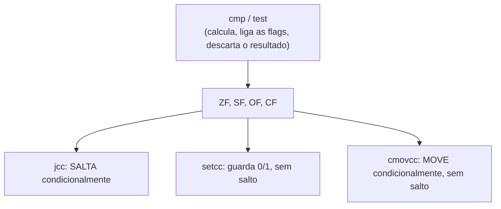

## Objetivos de Aprendizagem

- Nomear as quatro flags de código de condição usadas ao longo deste material (ZF, SF, OF, CF) e dizer o que cada uma informa sobre a instrução aritmética ou lógica mais recente.
- Explicar a diferença entre `cmp` e `test` e o que cada uma calcula internamente para ligar as flags, sem guardar o resultado desse cálculo em lugar nenhum.
- Ler e escrever instruções de salto condicional (`je`, `jne`, `jg`, `jl`, `ja`, `jb` e outras), associando corretamente cada uma à combinação de flags que ela verifica.
- Distinguir `setcc` (guardar um resultado 0/1) e `cmovcc` (mover condicionalmente) de `jcc` (saltar condicionalmente), identificando quando um programa usaria uma em vez da outra.
- Ligar cada flag e instrução vista aqui diretamente às flags da ULA já vistas estruturalmente em `digital-logic-computer-organization`, identificando este conceito como o uso real, no nível da ISA, exatamente desse sinal de hardware.

## Contexto e Motivação

`digital-logic-computer-organization/alu-operation-selection-and-flags` estabeleceu que uma ULA informa mais do que só o resultado principal: ela também liga um punhado de flags de um bit (zero, negativo, overflow, carry) que a lógica de controle de uma CPU lê para decidir se um desvio condicional deve de fato saltar. Aquele conceito descreveu as flags estruturalmente, como sinais que um datapath de hardware produz e consome. Este conceito é o uso real e nomeado, no nível da ISA, exatamente desses mesmos sinais: o x86-64 os chama de ZF, SF, OF e CF e oferece uma família específica de instruções (`cmp`, `test` e as famílias `jcc`/`setcc`/`cmovcc`) construída inteiramente em torno de lê-los e agir com base neles.

Este também é o fundamento mecânico de `translating-control-flow-if-while-for`, o próximo conceito deste bloco: todo `if`, `while` e `for` que um programa C escreve acaba virando alguma sequência de uma instrução de comparação (que liga as flags) seguida de um salto condicional (que as lê). Não existe uma instrução de "comando if" separada na ISA; uma condicional de alto nível é sempre construída a partir dessas duas peças mais primitivas. Entender as flags e como as instruções condicionais as leem não é, portanto, um tema lateral, e sim o pré-requisito direto para entender como qualquer construção de controle de fluxo em C é de fato compilada.

O guia de x86-64 do CS107 documenta exatamente essa família de instruções (`cmp`, `test` e a lista completa de mnemônicos `jcc`) como material de referência central, e o CS:APP dedica atenção cuidadosa aos códigos de condição justamente porque quase todo tema seguinte da programação no nível de máquina (controle de fluxo, laços, comparações) depende de entendê-los primeiro.

## Teoria Central

### As quatro flags de código de condição

Depois da maioria das instruções aritméticas e lógicas, o processador atualiza um pequeno conjunto de flags de um bit que descrevem propriedades do resultado (não o valor do resultado em si, só fatos sobre ele):

```text
ZF (Zero Flag)       : vale 1 se o resultado foi exatamente zero
SF (Sign Flag)       : vale 1 se o bit mais significativo do resultado é 1 (negativo, em complemento de dois)
OF (Overflow Flag)   : vale 1 se ocorreu um overflow aritmético com sinal
CF (Carry Flag)      : vale 1 se ocorreu um carry/borrow aritmético sem sinal
```

São exatamente as quatro flags que `alu-operation-selection-and-flags` já apresentou como as saídas não principais da ULA; este conceito simplesmente lhes dá seus nomes reais no x86-64 e mostra as instruções de fato construídas para lê-las.

### `cmp`: subtrair, mas só manter as flags

`cmp` calcula uma subtração (exatamente como `sub`), mas descarta o resultado numérico por completo, mantendo só as flags que essa subtração teria ligado:

```text
cmpq %rbx, %rax    ; calcula %rax - %rbx internamente, liga as flags, descarta o resultado
```

Se `%rax` e `%rbx` guardam valores iguais, `%rax - %rbx` é 0, então ZF vale 1, que é exatamente o que `je` (jump if equal) verifica, abaixo. Se `%rax` é menor que `%rbx` (como valores com sinal), a subtração é negativa, então SF é ligada, a base de `jl` (jump if less). `cmp` é, literalmente, `sub` com a saída numérica jogada fora e só o efeito colateral (as flags) mantido.

### `test`: AND bit a bit, mas só manter as flags

```text
testq %rax, %rax    ; calcula %rax & %rax internamente (ou seja, só %rax), liga as flags, descarta o resultado
```

`test` se comporta da mesma forma em relação a `and`: faz um AND bit a bit e descarta o resultado, mantendo só as flags. `testq %rax, %rax` é um idioma específico e extremamente comum para verificar se `%rax` é zero: fazer AND de qualquer valor com ele mesmo reproduz esse valor inalterado, então ZF acaba ligada exatamente quando o próprio `%rax` era zero, sem precisar de uma comparação separada contra um 0 explícito.

### Saltos condicionais: `jcc`, lendo as flags

Um salto condicional verifica uma combinação específica de flags e, se essa combinação valer, redireciona a execução para um endereço de destino, em vez de seguir para a próxima instrução:

```text
je  / jz     : salta se ZF == 1                  (igual / zero)
jne / jnz    : salta se ZF == 0                  (diferente / não zero)
jg           : salta se maior (com sinal)         : verifica ZF e SF/OF juntos
jge          : salta se maior ou igual (com sinal)
jl           : salta se menor (com sinal)
jle          : salta se menor ou igual (com sinal)
ja           : salta se acima (sem sinal)         : verifica CF e ZF
jb           : salta se abaixo (sem sinal)
```

As famílias com sinal (`jg`/`jl`/...) e sem sinal (`ja`/`jb`/...) existem como instruções genuinamente separadas porque "maior que" significa coisas diferentes conforme a forma como o mesmo padrão de bits é interpretado, exatamente a mesma distinção que `unsigned-and-twos-complement-integers` já estabeleceu entre ler um padrão como sem sinal ou como com sinal em complemento de dois. Usar a família de comparação com sinal em valores que deveriam ser sem sinal (ou vice-versa) produz um bug real e silencioso: as flags são calculadas do mesmo jeito de qualquer forma, mas a variante errada de `jcc` verifica a combinação errada para a interpretação pretendida.

### `setcc` e `cmovcc`: agindo com base nas flags sem saltar

Nem todo uso de uma condição precisa de um salto. `setcc` guarda um 0 ou 1 num registrador com base numa condição de flags, e `cmovcc` faz um movimento condicional, sem nunca desviar:

```text
cmpq %rbx, %rax
setg %cl          ; %cl = 1 se %rax > %rbx (com sinal), senão 0: sem salto, só um resultado guardado

cmovg %rbx, %rax   ; se as flags ANTERIORES satisfazem "maior", copia %rbx para %rax; senão deixa %rax inalterado
```

`cmovcc` é uma alternativa real e prática a um desvio curto baseado em `jcc`, e os compiladores a usam especificamente porque o pipeline de um processador moderno (um tema de `computer-architecture`, e não desta disciplina) pode sofrer uma penalidade real de desempenho quando erra o palpite sobre para que lado um salto condicional vai. Um movimento condicional não tem nenhum palpite a fazer, já que os dois valores possíveis já estão calculados e ele simplesmente escolhe um.



## Exemplos Resolvidos

### Exemplo 1: comparando dois inteiros com sinal e desviando

```c
if (a > b) {
    result = 1;
} else {
    result = 0;
}
```

```text
; supondo a em %eax, b em %ebx
cmpl %ebx, %eax      ; calcula %eax - %ebx, liga as flags, descarta o resultado
jg   .L_greater       ; se (com sinal) %eax > %ebx, salta para o ramo "maior"
movl $0, %ecx          ; ramo else: result = 0
jmp  .L_done
.L_greater:
movl $1, %ecx          ; ramo if: result = 1
.L_done:
```

`cmpl` calcula `a - b` só para ligar as flags (ZF, SF, OF); `jg` lê exatamente a combinação dessas flags que significa "a subtração foi positiva numa interpretação com sinal" e salta para `.L_greater` só quando isso vale. Esse padrão de duas instruções (um `cmp`, um `jcc`) é a forma universal para a qual toda comparação com sinal em C é compilada.

### Exemplo 2: `test` para verificar um ponteiro nulo

```c
if (p != NULL) {
    use(p);
}
```

```text
; supondo que p está em %rax
testq %rax, %rax     ; %rax & %rax: liga ZF se o próprio %rax for 0
je    .L_skip          ; se ZF estiver ligada (p era NULL), pula a chamada
call  use
.L_skip:
```

`testq %rax, %rax` é a forma idiomática de verificar "este registrador é zero" sem uma comparação explícita contra o valor imediato 0. É um padrão real que um desmontador ou um humano lendo assembly bruto encontra o tempo todo, e que é fácil de ler errado como "não faz nada" se o idioma do `test` contra si mesmo ainda não for familiar.

### Exemplo 3: comparação sem sinal versus com sinal, mesmo padrão de bits, salto diferente

```text
; %eax guarda o padrão de 32 bits 0xFFFFFFFF

cmpl $0, %eax
jl   .L_taken_if_signed     ; tomado: COM SINAL, 0xFFFFFFFF significa -1, e -1 < 0
```

```text
cmpl $0, %eax
jb   .L_taken_if_unsigned   ; NÃO tomado: SEM SINAL, 0xFFFFFFFF é o maior valor possível, não está abaixo de 0
```

Exatamente o mesmo padrão de bits e exatamente a mesma instrução `cmp` produzem flags que significam coisas opostas conforme a família de salto condicional que as lê depois. `jl` ("menor que" com sinal) é tomado, porque `0xFFFFFFFF` como valor com sinal em complemento de dois é -1, que é menor que 0; `jb` ("abaixo" sem sinal) nunca é tomado aqui, porque, como valor sem sinal, `0xFFFFFFFF` é o maior número de 32 bits possível, longe de estar "abaixo" de 0. É exatamente a distinção de interpretação com sinal/sem sinal de `digital-logic-computer-organization` aparecendo como uma escolha real e com consequências entre duas famílias de instruções que, fora isso, parecem quase idênticas.

## Equívocos Comuns e Armadilhas

- **"`cmp` guarda o resultado da subtração em algum lugar, como `sub` faz."** Ela descarta o resultado numérico por completo; seu único efeito observável são as flags que ela liga. Procurar para onde foi a "resposta" de `cmp` é um erro de categoria: a resposta *são* as flags.
- **"`jg`/`jl` e `ja`/`jb` são só nomes diferentes para a mesma comparação."** Elas verificam combinações de flags diferentes, adequadas a interpretações genuinamente diferentes (com sinal versus sem sinal) exatamente dos mesmos bits. Usar a família errada em dados destinados à outra interpretação produz um erro de lógica real e silencioso, exatamente como o Exemplo 3 demonstra.
- **"Um salto condicional é a única forma de agir com base no resultado de uma comparação."** `setcc` (guardar um 0/1) e `cmovcc` (mover condicionalmente) agem ambas com base nas mesmas flags sem nunca desviar, e muitas vezes são preferidas por compiladores reais especificamente para evitar o custo de desempenho que um salto mal previsto pode causar num processador com pipeline.
- **"`test %rax, %rax` não faz nada, já que faz AND de um registrador com ele mesmo."** Ela não afeta o valor guardado em `%rax`, mas tem um efeito: liga as flags exatamente como se `%rax` tivesse sido comparado com 0, que é todo o propósito do idioma, como mostra o Exemplo 2.

## Resumo

O x86-64 expõe as mesmas quatro flags da ULA já vistas estruturalmente em `digital-logic-computer-organization` (ZF, SF, OF, CF) com seus nomes reais, atualizadas por quase toda instrução aritmética e lógica. `cmp` e `test` são instruções dedicadas que calculam uma subtração ou um AND só para ligar essas flags, descartando o resultado numérico por completo; `jcc` (salto condicional), `setcc` (guardar 0/1) e `cmovcc` (movimento condicional) são as três formas distintas pelas quais um programa pode agir com base nessas flags depois, escolhidas conforme o que de fato se precisa: um desvio, um booleano guardado ou um valor condicional sem desvio. Escolher corretamente a família de instruções com sinal (`jg`/`jl`) ou sem sinal (`ja`/`jb`), para dados que devem ser interpretados de um jeito ou de outro, tem exatamente as mesmas consequências que a distinção com sinal/sem sinal já estabelecida para a representação de números: os mesmos bits, lidos do jeito errado, produzem um bug real e silencioso.

## Documentation Links

- [Stanford CS107: Guide to x86-64](https://web.stanford.edu/class/cs107/guide/x86-64.html): referência que cobre os códigos de condição, `cmp`/`test` e a família completa de mnemônicos `jcc`.
- [Bryant & O'Hallaron: Computer Systems: A Programmer's Perspective (CS:APP)](https://csapp.cs.cmu.edu/): livro-texto cujo tratamento de códigos de condição e instruções condicionais esta disciplina segue.
