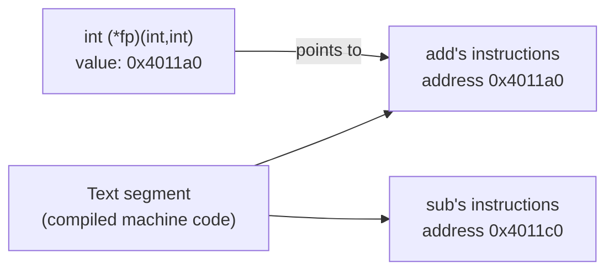

## Learning Objectives

- Explain that a function, once compiled, lives at a specific address in memory, exactly like any other object, and that a function pointer simply stores that address.
- Declare a function pointer with the correct syntax, matching a function's return type and parameter list, and use it to call the function it points to.
- Implement a callback: a function that receives another function's address as a parameter and calls it indirectly.
- Build a small dispatch table (an array of function pointers) and use it to replace a chain of `if`/`else if` branches.
- Contrast function pointers in C with the higher-order functions already covered in `programming-paradigms`, identifying what a function pointer can and cannot do that a Python function object can.

## Context & Motivation

`algorithms-software/programming-paradigms` already established that functions can be treated as values — passed as arguments, returned from other functions, stored in data structures — using Python's built-in support for functions as first-class objects. C has no such built-in feature, but it achieves nearly the same practical effect through a much more literal mechanism: once a program is compiled, every function's machine code lives at some fixed address, exactly like a global variable lives at some address, and a function pointer is simply a variable that holds that address.

This concept exists to make explicit something the rest of this discipline has been implying throughout: there is no deep boundary between "code" and "data" from the machine's point of view — both are just bytes at addresses, and a pointer can hold the address of either kind of byte, so long as the program is careful about what it does with each. A function pointer is used specifically to invoke the bytes it points to as instructions, not to read them as ordinary data — but the address itself is stored, passed around, and compared exactly like any other pointer covered so far.

CS:APP treats function pointers as an unremarkable extension of everything already true about pointers, and Stanford CS107 folds "Function Pointers" directly into its early pointer sequence, right alongside `void *` — both are treated as natural, if less common, uses of the exact same pointer mechanism, not as a separate topic requiring new rules.

## Core Theory

### A compiled function is bytes at an address, like any other object

After compilation, a function's machine instructions are stored somewhere in the program's memory — specifically, in the read-only code (text) segment covered in `the-process-address-space`. That storage location has an address, exactly the way a global variable or a heap allocation has an address. A function pointer is a pointer whose value is that address:

```c
int add(int a, int b) {
    return a + b;
}

int (*fp)(int, int) = add;   /* fp holds the address of the add function */
```

`add`, used here without parentheses, is not called — it decays (in the same spirit as an array's name decaying to a pointer, covered in `pointer-arithmetic-and-array-decay`) to the address where `add`'s code begins.

### Declaring and calling through a function pointer

A function pointer's declaration must specify the exact return type and parameter types of the functions it's allowed to point to, so the compiler knows how to correctly set up a call through it:

```c
int (*fp)(int, int) = add;  /* pointer to: a function taking (int, int), returning int */

int result = fp(3, 4);       /* calls add(3, 4) indirectly, through fp */
int result2 = (*fp)(3, 4);   /* equivalent, more explicit dereference */
```

Both call forms are legal and produce identical machine code — C allows calling through a function pointer with or without an explicit `*`, unlike ordinary data pointers, where dereferencing is always required to reach the pointee.

### Callbacks: passing behavior as a parameter

A callback is a function that receives another function's address as a parameter, and calls it — the C mechanism behind "pass a behavior in, not just a value," a pattern `programming-paradigms/higher-order-functions-and-map-filter-reduce` already covered using Python closures:

```c
void applyToEach(int *arr, int len, int (*op)(int)) {
    for (int i = 0; i < len; i++) {
        arr[i] = op(arr[i]);   /* call whichever function op currently points to */
    }
}

int square(int x) { return x * x; }
int negate(int x) { return -x; }

int nums[3] = {1, 2, 3};
applyToEach(nums, 3, square);   /* nums becomes {1, 4, 9} */
applyToEach(nums, 3, negate);   /* nums becomes {-1, -4, -9} */
```

`applyToEach` is written once and never needs to know which specific function it will call — `op` could hold the address of `square`, `negate`, or any other function matching the same signature, decided entirely by whichever address the caller passes in.

### Dispatch tables: an array of function pointers

Because function pointers are ordinary values, they can be stored in an array, and indexed into — replacing a long `if`/`else if` chain with a single lookup:

```c
int add(int a, int b) { return a + b; }
int sub(int a, int b) { return a - b; }
int mul(int a, int b) { return a * b; }

int (*ops[3])(int, int) = { add, sub, mul };

int choice = 1;                        /* pick "sub" */
int result = ops[choice](10, 4);       /* calls sub(10, 4) == 6 */
```

`ops` is an array of three function pointers; indexing into it and calling the result replaces a chain of comparisons with one array lookup — the exact structure real interpreters and virtual machines use to dispatch on an instruction's opcode.



## Worked Examples

### Example 1: a comparator passed to a generic sort

```c
int ascending(int a, int b)  { return a - b; }
int descending(int a, int b) { return b - a; }

void bubbleSort(int *arr, int len, int (*cmp)(int, int)) {
    for (int i = 0; i < len - 1; i++) {
        for (int j = 0; j < len - 1 - i; j++) {
            if (cmp(arr[j], arr[j + 1]) > 0) {
                int tmp = arr[j];
                arr[j] = arr[j + 1];
                arr[j + 1] = tmp;
            }
        }
    }
}

int nums[4] = {3, 1, 4, 1};
bubbleSort(nums, 4, ascending);    /* nums becomes {1, 1, 3, 4} */
bubbleSort(nums, 4, descending);   /* nums becomes {4, 3, 1, 1} */
```

`bubbleSort`'s algorithm is written exactly once; the direction of the sort is decided entirely by which function's address is passed as `cmp`. This is the same idea C's own standard library `qsort` uses, and the same idea `sorting-algorithms-intro` (`programming-computational-thinking`) left implicit when it discussed sorting "by some comparison" without specifying how that comparison is supplied.

### Example 2: a state machine driven by a dispatch table

```c
typedef void (*StateHandler)(void);

void onIdle(void)    { printf("idle\n"); }
void onRunning(void) { printf("running\n"); }
void onStopped(void) { printf("stopped\n"); }

StateHandler handlers[3] = { onIdle, onRunning, onStopped };

int currentState = 1;               /* "running" */
handlers[currentState]();           /* calls onRunning(), prints "running" */
```

This is a direct, mechanical implementation of a finite state machine's dispatch step — a pattern already covered structurally in `digital-logic-computer-organization/finite-state-machines-design-and-analysis` at the hardware level (a register holding the current state, combinational logic deciding what happens next). Here, the same idea is implemented in software: an integer holds the current state, and it indexes directly into an array of function pointers to invoke that state's behavior.

### Example 3: what a function pointer cannot do that Python's function objects can

```python
# Python: a closure captures its enclosing variables automatically
def make_adder(n):
    def adder(x):
        return x + n
    return adder

add5 = make_adder(5)
print(add5(10))   # 15 — "adder" remembers n = 5
```

```c
/* C: a function pointer alone cannot capture surrounding state */
int (*makeAdder(int n))(int) {
    /* there is no way to return a function that "remembers" n here —
       a plain function pointer carries only a code address, no data */
}
```

`programming-paradigms/functions-as-first-class-objects` already established that a Python closure bundles a function together with the variables it captured from its enclosing scope. A C function pointer is only ever a code address — it carries no bundled data of its own, so it cannot reproduce a closure directly. Real C code that needs closure-like behavior (a callback plus some associated state) typically passes a `void *` (covered in `void-pointers-and-generic-code`) alongside the function pointer, carrying the "captured" data explicitly, by hand, exactly the mechanism Python's closures perform automatically.

## Common Misconceptions & Pitfalls

- **"A function pointer is a different, special kind of pointer with its own rules."** It follows the exact same address-storing mechanism as every other pointer covered in this discipline; the only difference is that its pointee is executable code, not data, and it must be declared with a matching return type and parameter list so the compiler generates a correct call.
- **"You must always write `(*fp)(args)` to call through a function pointer."** Both `fp(args)` and `(*fp)(args)` are legal and equivalent — C allows calling through a function pointer with or without the explicit dereference, unlike reading through a data pointer, which always requires `*`.
- **"A C function pointer can capture surrounding variables, like a Python closure."** It cannot — a function pointer is only ever a code address, with no room to carry captured data. Real C code emulating closure-like behavior passes that data explicitly, typically as an extra `void *` parameter, as shown in Example 3.
- **"An array of function pointers is a niche technique, rarely used in real code."** Dispatch tables built from arrays or hash tables of function pointers are a standard, widely used pattern for implementing interpreters, virtual machines, and state machines in C — not an unusual trick.

## Summary

A function, once compiled, occupies a fixed address in memory exactly like any other object, and a function pointer is a variable that stores that address, declared with the return type and parameter list needed for the compiler to generate a correct indirect call. Function pointers implement callbacks (passing behavior as a parameter) and dispatch tables (arrays of function pointers indexed by an integer, replacing long conditional chains) — mechanisms that approximate, in C, what `programming-paradigms` already covered as first-class functions and higher-order functions in Python, with one real limitation: a bare function pointer carries only a code address, never bundled captured state the way a Python closure does, so C code emulating a closure must pass that state explicitly alongside the pointer.

## Documentation Links

- [Bryant & O'Hallaron — Computer Systems: A Programmer's Perspective (CS:APP)](https://csapp.cs.cmu.edu/) — textbook covering function pointers as a direct extension of the pointer model.
- [Stanford CS107 — General Information and Syllabus](https://web.stanford.edu/class/cs107/syllabus) — course folding function pointers into its early pointer unit, alongside `void *`.
