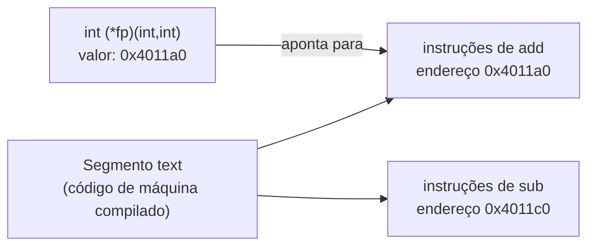

## Objetivos de Aprendizagem

- Explicar que uma função, depois de compilada, mora num endereço específico da memória, exatamente como qualquer outro objeto, e que um ponteiro para função simplesmente guarda esse endereço.
- Declarar um ponteiro para função com a sintaxe correta, casando o tipo de retorno e a lista de parâmetros de uma função, e usá-lo para chamar a função para a qual aponta.
- Implementar um callback: uma função que recebe o endereço de outra função como parâmetro e a chama indiretamente.
- Montar uma pequena tabela de despacho (um array de ponteiros para função) e usá-la para substituir uma cadeia de desvios `if`/`else if`.
- Contrastar ponteiros para função em C com as funções de ordem superior já vistas em `programming-paradigms`, identificando o que um ponteiro para função consegue e não consegue fazer que um objeto função do Python consegue.

## Contexto e Motivação

`algorithms-software/programming-paradigms` já estabeleceu que funções podem ser tratadas como valores (passadas como argumentos, retornadas de outras funções, guardadas em estruturas de dados), usando o suporte embutido do Python a funções como objetos de primeira classe. C não tem esse recurso embutido, mas chega a quase o mesmo efeito prático por um mecanismo muito mais literal: depois que um programa é compilado, o código de máquina de cada função mora em algum endereço fixo, exatamente como uma variável global mora em algum endereço, e um ponteiro para função é simplesmente uma variável que guarda esse endereço.

Este conceito existe para tornar explícito algo que o resto desta disciplina vem sugerindo o tempo todo: não há uma fronteira profunda entre "código" e "dados" do ponto de vista da máquina. Ambos são só bytes em endereços, e um ponteiro pode guardar o endereço de qualquer um dos dois tipos de byte, desde que o programa tome cuidado com o que faz com cada um. Um ponteiro para função é usado especificamente para invocar os bytes para os quais aponta como instruções, e não para lê-los como dados comuns, mas o endereço em si é guardado, repassado e comparado exatamente como qualquer outro ponteiro visto até aqui.

O CS:APP trata ponteiros para função como uma extensão comum de tudo o que já vale para ponteiros, e o CS107 de Stanford encaixa "Function Pointers" diretamente na sua sequência inicial de ponteiros, logo ao lado de `void *`: ambos são tratados como usos naturais, ainda que menos comuns, exatamente do mesmo mecanismo de ponteiros, e não como um tema separado que exige regras novas.

## Teoria Central

### Uma função compilada são bytes num endereço, como qualquer outro objeto

Depois da compilação, as instruções de máquina de uma função ficam guardadas em algum lugar da memória do programa, especificamente no segmento de código (text) somente leitura visto em `the-process-address-space`. Esse local de armazenamento tem um endereço, exatamente como uma variável global ou uma alocação no heap têm um endereço. Um ponteiro para função é um ponteiro cujo valor é esse endereço:

```c
int add(int a, int b) {
    return a + b;
}

int (*fp)(int, int) = add;   /* fp guarda o endereço da função add */
```

`add`, usado aqui sem parênteses, não é chamado: ele decai (no mesmo espírito do nome de um array decaindo para um ponteiro, visto em `pointer-arithmetic-and-array-decay`) para o endereço onde o código de `add` começa.

### Declarando e chamando por meio de um ponteiro para função

A declaração de um ponteiro para função precisa especificar exatamente o tipo de retorno e os tipos de parâmetro das funções para as quais ele pode apontar, para que o compilador saiba montar corretamente uma chamada por meio dele:

```c
int (*fp)(int, int) = add;  /* ponteiro para: uma função que recebe (int, int) e retorna int */

int result = fp(3, 4);       /* chama add(3, 4) indiretamente, por meio de fp */
int result2 = (*fp)(3, 4);   /* equivalente, com desreferência mais explícita */
```

As duas formas de chamada são válidas e produzem código de máquina idêntico: C permite chamar por meio de um ponteiro para função com ou sem um `*` explícito, ao contrário dos ponteiros para dados comuns, em que a desreferência é sempre necessária para chegar ao alvo.

### Callbacks: passando comportamento como parâmetro

Um callback é uma função que recebe o endereço de outra função como parâmetro e a chama. É o mecanismo de C por trás de "passar um comportamento, e não só um valor", um padrão que `programming-paradigms/higher-order-functions-and-map-filter-reduce` já cobriu usando closures do Python:

```c
void applyToEach(int *arr, int len, int (*op)(int)) {
    for (int i = 0; i < len; i++) {
        arr[i] = op(arr[i]);   /* chama a função para a qual op aponta no momento */
    }
}

int square(int x) { return x * x; }
int negate(int x) { return -x; }

int nums[3] = {1, 2, 3};
applyToEach(nums, 3, square);   /* nums vira {1, 4, 9} */
applyToEach(nums, 3, negate);   /* nums vira {-1, -4, -9} */
```

`applyToEach` é escrita uma vez e nunca precisa saber qual função específica vai chamar: `op` pode guardar o endereço de `square`, de `negate` ou de qualquer outra função com a mesma assinatura, decidido inteiramente pelo endereço que quem chama passar.

### Tabelas de despacho: um array de ponteiros para função

Como ponteiros para função são valores comuns, eles podem ser guardados num array e indexados, substituindo uma longa cadeia de `if`/`else if` por uma única consulta:

```c
int add(int a, int b) { return a + b; }
int sub(int a, int b) { return a - b; }
int mul(int a, int b) { return a * b; }

int (*ops[3])(int, int) = { add, sub, mul };

int choice = 1;                        /* escolhe "sub" */
int result = ops[choice](10, 4);       /* chama sub(10, 4) == 6 */
```

`ops` é um array de três ponteiros para função; indexá-lo e chamar o resultado substitui uma cadeia de comparações por uma consulta a array, exatamente a estrutura que interpretadores e máquinas virtuais reais usam para despachar com base no opcode de uma instrução.



## Exemplos Resolvidos

### Exemplo 1: um comparador passado a uma ordenação genérica

```c
int ascending(int a, int b)  { return a - b; }
int descending(int a, int b) { return b - a; }

void bubbleSort(int *arr, int len, int (*cmp)(int, int)) {
    for (int i = 0; i < len - 1; i++) {
        for (int j = 0; j < len - 1 - i; j++) {
            if (cmp(arr[j], arr[j + 1]) > 0) {
                int tmp = arr[j];
                arr[j] = arr[j + 1];
                arr[j + 1] = tmp;
            }
        }
    }
}

int nums[4] = {3, 1, 4, 1};
bubbleSort(nums, 4, ascending);    /* nums vira {1, 1, 3, 4} */
bubbleSort(nums, 4, descending);   /* nums vira {4, 3, 1, 1} */
```

O algoritmo de `bubbleSort` é escrito exatamente uma vez; a direção da ordenação é decidida inteiramente por qual endereço de função é passado como `cmp`. É a mesma ideia que o `qsort` da própria biblioteca padrão de C usa, e a mesma ideia que `sorting-algorithms-intro` (`programming-computational-thinking`) deixou implícita ao discutir ordenar "por alguma comparação" sem especificar como essa comparação é fornecida.

### Exemplo 2: uma máquina de estados conduzida por uma tabela de despacho

```c
typedef void (*StateHandler)(void);

void onIdle(void)    { printf("idle\n"); }
void onRunning(void) { printf("running\n"); }
void onStopped(void) { printf("stopped\n"); }

StateHandler handlers[3] = { onIdle, onRunning, onStopped };

int currentState = 1;               /* "running" */
handlers[currentState]();           /* chama onRunning(), imprime "running" */
```

É uma implementação direta e mecânica da etapa de despacho de uma máquina de estados finitos, um padrão já visto estruturalmente em `digital-logic-computer-organization/finite-state-machines-design-and-analysis` no nível do hardware (um registrador guardando o estado atual e lógica combinacional decidindo o que acontece em seguida). Aqui, a mesma ideia é implementada em software: um inteiro guarda o estado atual e indexa diretamente um array de ponteiros para função para invocar o comportamento daquele estado.

### Exemplo 3: o que um ponteiro para função não consegue fazer e os objetos função do Python conseguem

```python
# Python: uma closure captura automaticamente as variáveis do escopo que a envolve
def make_adder(n):
    def adder(x):
        return x + n
    return adder

add5 = make_adder(5)
print(add5(10))   # 15: "adder" lembra que n = 5
```

```c
/* C: um ponteiro para função sozinho não consegue capturar o estado ao redor */
int (*makeAdder(int n))(int) {
    /* não há como retornar aqui uma função que "lembre" n:
       um ponteiro para função simples carrega só um endereço de código, nenhum dado */
}
```

`programming-paradigms/functions-as-first-class-objects` já estabeleceu que uma closure do Python empacota uma função junto com as variáveis que ela capturou do escopo que a envolve. Um ponteiro para função em C é sempre só um endereço de código: ele não carrega nenhum dado empacotado próprio, então não consegue reproduzir uma closure diretamente. Código C real que precisa de comportamento parecido com closure (um callback mais algum estado associado) normalmente passa um `void *` (visto em `void-pointers-and-generic-code`) junto com o ponteiro para função, carregando os dados "capturados" de forma explícita, à mão, exatamente o mecanismo que as closures do Python fazem automaticamente.

## Equívocos Comuns e Armadilhas

- **"Um ponteiro para função é um tipo diferente e especial de ponteiro, com regras próprias."** Ele segue exatamente o mesmo mecanismo de guardar endereços de todos os outros ponteiros vistos nesta disciplina; a única diferença é que seu alvo é código executável, e não dados, e que ele precisa ser declarado com o tipo de retorno e a lista de parâmetros correspondentes para que o compilador gere uma chamada correta.
- **"É sempre preciso escrever `(*fp)(args)` para chamar por meio de um ponteiro para função."** Tanto `fp(args)` quanto `(*fp)(args)` são válidos e equivalentes: C permite chamar por meio de um ponteiro para função com ou sem a desreferência explícita, ao contrário de ler por meio de um ponteiro para dados, que sempre exige `*`.
- **"Um ponteiro para função em C consegue capturar variáveis ao redor, como uma closure do Python."** Não consegue: um ponteiro para função é sempre só um endereço de código, sem espaço para carregar dados capturados. Código C real que emula comportamento de closure passa esses dados de forma explícita, normalmente como um parâmetro `void *` extra, como mostra o Exemplo 3.
- **"Um array de ponteiros para função é uma técnica de nicho, raramente usada em código real."** Tabelas de despacho montadas com arrays ou tabelas hash de ponteiros para função são um padrão comum e amplamente usado para implementar interpretadores, máquinas virtuais e máquinas de estados em C, e não um truque incomum.

## Resumo

Uma função, depois de compilada, ocupa um endereço fixo na memória exatamente como qualquer outro objeto, e um ponteiro para função é uma variável que guarda esse endereço, declarada com o tipo de retorno e a lista de parâmetros necessários para o compilador gerar uma chamada indireta correta. Ponteiros para função implementam callbacks (passar comportamento como parâmetro) e tabelas de despacho (arrays de ponteiros para função indexados por um inteiro, substituindo longas cadeias condicionais), mecanismos que aproximam, em C, o que `programming-paradigms` já cobriu como funções de primeira classe e funções de ordem superior em Python, com uma limitação real: um ponteiro para função sozinho carrega só um endereço de código, nunca um estado capturado empacotado como uma closure do Python, então código C que emula uma closure precisa passar esse estado explicitamente junto com o ponteiro.

## Documentation Links

- [Bryant & O'Hallaron: Computer Systems: A Programmer's Perspective (CS:APP)](https://csapp.cs.cmu.edu/): livro-texto que cobre ponteiros para função como uma extensão direta do modelo de ponteiros.
- [Stanford CS107: General Information and Syllabus](https://web.stanford.edu/class/cs107/syllabus): curso que encaixa ponteiros para função na sua unidade inicial de ponteiros, ao lado de `void *`.
