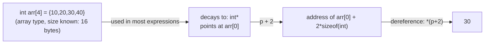

## Learning Objectives

- Explain why adding an integer `n` to a pointer moves it forward by `n` elements, not `n` bytes, and compute the resulting address for a given pointee type and size.
- State the array-decay rule: in nearly every expression, an array's name evaluates to a pointer to its first element.
- Rewrite array-indexing expressions (`a[i]`) as pointer arithmetic (`*(a + i)`) and explain why the two are, mechanically, the exact same operation.
- Identify the specific contexts where decay does *not* happen (`sizeof`, `&`, string literal initialization) and explain why those are exceptions rather than counterexamples.
- Connect array decay to the O(1) random access already established for `static-arrays-and-random-access`, by showing that indexing is literally "compute an address, then dereference."

## Context & Motivation

`foundations/data-structures-i` established that a static array supports O(1) access to any element by index, and attributed that speed to the array's contiguous layout in memory — but stopped short of showing the actual mechanism that turns an index into an address. This concept supplies that mechanism directly, in the one language on this platform where it is fully exposed: C. Pointer arithmetic is not a separate feature bolted onto pointers; it is the precise arithmetic — scaled by the size of whatever type the pointer points to — that makes indexing into an array possible in the first place.

Array decay is the second half of the same story. In C, an array and a pointer are related but distinct: an array is a block of contiguous storage with a fixed size known at compile time, while a pointer is a variable holding a single address. The decay rule is what lets the two interoperate almost seamlessly — an array's name, used in an expression, degrades into a pointer to its first element, which is exactly why a function written to take a pointer parameter can be called with an array argument. CS:APP treats pointer arithmetic and array/pointer equivalence as the mechanical foundation for everything C does with sequences of data, and CS107's early "Pointers and Arrays" lecture builds its entire early unit around exactly this equivalence, before touching the stack, the heap, or assembly.

Getting this right also explains a real, easy-to-hit class of bug that has nothing to do with C's syntax and everything to do with the arithmetic: forgetting that `p + 1` does not mean "one byte later," but "one *element* later," where the element's size depends on the pointer's type. Off-by-one and off-by-`sizeof` errors are the direct, mechanical consequence of getting this arithmetic wrong.

## Core Theory

### Pointer arithmetic is scaled by the pointee's size

Given a pointer `p` of type `T *`, the expression `p + n` does not compute "the address stored in `p`, plus `n`." It computes "the address stored in `p`, plus `n * sizeof(T)`." The compiler performs this scaling automatically, based on the pointer's declared type:

```c
int arr[4] = {10, 20, 30, 40};
int *p = arr;        /* p points at arr[0] */

int *p1 = p + 1;      /* address of arr[0] + 1 * sizeof(int) = address of arr[1] */
int *p2 = p + 2;      /* address of arr[0] + 2 * sizeof(int) = address of arr[2] */
```

If `sizeof(int)` is 4 bytes and `arr` starts at address `0x1000`, then `p1` holds `0x1004` and `p2` holds `0x1008` — each step of `+1` moves exactly one `int`'s width forward, regardless of what that width happens to be for the pointer's type. A `char *` advanced by 1 moves forward by exactly 1 byte, since `sizeof(char)` is 1; a pointer to a struct advances by the entire size of that struct.

### Array indexing is pointer arithmetic plus a dereference

`a[i]` is defined in the C standard, and implemented by every real compiler, as precisely `*(a + i)` — compute the address `i` elements past `a`'s start, then dereference it:

```c
int arr[4] = {10, 20, 30, 40};

printf("%d\n", arr[2]);        /* 30 */
printf("%d\n", *(arr + 2));    /* 30 — identical operation */
```

This is not an approximation or a special case; the two expressions compile to the exact same machine instructions. It also explains a piece of C trivia that stops being surprising once the arithmetic is understood: because addition commutes, `arr[2]` and `2[arr]` are the same expression, since both expand to `*(arr + 2)` and `*(2 + arr)` respectively — legal C, just never written that way by convention.

### Array decay: an array's name becomes a pointer to its first element

An array and a pointer are different types — an array carries its total size as part of its type, a pointer does not — but in almost every expression, an array's name automatically **decays** into a pointer to its first element. This is what makes `int *p = arr;` in the example above legal: `arr` decays to `&arr[0]`, an `int *`, which is exactly what `p` is declared to hold.

Decay is also why a function parameter declared as `int arr[]` behaves identically to one declared `int *arr` — both receive a pointer, never a copy of the whole array:

```c
void printFirst(int arr[]) {      /* arr is really an int *, receives a pointer */
    printf("%d\n", arr[0]);
}
```

### Where decay does *not* happen

Decay is a rule about *most* contexts, not all of them. Three real exceptions matter:

1. **`sizeof`**: `sizeof(arr)` on an actual array gives the array's *total* size in bytes (e.g., 16 for four `int`s), not the size of a pointer (8 bytes on x86-64). This is the single most common source of confusion once an array is passed into a function — inside the function, the parameter has already decayed to a pointer, so `sizeof` on it there gives 8, not the original array's size.
2. **`&arr`**: taking the address of the array itself (not of an element) yields a pointer to the *whole array type*, not to its first element — a different, more specific pointer type than the one produced by decay.
3. **String literal initialization**: `char name[] = "hi";` copies the literal's characters into `name`'s own storage; no decay or pointer is involved in this specific declaration form.



## Worked Examples

### Example 1: manually walking an array with a pointer

```c
int arr[5] = {2, 4, 6, 8, 10};
int *p = arr;                 /* decay: p = &arr[0] */

for (int i = 0; i < 5; i++) {
    printf("%d ", *(p + i));  /* identical to arr[i] */
}
/* prints: 2 4 6 8 10 */

for (int i = 0; i < 5; i++) {
    printf("%d ", *p);
    p = p + 1;                 /* advance p by one int's width each iteration */
}
/* prints: 2 4 6 8 10 — same output, walking p forward instead of indexing */
```

Both loops visit the same five elements. The first computes a fresh address each iteration (`p + i`); the second advances the pointer itself by one element each time and dereferences the current position. This second form — advance-then-dereference — is exactly the pattern the compiler generates when it lowers a `for` loop over an array into real machine code.

### Example 2: the `sizeof` trap after decay

```c
void reportSize(int arr[]) {
    printf("inside function: %zu\n", sizeof(arr));   /* prints 8 — arr decayed to int* */
}

int main(void) {
    int nums[10];
    printf("in main: %zu\n", sizeof(nums));           /* prints 40 — 10 ints, 4 bytes each */
    reportSize(nums);
}
```

`sizeof(nums)` in `main` sees the real array type and correctly reports 40 bytes. The moment `nums` is passed to `reportSize`, it decays to an `int *`; inside the function, `arr` is just a pointer, and `sizeof(arr)` reports the size of a pointer (8 bytes on x86-64) — not the array's size, which the function has no way to recover from `arr` alone. This is precisely why functions that operate on C arrays are almost always written to take an explicit length parameter alongside the pointer.

### Example 3: pointer arithmetic with a non-`int` type

```c
double vals[3] = {1.5, 2.5, 3.5};
double *dp = vals;

double *dp1 = dp + 1;   /* moves forward by sizeof(double) = 8 bytes, not 4 */
printf("%f\n", *dp1);   /* 2.5 */

char letters[3] = {'a', 'b', 'c'};
char *cp = letters;
char *cp1 = cp + 1;     /* moves forward by sizeof(char) = 1 byte */
printf("%c\n", *cp1);   /* 'b' */
```

The same `+ 1` means a different number of bytes depending entirely on the pointer's declared type — 8 bytes for a `double *`, 1 byte for a `char *` — which is exactly why the type attached to a pointer (already covered in `pointers-addresses-and-dereferencing`) is not optional bookkeeping: it is the number the compiler multiplies every pointer-arithmetic operation by.

## Common Misconceptions & Pitfalls

- **"`p + 1` moves the pointer forward by one byte."** It moves it forward by `sizeof(T)` bytes, where `T` is the pointee type — one byte only when `T` is `char`. This is the single most common source of off-by-`sizeof` bugs when a programmer mentally treats every pointer as if it addressed raw bytes.
- **"An array and a pointer are the same type."** They decay into interchangeable behavior in most expressions, but they are distinct types with distinct `sizeof` results — an array carries its total size, a pointer never does, which is exactly the trap in Example 2.
- **"`arr[i]` is fundamentally different from `*(arr + i)`."** They are the same operation; the compiler generates identical code for both. Understanding this equivalence is what makes pointer-based traversal (Example 1) and index-based traversal interchangeable rather than two unrelated techniques.
- **"Once an array decays to a pointer, the original array's size is still recoverable from the pointer."** It is not. A decayed pointer carries no memory of how many elements the original array had; any function that needs the length must be told it explicitly, since `sizeof` on the parameter only reports the pointer's own size.

## Summary

Pointer arithmetic is ordinary addition scaled by the pointee type's size — `p + n` moves `n` whole elements forward, not `n` bytes — and array indexing, `a[i]`, is defined as exactly `*(a + i)`, the identical operation under different notation. Array decay is what makes an array's name usable as a pointer in most expressions, converting it to a pointer to its first element everywhere except inside `sizeof`, under `&`, and in string-literal initialization. Together, these two rules are the literal mechanism behind the O(1) random access `static-arrays-and-random-access` already established: indexing an array is computing one address (via scaled arithmetic) and dereferencing it once — no searching, no chasing pointers through intermediate structures, just arithmetic and a single memory access.

## Documentation Links

- [Bryant & O'Hallaron — Computer Systems: A Programmer's Perspective (CS:APP)](https://csapp.cs.cmu.edu/) — textbook treatment of pointer arithmetic and the array/pointer equivalence this discipline follows.
- [Stanford CS107 — General Information and Syllabus](https://web.stanford.edu/class/cs107/syllabus) — course whose early unit is built specifically around pointers and arrays before introducing assembly.
