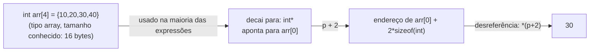

## Objetivos de Aprendizagem

- Explicar por que somar um inteiro `n` a um ponteiro o avança `n` elementos, e não `n` bytes, e calcular o endereço resultante para um dado tipo e tamanho de alvo.
- Enunciar a regra de decaimento de arrays: em quase toda expressão, o nome de um array é avaliado como um ponteiro para o seu primeiro elemento.
- Reescrever expressões de indexação de array (`a[i]`) como aritmética de ponteiros (`*(a + i)`) e explicar por que as duas são, mecanicamente, exatamente a mesma operação.
- Identificar os contextos específicos em que o decaimento *não* acontece (`sizeof`, `&`, inicialização com literal de string) e explicar por que são exceções, e não contraexemplos.
- Ligar o decaimento de arrays ao acesso aleatório O(1) já estabelecido em `static-arrays-and-random-access`, mostrando que indexar é literalmente "calcular um endereço e depois desreferenciá-lo".

## Contexto e Motivação

`foundations/data-structures-i` estabeleceu que um array estático permite acesso O(1) a qualquer elemento por índice e atribuiu essa velocidade ao layout contíguo do array na memória, mas parou antes de mostrar o mecanismo real que transforma um índice num endereço. Este conceito fornece esse mecanismo diretamente, na única linguagem desta plataforma em que ele fica totalmente exposto: C. A aritmética de ponteiros não é um recurso separado acoplado aos ponteiros; é a aritmética precisa (escalada pelo tamanho do tipo para o qual o ponteiro aponta) que torna possível, para começo de conversa, indexar um array.

O decaimento de arrays é a segunda metade da mesma história. Em C, um array e um ponteiro são relacionados, mas distintos: um array é um bloco de armazenamento contíguo com tamanho fixo conhecido em tempo de compilação, enquanto um ponteiro é uma variável que guarda um único endereço. A regra de decaimento é o que permite aos dois interoperarem quase sem atrito: o nome de um array, usado numa expressão, se degrada num ponteiro para o seu primeiro elemento, e é exatamente por isso que uma função escrita para receber um parâmetro ponteiro pode ser chamada com um array como argumento. O CS:APP trata a aritmética de ponteiros e a equivalência array/ponteiro como o fundamento mecânico de tudo o que C faz com sequências de dados, e a aula inicial "Pointers and Arrays" do CS107 constrói toda a sua unidade inicial exatamente em torno dessa equivalência, antes de tocar na pilha, no heap ou em assembly.

Acertar isso também explica uma classe real de bug, fácil de cometer, que não tem nada a ver com a sintaxe de C e tudo a ver com a aritmética: esquecer que `p + 1` não significa "um byte depois", e sim "um *elemento* depois", em que o tamanho do elemento depende do tipo do ponteiro. Erros de um a mais e de um `sizeof` a mais são a consequência direta e mecânica de errar essa aritmética.

## Teoria Central

### A aritmética de ponteiros é escalada pelo tamanho do alvo

Dado um ponteiro `p` do tipo `T *`, a expressão `p + n` não calcula "o endereço guardado em `p`, mais `n`". Ela calcula "o endereço guardado em `p`, mais `n * sizeof(T)`". O compilador faz esse escalonamento automaticamente, com base no tipo declarado do ponteiro:

```c
int arr[4] = {10, 20, 30, 40};
int *p = arr;        /* p aponta para arr[0] */

int *p1 = p + 1;      /* endereço de arr[0] + 1 * sizeof(int) = endereço de arr[1] */
int *p2 = p + 2;      /* endereço de arr[0] + 2 * sizeof(int) = endereço de arr[2] */
```

Se `sizeof(int)` é 4 bytes e `arr` começa no endereço `0x1000`, então `p1` guarda `0x1004` e `p2` guarda `0x1008`: cada passo de `+1` avança exatamente a largura de um `int`, qualquer que seja essa largura para o tipo do ponteiro. Um `char *` avançado em 1 anda exatamente 1 byte, já que `sizeof(char)` é 1; um ponteiro para uma struct avança o tamanho inteiro dessa struct.

### A indexação de array é aritmética de ponteiros mais uma desreferência

`a[i]` é definido no padrão C, e implementado por todo compilador real, precisamente como `*(a + i)`: calcular o endereço `i` elementos depois do início de `a` e então desreferenciá-lo:

```c
int arr[4] = {10, 20, 30, 40};

printf("%d\n", arr[2]);        /* 30 */
printf("%d\n", *(arr + 2));    /* 30: operação idêntica */
```

Isso não é uma aproximação nem um caso especial; as duas expressões compilam exatamente para as mesmas instruções de máquina. Isso também explica uma curiosidade de C que deixa de surpreender quando a aritmética é entendida: como a adição é comutativa, `arr[2]` e `2[arr]` são a mesma expressão, já que se expandem para `*(arr + 2)` e `*(2 + arr)`, respectivamente. É C válido, só que nunca escrito assim por convenção.

### Decaimento de arrays: o nome de um array vira um ponteiro para o seu primeiro elemento

Um array e um ponteiro são tipos diferentes (um array carrega seu tamanho total como parte do tipo, um ponteiro não), mas, em quase toda expressão, o nome de um array **decai** automaticamente para um ponteiro para o seu primeiro elemento. É isso que torna válido `int *p = arr;` no exemplo acima: `arr` decai para `&arr[0]`, um `int *`, que é exatamente o que `p` foi declarado para guardar.

O decaimento também é o motivo pelo qual um parâmetro de função declarado como `int arr[]` se comporta de forma idêntica a um declarado como `int *arr`: ambos recebem um ponteiro, nunca uma cópia do array inteiro:

```c
void printFirst(int arr[]) {      /* arr é na verdade um int *, recebe um ponteiro */
    printf("%d\n", arr[0]);
}
```

### Onde o decaimento *não* acontece

O decaimento é uma regra sobre a *maioria* dos contextos, não sobre todos. Três exceções reais importam:

1. **`sizeof`**: `sizeof(arr)` num array de verdade dá o tamanho *total* do array em bytes (por exemplo, 16 para quatro `int`s), e não o tamanho de um ponteiro (8 bytes no x86-64). Essa é a maior fonte de confusão quando um array é passado para uma função: dentro da função, o parâmetro já decaiu para um ponteiro, então `sizeof` nele dá 8, e não o tamanho do array original.
2. **`&arr`**: tomar o endereço do próprio array (e não de um elemento) produz um ponteiro para o *tipo array inteiro*, e não para o seu primeiro elemento, um tipo de ponteiro diferente e mais específico que o produzido pelo decaimento.
3. **Inicialização com literal de string**: `char name[] = "hi";` copia os caracteres do literal para o armazenamento próprio de `name`; nenhum decaimento nem ponteiro está envolvido nessa forma específica de declaração.



## Exemplos Resolvidos

### Exemplo 1: percorrendo um array manualmente com um ponteiro

```c
int arr[5] = {2, 4, 6, 8, 10};
int *p = arr;                 /* decaimento: p = &arr[0] */

for (int i = 0; i < 5; i++) {
    printf("%d ", *(p + i));  /* idêntico a arr[i] */
}
/* imprime: 2 4 6 8 10 */

for (int i = 0; i < 5; i++) {
    printf("%d ", *p);
    p = p + 1;                 /* avança p a largura de um int a cada iteração */
}
/* imprime: 2 4 6 8 10, a mesma saída, avançando p em vez de indexar */
```

Os dois laços visitam os mesmos cinco elementos. O primeiro calcula um endereço novo a cada iteração (`p + i`); o segundo avança o próprio ponteiro um elemento por vez e desreferencia a posição atual. Essa segunda forma (avançar e depois desreferenciar) é exatamente o padrão que o compilador gera quando traduz um laço `for` sobre um array para código de máquina real.

### Exemplo 2: a armadilha do `sizeof` depois do decaimento

```c
void reportSize(int arr[]) {
    printf("dentro da função: %zu\n", sizeof(arr));   /* imprime 8: arr decaiu para int* */
}

int main(void) {
    int nums[10];
    printf("em main: %zu\n", sizeof(nums));           /* imprime 40: 10 ints, 4 bytes cada */
    reportSize(nums);
}
```

`sizeof(nums)` em `main` vê o tipo array real e informa corretamente 40 bytes. No momento em que `nums` é passado para `reportSize`, ele decai para um `int *`; dentro da função, `arr` é só um ponteiro, e `sizeof(arr)` informa o tamanho de um ponteiro (8 bytes no x86-64), e não o tamanho do array, que a função não tem como recuperar só a partir de `arr`. É precisamente por isso que funções que operam sobre arrays em C quase sempre são escritas para receber um parâmetro de tamanho explícito junto com o ponteiro.

### Exemplo 3: aritmética de ponteiros com um tipo que não é `int`

```c
double vals[3] = {1.5, 2.5, 3.5};
double *dp = vals;

double *dp1 = dp + 1;   /* avança sizeof(double) = 8 bytes, e não 4 */
printf("%f\n", *dp1);   /* 2.5 */

char letters[3] = {'a', 'b', 'c'};
char *cp = letters;
char *cp1 = cp + 1;     /* avança sizeof(char) = 1 byte */
printf("%c\n", *cp1);   /* 'b' */
```

O mesmo `+ 1` significa uma quantidade diferente de bytes conforme o tipo declarado do ponteiro (8 bytes para um `double *`, 1 byte para um `char *`), e é exatamente por isso que o tipo associado a um ponteiro (já visto em `pointers-addresses-and-dereferencing`) não é contabilidade opcional: é o número pelo qual o compilador multiplica toda operação de aritmética de ponteiros.

## Equívocos Comuns e Armadilhas

- **"`p + 1` avança o ponteiro um byte."** Ele o avança `sizeof(T)` bytes, em que `T` é o tipo do alvo; só um byte quando `T` é `char`. Essa é a maior fonte de bugs de um `sizeof` a mais quando um programador trata mentalmente todo ponteiro como se endereçasse bytes brutos.
- **"Um array e um ponteiro são o mesmo tipo."** Eles decaem para um comportamento intercambiável na maioria das expressões, mas são tipos distintos com resultados de `sizeof` distintos: um array carrega seu tamanho total, um ponteiro nunca, e é exatamente essa a armadilha do Exemplo 2.
- **"`arr[i]` é fundamentalmente diferente de `*(arr + i)`."** São a mesma operação; o compilador gera código idêntico para as duas. Entender essa equivalência é o que torna o percurso por ponteiro (Exemplo 1) e o percurso por índice intercambiáveis, e não duas técnicas sem relação.
- **"Depois que um array decai para um ponteiro, o tamanho do array original ainda pode ser recuperado a partir do ponteiro."** Não pode. Um ponteiro decaído não guarda nenhuma memória de quantos elementos o array original tinha; qualquer função que precise do tamanho tem de ser informada dele explicitamente, já que `sizeof` no parâmetro só informa o tamanho do próprio ponteiro.

## Resumo

A aritmética de ponteiros é uma adição comum escalada pelo tamanho do tipo do alvo (`p + n` avança `n` elementos inteiros, e não `n` bytes), e a indexação de array, `a[i]`, é definida exatamente como `*(a + i)`, a operação idêntica com outra notação. O decaimento de arrays é o que torna o nome de um array utilizável como ponteiro na maioria das expressões, convertendo-o num ponteiro para o seu primeiro elemento em todo lugar, exceto dentro de `sizeof`, sob `&` e na inicialização com literal de string. Juntas, essas duas regras são o mecanismo literal por trás do acesso aleatório O(1) que `static-arrays-and-random-access` já estabeleceu: indexar um array é calcular um endereço (por aritmética escalada) e desreferenciá-lo uma vez, sem busca e sem seguir ponteiros por estruturas intermediárias, só aritmética e um único acesso à memória.

## Documentation Links

- [Bryant & O'Hallaron: Computer Systems: A Programmer's Perspective (CS:APP)](https://csapp.cs.cmu.edu/): o tratamento, no livro-texto, da aritmética de ponteiros e da equivalência array/ponteiro que esta disciplina segue.
- [Stanford CS107: General Information and Syllabus](https://web.stanford.edu/class/cs107/syllabus): curso cuja unidade inicial é construída especificamente em torno de ponteiros e arrays antes de apresentar assembly.
