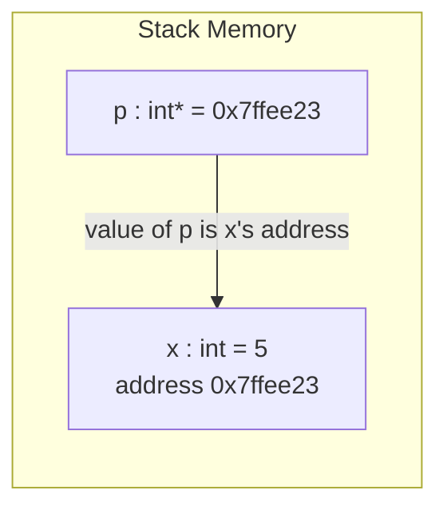

## Learning Objectives

- Define a pointer as an ordinary variable whose stored value is a memory address, distinct from the object living at that address.
- Use the address-of operator `&` to obtain the address of a variable, and the dereference operator `*` to read or write the value stored at an address.
- Explain why a pointer must be declared with the type of the object it points to, and what that type buys the compiler (size and interpretation of the bytes at that address).
- Trace a simple "swap" function written with pointer parameters and explain why the equivalent function written with plain value parameters cannot work.
- Connect the informal "arrow" already drawn between linked-list nodes to the literal mechanism — one variable's value being another object's address — that makes it possible.

## Context & Motivation

Every value discussed so far in this platform's Python-first tracks — a variable, a list element, a dictionary entry — has been described at the level of *what it means*, never at the level of *where it physically lives*. That omission was deliberate: Python's runtime hides the address of every object behind a reference the language manages for you, and nothing in `foundations/programming-computational-thinking` or `foundations/data-structures-i` required knowing otherwise. This discipline exists specifically to remove that curtain. C, the language this discipline uses throughout, gives the programmer direct, unmediated access to memory addresses, and a pointer is simply the language's name for a variable that holds one.

This matters for a reason bigger than "learning another language's syntax." `foundations/data-structures-i` already drew linked lists as boxes connected by arrows — "a node, pointing to the next" — treating the arrow as an intuitive given. That arrow is not a metaphor. It is a pointer: a field inside one node whose stored value is literally the memory address of the next node. Understanding pointers is understanding, precisely and without hand-waving, what that arrow was made of the entire time. It is also the foundation for everything else in this discipline: the process address space, the stack, the heap, and the calling convention are all, at bottom, stories about which addresses hold what, and pointers are the vocabulary for talking about addresses at all.

CS:APP (Bryant & O'Hallaron, *Computer Systems: A Programmer's Perspective*) opens its treatment of C and memory from exactly this angle: a programmer who understands what a variable's address is, and how a pointer stores and follows one, has a working mental model for the rest of the machine. Stanford's CS107 builds its entire early sequence — "C-Strings, Pointers, and Arrays" — around the same starting point, before ever touching assembly. Both converge on treating pointers not as an advanced feature bolted onto C, but as the single idea the rest of the language's memory model is built from.

## Core Theory

### A pointer is a variable, nothing more

In C, declaring `int x = 5;` allocates a small piece of memory — enough to hold an `int` — and gives it the name `x`. Declaring `int *p;` allocates a *different* piece of memory, big enough to hold an address (8 bytes on x86-64), and gives it the name `p`. `p` is a variable exactly like `x` is a variable; the only difference is what kind of value it's meant to hold. An `int` variable holds a number that means whatever the program intends it to mean. A pointer variable holds a number too — but that number is interpreted as a memory address, the location of some other piece of data.

### `&`: asking an object for its address

Every variable in a running C program lives somewhere in memory, at some address, whether or not the program ever asks for it. The `&` operator asks: `&x` evaluates to the address where `x` is stored. This is how a pointer gets a meaningful value in the first place — it is assigned the address of some real object:

```c
int x = 5;
int *p = &x;   /* p now holds the address of x */
```

After this, `p` and `x` are two separate variables, but `p`'s *value* happens to be `x`'s *address*. Nothing about `x` itself changed; a new, separate way of referring to it was created.

### `*`: following an address back to the object

The dereference operator `*` does the reverse of `&`: given a pointer, `*p` means "go to the address stored in `p`, and treat whatever's there as the object `p` points to." This works for both reading and writing:

```c
int x = 5;
int *p = &x;

printf("%d\n", *p);   /* prints 5 — reads the int living at x's address */
*p = 10;              /* writes 10 into the int living at x's address */
printf("%d\n", x);    /* prints 10 — x itself changed, through p */
```

The last line is the entire point of a pointer: `*p = 10` did not touch `p`'s own value (still `&x`) — it reached *through* `p` to modify the object `p` points at. This is indirection: manipulating a value without naming it directly, only its address.

### Why a pointer needs a type

`int *p` and `char *q` are both, physically, just an 8-byte address on x86-64 — but they are not interchangeable. The type attached to a pointer tells the compiler two things: how many bytes to read or write when the pointer is dereferenced (4 bytes for `int *`, 1 byte for `char *`), and how to interpret those bytes (as a signed integer, as a character code, and so on). Losing that type information — by casting a pointer to the wrong type and dereferencing it — is a real category of bug: the machine will happily read the wrong number of bytes and interpret them incorrectly, since C performs no runtime check.



### Pass-by-value, and why pointers are how C simulates pass-by-reference

Every ordinary function argument in C is passed by value: the callee receives a *copy* of whatever the caller passed, and any modification the callee makes to its copy is invisible to the caller. This is why a function cannot modify a caller's variable directly:

```c
void doesNotWork(int n) {
    n = 100;               /* modifies the local copy only */
}
```

Passing a pointer instead sidesteps this entirely — the callee still receives a copy, but the copy is a copy of an *address*, and dereferencing it reaches the original object:

```c
void works(int *n) {
    *n = 100;               /* follows the address; modifies the caller's variable */
}

int main(void) {
    int x = 5;
    works(&x);
    /* x is now 100 */
}
```

This is the entire mechanism behind C's version of "pass by reference" — there is no separate language feature for it; it is ordinary pass-by-value applied to a pointer.

## Worked Examples

### Example 1: swap, written correctly and incorrectly

A classic first demonstration of why pointers exist is a function that swaps two integers:

```c
/* Wrong: parameters are copies; nothing outside changes */
void swapWrong(int a, int b) {
    int tmp = a;
    a = b;
    b = tmp;
}

/* Right: parameters are addresses; dereferencing reaches the originals */
void swapRight(int *a, int *b) {
    int tmp = *a;
    *a = *b;
    *b = tmp;
}

int main(void) {
    int x = 1, y = 2;
    swapWrong(x, y);
    printf("%d %d\n", x, y);   /* prints 1 2 — unchanged */

    swapRight(&x, &y);
    printf("%d %d\n", x, y);   /* prints 2 1 — actually swapped */
}
```

`swapWrong` receives copies of the *values* 1 and 2 and swaps those copies — a swap nobody outside the function ever sees. `swapRight` receives copies of the *addresses* of `x` and `y`, and every `*a`/`*b` in its body reaches all the way back through those addresses to the caller's own variables.

### Example 2: a chain of pointers

Pointers can point to other pointers, and following them one step at a time is exactly how a linked list's traversal already worked informally in `data-structures-i`:

```c
int x = 42;
int *p = &x;      /* p holds x's address */
int **pp = &p;    /* pp holds p's address */

printf("%d\n", **pp);   /* dereference pp to get p, dereference p to get x: 42 */
```

`**pp` is read right to left: `*pp` yields `p`'s value (which is `&x`), and applying `*` again dereferences that to reach `x` itself.

### Example 3: what the linked-list arrow was, exactly

`data-structures-i/singly-linked-lists` described a node as "pointing to the next" without specifying the mechanism. In C, that description is literal:

```c
struct Node {
    int value;
    struct Node *next;   /* the arrow: an address, not a nested Node */
};

struct Node a = { 1, NULL };
struct Node b = { 2, NULL };
a.next = &b;   /* a's "next" field now holds b's address */

printf("%d\n", a.next->value);   /* follows a.next to b, prints 2 */
```

`a.next` is not a copy of `b` — it is `b`'s address, exactly like `p` was `x`'s address in Example 1. `a.next->value` (shorthand for `(*a.next).value`) dereferences that address to reach `b`, then reads its `value` field. The "arrow" drawn between boxes in every linked-list diagram is this field, holding an address, nothing more.

## Common Misconceptions & Pitfalls

- **"A pointer and the value it points to are the same thing."** They are two distinct pieces of memory: the pointer variable itself (which holds an address) and the object at that address. Assigning to a pointer (`p = &y;`) changes what it points at; assigning through a pointer (`*p = y;`) changes the object it already points at. Confusing the two is the single most common pointer bug.
- **"An uninitialized pointer is just a null pointer waiting to be used."** An uninitialized pointer holds whatever garbage bits were already in that memory — an unpredictable, essentially random address. Dereferencing it is undefined behavior, not a safe no-op; only a pointer explicitly set to `NULL` (or a valid address) is safe to reason about.
- **"Pointer type is just documentation — the machine doesn't care."** The machine very much cares: the pointee type tells the compiler how many bytes to read or write on dereference. Casting an `int *` to a `char *` and dereferencing it reads only the first byte of the `int`, not the whole value — a real, silent source of bugs, not merely a style issue.
- **"`&x` and `x` are interchangeable in most contexts."** `x` is a value; `&x` is that value's address, a completely different number. They only ever appear together deliberately — passing `&x` to a function expecting a pointer, never a plain value.

## Summary

A pointer is a variable like any other, distinguished only by what its value means: not a number to compute with, but the address of some other object in memory. `&` asks a variable for its address; `*` follows an address back to the object living there, for both reading and writing. This single mechanism — indirection — is what lets a C function modify a caller's variable (pass-by-value applied to an address), and it is the literal, non-metaphorical substance of the "arrow" every linked-list diagram in `data-structures-i` already relied on. Every remaining concept in this discipline — pointer arithmetic, the heap, the stack, the calling convention — is really a further exploration of what can be built once a variable is allowed to hold an address instead of a value.

## Documentation Links

- [Bryant & O'Hallaron — Computer Systems: A Programmer's Perspective (CS:APP)](https://csapp.cs.cmu.edu/) — companion site for the textbook this discipline uses as its primary anchor for C and memory.
- [Stanford CS107 — General Information and Syllabus](https://web.stanford.edu/class/cs107/syllabus) — course that opens its C sequence with pointers before touching assembly, the same ordering used here.
