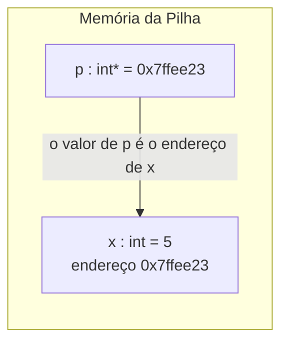

## Objetivos de Aprendizagem

- Definir um ponteiro como uma variável comum cujo valor guardado é um endereço de memória, distinta do objeto que mora nesse endereço.
- Usar o operador de endereço `&` para obter o endereço de uma variável e o operador de desreferência `*` para ler ou escrever o valor guardado num endereço.
- Explicar por que um ponteiro precisa ser declarado com o tipo do objeto para o qual aponta e o que esse tipo dá ao compilador (o tamanho e a interpretação dos bytes naquele endereço).
- Rastrear uma função "swap" simples escrita com parâmetros ponteiro e explicar por que a função equivalente escrita com parâmetros de valor comuns não funciona.
- Ligar a "seta" informal já desenhada entre os nós de uma lista ligada ao mecanismo literal (o valor de uma variável sendo o endereço de outro objeto) que a torna possível.

## Contexto e Motivação

Todo valor discutido até agora nas trilhas desta plataforma centradas em Python (uma variável, um elemento de lista, uma entrada de dicionário) foi descrito no nível de *o que significa*, e nunca no nível de *onde mora fisicamente*. Essa omissão foi deliberada: o runtime do Python esconde o endereço de cada objeto atrás de uma referência que a linguagem gerencia por você, e nada em `foundations/programming-computational-thinking` ou `foundations/data-structures-i` exigia saber o contrário. Esta disciplina existe especificamente para tirar essa cortina. C, a linguagem que esta disciplina usa o tempo todo, dá ao programador acesso direto e sem intermediários a endereços de memória, e um ponteiro é simplesmente o nome que a linguagem dá a uma variável que guarda um deles.

Isso importa por uma razão maior que "aprender a sintaxe de outra linguagem". `foundations/data-structures-i` já desenhou listas ligadas como caixas ligadas por setas ("um nó, apontando para o próximo"), tratando a seta como algo intuitivo e dado. Essa seta não é uma metáfora. É um ponteiro: um campo dentro de um nó cujo valor guardado é literalmente o endereço de memória do próximo nó. Entender ponteiros é entender, com precisão e sem rodeios, de que essa seta foi feita o tempo todo. É também o fundamento de todo o resto desta disciplina: o espaço de endereçamento do processo, a pilha, o heap e a convenção de chamada são todos, no fundo, histórias sobre quais endereços guardam o quê, e ponteiros são o vocabulário para sequer falar de endereços.

O CS:APP (Bryant & O'Hallaron, *Computer Systems: A Programmer's Perspective*) abre seu tratamento de C e memória exatamente por esse ângulo: um programador que entende o que é o endereço de uma variável, e como um ponteiro guarda e segue um, tem um modelo mental funcional para o resto da máquina. O CS107 de Stanford constrói toda a sua sequência inicial ("C-Strings, Pointers, and Arrays") em torno do mesmo ponto de partida, antes de tocar em assembly. Os dois convergem em tratar ponteiros não como um recurso avançado acoplado a C, e sim como a única ideia a partir da qual o resto do modelo de memória da linguagem é construído.

## Teoria Central

### Um ponteiro é uma variável, nada mais

Em C, declarar `int x = 5;` aloca um pequeno pedaço de memória (o suficiente para guardar um `int`) e lhe dá o nome `x`. Declarar `int *p;` aloca um pedaço de memória *diferente*, grande o bastante para guardar um endereço (8 bytes no x86-64), e lhe dá o nome `p`. `p` é uma variável exatamente como `x` é uma variável; a única diferença é o tipo de valor que ela deve guardar. Uma variável `int` guarda um número que significa o que quer que o programa pretenda que signifique. Uma variável ponteiro também guarda um número, mas esse número é interpretado como um endereço de memória, a localização de algum outro dado.

### `&`: pedindo a um objeto o seu endereço

Toda variável num programa C em execução mora em algum lugar da memória, em algum endereço, quer o programa o peça ou não. O operador `&` pergunta: `&x` é avaliado como o endereço onde `x` está guardado. É assim que um ponteiro recebe um valor com significado, para começo de conversa: ele recebe o endereço de algum objeto real:

```c
int x = 5;
int *p = &x;   /* p agora guarda o endereço de x */
```

Depois disso, `p` e `x` são duas variáveis separadas, mas o *valor* de `p` por acaso é o *endereço* de `x`. Nada no próprio `x` mudou; foi criada uma forma nova e separada de se referir a ele.

### `*`: seguindo um endereço de volta até o objeto

O operador de desreferência `*` faz o inverso de `&`: dado um ponteiro, `*p` significa "vá ao endereço guardado em `p` e trate o que estiver lá como o objeto para o qual `p` aponta". Isso funciona tanto para ler quanto para escrever:

```c
int x = 5;
int *p = &x;

printf("%d\n", *p);   /* imprime 5: lê o int que mora no endereço de x */
*p = 10;              /* escreve 10 no int que mora no endereço de x */
printf("%d\n", x);    /* imprime 10: o próprio x mudou, por meio de p */
```

A última linha é todo o propósito de um ponteiro: `*p = 10` não tocou o próprio valor de `p` (que continua `&x`); ele alcançou *através* de `p` para modificar o objeto para o qual `p` aponta. Isso é indireção: manipular um valor sem nomeá-lo diretamente, só pelo seu endereço.

### Por que um ponteiro precisa de um tipo

`int *p` e `char *q` são ambos, fisicamente, só um endereço de 8 bytes no x86-64, mas não são intercambiáveis. O tipo associado a um ponteiro diz duas coisas ao compilador: quantos bytes ler ou escrever quando o ponteiro é desreferenciado (4 bytes para `int *`, 1 byte para `char *`) e como interpretar esses bytes (como um inteiro com sinal, como um código de caractere e assim por diante). Perder essa informação de tipo (convertendo um ponteiro para o tipo errado e desreferenciando-o) é uma categoria real de bug: a máquina vai tranquilamente ler a quantidade errada de bytes e interpretá-los de forma incorreta, já que C não faz nenhuma verificação em tempo de execução.



### Passagem por valor, e por que ponteiros são como C simula a passagem por referência

Todo argumento de função comum em C é passado por valor: a função chamada recebe uma *cópia* do que quem chamou passou, e qualquer modificação que ela faça na sua cópia é invisível para quem chamou. É por isso que uma função não consegue modificar diretamente uma variável de quem a chamou:

```c
void doesNotWork(int n) {
    n = 100;               /* modifica só a cópia local */
}
```

Passar um ponteiro em vez disso contorna isso por completo: a função chamada ainda recebe uma cópia, mas é a cópia de um *endereço*, e desreferenciá-la alcança o objeto original:

```c
void works(int *n) {
    *n = 100;               /* segue o endereço; modifica a variável de quem chamou */
}

int main(void) {
    int x = 5;
    works(&x);
    /* x agora vale 100 */
}
```

Esse é todo o mecanismo por trás da versão de C da "passagem por referência": não há um recurso separado da linguagem para isso; é a passagem por valor comum aplicada a um ponteiro.

## Exemplos Resolvidos

### Exemplo 1: swap, escrito do jeito certo e do jeito errado

Uma primeira demonstração clássica de por que ponteiros existem é uma função que troca dois inteiros:

```c
/* Errado: os parâmetros são cópias; nada do lado de fora muda */
void swapWrong(int a, int b) {
    int tmp = a;
    a = b;
    b = tmp;
}

/* Certo: os parâmetros são endereços; desreferenciar alcança os originais */
void swapRight(int *a, int *b) {
    int tmp = *a;
    *a = *b;
    *b = tmp;
}

int main(void) {
    int x = 1, y = 2;
    swapWrong(x, y);
    printf("%d %d\n", x, y);   /* imprime 1 2: inalterados */

    swapRight(&x, &y);
    printf("%d %d\n", x, y);   /* imprime 2 1: de fato trocados */
}
```

`swapWrong` recebe cópias dos *valores* 1 e 2 e troca essas cópias, uma troca que ninguém fora da função jamais vê. `swapRight` recebe cópias dos *endereços* de `x` e `y`, e cada `*a`/`*b` no seu corpo alcança, através desses endereços, as próprias variáveis de quem chamou.

### Exemplo 2: uma cadeia de ponteiros

Ponteiros podem apontar para outros ponteiros, e segui-los um passo de cada vez é exatamente como o percurso de uma lista ligada já funcionava informalmente em `data-structures-i`:

```c
int x = 42;
int *p = &x;      /* p guarda o endereço de x */
int **pp = &p;    /* pp guarda o endereço de p */

printf("%d\n", **pp);   /* desreferencia pp para obter p, desreferencia p para obter x: 42 */
```

`**pp` se lê da direita para a esquerda: `*pp` dá o valor de `p` (que é `&x`), e aplicar `*` de novo desreferencia isso para chegar ao próprio `x`.

### Exemplo 3: o que exatamente era a seta da lista ligada

`data-structures-i/singly-linked-lists` descreveu um nó como "apontando para o próximo" sem especificar o mecanismo. Em C, essa descrição é literal:

```c
struct Node {
    int value;
    struct Node *next;   /* a seta: um endereço, e não um Node aninhado */
};

struct Node a = { 1, NULL };
struct Node b = { 2, NULL };
a.next = &b;   /* o campo "next" de a agora guarda o endereço de b */

printf("%d\n", a.next->value);   /* segue a.next até b, imprime 2 */
```

`a.next` não é uma cópia de `b`: é o endereço de `b`, exatamente como `p` era o endereço de `x` no Exemplo 1. `a.next->value` (abreviação de `(*a.next).value`) desreferencia esse endereço para chegar a `b` e então lê seu campo `value`. A "seta" desenhada entre as caixas em todo diagrama de lista ligada é esse campo, guardando um endereço, nada mais.

## Equívocos Comuns e Armadilhas

- **"Um ponteiro e o valor para o qual ele aponta são a mesma coisa."** São dois pedaços distintos de memória: a própria variável ponteiro (que guarda um endereço) e o objeto naquele endereço. Atribuir ao ponteiro (`p = &y;`) muda para onde ele aponta; atribuir através do ponteiro (`*p = y;`) muda o objeto para o qual ele já aponta. Confundir os dois é o bug de ponteiro mais comum de todos.
- **"Um ponteiro não inicializado é só um ponteiro nulo esperando para ser usado."** Um ponteiro não inicializado guarda os bits de lixo que já estavam naquela memória, um endereço imprevisível, essencialmente aleatório. Desreferenciá-lo é comportamento indefinido, e não uma operação nula segura; só um ponteiro explicitamente definido como `NULL` (ou com um endereço válido) é seguro para raciocinar.
- **"O tipo do ponteiro é só documentação; a máquina não liga."** A máquina liga muito: o tipo do alvo diz ao compilador quantos bytes ler ou escrever na desreferência. Converter um `int *` para `char *` e desreferenciá-lo lê só o primeiro byte do `int`, e não o valor inteiro: uma fonte real e silenciosa de bugs, e não só uma questão de estilo.
- **"`&x` e `x` são intercambiáveis na maioria dos contextos."** `x` é um valor; `&x` é o endereço desse valor, um número completamente diferente. Eles só aparecem juntos de forma deliberada: passar `&x` para uma função que espera um ponteiro, nunca um valor comum.

## Resumo

Um ponteiro é uma variável como qualquer outra, distinguida apenas pelo que o seu valor significa: não um número para calcular, e sim o endereço de algum outro objeto na memória. `&` pede a uma variável o seu endereço; `*` segue um endereço de volta até o objeto que mora lá, tanto para ler quanto para escrever. Esse único mecanismo, a indireção, é o que permite a uma função C modificar uma variável de quem a chamou (passagem por valor aplicada a um endereço), e é a substância literal, e não metafórica, da "seta" da qual todo diagrama de lista ligada em `data-structures-i` já dependia. Todo conceito restante desta disciplina (aritmética de ponteiros, o heap, a pilha, a convenção de chamada) é, na verdade, uma exploração mais profunda do que dá para construir quando se permite que uma variável guarde um endereço em vez de um valor.

## Documentation Links

- [Bryant & O'Hallaron: Computer Systems: A Programmer's Perspective (CS:APP)](https://csapp.cs.cmu.edu/): site complementar do livro-texto que esta disciplina usa como referência principal para C e memória.
- [Stanford CS107: General Information and Syllabus](https://web.stanford.edu/class/cs107/syllabus): curso que abre sua sequência de C com ponteiros antes de tocar em assembly, a mesma ordem usada aqui.
