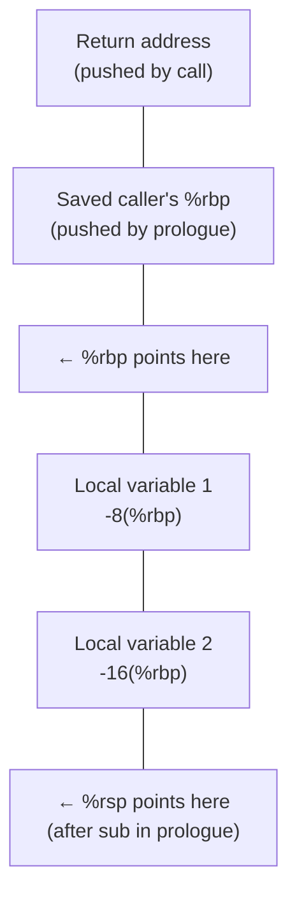

## Learning Objectives

- Explain the purpose of `%rbp` (the frame pointer) and how it differs from `%rsp` (the stack pointer) as a stable reference point within a single function call.
- Read and write a standard function prologue (`push %rbp; mov %rsp, %rbp; sub $N, %rsp`) and explain what each instruction contributes.
- Read and write a standard function epilogue (`leave; ret`, or its expanded equivalent) and explain why it must exactly undo the prologue's effects.
- Draw or read a diagram of a stack frame's layout — return address, saved `%rbp`, local variables — and compute a local variable's address as an offset from `%rbp`.
- Explain why the prologue/epilogue pair is precisely what guarantees `ret`'s unconditional trust, from `the-x86-64-runtime-stack-call-and-ret`, is actually safe to rely on.

## Context & Motivation

`the-x86-64-runtime-stack-call-and-ret` ended on a specific, load-bearing caveat: `ret` pops whatever value is on top of the stack and jumps to it unconditionally, and this only works correctly if a function's internal stack usage is perfectly balanced — every value pushed also popped — before `ret` executes. This concept is the standard, disciplined pattern real compilers use to guarantee exactly that: the **prologue**, a short, fixed sequence of instructions that runs at the start of every function to set up its own private workspace, and the **epilogue**, the matching sequence that runs at the end to tear that workspace down completely before the function returns.

The frame pointer, `%rbp`, is the second major idea this concept introduces. `%rsp` changes constantly within a function — every `push`, every local array declared, every nested call shifts it — which makes it an unreliable reference point for locating a specific local variable partway through a function's execution. `%rbp`, by convention, is set once at the very start of a function (in the prologue) and left untouched for the function's entire body, giving every local variable a fixed, predictable offset relative to it — `-8(%rbp)`, `-16(%rbp)`, and so on — regardless of how much the stack grows and shrinks around temporary values in between.

This concept is where the abstract "stack frame" language `the-stack-and-automatic-storage` used throughout finally receives an exact, byte-level layout, and it is the direct mechanical answer to the diagram `stack-smashing-and-buffer-overflows` already sketched showing a local buffer sitting near a saved return address — this concept names precisely what sits where, and why.

## Core Theory

### The standard prologue

```text
pushq %rbp           ; save the CALLER's %rbp value, so it can be restored later
movq  %rsp, %rbp      ; establish THIS function's frame pointer at the current top of stack
subq  $32, %rsp        ; reserve 32 bytes of space for this function's local variables
```

Each instruction has a specific, necessary role: `push %rbp` preserves the caller's frame pointer value (since `%rbp` is about to be overwritten, and the caller will need its own original value back once this function returns); `mov %rsp, %rbp` fixes this function's own frame pointer at exactly the stack position right after that saved value; `sub $32, %rsp` moves the stack pointer further down, carving out a fixed block of space (here, 32 bytes) for this function's own local variables to live in, without disturbing anything below.

### The standard epilogue

```text
leave    ; equivalent to: movq %rbp, %rsp ;  popq %rbp
ret       ; pop the return address and jump to it (from the-x86-64-runtime-stack-call-and-ret)
```

`leave` is a single instruction that performs exactly the two steps needed to undo the prologue: `movq %rbp, %rsp` collapses the stack pointer back up to where the frame pointer already is (instantly reclaiming all the local-variable space the prologue's `sub` had carved out, without needing to know its exact size), and `popq %rbp` restores the caller's original frame-pointer value that the prologue had saved. Only after both of those steps have run — with `%rsp` back to exactly where it was immediately after the original `call` pushed the return address — does `ret` execute, popping that return address and jumping to it correctly.

### A stack frame's exact layout



Once the prologue has run, `%rbp` sits at a fixed position, with the return address and the caller's saved frame pointer just above it (at positive offsets, toward higher addresses — `8(%rbp)` and `0(%rbp)` respectively) and this function's own local variables just below it (at negative offsets — `-8(%rbp)`, `-16(%rbp)`, and so on, toward lower addresses). Because `%rbp` never moves during the function's body, any local variable's address can be computed as a fixed offset from `%rbp` at compile time, regardless of what temporary values get pushed and popped elsewhere on the stack in between.

### Why this exactly satisfies `ret`'s requirement

`the-x86-64-runtime-stack-call-and-ret` established that `ret` only works correctly if `%rsp` is restored to exactly its post-`call` value before `ret` executes. The prologue/epilogue pair guarantees this by construction: whatever the prologue reserved (`sub $N, %rsp`) is undone by `leave`'s `mov %rbp, %rsp`, and whatever the prologue saved (`push %rbp`) is undone by `leave`'s `pop %rbp` — as long as every function follows this same disciplined pattern, and doesn't leave any of its own internal `push`es unmatched, `%rsp` is guaranteed to be exactly right by the time `ret` runs, which is precisely the guarantee `ret`'s blind trust depends on.

## Worked Examples

### Example 1: locating two local variables by their offsets

```c
void example(void) {
    int a = 1;    /* stored at, say, -4(%rbp) */
    int b = 2;    /* stored at, say, -8(%rbp) */
}
```

```text
example:
    pushq %rbp
    movq  %rsp, %rbp
    subq  $16, %rsp          ; reserve 16 bytes (aligned, even though only 8 are strictly needed)

    movl  $1, -4(%rbp)        ; a = 1
    movl  $2, -8(%rbp)        ; b = 2

    leave
    ret
```

`a` and `b` are each accessed as a fixed offset from `%rbp` — `-4(%rbp)` and `-8(%rbp)` — chosen once by the compiler and never recomputed during the function's execution, regardless of anything else that happens to `%rsp` in between (a nested call, for instance, would push and pop values below these locals without ever needing to shift `a` or `b`'s addresses).

### Example 2: full trace of a call, including the saved `%rbp` chain

```text
caller:
    call callee              ; pushes caller's return address

callee:
    pushq %rbp                 ; save caller's %rbp
    movq  %rsp, %rbp            ; callee's own %rbp now points here
    subq  $16, %rsp

    ; ... callee's body, using -4(%rbp), -8(%rbp), etc. ...

    leave                       ; movq %rbp,%rsp ; popq %rbp  — restores caller's %rbp exactly
    ret                          ; pops the return address, jumps back to caller
```

At the exact moment `callee`'s prologue finishes, the stack (from high to low addresses) holds: the return address, the caller's saved `%rbp`, and then `callee`'s own 16 bytes of local-variable space — precisely the layout diagrammed in the Core Theory section. The epilogue's `leave` reverses this in one instruction, and `ret` completes the return, exactly matching the `call`/`ret` pairing already established.

### Example 3: why `%rbp` stays fixed while `%rsp` moves

```c
void withNestedCall(void) {
    int local = 5;
    helper();     /* a call happens partway through the function */
}
```

```text
withNestedCall:
    pushq %rbp
    movq  %rsp, %rbp
    subq  $16, %rsp
    movl  $5, -4(%rbp)     ; local = 5, always at -4(%rbp)

    call  helper             ; %rsp drops further (return address pushed);
                              ; %rbp is COMPLETELY UNAFFECTED by this call

    ; back here after helper() returns: -4(%rbp) still correctly refers to local
    leave
    ret
```

`call helper` pushes a return address, temporarily lowering `%rsp` further than it was — but `%rbp` doesn't change at all, so `-4(%rbp)` continues to correctly name `local`'s address both before and after the nested call. This is the entire practical point of having a dedicated, stable frame pointer separate from the constantly-shifting stack pointer: `local`'s address never needs to be recomputed relative to whatever `%rsp` happens to be at a given moment.

## Common Misconceptions & Pitfalls

- **"`%rbp` and `%rsp` are two names for the same idea, tracking the same thing."** They track genuinely different things: `%rsp` always points at the current top of the stack, shifting with every `push`/`pop`/`call` within a function's body; `%rbp` is set once, at the start of a function, and stays fixed for that function's entire execution, specifically so local variables have a stable reference point.
- **"The prologue's `sub $N, %rsp` and the epilogue's `leave` are unrelated instructions that happen to both mention the stack."** `leave`'s first half (`mov %rbp, %rsp`) is specifically what undoes the prologue's `sub` — it doesn't need to know what `N` was, because collapsing `%rsp` back to `%rbp`'s value undoes any amount of reservation in one step.
- **"A function's local variables move around in memory as the function executes."** They don't — each local variable is assigned one fixed offset from `%rbp`, decided once (typically at compile time), that stays valid for the entire function call regardless of other stack activity (like a nested call) happening around it, exactly as Example 3 shows.
- **"Skipping the prologue/epilogue pattern for a 'simple' function that uses no locals is always safe."** It's only safe if that function also never pushes anything internally without a matching pop before its `ret` — the prologue/epilogue discipline exists specifically to make that balance automatic and reliable, rather than something each function must get right by hand, ad hoc.

## Summary

A function's prologue (`push %rbp; mov %rsp, %rbp; sub $N, %rsp`) saves the caller's frame pointer, establishes this function's own fixed frame pointer, and reserves space for local variables; its epilogue (`leave; ret`, where `leave` expands to `mov %rbp, %rsp; pop %rbp`) undoes exactly those three steps in reverse, restoring `%rsp` to precisely the value it held right after the original `call`, before `ret` pops the return address and jumps to it. `%rbp`, unlike the constantly-shifting `%rsp`, stays fixed for a function's entire execution, giving every local variable a stable, fixed offset (`-8(%rbp)`, `-16(%rbp)`, ...) that remains valid regardless of nested calls or other stack activity happening in between. This disciplined, matched pair is exactly what guarantees the unconditional trust `ret` places in the stack, established in `the-x86-64-runtime-stack-call-and-ret`, is actually safe — and it is the precise, named layout `stack-smashing-and-buffer-overflows` already needed, informally, to explain why an overflowing local buffer can reach a saved return address at all.

## Documentation Links

- [Bryant & O'Hallaron — Computer Systems: A Programmer's Perspective (CS:APP)](https://csapp.cs.cmu.edu/) — textbook whose stack-frame layout, prologue, and epilogue conventions this concept follows.
- [Stanford CS107 — Guide to x86-64](https://web.stanford.edu/class/cs107/guide/x86-64.html) — reference documenting the frame pointer's role and the standard prologue/epilogue pattern.
