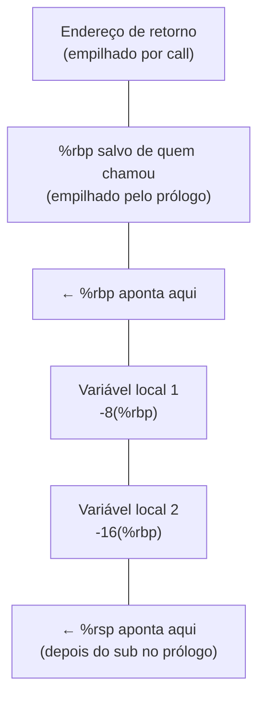

## Objetivos de Aprendizagem

- Explicar o propósito de `%rbp` (o frame pointer) e como ele difere de `%rsp` (o stack pointer) como ponto de referência estável dentro de uma única chamada de função.
- Ler e escrever um prólogo de função padrão (`push %rbp; mov %rsp, %rbp; sub $N, %rsp`) e explicar o que cada instrução contribui.
- Ler e escrever um epílogo de função padrão (`leave; ret`, ou seu equivalente expandido) e explicar por que ele precisa desfazer exatamente os efeitos do prólogo.
- Desenhar ou ler um diagrama do layout de um stack frame (endereço de retorno, `%rbp` salvo, variáveis locais) e calcular o endereço de uma variável local como um deslocamento a partir de `%rbp`.
- Explicar por que o par prólogo/epílogo é precisamente o que garante que a confiança incondicional de `ret`, de `the-x86-64-runtime-stack-call-and-ret`, é de fato segura.

## Contexto e Motivação

`the-x86-64-runtime-stack-call-and-ret` terminou com uma ressalva específica e essencial: `ret` desempilha o valor que estiver no topo da pilha e salta para ele incondicionalmente, e isso só funciona corretamente se o uso interno da pilha por uma função estiver perfeitamente equilibrado (todo valor empilhado também desempilhado) antes de `ret` executar. Este conceito é o padrão disciplinado e padronizado que compiladores reais usam para garantir exatamente isso: o **prólogo**, uma sequência curta e fixa de instruções que roda no início de toda função para montar sua área de trabalho privada, e o **epílogo**, a sequência correspondente que roda no fim para desmontar essa área por completo antes de a função retornar.

O frame pointer, `%rbp`, é a segunda grande ideia que este conceito apresenta. `%rsp` muda o tempo todo dentro de uma função (todo `push`, todo array local declarado, toda chamada aninhada o desloca), o que o torna um ponto de referência pouco confiável para localizar uma variável local específica no meio da execução de uma função. `%rbp`, por convenção, é definido uma vez, bem no início de uma função (no prólogo), e deixado intocado durante todo o corpo da função, dando a cada variável local um deslocamento fixo e previsível em relação a ele (`-8(%rbp)`, `-16(%rbp)` e assim por diante), por mais que a pilha cresça e encolha em torno de valores temporários nesse meio-tempo.

Este conceito é onde a linguagem abstrata de "stack frame" que `the-stack-and-automatic-storage` usou o tempo todo finalmente recebe um layout exato, no nível dos bytes, e é a resposta mecânica direta ao diagrama que `stack-smashing-and-buffer-overflows` já esboçou mostrando um buffer local perto de um endereço de retorno salvo: este conceito nomeia com precisão o que fica onde, e por quê.

## Teoria Central

### O prólogo padrão

```text
pushq %rbp           ; salva o valor de %rbp de QUEM CHAMOU, para poder restaurá-lo depois
movq  %rsp, %rbp      ; estabelece o frame pointer DESTA função no topo atual da pilha
subq  $32, %rsp        ; reserva 32 bytes de espaço para as variáveis locais desta função
```

Cada instrução tem um papel específico e necessário: `push %rbp` preserva o valor do frame pointer de quem chamou (já que `%rbp` está prestes a ser sobrescrito, e quem chamou vai precisar de volta o seu valor original quando esta função retornar); `mov %rsp, %rbp` fixa o frame pointer desta função exatamente na posição da pilha logo depois desse valor salvo; `sub $32, %rsp` move o stack pointer mais para baixo, reservando um bloco fixo de espaço (aqui, 32 bytes) onde as variáveis locais desta função vão morar, sem perturbar nada abaixo.

### O epílogo padrão

```text
leave    ; equivalente a: movq %rbp, %rsp ;  popq %rbp
ret       ; desempilha o endereço de retorno e salta para ele (de the-x86-64-runtime-stack-call-and-ret)
```

`leave` é uma única instrução que faz exatamente os dois passos necessários para desfazer o prólogo: `movq %rbp, %rsp` recolhe o stack pointer de volta até onde o frame pointer já está (recuperando instantaneamente todo o espaço de variáveis locais que o `sub` do prólogo tinha reservado, sem precisar saber seu tamanho exato), e `popq %rbp` restaura o valor original do frame pointer de quem chamou, que o prólogo tinha salvado. Só depois que esses dois passos rodaram (com `%rsp` de volta exatamente onde estava logo depois que o `call` original empilhou o endereço de retorno) é que `ret` executa, desempilhando esse endereço de retorno e saltando para ele corretamente.

### O layout exato de um stack frame



Depois que o prólogo roda, `%rbp` fica numa posição fixa, com o endereço de retorno e o frame pointer salvo de quem chamou logo acima dele (em deslocamentos positivos, em direção aos endereços mais altos: `8(%rbp)` e `0(%rbp)`, respectivamente) e as variáveis locais desta função logo abaixo dele (em deslocamentos negativos: `-8(%rbp)`, `-16(%rbp)` e assim por diante, em direção aos endereços mais baixos). Como `%rbp` nunca se move durante o corpo da função, o endereço de qualquer variável local pode ser calculado como um deslocamento fixo a partir de `%rbp` em tempo de compilação, quaisquer que sejam os valores temporários empilhados e desempilhados em outras partes da pilha nesse meio-tempo.

### Por que isso satisfaz exatamente a exigência de `ret`

`the-x86-64-runtime-stack-call-and-ret` estabeleceu que `ret` só funciona corretamente se `%rsp` for restaurado exatamente ao seu valor pós-`call` antes de `ret` executar. O par prólogo/epílogo garante isso por construção: o que o prólogo reservou (`sub $N, %rsp`) é desfeito pelo `mov %rbp, %rsp` de `leave`, e o que o prólogo salvou (`push %rbp`) é desfeito pelo `pop %rbp` de `leave`. Desde que toda função siga esse mesmo padrão disciplinado e não deixe nenhum dos seus próprios `push`es internos sem correspondência, `%rsp` tem garantia de estar exatamente certo quando `ret` rodar, que é precisamente a garantia da qual a confiança cega de `ret` depende.

## Exemplos Resolvidos

### Exemplo 1: localizando duas variáveis locais pelos seus deslocamentos

```c
void example(void) {
    int a = 1;    /* guardado, digamos, em -4(%rbp) */
    int b = 2;    /* guardado, digamos, em -8(%rbp) */
}
```

```text
example:
    pushq %rbp
    movq  %rsp, %rbp
    subq  $16, %rsp          ; reserva 16 bytes (alinhados, embora só 8 sejam estritamente necessários)

    movl  $1, -4(%rbp)        ; a = 1
    movl  $2, -8(%rbp)        ; b = 2

    leave
    ret
```

`a` e `b` são acessados cada um como um deslocamento fixo a partir de `%rbp` (`-4(%rbp)` e `-8(%rbp)`), escolhido uma vez pelo compilador e nunca recalculado durante a execução da função, não importa o que mais aconteça com `%rsp` nesse meio-tempo (uma chamada aninhada, por exemplo, empilharia e desempilharia valores abaixo dessas variáveis locais sem nunca precisar deslocar os endereços de `a` ou `b`).

### Exemplo 2: rastreamento completo de uma chamada, incluindo a cadeia de `%rbp` salvos

```text
caller:
    call callee              ; empilha o endereço de retorno de caller

callee:
    pushq %rbp                 ; salva o %rbp de caller
    movq  %rsp, %rbp            ; o próprio %rbp de callee agora aponta aqui
    subq  $16, %rsp

    ; ... corpo de callee, usando -4(%rbp), -8(%rbp) etc. ...

    leave                       ; movq %rbp,%rsp ; popq %rbp: restaura exatamente o %rbp de caller
    ret                          ; desempilha o endereço de retorno, salta de volta para caller
```

No instante exato em que o prólogo de `callee` termina, a pilha (dos endereços mais altos para os mais baixos) guarda: o endereço de retorno, o `%rbp` salvo de caller e então os 16 bytes de espaço de variáveis locais do próprio `callee`, precisamente o layout diagramado na seção de Teoria Central. O `leave` do epílogo inverte isso numa instrução, e `ret` completa o retorno, casando exatamente com o pareamento `call`/`ret` já estabelecido.

### Exemplo 3: por que `%rbp` fica fixo enquanto `%rsp` se move

```c
void withNestedCall(void) {
    int local = 5;
    helper();     /* uma chamada acontece no meio da função */
}
```

```text
withNestedCall:
    pushq %rbp
    movq  %rsp, %rbp
    subq  $16, %rsp
    movl  $5, -4(%rbp)     ; local = 5, sempre em -4(%rbp)

    call  helper             ; %rsp desce mais (endereço de retorno empilhado);
                              ; %rbp NÃO é afetado em nada por esta chamada

    ; de volta aqui depois que helper() retorna: -4(%rbp) ainda se refere corretamente a local
    leave
    ret
```

`call helper` empilha um endereço de retorno, baixando temporariamente `%rsp` mais do que estava, mas `%rbp` não muda nada, então `-4(%rbp)` continua nomeando corretamente o endereço de `local` tanto antes quanto depois da chamada aninhada. Esse é todo o propósito prático de ter um frame pointer dedicado e estável, separado do stack pointer que se desloca o tempo todo: o endereço de `local` nunca precisa ser recalculado em relação ao que quer que `%rsp` valha num dado momento.

## Equívocos Comuns e Armadilhas

- **"`%rbp` e `%rsp` são dois nomes para a mesma ideia, acompanhando a mesma coisa."** Eles acompanham coisas genuinamente diferentes: `%rsp` sempre aponta para o topo atual da pilha, deslocando-se a cada `push`/`pop`/`call` dentro do corpo de uma função; `%rbp` é definido uma vez, no início de uma função, e fica fixo durante toda a execução dela, especificamente para que as variáveis locais tenham um ponto de referência estável.
- **"O `sub $N, %rsp` do prólogo e o `leave` do epílogo são instruções sem relação que por acaso mencionam a pilha."** A primeira metade de `leave` (`mov %rbp, %rsp`) é especificamente o que desfaz o `sub` do prólogo; ela não precisa saber quanto valia `N`, porque recolher `%rsp` de volta ao valor de `%rbp` desfaz qualquer quantidade de reserva num único passo.
- **"As variáveis locais de uma função se movem na memória enquanto a função executa."** Não se movem: cada variável local recebe um deslocamento fixo a partir de `%rbp`, decidido uma vez (normalmente em tempo de compilação), que permanece válido durante toda a chamada da função, independentemente de outra atividade na pilha (como uma chamada aninhada) acontecendo ao redor, exatamente como mostra o Exemplo 3.
- **"Pular o padrão prólogo/epílogo numa função 'simples' que não usa variáveis locais é sempre seguro."** Só é seguro se essa função também nunca empilhar nada internamente sem um desempilhamento correspondente antes do seu `ret`. A disciplina de prólogo/epílogo existe especificamente para tornar esse equilíbrio automático e confiável, em vez de algo que cada função precisa acertar à mão, caso a caso.

## Resumo

O prólogo de uma função (`push %rbp; mov %rsp, %rbp; sub $N, %rsp`) salva o frame pointer de quem chamou, estabelece o frame pointer fixo desta função e reserva espaço para variáveis locais; seu epílogo (`leave; ret`, em que `leave` se expande para `mov %rbp, %rsp; pop %rbp`) desfaz exatamente esses três passos em ordem inversa, restaurando `%rsp` precisamente ao valor que tinha logo depois do `call` original, antes que `ret` desempilhe o endereço de retorno e salte para ele. `%rbp`, ao contrário do `%rsp` que se desloca o tempo todo, fica fixo durante toda a execução de uma função, dando a cada variável local um deslocamento fixo e estável (`-8(%rbp)`, `-16(%rbp)`, ...) que continua válido independentemente de chamadas aninhadas ou de outra atividade na pilha nesse meio-tempo. Esse par disciplinado e casado é exatamente o que garante que a confiança incondicional que `ret` deposita na pilha, estabelecida em `the-x86-64-runtime-stack-call-and-ret`, é de fato segura, e é o layout preciso e nomeado de que `stack-smashing-and-buffer-overflows` já precisava, informalmente, para explicar por que um buffer local que transborda consegue sequer alcançar um endereço de retorno salvo.

## Documentation Links

- [Bryant & O'Hallaron: Computer Systems: A Programmer's Perspective (CS:APP)](https://csapp.cs.cmu.edu/): livro-texto cujas convenções de layout de stack frame, prólogo e epílogo este conceito segue.
- [Stanford CS107: Guide to x86-64](https://web.stanford.edu/class/cs107/guide/x86-64.html): referência que documenta o papel do frame pointer e o padrão de prólogo/epílogo padrão.
