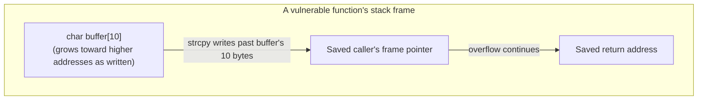
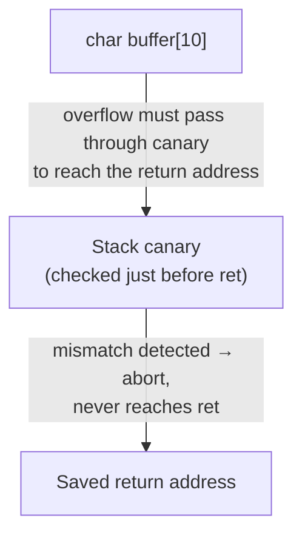

## Learning Objectives

- Explain why writing past the end of a stack-allocated array is possible at all in C, in terms of the language's lack of automatic bounds checking.
- Trace, conceptually, how a large enough out-of-bounds write into a stack buffer can reach and overwrite adjacent stack memory, including a saved return address.
- Explain, at a conceptual level, why overwriting a saved return address lets an attacker redirect a program's control flow, without needing to construct a working exploit.
- Identify unsafe standard-library functions (`gets`, unchecked `strcpy`) as a real, historical source of this bug class, and name their safer counterparts.
- Connect this bug to the stack-frame layout from `stack-frames-prologue-and-epilogue` and describe, at a high level, one real defensive mechanism (stack canaries) used to detect it.

## Context & Motivation

Every pointer-arithmetic and array-indexing operation covered so far in this discipline has assumed the programmer stays within an array's declared bounds. C does not enforce that assumption — there is no automatic bounds check on an array access, at compile time or at runtime, and `pointer-arithmetic-and-array-decay` already established that `a[i]` is nothing more than `*(a + i)`: an address computation and a dereference, both of which happily proceed even when `i` is far outside the array's actual size. A buffer overflow is exactly this: writing past the end of an array's allocated storage, into memory that belongs to something else entirely.

This concept exists specifically because the *something else* a stack-allocated buffer's overflow reaches is not arbitrary — it is, predictably, whatever else is stored in that same stack frame or an adjacent one, and `stack-frames-prologue-and-epilogue` will establish that a frame's layout includes the saved return address that `ret` (covered in `the-x86-64-runtime-stack-call-and-ret`) trusts completely when a function returns. Overwriting that saved value with an attacker-chosen address is the textbook first step in a whole historical class of security exploits — not because the attacker broke some encryption or guessed a password, but because a program's own stack layout, once understood, tells you exactly where to write to hijack what happens next.

This is covered here, at a conceptual level, for the same reason CS107 covers it directly: understanding *why* this vulnerability exists is inseparable from understanding the stack layout this discipline already teaches — it is the direct, concrete payoff of taking that layout seriously, not a separate security topic bolted on. The goal here is understanding the mechanism and the defenses, not constructing a working exploit; real offensive exploitation techniques belong to a security-focused course, and this discipline stops at the conceptual "why this class of bug is possible and how it's mitigated."

## Core Theory

### Why the overflow is possible: no bounds checking

C arrays carry no runtime record of their own size once compiled, and array access is defined, without exception, as pointer arithmetic followed by a dereference. Writing to `arr[20]` on an array declared with only 10 elements is not rejected by the compiler and is not caught at runtime — it computes an address 20 elements past `arr`'s start and writes there, regardless of whether that address still belongs to `arr`:

```c
void vulnerable(void) {
    char buffer[10];
    strcpy(buffer, "this string is much longer than 10 characters");
    /* strcpy copies every byte of the source, with no regard for buffer's size —
       characters past the 10th overwrite whatever memory comes after buffer */
}
```

`strcpy`, used here, copies bytes until it reaches the source string's terminating null byte, with no awareness of the destination buffer's actual size — it will happily write far past the end of `buffer` if the source string is longer, corrupting whatever memory lies immediately after `buffer` in the stack frame.

### What lies immediately after a stack buffer

`stack-frames-prologue-and-epilogue` establishes that a function's stack frame holds, in addition to its local variables, the saved return address — the exact location `ret` reads from when the function is ready to hand control back to its caller. Depending on the compiler's specific layout choices, a local buffer can sit close enough to that saved return address that a large enough overflow reaches it directly:



Overwriting the saved return address with a value the program never intended — often, in a classic exploit, the address of malicious code the attacker has also managed to place in memory — means that when the vulnerable function eventually executes `ret`, it jumps to wherever the attacker chose, not back to its legitimate caller. Nothing about `ret`'s own mechanism (covered in `the-x86-64-runtime-stack-call-and-ret`) distinguishes a legitimately saved return address from one an overflow has silently replaced; `ret` trusts whatever value it finds on the stack completely.

### Unsafe functions: a real, historical pattern

Several C standard library functions are unsafe specifically because they have no way to know the size of the buffer they're writing into, and perform no check even when that information is available elsewhere:

- **`gets(buffer)`** reads an entire line of input with absolutely no length limit, writing as many bytes as the input contains regardless of `buffer`'s actual size — considered so dangerous that it was formally removed from the C standard library entirely in C11, rather than merely discouraged.
- **`strcpy(dest, src)`** copies `src` until its terminating null byte, with no check against `dest`'s capacity, exactly as shown above.
- **`sprintf(buffer, fmt, ...)`** writes formatted output into `buffer` with no length limit either.

Each has a safer, size-bounded counterpart that takes an explicit maximum length and never writes past it: `fgets` (with an explicit buffer size) in place of `gets`, `strncpy` (though it has its own well-known subtleties around null-termination) or safer string-handling patterns in place of unchecked `strcpy`, and `snprintf` in place of `sprintf`. The existence of these safer counterparts is itself evidence of how well-understood and how common this bug class has historically been.

### A real, standard defense: stack canaries

One widely deployed mitigation, used by real compilers by default, is the **stack canary**: a small, unpredictable value the compiler places on the stack between local buffers and the saved return address, checked immediately before a function returns. If a buffer overflow has overwritten the canary's value on its way to the return address, the mismatch is detected right before `ret` would otherwise execute, and the program is deliberately terminated rather than allowed to jump to a corrupted address:



This does not prevent the overflow itself from happening — the buffer can still be overwritten past its bounds — but it reliably detects the specific, most dangerous consequence (a corrupted return address) before that corruption can be exploited, converting a potential control-flow hijack into a controlled crash.

## Worked Examples

### Example 1: the vulnerable `strcpy` pattern, made concrete

```c
void login(char *username) {
    char buffer[16];
    strcpy(buffer, username);   /* no length check against buffer's 16-byte capacity */
    printf("Welcome, %s\n", buffer);
}

login("short_name");                                  /* fits, no problem */
login("a_username_that_is_deliberately_far_too_long_for_the_buffer");  /* overflow */
```

The first call is entirely safe — the input fits comfortably within `buffer`'s 16 bytes. The second call supplies a string far longer than 16 characters, and `strcpy` writes every one of those characters into and past `buffer`, into whatever stack memory follows it — potentially the saved frame pointer, and beyond that, the saved return address, depending on the exact stack layout the compiler generated for this function.

### Example 2: the same logic, made safe with an explicit bound

```c
void loginSafe(char *username) {
    char buffer[16];
    strncpy(buffer, username, sizeof(buffer) - 1);   /* copies at most 15 bytes */
    buffer[sizeof(buffer) - 1] = '\0';                /* guarantee null-termination */
    printf("Welcome, %s\n", buffer);
}
```

`strncpy` is given an explicit maximum (`sizeof(buffer) - 1`, leaving room for the terminating null byte), and never writes beyond it regardless of how long `username` actually is — a long input is simply truncated rather than allowed to overflow. The explicit manual null-termination on the next line is necessary because `strncpy`, notably, does not guarantee a null-terminated result if the source is at least as long as the limit — one of several well-documented subtleties safer string handling in C has to account for.

### Example 3: conceptually locating the canary's role

```c
void withCanary(void) {
    char buffer[10];
    /* [compiler-inserted]: canary value written here, right after buffer */
    strcpy(buffer, someInput);
    /* [compiler-inserted]: canary checked here, right before the function returns */
}   /* if the canary doesn't match its original value: abort() is called, ret never executes */
```

The canary check the compiler inserts happens after any local code the programmer wrote and immediately before the function's epilogue would otherwise execute `ret` (covered in `stack-frames-prologue-and-epilogue`). An overflow large enough to reach the saved return address must first pass through — and corrupt — the canary sitting between the buffer and that return address, which is exactly the position that makes the canary a reliable tripwire for this specific class of attack, without needing to inspect the return address's value directly.

## Common Misconceptions & Pitfalls

- **"A buffer overflow just corrupts some unrelated data — it's a correctness bug, not a security issue."** It can be exactly that (silently corrupting an adjacent variable) — but when the overflow is large enough and the layout is right, it can overwrite the saved return address itself, turning a correctness bug into a control-flow hijack, which is precisely why this bug class receives dedicated attention rather than being treated as an ordinary logic error.
- **"Stack canaries make buffer overflows impossible."** They don't prevent the overflow from happening at all — they only detect the specific, most dangerous outcome (a corrupted return address) before `ret` acts on it. The underlying out-of-bounds write is still a real bug that needs fixing; the canary is a safety net, not a cure.
- **"`strncpy` is a fully safe drop-in replacement for `strcpy`."** It bounds the number of bytes copied, but does not guarantee the result is null-terminated when the source is at least as long as the limit — Example 2 shows the manual null-termination step this real subtlety requires.
- **"This is a topic for a dedicated security course, unrelated to understanding the stack."** The vulnerability is a direct, mechanical consequence of the exact stack-frame layout this discipline already teaches — understanding it requires no separate security-specific knowledge beyond what `the-stack-and-automatic-storage` and `stack-frames-prologue-and-epilogue` already cover.

## Summary

A buffer overflow is possible because C performs no automatic bounds checking on array writes — `pointer-arithmetic-and-array-decay` already established that indexing is just address arithmetic and a dereference, which proceeds identically whether or not the resulting address still belongs to the array. When the overflowed buffer is stack-allocated, a large enough overflow can reach adjacent stack memory, including the saved return address `ret` will trust unconditionally when the function returns — overwriting that address is the classic first step toward hijacking a program's control flow. Unsafe standard-library functions like `gets` and unchecked `strcpy` are the historical, real-world source of this bug class, with size-bounded counterparts (`fgets`, `strncpy`, `snprintf`) as the direct fix, and stack canaries are a widely deployed compiler-inserted defense that detects (without preventing) exactly the return-address-corruption outcome, aborting the program before a corrupted `ret` can execute.

## Documentation Links

- [Stanford CS107 — x86-64 Reference Sheet](https://web.stanford.edu/class/cs107/resources/x86-64-reference.pdf) — reference material covering the stack layout this vulnerability class depends on.
- [Bryant & O'Hallaron — Computer Systems: A Programmer's Perspective (CS:APP)](https://csapp.cs.cmu.edu/) — textbook covering buffer overflow attacks and stack-smashing defenses as a direct application of stack-frame layout.
