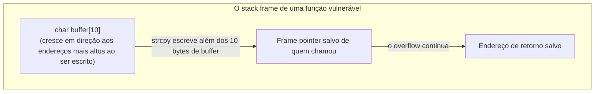
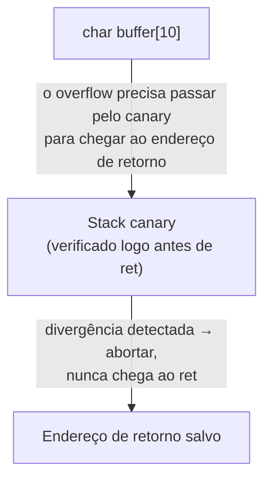

## Objetivos de Aprendizagem

- Explicar por que escrever além do fim de um array alocado na pilha é sequer possível em C, em termos da falta de verificação automática de limites da linguagem.
- Rastrear, conceitualmente, como uma escrita fora dos limites grande o bastante num buffer da pilha pode alcançar e sobrescrever a memória adjacente da pilha, incluindo um endereço de retorno salvo.
- Explicar, em nível conceitual, por que sobrescrever um endereço de retorno salvo permite a um atacante redirecionar o fluxo de controle de um programa, sem precisar construir um exploit funcional.
- Identificar funções inseguras da biblioteca padrão (`gets`, `strcpy` sem verificação) como uma fonte real e histórica desta classe de bug e nomear suas contrapartes mais seguras.
- Ligar este bug ao layout de stack frame de `stack-frames-prologue-and-epilogue` e descrever, em alto nível, um mecanismo defensivo real (stack canaries) usado para detectá-lo.

## Contexto e Motivação

Toda operação de aritmética de ponteiros e indexação de array vista até agora nesta disciplina supôs que o programador fica dentro dos limites declarados de um array. C não impõe essa suposição: não há verificação automática de limites num acesso a array, nem em tempo de compilação nem em tempo de execução, e `pointer-arithmetic-and-array-decay` já estabeleceu que `a[i]` não é nada mais que `*(a + i)`, um cálculo de endereço e uma desreferência, ambos seguindo tranquilamente mesmo quando `i` está muito além do tamanho real do array. Um buffer overflow é exatamente isso: escrever além do fim do armazenamento alocado de um array, em memória que pertence a outra coisa.

Este conceito existe especificamente porque a *outra coisa* que o overflow de um buffer na pilha alcança não é arbitrária: é, de forma previsível, o que mais estiver guardado naquele mesmo stack frame ou num adjacente, e `stack-frames-prologue-and-epilogue` vai estabelecer que o layout de um frame inclui o endereço de retorno salvo em que `ret` (visto em `the-x86-64-runtime-stack-call-and-ret`) confia totalmente quando uma função retorna. Sobrescrever esse valor salvo com um endereço escolhido pelo atacante é o primeiro passo clássico de toda uma classe histórica de exploits de segurança. Não porque o atacante quebrou alguma criptografia ou adivinhou uma senha, e sim porque o próprio layout da pilha de um programa, uma vez entendido, diz exatamente onde escrever para sequestrar o que acontece em seguida.

Isso é tratado aqui, em nível conceitual, pelo mesmo motivo pelo qual o CS107 o trata diretamente: entender *por que* essa vulnerabilidade existe é inseparável de entender o layout da pilha que esta disciplina já ensina. É o retorno direto e concreto de levar esse layout a sério, e não um tema de segurança separado acoplado. O objetivo aqui é entender o mecanismo e as defesas, e não construir um exploit funcional; técnicas reais de exploração ofensiva pertencem a um curso focado em segurança, e esta disciplina para no conceitual "por que essa classe de bug é possível e como ela é mitigada".

## Teoria Central

### Por que o overflow é possível: nenhuma verificação de limites

Arrays em C não carregam nenhum registro em tempo de execução do próprio tamanho depois de compilados, e o acesso a array é definido, sem exceção, como aritmética de ponteiros seguida de uma desreferência. Escrever em `arr[20]` num array declarado com só 10 elementos não é rejeitado pelo compilador nem pego em tempo de execução: calcula-se um endereço 20 elementos depois do início de `arr` e escreve-se lá, quer esse endereço ainda pertença a `arr` ou não:

```c
void vulnerable(void) {
    char buffer[10];
    strcpy(buffer, "this string is much longer than 10 characters");
    /* strcpy copia cada byte da origem, sem considerar o tamanho de buffer:
       os caracteres depois do 10º sobrescrevem a memória que vier depois de buffer */
}
```

`strcpy`, usada aqui, copia bytes até chegar ao byte nulo terminador da string de origem, sem nenhuma noção do tamanho real do buffer de destino: ela vai tranquilamente escrever muito além do fim de `buffer` se a string de origem for mais longa, corrompendo a memória que estiver logo depois de `buffer` no stack frame.

### O que fica logo depois de um buffer na pilha

`stack-frames-prologue-and-epilogue` estabelece que o stack frame de uma função guarda, além das variáveis locais, o endereço de retorno salvo: o local exato que `ret` lê quando a função está pronta para devolver o controle a quem a chamou. Dependendo das escolhas específicas de layout do compilador, um buffer local pode ficar perto o bastante desse endereço de retorno salvo para que um overflow grande o suficiente o alcance diretamente:



Sobrescrever o endereço de retorno salvo com um valor que o programa nunca pretendeu (muitas vezes, num exploit clássico, o endereço de código malicioso que o atacante também conseguiu colocar na memória) significa que, quando a função vulnerável finalmente executar `ret`, ela vai saltar para onde o atacante escolheu, e não de volta para quem a chamou legitimamente. Nada no próprio mecanismo de `ret` (visto em `the-x86-64-runtime-stack-call-and-ret`) distingue um endereço de retorno salvo legitimamente de um que um overflow substituiu silenciosamente; `ret` confia totalmente em qualquer valor que encontre na pilha.

### Funções inseguras: um padrão real e histórico

Várias funções da biblioteca padrão de C são inseguras justamente porque não têm como saber o tamanho do buffer em que estão escrevendo, e não fazem nenhuma verificação mesmo quando essa informação está disponível em outro lugar:

- **`gets(buffer)`** lê uma linha inteira de entrada sem limite algum de tamanho, escrevendo quantos bytes a entrada tiver, qualquer que seja o tamanho real de `buffer`. Foi considerada tão perigosa que acabou formalmente removida da biblioteca padrão de C no C11, em vez de apenas desencorajada.
- **`strcpy(dest, src)`** copia `src` até o seu byte nulo terminador, sem verificar a capacidade de `dest`, exatamente como mostrado acima.
- **`sprintf(buffer, fmt, ...)`** escreve saída formatada em `buffer`, também sem limite de tamanho.

Cada uma tem uma contraparte mais segura, limitada por tamanho, que recebe um comprimento máximo explícito e nunca escreve além dele: `fgets` (com um tamanho de buffer explícito) no lugar de `gets`, `strncpy` (embora tenha suas próprias sutilezas bem conhecidas quanto ao terminador nulo) ou padrões mais seguros de manipulação de strings no lugar de `strcpy` sem verificação, e `snprintf` no lugar de `sprintf`. A existência dessas contrapartes mais seguras é ela própria uma evidência de quão bem entendida e quão comum essa classe de bug foi historicamente.

### Uma defesa real e padrão: stack canaries

Uma mitigação amplamente usada, aplicada por compiladores reais por padrão, é o **stack canary**: um valor pequeno e imprevisível que o compilador coloca na pilha entre os buffers locais e o endereço de retorno salvo, verificado logo antes de uma função retornar. Se um buffer overflow sobrescreveu o valor do canary no caminho até o endereço de retorno, a divergência é detectada logo antes de `ret` executar, e o programa é encerrado de propósito, em vez de ter permissão para saltar para um endereço corrompido:



Isso não impede que o overflow em si aconteça (o buffer ainda pode ser sobrescrito além dos limites), mas detecta de forma confiável a consequência específica e mais perigosa (um endereço de retorno corrompido) antes que essa corrupção possa ser explorada, convertendo um possível sequestro do fluxo de controle numa falha controlada.

## Exemplos Resolvidos

### Exemplo 1: o padrão vulnerável com `strcpy`, tornado concreto

```c
void login(char *username) {
    char buffer[16];
    strcpy(buffer, username);   /* nenhuma verificação de tamanho contra a capacidade de 16 bytes de buffer */
    printf("Welcome, %s\n", buffer);
}

login("short_name");                                  /* cabe, sem problema */
login("a_username_that_is_deliberately_far_too_long_for_the_buffer");  /* overflow */
```

A primeira chamada é totalmente segura: a entrada cabe com folga nos 16 bytes de `buffer`. A segunda chamada fornece uma string muito mais longa que 16 caracteres, e `strcpy` escreve cada um desses caracteres em `buffer` e além dele, na memória da pilha que vem a seguir, potencialmente o frame pointer salvo e, depois dele, o endereço de retorno salvo, dependendo do layout exato da pilha que o compilador gerou para esta função.

### Exemplo 2: a mesma lógica, tornada segura com um limite explícito

```c
void loginSafe(char *username) {
    char buffer[16];
    strncpy(buffer, username, sizeof(buffer) - 1);   /* copia no máximo 15 bytes */
    buffer[sizeof(buffer) - 1] = '\0';                /* garante o terminador nulo */
    printf("Welcome, %s\n", buffer);
}
```

`strncpy` recebe um máximo explícito (`sizeof(buffer) - 1`, deixando espaço para o byte nulo terminador) e nunca escreve além dele, por mais longo que `username` seja; uma entrada longa é simplesmente truncada, em vez de ter permissão para transbordar. A terminação nula manual explícita na linha seguinte é necessária porque `strncpy`, notavelmente, não garante um resultado terminado em nulo se a origem tiver pelo menos o tamanho do limite, uma das várias sutilezas bem documentadas de que a manipulação segura de strings em C precisa dar conta.

### Exemplo 3: localizando conceitualmente o papel do canary

```c
void withCanary(void) {
    char buffer[10];
    /* [inserido pelo compilador]: valor do canary escrito aqui, logo depois de buffer */
    strcpy(buffer, someInput);
    /* [inserido pelo compilador]: canary verificado aqui, logo antes de a função retornar */
}   /* se o canary não bater com o valor original: abort() é chamado, ret nunca executa */
```

A verificação do canary que o compilador insere acontece depois de qualquer código local que o programador escreveu e imediatamente antes de o epílogo da função executar `ret` (visto em `stack-frames-prologue-and-epilogue`). Um overflow grande o bastante para alcançar o endereço de retorno salvo precisa primeiro passar pelo canary, e corrompê-lo, já que ele fica entre o buffer e esse endereço de retorno; é exatamente essa posição que torna o canary um alarme confiável para esta classe específica de ataque, sem precisar inspecionar diretamente o valor do endereço de retorno.

## Equívocos Comuns e Armadilhas

- **"Um buffer overflow só corrompe algum dado sem relação; é um bug de correção, e não um problema de segurança."** Pode ser exatamente isso (corromper silenciosamente uma variável adjacente), mas, quando o overflow é grande o bastante e o layout é o certo, ele pode sobrescrever o próprio endereço de retorno salvo, transformando um bug de correção num sequestro do fluxo de controle. É exatamente por isso que esta classe de bug recebe atenção dedicada, em vez de ser tratada como um erro de lógica comum.
- **"Stack canaries tornam os buffer overflows impossíveis."** Eles não impedem o overflow de acontecer; só detectam o resultado específico e mais perigoso (um endereço de retorno corrompido) antes que `ret` aja com base nele. A escrita fora dos limites subjacente continua sendo um bug real que precisa ser corrigido; o canary é uma rede de segurança, e não uma cura.
- **"`strncpy` é um substituto totalmente seguro e direto para `strcpy`."** Ela limita o número de bytes copiados, mas não garante que o resultado seja terminado em nulo quando a origem tem pelo menos o tamanho do limite. O Exemplo 2 mostra o passo de terminação nula manual que essa sutileza real exige.
- **"Este é um tema para um curso dedicado de segurança, sem relação com entender a pilha."** A vulnerabilidade é uma consequência direta e mecânica exatamente do layout de stack frame que esta disciplina já ensina; entendê-la não exige nenhum conhecimento específico de segurança além do que `the-stack-and-automatic-storage` e `stack-frames-prologue-and-epilogue` já cobrem.

## Resumo

Um buffer overflow é possível porque C não faz nenhuma verificação automática de limites em escritas em arrays: `pointer-arithmetic-and-array-decay` já estabeleceu que indexar é só aritmética de endereços e uma desreferência, que procede de forma idêntica quer o endereço resultante ainda pertença ao array ou não. Quando o buffer que transborda está alocado na pilha, um overflow grande o bastante pode alcançar a memória adjacente da pilha, incluindo o endereço de retorno salvo em que `ret` vai confiar incondicionalmente quando a função retornar; sobrescrever esse endereço é o primeiro passo clássico para sequestrar o fluxo de controle de um programa. Funções inseguras da biblioteca padrão como `gets` e `strcpy` sem verificação são a fonte histórica e real desta classe de bug, com contrapartes limitadas por tamanho (`fgets`, `strncpy`, `snprintf`) como correção direta, e os stack canaries são uma defesa amplamente usada, inserida pelo compilador, que detecta (sem impedir) exatamente o resultado de corrupção do endereço de retorno, abortando o programa antes que um `ret` corrompido possa executar.

## Documentation Links

- [Stanford CS107: x86-64 Reference Sheet](https://web.stanford.edu/class/cs107/resources/x86-64-reference.pdf): material de referência que cobre o layout da pilha do qual esta classe de vulnerabilidade depende.
- [Bryant & O'Hallaron: Computer Systems: A Programmer's Perspective (CS:APP)](https://csapp.cs.cmu.edu/): livro-texto que cobre ataques de buffer overflow e defesas contra stack smashing como uma aplicação direta do layout de stack frame.
