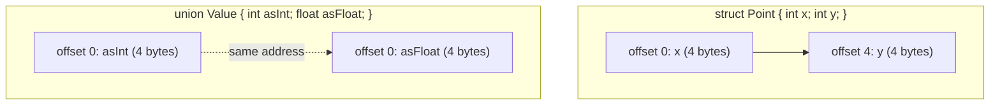

## Learning Objectives

- Describe how a struct's fields are laid out contiguously in memory, in declaration order, and compute a field's offset from the struct's starting address.
- Explain why the compiler inserts padding bytes between fields, in terms of each field's alignment requirement, and predict the total size of a small struct given its field types and order.
- Describe how a union differs from a struct: all members share the same starting address, and the union's size is the size of its largest member, not the sum of all members.
- Reorder a struct's fields to reduce padding, and explain why the reordering changes the struct's total size without changing its behavior.
- Connect a struct to the `Node` objects already used informally in `data-structures-i`, showing that a `struct Node { int value; struct Node *next; }` is the literal memory layout behind that abstraction.

## Context & Motivation

`data-structures-i` introduced nodes as bundles of a value and a pointer to the next node, without describing how such a bundle is actually arranged in memory. A C struct is exactly that arrangement made explicit and controllable: a fixed sequence of named fields, laid out one after another in memory, each occupying a predictable offset from the struct's start. Understanding struct layout closes the last gap in the informal "node" picture from Data Structures I — a struct is not a container that magically groups values together; it is a contiguous block of bytes whose fields are found by simple, fixed arithmetic on offsets, in exactly the spirit of the array indexing already covered.

The one genuinely new idea a struct introduces — and the one every real course covering this material treats carefully — is padding. A struct's total size is very often *larger* than the sum of its fields' individual sizes, because the compiler inserts unused bytes to keep each field aligned to an address the hardware can access efficiently. This is not a wasteful accident to be immediately optimized away; it's a direct consequence of how memory access actually works at the hardware level, and CS:APP devotes real attention to it precisely because programmers who don't understand it are routinely surprised by `sizeof` results that don't match their naive expectation.

A union is included here specifically because it is the sharpest possible contrast to a struct: where a struct's fields each get their own space, a union's members are deliberately overlapped at the same address, trading the ability to hold multiple values simultaneously for the ability to interpret the same bytes multiple ways — a technique used throughout systems code (and, not coincidentally, exactly the trick IEEE 754 uses to let the same 32 or 64 bits be read as either a float or a set of raw bits).

## Core Theory

### A struct lays fields out contiguously, in declaration order

Declaring a struct reserves one contiguous block of memory, with fields placed in the exact order they're declared:

```c
struct Point {
    int x;      /* offset 0 */
    int y;      /* offset 4 */
};
```

Given a `struct Point p`, `p.x` lives at `&p + 0` and `p.y` lives at `&p + 4` (assuming a 4-byte `int` with no padding needed here, since both fields have the same alignment). Accessing a field is, mechanically, computing the struct's base address plus a fixed offset and dereferencing — the same "compute an address, then dereference" pattern already established for array indexing.

### Alignment: why padding exists

Most hardware can read or write an N-byte value efficiently only when that value's address is a multiple of N (or of some hardware-specific alignment boundary) — reading a 4-byte `int` from an address that isn't a multiple of 4 can require the processor to issue two memory accesses instead of one, or on some architectures, isn't permitted at all. To guarantee every field starts at a properly aligned address, the compiler inserts **padding** — unused filler bytes — between fields whenever the natural next offset doesn't already satisfy the next field's alignment requirement.

```c
struct Example {
    char  a;     /* offset 0, size 1 */
    /* 3 padding bytes here, so b starts at offset 4 (a multiple of 4) */
    int   b;     /* offset 4, size 4 */
    char  c;     /* offset 8, size 1 */
    /* 3 padding bytes here, so the struct's total size is a multiple of 4 */
};
/* sizeof(struct Example) == 12, not 1 + 4 + 1 == 6 */
```

The struct's *total* size is also padded up to a multiple of its own largest-required alignment (4, matching `int`, in this example) — this ensures that an array of these structs keeps every element correctly aligned too, not just the first one.

### Reordering fields to reduce padding

Because padding depends on the order fields are declared in, simply reordering fields — largest alignment requirement first — can shrink a struct's total size without changing what it stores or how it behaves:

```c
struct Wasteful {
    char  a;   /* offset 0 */
    int   b;   /* offset 4 (3 bytes padding before it) */
    char  c;   /* offset 8 */
};             /* size 12 (3 bytes padding at the end) */

struct Tight {
    int   b;   /* offset 0 */
    char  a;   /* offset 4 */
    char  c;   /* offset 5 */
};             /* size 8 (2 bytes padding at the end, none in the middle) */
```

Both structs store the same three values; `Tight` simply groups the differently-aligned fields to avoid gaps between them. This is a real, practical technique — struct reordering for size — used in memory-constrained or high-throughput systems code, and it only makes sense once padding itself is understood as the mechanical cause.

### Unions: every member starts at the same address

A union looks syntactically like a struct but means something fundamentally different: every member is placed at offset 0, and the union's total size is the size of its *largest* member, not the sum of all of them:

```c
union Value {
    int   asInt;      /* offset 0, 4 bytes */
    float asFloat;     /* offset 0, 4 bytes */
    char  asBytes[4];  /* offset 0, 4 bytes */
};
/* sizeof(union Value) == 4 — the size of its largest member */
```

Writing through one member and reading through another reinterprets the exact same bytes under a different type — the same set of 4 bytes can be written as an `int` and read back as a `float`, with no copying involved. This is precisely the mechanism `digital-logic-computer-organization/ieee-754-floating-point` relies on implicitly whenever a float's raw bit pattern needs to be inspected: a union lets C code do that reinterpretation directly and portably, instead of relying on undefined-behavior-prone pointer casts.



## Worked Examples

### Example 1: computing offsets by hand

```c
struct Record {
    char  flag;    /* offset 0, size 1 */
    /* padding: 3 bytes, so id starts at offset 4 */
    int   id;      /* offset 4, size 4 */
    short count;   /* offset 8, size 2 */
    /* padding: 2 bytes, so total size is a multiple of 4 (int's alignment) */
};
/* sizeof(struct Record) == 12 */
```

Working through this by hand: `flag` needs no padding before it (offset 0 is always aligned). `id` needs to start at a multiple of 4, and offset 1 (right after `flag`) isn't, so 3 padding bytes are inserted, placing `id` at offset 4. `count` needs to start at a multiple of 2; offset 8 (right after `id`) already is, so no padding is needed there. After `count` ends at offset 10, the struct's overall size must round up to a multiple of 4 (the largest alignment requirement among its fields, from `int`), so 2 trailing padding bytes bring the total to 12.

### Example 2: the `Node` from data-structures-i, made concrete

```c
struct Node {
    int value;          /* offset 0, size 4 */
    struct Node *next;  /* offset 8, size 8 (pointer) — 4 bytes padding before it */
};
/* sizeof(struct Node) == 16 */
```

This is precisely the node `singly-linked-lists` described informally as "a value, and a pointer to the next node." The 4 bytes of padding between `value` and `next` exist because `next`, a pointer, needs to start at an 8-byte-aligned address on x86-64, and offset 4 isn't one. Every node allocated on the heap (covered in `the-heap-and-dynamic-allocation`) for a real linked list in C is exactly 16 bytes of memory laid out this way — not an abstraction, an actual, computable layout.

### Example 3: reinterpreting bits with a union

```c
union FloatBits {
    float f;
    unsigned int bits;
};

union FloatBits u;
u.f = 1.5f;
printf("%u\n", u.bits);   /* prints the raw 32-bit pattern of 1.5f as an unsigned int */
```

Writing `1.5f` into `u.f` stores its IEEE 754 bit pattern into the union's 4 bytes; reading `u.bits` interprets those exact same bytes as an `unsigned int`, with no conversion — 1.5 is never rounded or truncated to an integer here, its raw bits are simply relabeled. This is the direct, hands-on version of the sign/exponent/mantissa layout `digital-logic-computer-organization/ieee-754-floating-point` already covered structurally.

## Common Misconceptions & Pitfalls

- **"`sizeof(struct)` always equals the sum of its fields' sizes."** It doesn't, whenever alignment forces padding — `struct Example` above is 12 bytes, not 6, purely due to padding the compiler inserted for alignment.
- **"Field order in a struct declaration doesn't affect its size."** It very much does — `Wasteful` and `Tight` above store identical data but differ in total size purely because of field ordering and its effect on padding.
- **"A union lets you store several different values at once, one per member."** A union stores exactly one value at a time, physically — every member is an alias for the same bytes. Writing through one member and then reading through a *different* member reinterprets those same bytes; it does not retrieve a separately-stored value.
- **"Padding is a compiler inefficiency that should always be eliminated."** Padding exists to keep every field efficiently (or, on some architectures, correctly) accessible; eliminating it entirely (with a `packed` attribute, on compilers that support one) can make access slower or, on some hardware, cause a crash, and is a deliberate tradeoff, not a free optimization.

## Summary

A struct places its fields contiguously in memory, in declaration order, with the compiler inserting padding bytes wherever needed so every field starts at an address matching its alignment requirement — a fact that directly determines a struct's actual `sizeof`, which is often larger than the naive sum of its fields, and can be reduced by reordering fields from largest to smallest alignment. A union takes the opposite approach: every member shares the exact same starting address, so the union's size is the size of its largest member, and writing through one member while reading through another reinterprets the same underlying bytes — the same trick that lets a float's raw IEEE 754 bit pattern be inspected directly. Together, structs and unions turn the informal "node" and "boxed value" pictures used throughout `data-structures-i` into fully concrete, offset-computable memory layouts.

## Documentation Links

- [Bryant & O'Hallaron — Computer Systems: A Programmer's Perspective (CS:APP)](https://csapp.cs.cmu.edu/) — textbook treatment of struct layout, alignment, and padding this discipline follows.
- [Stanford CS107 — General Information and Syllabus](https://web.stanford.edu/class/cs107/syllabus) — course covering C data representation, including structs and memory layout, ahead of assembly.
