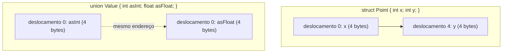

## Objetivos de Aprendizagem

- Descrever como os campos de uma struct são dispostos de forma contígua na memória, na ordem de declaração, e calcular o deslocamento de um campo a partir do endereço inicial da struct.
- Explicar por que o compilador insere bytes de padding entre os campos, em termos do requisito de alinhamento de cada campo, e prever o tamanho total de uma struct pequena dados os tipos e a ordem dos campos.
- Descrever como uma union difere de uma struct: todos os membros compartilham o mesmo endereço inicial, e o tamanho da union é o tamanho do seu maior membro, e não a soma de todos os membros.
- Reordenar os campos de uma struct para reduzir o padding e explicar por que a reordenação muda o tamanho total da struct sem mudar seu comportamento.
- Ligar uma struct aos objetos `Node` já usados informalmente em `data-structures-i`, mostrando que um `struct Node { int value; struct Node *next; }` é o layout de memória literal por trás dessa abstração.

## Contexto e Motivação

`data-structures-i` apresentou nós como pacotes de um valor e um ponteiro para o próximo nó, sem descrever como esse pacote é de fato organizado na memória. Uma struct em C é exatamente essa organização tornada explícita e controlável: uma sequência fixa de campos nomeados, dispostos um depois do outro na memória, cada um ocupando um deslocamento previsível a partir do início da struct. Entender o layout de structs fecha a última lacuna do quadro informal de "nó" de Estruturas de Dados I: uma struct não é um contêiner que agrupa valores por mágica; é um bloco contíguo de bytes cujos campos são encontrados por aritmética simples e fixa de deslocamentos, exatamente no espírito da indexação de arrays já vista.

A única ideia genuinamente nova que uma struct traz (e a que todo curso real que cobre este material trata com cuidado) é o padding. O tamanho total de uma struct é muitas vezes *maior* que a soma dos tamanhos individuais dos seus campos, porque o compilador insere bytes não usados para manter cada campo alinhado a um endereço que o hardware consegue acessar de forma eficiente. Isso não é um acidente desperdiçador a ser otimizado de imediato; é uma consequência direta de como o acesso à memória de fato funciona no nível do hardware, e o CS:APP dedica atenção real a isso justamente porque programadores que não o entendem são rotineiramente surpreendidos por resultados de `sizeof` que não batem com sua expectativa ingênua.

Uma union está aqui especificamente porque é o contraste mais nítido possível com uma struct: onde os campos de uma struct têm cada um seu próprio espaço, os membros de uma union são deliberadamente sobrepostos no mesmo endereço, trocando a capacidade de guardar vários valores ao mesmo tempo pela capacidade de interpretar os mesmos bytes de várias formas. É uma técnica usada em todo código de sistemas (e, não por coincidência, exatamente o truque que o IEEE 754 usa para permitir que os mesmos 32 ou 64 bits sejam lidos como um float ou como um conjunto de bits brutos).

## Teoria Central

### Uma struct dispõe os campos de forma contígua, na ordem de declaração

Declarar uma struct reserva um bloco contíguo de memória, com os campos colocados exatamente na ordem em que são declarados:

```c
struct Point {
    int x;      /* deslocamento 0 */
    int y;      /* deslocamento 4 */
};
```

Dada uma `struct Point p`, `p.x` mora em `&p + 0` e `p.y` mora em `&p + 4` (supondo um `int` de 4 bytes, sem padding necessário aqui, já que os dois campos têm o mesmo alinhamento). Acessar um campo é, mecanicamente, calcular o endereço base da struct mais um deslocamento fixo e desreferenciar: o mesmo padrão "calcular um endereço e depois desreferenciar" já estabelecido para a indexação de arrays.

### Alinhamento: por que o padding existe

A maior parte do hardware só consegue ler ou escrever de forma eficiente um valor de N bytes quando o endereço desse valor é múltiplo de N (ou de alguma fronteira de alinhamento específica do hardware). Ler um `int` de 4 bytes de um endereço que não é múltiplo de 4 pode exigir que o processador faça dois acessos à memória em vez de um, ou, em algumas arquiteturas, nem é permitido. Para garantir que todo campo comece num endereço devidamente alinhado, o compilador insere **padding** (bytes de preenchimento não usados) entre os campos sempre que o próximo deslocamento natural ainda não satisfaz o requisito de alinhamento do próximo campo.

```c
struct Example {
    char  a;     /* deslocamento 0, tamanho 1 */
    /* 3 bytes de padding aqui, para que b comece no deslocamento 4 (múltiplo de 4) */
    int   b;     /* deslocamento 4, tamanho 4 */
    char  c;     /* deslocamento 8, tamanho 1 */
    /* 3 bytes de padding aqui, para que o tamanho total da struct seja múltiplo de 4 */
};
/* sizeof(struct Example) == 12, e não 1 + 4 + 1 == 6 */
```

O tamanho *total* da struct também é arredondado para um múltiplo do seu maior alinhamento exigido (4, correspondente a `int`, neste exemplo): isso garante que um array dessas structs mantenha todo elemento corretamente alinhado também, e não só o primeiro.

### Reordenando campos para reduzir o padding

Como o padding depende da ordem em que os campos são declarados, simplesmente reordenar os campos (o maior requisito de alinhamento primeiro) pode encolher o tamanho total de uma struct sem mudar o que ela guarda nem como se comporta:

```c
struct Wasteful {
    char  a;   /* deslocamento 0 */
    int   b;   /* deslocamento 4 (3 bytes de padding antes dele) */
    char  c;   /* deslocamento 8 */
};             /* tamanho 12 (3 bytes de padding no fim) */

struct Tight {
    int   b;   /* deslocamento 0 */
    char  a;   /* deslocamento 4 */
    char  c;   /* deslocamento 5 */
};             /* tamanho 8 (2 bytes de padding no fim, nenhum no meio) */
```

As duas structs guardam os mesmos três valores; `Tight` simplesmente agrupa os campos de alinhamentos diferentes para evitar lacunas entre eles. É uma técnica real e prática (reordenar structs para economizar tamanho) usada em código de sistemas com memória restrita ou de alta vazão, e ela só faz sentido quando o próprio padding é entendido como a causa mecânica.

### Unions: todo membro começa no mesmo endereço

Uma union parece sintaticamente uma struct, mas significa algo fundamentalmente diferente: todo membro é colocado no deslocamento 0, e o tamanho total da union é o tamanho do seu *maior* membro, e não a soma de todos eles:

```c
union Value {
    int   asInt;      /* deslocamento 0, 4 bytes */
    float asFloat;     /* deslocamento 0, 4 bytes */
    char  asBytes[4];  /* deslocamento 0, 4 bytes */
};
/* sizeof(union Value) == 4: o tamanho do seu maior membro */
```

Escrever por meio de um membro e ler por meio de outro reinterpreta exatamente os mesmos bytes sob um tipo diferente: o mesmo conjunto de 4 bytes pode ser escrito como `int` e lido de volta como `float`, sem nenhuma cópia envolvida. É precisamente o mecanismo de que `digital-logic-computer-organization/ieee-754-floating-point` depende implicitamente sempre que o padrão de bits bruto de um float precisa ser inspecionado: uma union permite que código C faça essa reinterpretação de forma direta e portável, em vez de depender de conversões de ponteiro propensas a comportamento indefinido.



## Exemplos Resolvidos

### Exemplo 1: calculando deslocamentos à mão

```c
struct Record {
    char  flag;    /* deslocamento 0, tamanho 1 */
    /* padding: 3 bytes, para que id comece no deslocamento 4 */
    int   id;      /* deslocamento 4, tamanho 4 */
    short count;   /* deslocamento 8, tamanho 2 */
    /* padding: 2 bytes, para que o tamanho total seja múltiplo de 4 (o alinhamento de int) */
};
/* sizeof(struct Record) == 12 */
```

Fazendo à mão: `flag` não precisa de padding antes (o deslocamento 0 sempre está alinhado). `id` precisa começar num múltiplo de 4, e o deslocamento 1 (logo depois de `flag`) não é, então 3 bytes de padding são inseridos, colocando `id` no deslocamento 4. `count` precisa começar num múltiplo de 2; o deslocamento 8 (logo depois de `id`) já é, então nenhum padding é necessário ali. Depois que `count` termina no deslocamento 10, o tamanho geral da struct precisa ser arredondado para um múltiplo de 4 (o maior requisito de alinhamento entre seus campos, vindo de `int`), então 2 bytes de padding no fim levam o total a 12.

### Exemplo 2: o `Node` de data-structures-i, tornado concreto

```c
struct Node {
    int value;          /* deslocamento 0, tamanho 4 */
    struct Node *next;  /* deslocamento 8, tamanho 8 (ponteiro): 4 bytes de padding antes dele */
};
/* sizeof(struct Node) == 16 */
```

Este é precisamente o nó que `singly-linked-lists` descreveu informalmente como "um valor e um ponteiro para o próximo nó". Os 4 bytes de padding entre `value` e `next` existem porque `next`, um ponteiro, precisa começar num endereço alinhado a 8 bytes no x86-64, e o deslocamento 4 não é um deles. Todo nó alocado no heap (visto em `the-heap-and-dynamic-allocation`) para uma lista ligada real em C tem exatamente 16 bytes de memória dispostos dessa forma: não uma abstração, e sim um layout real e calculável.

### Exemplo 3: reinterpretando bits com uma union

```c
union FloatBits {
    float f;
    unsigned int bits;
};

union FloatBits u;
u.f = 1.5f;
printf("%u\n", u.bits);   /* imprime o padrão bruto de 32 bits de 1.5f como um unsigned int */
```

Escrever `1.5f` em `u.f` guarda o seu padrão de bits IEEE 754 nos 4 bytes da union; ler `u.bits` interpreta exatamente esses mesmos bytes como um `unsigned int`, sem conversão nenhuma: 1.5 nunca é arredondado nem truncado para um inteiro aqui, seus bits brutos são simplesmente rotulados de outro jeito. É a versão direta e prática do layout de sinal/expoente/mantissa que `digital-logic-computer-organization/ieee-754-floating-point` já cobriu estruturalmente.

## Equívocos Comuns e Armadilhas

- **"`sizeof(struct)` é sempre igual à soma dos tamanhos dos seus campos."** Não é, sempre que o alinhamento força padding: a `struct Example` acima tem 12 bytes, e não 6, puramente por causa do padding que o compilador inseriu para o alinhamento.
- **"A ordem dos campos na declaração de uma struct não afeta seu tamanho."** Afeta muito: `Wasteful` e `Tight`, acima, guardam dados idênticos, mas diferem no tamanho total puramente por causa da ordem dos campos e do seu efeito no padding.
- **"Uma union permite guardar vários valores diferentes ao mesmo tempo, um por membro."** Uma union guarda fisicamente exatamente um valor por vez: todo membro é um apelido para os mesmos bytes. Escrever por um membro e depois ler por um membro *diferente* reinterpreta esses mesmos bytes; não recupera um valor guardado separadamente.
- **"O padding é uma ineficiência do compilador que sempre deveria ser eliminada."** O padding existe para manter todo campo acessível de forma eficiente (ou, em algumas arquiteturas, correta); eliminá-lo por completo (com um atributo `packed`, em compiladores que o suportam) pode tornar o acesso mais lento ou, em alguns hardwares, causar uma falha, e é uma troca deliberada, e não uma otimização gratuita.

## Resumo

Uma struct coloca seus campos de forma contígua na memória, na ordem de declaração, com o compilador inserindo bytes de padding onde for preciso para que todo campo comece num endereço que corresponda ao seu requisito de alinhamento. É um fato que determina diretamente o `sizeof` real de uma struct, muitas vezes maior que a soma ingênua dos seus campos, e que pode ser reduzido reordenando os campos do maior para o menor alinhamento. Uma union adota a abordagem oposta: todo membro compartilha exatamente o mesmo endereço inicial, então o tamanho da union é o tamanho do seu maior membro, e escrever por um membro e ler por outro reinterpreta os mesmos bytes subjacentes, o mesmo truque que permite inspecionar diretamente o padrão de bits IEEE 754 bruto de um float. Juntas, structs e unions transformam os quadros informais de "nó" e "valor encaixotado" usados ao longo de `data-structures-i` em layouts de memória totalmente concretos e com deslocamentos calculáveis.

## Documentation Links

- [Bryant & O'Hallaron: Computer Systems: A Programmer's Perspective (CS:APP)](https://csapp.cs.cmu.edu/): o tratamento, no livro-texto, de layout de structs, alinhamento e padding que esta disciplina segue.
- [Stanford CS107: General Information and Syllabus](https://web.stanford.edu/class/cs107/syllabus): curso que cobre a representação de dados em C, incluindo structs e layout de memória, antes de assembly.
