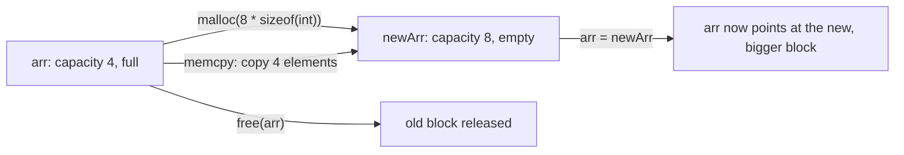

## Learning Objectives

- Explain why some data needs a lifetime independent of any single function call, and why the stack (covered previously) cannot provide that.
- Use `malloc` to request a block of raw memory of a given size, and `free` to release it, correctly matching every allocation with exactly one release.
- State what `malloc` returns when it succeeds, what it returns when it fails, and why checking for that failure case matters.
- Trace what actually happens, at the level of `malloc` calls, when a dynamic array (already covered abstractly in `data-structures-i`) doubles its capacity.
- Contrast the heap's manual lifetime management with the stack's automatic reclamation, identifying which one is the right tool for a given piece of data.

## Context & Motivation

`the-stack-and-automatic-storage` established that a local variable's memory is tied exactly to its enclosing function call — created on entry, reclaimed on return, with no explicit request from the programmer either way. That discipline is efficient and safe, but it is also a hard constraint: it cannot support data whose size isn't known until runtime, or data that needs to outlive the function that created it. The heap is the process address space's answer to both problems: a region of memory the programmer requests from, explicitly, by size, at runtime, and is entirely responsible for releasing, explicitly, whenever that memory is no longer needed.

This concept is where `data-structures-i/dynamic-arrays-and-amortized-resizing` finally becomes fully concrete. That discipline explained *why* doubling a dynamic array's capacity keeps appends O(1) amortized, entirely in the abstract — "allocate more space, copy the old elements over." This concept is the literal mechanism behind that abstraction: "allocate more space" means a call to `malloc` (or `realloc`) requesting a specific number of bytes, and "copy the old elements over" means an actual `memcpy`-style byte copy from the old block to the new one, followed by releasing the old block with `free`. Nothing about dynamic arrays was ever a metaphor; it was always this, described at a level of abstraction that didn't need pointers yet.

CS:APP treats dynamic memory allocation as a major topic in its own right — not just `malloc`'s interface but the tradeoffs any allocator has to navigate — and Stanford CS107 dedicates a dedicated late lecture, "Managing the Heap," specifically to the manual discipline this concept introduces, treating it as the natural payoff of having covered the stack immediately beforehand.

## Core Theory

### Why the stack alone isn't enough

Two situations the stack cannot handle cleanly motivate the heap directly:

1. **Data whose size isn't known until runtime.** A stack frame's size is fixed at compile time (the compiler must know, in advance, how much space a function's locals need). An array whose length depends on user input, a file's size, or a network response cannot be a plain stack-allocated array, because its size isn't known until the program is already running.
2. **Data that needs to outlive the function that created it.** `the-stack-and-automatic-storage` already showed that returning a pointer to a local variable is undefined behavior, because that variable's storage is reclaimed the instant its function returns. Any data meant to be built in one function and used long after that function has returned needs storage that persists independently of any particular call.

The heap solves both: its size is requested explicitly at runtime (any size the program computes, not a fixed compile-time constant), and its lifetime is entirely independent of function calls — a heap allocation persists until the program explicitly releases it, regardless of how many functions have called and returned in the meantime.

### `malloc`: requesting a block of raw memory

```c
void *malloc(size_t size);
```

`malloc` requests `size` bytes of memory from the heap and returns a `void *` pointing to the start of that block — `void *` specifically because, as `void-pointers-and-generic-code` covered, `malloc` has no way of knowing what type of data the caller intends to store there. The returned memory is **uninitialized** — it contains whatever bytes happened to be there before, not zeros — so a program that relies on freshly `malloc`'d memory being zeroed is relying on an assumption the language does not guarantee.

```c
int *nums = malloc(10 * sizeof(int));   /* request room for 10 ints */
if (nums == NULL) {
    /* malloc failed — the system had no more memory to give */
    return;
}
nums[0] = 42;   /* now safe to use, exactly like a stack-allocated array */
```

Checking the returned pointer against `NULL` is not defensive boilerplate — `malloc` genuinely can and does fail, most commonly when the system is out of available memory, and dereferencing a `NULL` result is undefined behavior, immediately.

### `free`: releasing a block back to the heap

```c
void free(void *ptr);
```

`free` releases a block of heap memory previously returned by `malloc`, making it available for future allocations. Every successful `malloc` must eventually be matched by exactly one `free` — never zero (a leak, covered in `common-memory-bugs-leaks-and-dangling-pointers`), and never more than one (a double free, also covered there):

```c
int *nums = malloc(10 * sizeof(int));
/* ... use nums ... */
free(nums);        /* release the block */
nums = NULL;        /* good practice: prevents accidentally using nums again */
```

Setting `nums` to `NULL` immediately after freeing it is a defensive habit, not a language requirement — it converts an accidental later use of `nums` from a silent, undefined-behavior bug into an immediate, obvious crash on dereferencing `NULL`.

### Dynamic arrays, made literal

`data-structures-i/dynamic-arrays-and-amortized-resizing` described capacity-doubling entirely in the abstract. Here is the mechanism, exactly:

```c
int *arr = malloc(4 * sizeof(int));   /* initial capacity: 4 */
int capacity = 4, length = 0;

/* ... arr fills up to length == capacity ... */

int newCapacity = capacity * 2;                          /* double it */
int *newArr = malloc(newCapacity * sizeof(int));           /* allocate a bigger block */
memcpy(newArr, arr, length * sizeof(int));                 /* copy old elements over */
free(arr);                                                  /* release the old block */
arr = newArr;
capacity = newCapacity;
```

This is precisely "allocate more space, copy the old elements over" from the abstract description — now expressed as a real `malloc` call for the bigger block, a real `memcpy` (or an equivalent manual loop) copying every existing element, and a real `free` releasing the block that's no longer needed. The amortized-O(1) argument `dynamic-arrays-and-amortized-resizing` already proved mathematically applies unchanged here — it was never an approximation, it described exactly this sequence of heap operations.



## Worked Examples

### Example 1: a heap-allocated struct that outlives its creating function

```c
struct Node *makeNode(int value) {
    struct Node *n = malloc(sizeof(struct Node));   /* heap allocation, not local */
    n->value = value;
    n->next = NULL;
    return n;    /* safe: n points to heap memory, which outlives makeNode */
}

int main(void) {
    struct Node *head = makeNode(1);
    /* head still valid here, even though makeNode has already returned */
    printf("%d\n", head->value);
    free(head);
}
```

This is the direct fix for the pattern `the-stack-and-automatic-storage` showed was undefined behavior: instead of returning a pointer to a local (stack) variable, `makeNode` allocates its `struct Node` on the heap, which persists exactly as long as the program wants it to, independent of `makeNode` having already returned. Every real linked list built in C (as `singly-linked-lists` described abstractly) allocates its nodes exactly this way.

### Example 2: `malloc` failure, handled correctly

```c
int *hugeArray = malloc(1000000000000UL * sizeof(int));   /* an unreasonably large request */

if (hugeArray == NULL) {
    fprintf(stderr, "allocation failed — not enough memory\n");
    return 1;
}
/* code here would only run if the allocation actually succeeded */
```

On most real systems, a request this large fails, and `malloc` returns `NULL` rather than crashing or throwing an exception — C's error-handling convention for this function is a return value, not a language-level exception mechanism. Code that skips the `NULL` check and immediately dereferences `hugeArray` invokes undefined behavior the moment the allocation actually fails, which real systems eventually do under memory pressure even for requests that seemed reasonable.

### Example 3: matching every `malloc` with exactly one `free`

```c
void processData(int n) {
    int *buffer = malloc(n * sizeof(int));
    if (buffer == NULL) return;

    for (int i = 0; i < n; i++) {
        buffer[i] = i * i;
    }

    /* ... use buffer ... */

    free(buffer);   /* exactly one free, matching the exactly one malloc above */
}
```

Every path through `processData` that successfully allocates `buffer` also reaches the matching `free` — the discipline `common-memory-bugs-leaks-and-dangling-pointers` will formalize as the source of leaks (a path that allocates but never frees) and double frees (a path that frees twice) whenever it's violated. Getting this one-to-one correspondence right, for every possible path through a function including early returns and error branches, is the entire discipline of manual memory management in C.

## Common Misconceptions & Pitfalls

- **"`malloc`'d memory starts out zeroed, like BSS globals do."** It does not — `malloc` returns raw, uninitialized memory containing whatever bytes were already there. A program that needs zeroed memory should use `calloc`, which explicitly guarantees zeroing, or zero the memory manually.
- **"Checking `malloc`'s return value for `NULL` is unnecessary defensive code."** `malloc` genuinely fails under real conditions (the system running low on memory), and dereferencing its `NULL` result is undefined behavior — skipping the check doesn't prevent failure, it just makes failure silent and much harder to diagnose.
- **"Once you `free` a pointer, the pointer itself becomes `NULL` automatically."** `free` releases the memory the pointer refers to; it does not modify the pointer variable itself, which still holds the same (now invalid) address afterward. Setting it to `NULL` manually, as shown in the Core Theory section, is a separate, deliberate step.
- **"A dynamic array's resizing is a different mechanism from ordinary `malloc`/`free`."** It is the same mechanism, applied in sequence — a bigger `malloc`, a copy of the old contents, and a `free` of the old block — exactly as this concept's Core Theory section makes explicit; nothing new is introduced by resizing beyond composing operations already covered.

## Summary

The heap is the region of the process address space set aside for memory requested explicitly at runtime, via `malloc`, and released explicitly, via `free` — solving the two problems the stack's automatic, function-call-scoped storage cannot: data whose size isn't known until runtime, and data that needs to outlive the function that created it. `malloc` returns a `void *` (uninitialized memory) or `NULL` on failure, and every successful allocation must be matched by exactly one `free`, never zero and never more than one. This is not an abstract rule: it is the literal mechanism behind `data-structures-i/dynamic-arrays-and-amortized-resizing`'s capacity-doubling — a bigger `malloc`, a real byte copy of the existing elements, and a `free` of the block that's no longer needed — proving that concept's amortized-O(1) argument was never a simplification, only a description one level of abstraction above the pointers this concept now supplies.

## Documentation Links

- [Bryant & O'Hallaron — Computer Systems: A Programmer's Perspective (CS:APP)](https://csapp.cs.cmu.edu/) — textbook covering dynamic memory allocation as a major, dedicated topic.
- [Stanford CS107 — General Information and Syllabus](https://web.stanford.edu/class/cs107/syllabus) — course pairing the stack and heap as consecutive lectures, contrasting automatic and manual memory discipline.
