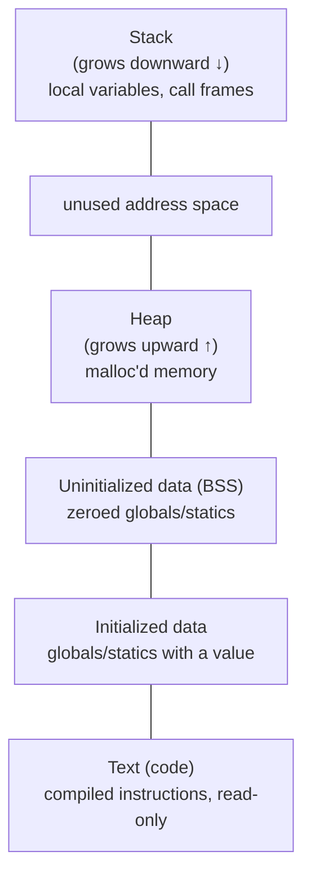

## Learning Objectives

- Name the standard regions of a process's address space — text, initialized data, uninitialized data (BSS), heap, and stack — and state what kind of value each one is meant to hold.
- Explain why the heap grows toward higher addresses and the stack grows toward lower addresses, and why that layout leaves room for both to grow without colliding, up to a point.
- Distinguish a process's virtual address space from the machine's actual physical RAM, and state what problem virtual addressing solves that this discipline sets aside for a later one.
- Given a variable's kind (global initialized, global uninitialized, local, dynamically allocated), place it correctly into one of the address space's regions.
- Read a simple diagram of a process's address space and correctly answer "where does this piece of data live" for several concrete examples.

## Context & Motivation

Every concept covered so far in this discipline — a pointer, an array, a struct — describes an object's layout *locally*, in isolation. This concept zooms out to the largest possible scale: the complete layout the operating system gives an entire running program, a single coherent map of every address that program is allowed to touch, from its very first instruction to the last byte of memory it dynamically allocates. Every pointer this discipline discusses from here forward holds an address that lives somewhere inside this map, and knowing which region it falls into — code, static data, heap, or stack — is what makes the rest of the discipline's material (the heap, the stack, buffer overflows, the calling convention) make sense as one connected story rather than a list of unrelated facts.

This is also the first point in the discipline where a genuine and important simplification needs to be named explicitly. What's described here — text, data, BSS, heap, stack, at specific-seeming addresses — is a process's **virtual** address space: the view of memory the operating system constructs and presents to each running program, as if that program had the entire address range to itself. The real, physical RAM chip underneath (already covered structurally in `digital-logic-computer-organization/ram-organization-and-address-decoding`) is a shared, finite resource, and the operating system's virtual memory system is what translates every virtual address a program uses into wherever that data is actually, physically stored — potentially moved around, potentially not even in RAM at all. That translation mechanism (page tables, the TLB, swapping) is deliberately out of scope here — it is `operating-systems-i`'s subject, once that discipline is reached. This discipline treats the address space purely as the layout a C program sees and reasons about, which is exactly the layer at which pointers, the heap, and the stack are actually programmed against.

CS:APP structures its entire discussion of memory around this same layered view — a process's address space as the immediate, programmer-visible layer, with the hardware and OS mechanisms that implement it addressed separately and later. ACM/IEEE CS2013's Systems Fundamentals knowledge area names virtual memory (as "levels of indirection... for managing physical memory resources") as a distinct topic from the process-level view used here, confirming the same separation independently.

## Core Theory

### The five standard regions

A typical process's virtual address space, from lowest to highest address, is divided into distinct regions, each meant for a different kind of data:

1. **Text (code)**: the program's compiled machine instructions. Read-only in practice — a process is not expected to modify its own code while running, and most systems enforce this at the hardware level.
2. **Initialized data**: global and static variables that were given an explicit initial value in the source code (e.g., `int counter = 0;` at file scope). Stored with that value already present when the program starts.
3. **Uninitialized data (BSS)**: global and static variables declared without an explicit initializer (e.g., `int total;` at file scope). The operating system guarantees these start out zeroed, without the program's executable file needing to store any actual data for them — "BSS" is a historical name ("block started by symbol") for this convention.
4. **Heap**: memory requested explicitly at runtime via `malloc` (covered in `the-heap-and-dynamic-allocation`). Grows toward higher addresses as more memory is requested.
5. **Stack**: memory holding function calls' local variables and bookkeeping (covered in `the-stack-and-automatic-storage`). Grows toward lower addresses as functions call other functions, and shrinks automatically as they return.



(Higher addresses toward the top of this diagram; the stack sits near the top of the usable range and grows downward, while the heap sits below it and grows upward — leaving the gap between them as room for both to expand.)

### Why the heap and stack grow toward each other

Placing the heap low (growing up) and the stack high (growing down), with unused space between them, is a deliberate layout choice: neither region has to be given a fixed maximum size in advance. A program that allocates very little on the heap but recurses very deeply can use almost the entire gap for its stack, and a program that recurses shallowly but allocates enormous amounts of heap memory can use almost the entire gap the other way. Only when the two regions actually grow enough to meet — an extremely deep, effectively unbounded recursion running out of stack space, most commonly — does the process run out of usable address space between them, a condition that surfaces as a stack overflow.

### Virtual addresses are not physical addresses

Every address discussed in this diagram — a variable's address, a pointer's value, the stack pointer — is a **virtual** address: a number meaningful only within this one process's private view of memory. The operating system maps these virtual addresses onto the machine's actual physical RAM, and two different processes can use the exact same virtual address (say, `0x400000` for their code's starting point) while that address refers to two completely different physical memory locations. This is precisely why one process's stray pointer cannot, by default, read or corrupt another process's memory: their virtual address spaces are entirely separate, even when the numbers look identical.

Nothing in this discipline needs the mechanism behind that translation — every pointer, every `malloc`, every stack frame this discipline discusses is expressed and reasoned about entirely in terms of virtual addresses. The translation mechanism itself — page tables mapping virtual pages to physical frames, the TLB caching recent translations, what happens when physical RAM is oversubscribed — is `operating-systems-i`'s subject once that discipline is written.

### Placing a variable into a region

Which region a given piece of data lives in is determined entirely by *how* it came to exist, not by its type:

```c
int globalInit = 5;      /* initialized data */
int globalZero;          /* BSS (implicitly zeroed) */

void example(void) {
    int local = 10;                 /* stack — exists only while example() runs */
    int *heapVal = malloc(sizeof(int));   /* the int itself lives on the heap;
                                              heapVal itself (the pointer) lives on the stack */
    *heapVal = 20;
}
```

`heapVal` is a genuinely useful example of how these regions interact: `heapVal` the pointer variable is itself a local variable, so it lives on the stack, and disappears the instant `example` returns — but the `int` it points to lives on the heap, and persists (correctly or as a leak, covered in `common-memory-bugs-leaks-and-dangling-pointers`) regardless of whether `example` has returned.

## Worked Examples

### Example 1: tracing four variables to four regions

```c
int globalCounter = 100;    /* initialized data: has an explicit value */
int globalBuffer[1000];     /* BSS: no explicit initializer, guaranteed zeroed */

void process(void) {
    int localTotal = 0;                       /* stack: a local variable */
    int *dynamicArr = malloc(1000 * sizeof(int));  /* dynamicArr (the pointer): stack
                                                        the 1000 ints it points to: heap */
}
```

`globalCounter` lives in initialized data because it was given a value (100) at declaration. `globalBuffer` lives in BSS because it wasn't — the operating system guarantees its 1000 `int`s start out as zero without the compiled program needing to store 4000 zero bytes on disk. `localTotal` lives on the stack, created fresh each time `process` is called and destroyed the instant it returns. `dynamicArr` is really two things at once: the pointer variable is on the stack (local to `process`), while the 1000 `int`s of actual storage it points to are on the heap, and will remain allocated even after `process` returns, until explicitly freed.

### Example 2: why BSS doesn't need to be stored in the executable file

```c
int hugeZeroedArray[1000000];   /* 4,000,000 bytes, all zero, BSS */
```

If the compiled executable file had to physically store four million zero bytes for `hugeZeroedArray`, every program declaring a large uninitialized global array would ship a needlessly bloated binary. Instead, the executable file records only that `hugeZeroedArray` needs 4,000,000 bytes of BSS space, and the operating system allocates and zeroes that space when the program starts — the file itself stores essentially nothing for it, which is exactly why BSS is treated as a distinct region from initialized data rather than folded into it.

### Example 3: the gap between heap and stack, concretely

```c
void deepRecursion(int n) {
    int localArray[1000];    /* 4000 bytes of stack space, every single call */
    if (n > 0) {
        deepRecursion(n - 1);
    }
}

deepRecursion(1000000);   /* likely crashes: stack overflow */
```

Each call to `deepRecursion` pushes another 4000-byte chunk onto the stack for `localArray`, on top of whatever the previous million calls already pushed. Eventually, the stack — growing downward from its starting high address — runs out of the gap separating it from the heap (or from the address space's lower bound), and the program crashes with a stack overflow: a direct, observable consequence of the layout described in this concept, not an abstract warning.

## Common Misconceptions & Pitfalls

- **"The address space diagram shows physical RAM."** It shows the process's *virtual* address space — the operating system's presented view of memory, not the actual physical layout of RAM chips. Two processes can use identical-looking virtual addresses that map to entirely different physical memory, via a translation mechanism this discipline leaves to `operating-systems-i`.
- **"An uninitialized global variable's value is unpredictable garbage, like an uninitialized local variable's."** It isn't — a genuinely uninitialized *global or static* variable is guaranteed by the language to start at zero, because it lives in BSS. Only uninitialized *local* (stack) variables hold unpredictable garbage.
- **"`malloc`'d memory and the pointer that holds its address are the same thing, in the same place."** They are not, and Example 1 shows exactly why: the pointer variable itself typically lives on the stack (if it's a local variable), while the memory it points to lives on the heap — two separate objects in two separate regions, connected only by an address.
- **"The heap and stack can each grow to fill the entire address space independently."** They share the same gap between them, growing toward each other from opposite ends; either one growing enough can eventually collide with (or run out of space before reaching) the other, which is the underlying cause of a stack overflow in deep or unbounded recursion.

## Summary

A process's virtual address space is divided into standard regions — text (code), initialized data, uninitialized data (BSS, guaranteed zeroed), heap (grows upward, holds dynamically allocated memory), and stack (grows downward, holds function calls' local variables) — with the heap and stack deliberately placed to grow toward each other across an unused gap, so neither needs a fixed size chosen in advance. Every address discussed here is virtual, not physical: the operating system's virtual memory system (left to `operating-systems-i`) is responsible for mapping these addresses onto the machine's actual, shared physical RAM. This region map is the map every other concept in this discipline places its data onto — a global variable, a local variable, and a `malloc`'d block are distinguished entirely by which of these regions they live in, not by anything about their type.

## Documentation Links

- [Bryant & O'Hallaron — Computer Systems: A Programmer's Perspective (CS:APP)](https://csapp.cs.cmu.edu/) — textbook whose treatment of the process address space this discipline follows, including its separation from virtual memory's implementation.
- [ACM/IEEE CS2013 — Systems Fundamentals Knowledge Area](https://csed.acm.org/knowledge-areas-systems-fundamentals-sf-cs2013-version/) — curriculum guidelines naming virtual memory as a distinct topic from the process-level address space view used here.
