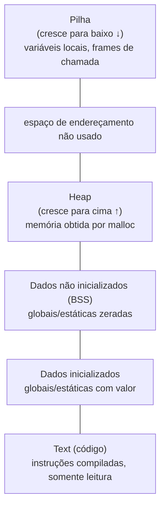

## Objetivos de Aprendizagem

- Nomear as regiões padrão do espaço de endereçamento de um processo (text, dados inicializados, dados não inicializados (BSS), heap e pilha) e dizer que tipo de valor cada uma deve guardar.
- Explicar por que o heap cresce em direção aos endereços mais altos e a pilha cresce em direção aos endereços mais baixos, e por que esse layout deixa espaço para os dois crescerem sem colidir, até certo ponto.
- Distinguir o espaço de endereçamento virtual de um processo da RAM física real da máquina e dizer que problema o endereçamento virtual resolve, que esta disciplina deixa para uma posterior.
- Dado o tipo de uma variável (global inicializada, global não inicializada, local, alocada dinamicamente), colocá-la corretamente numa das regiões do espaço de endereçamento.
- Ler um diagrama simples do espaço de endereçamento de um processo e responder corretamente "onde este dado mora" para vários exemplos concretos.

## Contexto e Motivação

Todo conceito visto até agora nesta disciplina (um ponteiro, um array, uma struct) descreve o layout de um objeto *localmente*, de forma isolada. Este conceito dá zoom para a maior escala possível: o layout completo que o sistema operacional dá a um programa inteiro em execução, um único mapa coerente de todo endereço que esse programa pode tocar, da sua primeira instrução até o último byte de memória que ele aloca dinamicamente. Todo ponteiro que esta disciplina discutir daqui em diante guarda um endereço que mora em algum lugar dentro desse mapa, e saber em que região ele cai (código, dados estáticos, heap ou pilha) é o que faz o resto do material da disciplina (o heap, a pilha, buffer overflows, a convenção de chamada) fazer sentido como uma história conectada, e não como uma lista de fatos sem relação.

Este também é o primeiro ponto da disciplina em que uma simplificação genuína e importante precisa ser nomeada explicitamente. O que se descreve aqui (text, data, BSS, heap, pilha, em endereços aparentemente específicos) é o espaço de endereçamento **virtual** de um processo: a visão da memória que o sistema operacional constrói e apresenta a cada programa em execução, como se esse programa tivesse a faixa de endereços inteira só para si. O chip de RAM físico real por baixo (já visto estruturalmente em `digital-logic-computer-organization/ram-organization-and-address-decoding`) é um recurso finito e compartilhado, e o sistema de memória virtual do sistema operacional é o que traduz cada endereço virtual que um programa usa para onde quer que aqueles dados estejam de fato, fisicamente, guardados, possivelmente movidos de lugar, possivelmente nem mesmo na RAM. Esse mecanismo de tradução (tabelas de páginas, a TLB, swapping) está deliberadamente fora de escopo aqui: é o tema de `operating-systems-i`, quando essa disciplina for alcançada. Esta disciplina trata o espaço de endereçamento puramente como o layout que um programa C vê e sobre o qual raciocina, que é exatamente a camada em que ponteiros, o heap e a pilha são de fato programados.

O CS:APP estrutura toda a sua discussão de memória em torno dessa mesma visão em camadas: o espaço de endereçamento de um processo como a camada imediata, visível ao programador, com os mecanismos de hardware e de SO que o implementam tratados separadamente e depois. A área de conhecimento Systems Fundamentals do ACM/IEEE CS2013 nomeia a memória virtual (como "níveis de indireção... para gerenciar recursos de memória física") como um tema distinto da visão no nível do processo usada aqui, confirmando a mesma separação de forma independente.

## Teoria Central

### As cinco regiões padrão

O espaço de endereçamento virtual de um processo típico, do endereço mais baixo para o mais alto, é dividido em regiões distintas, cada uma destinada a um tipo diferente de dado:

1. **Text (código)**: as instruções de máquina compiladas do programa. Somente leitura na prática: não se espera que um processo modifique o próprio código enquanto roda, e a maioria dos sistemas impõe isso no nível do hardware.
2. **Dados inicializados**: variáveis globais e estáticas que receberam um valor inicial explícito no código-fonte (por exemplo, `int counter = 0;` no escopo de arquivo). Guardadas com esse valor já presente quando o programa começa.
3. **Dados não inicializados (BSS)**: variáveis globais e estáticas declaradas sem inicializador explícito (por exemplo, `int total;` no escopo de arquivo). O sistema operacional garante que elas começam zeradas, sem que o arquivo executável do programa precise guardar nenhum dado real para elas; "BSS" é um nome histórico ("block started by symbol") para essa convenção.
4. **Heap**: memória pedida explicitamente em tempo de execução via `malloc` (visto em `the-heap-and-dynamic-allocation`). Cresce em direção aos endereços mais altos conforme mais memória é pedida.
5. **Pilha**: memória que guarda as variáveis locais e a contabilidade das chamadas de função (vista em `the-stack-and-automatic-storage`). Cresce em direção aos endereços mais baixos conforme funções chamam outras funções e encolhe automaticamente conforme elas retornam.



(Endereços mais altos em direção ao topo deste diagrama; a pilha fica perto do topo da faixa utilizável e cresce para baixo, enquanto o heap fica abaixo dela e cresce para cima, deixando a lacuna entre eles como espaço para os dois se expandirem.)

### Por que o heap e a pilha crescem um em direção ao outro

Colocar o heap embaixo (crescendo para cima) e a pilha em cima (crescendo para baixo), com espaço não usado entre eles, é uma escolha deliberada de layout: nenhuma das regiões precisa receber um tamanho máximo fixo de antemão. Um programa que aloca muito pouco no heap mas faz recursão muito profunda pode usar quase toda a lacuna para a pilha, e um programa que faz recursão rasa mas aloca quantidades enormes de memória no heap pode usar quase toda a lacuna no sentido oposto. Só quando as duas regiões de fato crescem o bastante para se encontrar (mais comumente, uma recursão extremamente profunda, na prática ilimitada, esgotando o espaço da pilha) é que o processo fica sem espaço de endereçamento utilizável entre elas, uma condição que aparece como stack overflow.

### Endereços virtuais não são endereços físicos

Todo endereço discutido neste diagrama (o endereço de uma variável, o valor de um ponteiro, o stack pointer) é um endereço **virtual**: um número com significado só dentro da visão privada da memória deste único processo. O sistema operacional mapeia esses endereços virtuais na RAM física real da máquina, e dois processos diferentes podem usar exatamente o mesmo endereço virtual (digamos, `0x400000` para o ponto de início do seu código) enquanto esse endereço se refere a dois locais de memória física completamente diferentes. É precisamente por isso que um ponteiro perdido de um processo não consegue, por padrão, ler nem corromper a memória de outro processo: seus espaços de endereçamento virtuais são totalmente separados, mesmo quando os números parecem idênticos.

Nada nesta disciplina precisa do mecanismo por trás dessa tradução: todo ponteiro, todo `malloc`, todo stack frame que esta disciplina discute é expresso e raciocinado inteiramente em termos de endereços virtuais. O próprio mecanismo de tradução (tabelas de páginas mapeando páginas virtuais para frames físicos, a TLB guardando traduções recentes, o que acontece quando a RAM física está sobrecarregada) é tema de `operating-systems-i`, quando essa disciplina for escrita.

### Colocando uma variável numa região

A região em que um dado mora é determinada inteiramente por *como* ele passou a existir, e não pelo seu tipo:

```c
int globalInit = 5;      /* dados inicializados */
int globalZero;          /* BSS (zerada implicitamente) */

void example(void) {
    int local = 10;                 /* pilha: existe só enquanto example() roda */
    int *heapVal = malloc(sizeof(int));   /* o próprio int mora no heap;
                                              o próprio heapVal (o ponteiro) mora na pilha */
    *heapVal = 20;
}
```

`heapVal` é um exemplo genuinamente útil de como essas regiões interagem: `heapVal`, a variável ponteiro, é ela própria uma variável local, então mora na pilha e desaparece no instante em que `example` retorna, mas o `int` para o qual ela aponta mora no heap e persiste (corretamente ou como vazamento, visto em `common-memory-bugs-leaks-and-dangling-pointers`), quer `example` já tenha retornado ou não.

## Exemplos Resolvidos

### Exemplo 1: rastreando quatro variáveis até quatro regiões

```c
int globalCounter = 100;    /* dados inicializados: tem um valor explícito */
int globalBuffer[1000];     /* BSS: sem inicializador explícito, garantidamente zerada */

void process(void) {
    int localTotal = 0;                       /* pilha: uma variável local */
    int *dynamicArr = malloc(1000 * sizeof(int));  /* dynamicArr (o ponteiro): pilha
                                                        os 1000 ints para os quais aponta: heap */
}
```

`globalCounter` mora nos dados inicializados porque recebeu um valor (100) na declaração. `globalBuffer` mora na BSS porque não recebeu: o sistema operacional garante que seus 1000 `int`s começam em zero sem que o programa compilado precise guardar 4000 bytes zero em disco. `localTotal` mora na pilha, criada do zero a cada chamada de `process` e destruída no instante em que ela retorna. `dynamicArr` é, na verdade, duas coisas ao mesmo tempo: a variável ponteiro está na pilha (local de `process`), enquanto os 1000 `int`s de armazenamento real para os quais ela aponta estão no heap, e vão continuar alocados mesmo depois que `process` retornar, até serem liberados explicitamente.

### Exemplo 2: por que a BSS não precisa ser guardada no arquivo executável

```c
int hugeZeroedArray[1000000];   /* 4.000.000 bytes, todos zero, BSS */
```

Se o arquivo executável compilado tivesse de guardar fisicamente quatro milhões de bytes zero para `hugeZeroedArray`, todo programa que declarasse um grande array global não inicializado distribuiria um binário inchado sem necessidade. Em vez disso, o arquivo executável registra só que `hugeZeroedArray` precisa de 4.000.000 bytes de espaço na BSS, e o sistema operacional aloca e zera esse espaço quando o programa começa; o próprio arquivo não guarda praticamente nada para ele, e é exatamente por isso que a BSS é tratada como uma região distinta dos dados inicializados, em vez de ser incorporada a eles.

### Exemplo 3: a lacuna entre o heap e a pilha, de forma concreta

```c
void deepRecursion(int n) {
    int localArray[1000];    /* 4000 bytes de espaço na pilha, a cada chamada */
    if (n > 0) {
        deepRecursion(n - 1);
    }
}

deepRecursion(1000000);   /* provavelmente trava: stack overflow */
```

Cada chamada a `deepRecursion` empilha mais um pedaço de 4000 bytes para `localArray`, por cima do que o milhão de chamadas anteriores já empilhou. Em algum momento, a pilha (crescendo para baixo a partir do seu endereço inicial alto) esgota a lacuna que a separa do heap (ou do limite inferior do espaço de endereçamento), e o programa trava com um stack overflow: uma consequência direta e observável do layout descrito neste conceito, e não um aviso abstrato.

## Equívocos Comuns e Armadilhas

- **"O diagrama do espaço de endereçamento mostra a RAM física."** Ele mostra o espaço de endereçamento *virtual* do processo: a visão da memória apresentada pelo sistema operacional, e não o layout físico real dos chips de RAM. Dois processos podem usar endereços virtuais de aparência idêntica que mapeiam para memórias físicas totalmente diferentes, por meio de um mecanismo de tradução que esta disciplina deixa para `operating-systems-i`.
- **"O valor de uma variável global não inicializada é lixo imprevisível, como o de uma variável local não inicializada."** Não é: uma variável *global ou estática* genuinamente não inicializada tem a garantia da linguagem de começar em zero, porque mora na BSS. Só as variáveis *locais* (na pilha) não inicializadas guardam lixo imprevisível.
- **"A memória obtida por `malloc` e o ponteiro que guarda seu endereço são a mesma coisa, no mesmo lugar."** Não são, e o Exemplo 1 mostra exatamente por quê: a própria variável ponteiro normalmente mora na pilha (se for uma variável local), enquanto a memória para a qual ela aponta mora no heap; são dois objetos separados em duas regiões separadas, ligados só por um endereço.
- **"O heap e a pilha podem, cada um, crescer até preencher todo o espaço de endereçamento de forma independente."** Eles compartilham a mesma lacuna entre si, crescendo um em direção ao outro a partir de extremidades opostas; qualquer um deles crescendo o bastante pode acabar colidindo com o outro (ou ficando sem espaço antes de alcançá-lo), que é a causa subjacente de um stack overflow numa recursão profunda ou ilimitada.

## Resumo

O espaço de endereçamento virtual de um processo é dividido em regiões padrão (text (código), dados inicializados, dados não inicializados (BSS, garantidamente zerados), heap (cresce para cima, guarda memória alocada dinamicamente) e pilha (cresce para baixo, guarda as variáveis locais das chamadas de função)), com o heap e a pilha colocados deliberadamente para crescer um em direção ao outro através de uma lacuna não usada, para que nenhum dos dois precise de um tamanho fixo escolhido de antemão. Todo endereço discutido aqui é virtual, e não físico: o sistema de memória virtual do sistema operacional (deixado para `operating-systems-i`) é responsável por mapear esses endereços na RAM física real e compartilhada da máquina. Esse mapa de regiões é o mapa no qual todo outro conceito desta disciplina coloca seus dados: uma variável global, uma variável local e um bloco obtido por `malloc` se distinguem inteiramente pela região em que moram, e não por nada no seu tipo.

## Documentation Links

- [Bryant & O'Hallaron: Computer Systems: A Programmer's Perspective (CS:APP)](https://csapp.cs.cmu.edu/): livro-texto cujo tratamento do espaço de endereçamento do processo esta disciplina segue, incluindo sua separação da implementação da memória virtual.
- [ACM/IEEE CS2013: Systems Fundamentals Knowledge Area](https://csed.acm.org/knowledge-areas-systems-fundamentals-sf-cs2013-version/): diretrizes curriculares que nomeiam a memória virtual como um tema distinto da visão do espaço de endereçamento no nível do processo usada aqui.
