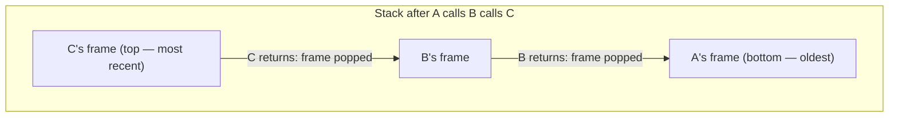

## Learning Objectives

- Define automatic storage: memory whose lifetime is tied exactly to the block (typically a function call) in which it was declared, allocated and reclaimed without any explicit request from the programmer.
- Explain why the stack, as a LIFO structure, is exactly the right shape for managing function calls, where the most recently called function is always the first to return.
- Trace how the stack grows by one frame per function call and shrinks by one frame per return, for a short chain of nested calls.
- State why returning a pointer to a local (stack) variable is undefined behavior, and identify this pattern in a short code example.
- Connect the stack's LIFO discipline explicitly to the Stack ADT already covered in `data-structures-i`, identifying which one is the abstraction and which one is the concrete hardware mechanism it was modeled after.

## Context & Motivation

`data-structures-i/the-stack-adt` introduced the stack as an abstract data type — a LIFO container exposing only push and pop — and noted, without elaborating, that the name comes from somewhere. This concept is that somewhere: the actual, physical call stack every running C program uses to manage function calls, a genuinely LIFO region of memory that predates and inspired the ADT, not the other way around. Understanding it is what finally answers a question this platform has left open since `programming-computational-thinking/recursion` first asked the reader to trust that a recursive function "remembers" its way back through a chain of calls without any code ever taking a note.

The stack is also the first fully concrete instance of "automatic storage" — a term this discipline uses precisely because it names *when* memory is reclaimed, not merely where it lives. A local variable's storage is set aside the instant its enclosing function is called and torn down automatically, with no explicit request, the instant that function returns — in sharp contrast to heap memory (covered next, in `the-heap-and-dynamic-allocation`), which persists until a program explicitly says otherwise. Nearly every bug pattern rooted in "using memory after it's no longer valid" traces back to confusing these two: treating an automatic (stack) variable as if it had heap-like persistence.

CS:APP frames the stack specifically as the region supporting procedure calls — parameter passing, control transfer, and local variable storage — and Stanford CS107 makes "Stack and Heap" a single, deliberately paired lecture, precisely because understanding the stack's automatic, LIFO discipline is what makes the heap's very different, manual discipline (covered next) legible by contrast.

## Core Theory

### Automatic storage: reclaimed without being asked

A variable declared inside a function, without any special keyword, gets **automatic storage duration**: memory allocated automatically when execution reaches its declaration, and reclaimed automatically the instant the enclosing block ends — most commonly, when the function returns:

```c
void example(void) {
    int x = 5;    /* x's storage exists from here... */
    /* ... to here, when example() returns and x's storage is reclaimed */
}
```

Nothing in this code asks for `x`'s memory to be freed — it simply stops being valid the moment `example` returns, and that memory becomes available for whatever the next function call needs. This automatic reclamation is exactly what a stack, as a data structure, is built to provide efficiently: because function calls nest in a strict last-in-first-out order, the *most recently allocated* automatic storage is always the first that needs to be reclaimed.

### The stack is a LIFO region, for a LIFO problem

Function calls have an inherent LIFO structure: if function `A` calls `B`, and `B` calls `C`, then `C` must finish and return before `B` can continue, and `B` must finish and return before `A` can continue — the most recently started call is always the first to finish. The stack region of the process address space (introduced in `the-process-address-space`) exploits this directly: each function call pushes a new frame onto the stack, holding that call's local variables and bookkeeping, and each return pops the topmost frame off — exactly the push/pop discipline `data-structures-i/the-stack-adt` already described as an abstract interface, now revealed as the literal hardware mechanism it was named after.



### Growth and shrinkage, one frame at a time

Each function call **pushes** a new frame — a contiguous chunk of stack memory holding that call's local variables, among other bookkeeping covered in `the-x86-64-runtime-stack-call-and-ret` and `stack-frames-prologue-and-epilogue` — and each return **pops** that frame off, immediately making its memory available for whatever call happens next:

```c
void third(void)  { int c = 3; }             /* pushes a small frame, then pops it */
void second(void) { int b = 2; third(); }    /* pushes a frame, calls third, then pops */
void first(void)  { int a = 1; second(); }   /* pushes a frame, calls second, then pops */
```

At the deepest point of this call chain (inside `third`), the stack holds three frames simultaneously: `first`'s, `second`'s, and `third`'s, stacked in that order. As each function returns, its frame is popped, in the exact reverse order they were pushed — `third`'s frame first, then `second`'s, then `first`'s — a direct, hardware-level LIFO discipline, not an analogy to one.

### Why a pointer to a local variable becomes invalid

Because automatic storage is reclaimed the instant its function returns, a pointer to a local variable becomes meaningless the moment that function returns — the memory it points to is no longer reserved for that variable, and may be overwritten by the very next function call's frame:

```c
int *dangerous(void) {
    int local = 42;
    return &local;      /* returns the address of local... */
}                        /* ...but local's storage is reclaimed right here */

int *p = dangerous();
printf("%d\n", *p);      /* undefined behavior: local's memory may already be reused */
```

This is not merely bad style — it is undefined behavior, because nothing in the language guarantees what (if anything) is still stored at that address once the function has returned. The fix is never to return a pointer to a local variable; if a value needs to outlive the function that created it, it belongs on the heap (`the-heap-and-dynamic-allocation`) instead.

## Worked Examples

### Example 1: watching the stack grow and shrink through recursion

```c
int factorial(int n) {
    if (n <= 1) return 1;
    return n * factorial(n - 1);
}

factorial(4);
```

Each recursive call to `factorial` pushes a new frame holding its own copy of `n`, distinct from every other call's copy. At the deepest point, the stack holds four frames simultaneously — for `n = 4, 3, 2, 1` — each waiting for the call above it to finish and report a result. As each call returns (starting from `n = 1`), its frame is popped, and the multiplication (`n * factorial(n - 1)`) completes using the value the just-popped frame returned. This is the concrete mechanism behind the trust `recursion` (`programming-computational-thinking`) asked the reader to place in a recursive call "remembering its place" — it remembers nothing; the stack, mechanically, holds every call's state until it's needed again.

### Example 2: two sibling calls, not nested inside each other

```c
void greet(void)   { int x = 1; printf("hi\n"); }
void farewell(void){ int y = 2; printf("bye\n"); }

void run(void) {
    greet();       /* greet's frame pushed, then popped, before farewell is ever called */
    farewell();    /* farewell's frame pushed fresh, unrelated to greet's already-popped frame */
}
```

`greet` and `farewell` are siblings, not nested — `greet`'s frame is completely pushed and popped before `farewell` is ever called, so at no point do both frames exist on the stack simultaneously. This contrasts with Example 1, where every recursive call's frame stays on the stack until that specific call returns, precisely because each call is nested *inside* the previous one, not sequential after it.

### Example 3: the dangling-pointer bug, made concrete with a real crash pattern

```c
int *getBadPointer(void) {
    int result = compute();
    return &result;    /* WRONG: returns address of a variable about to be reclaimed */
}

void useIt(void) {
    int otherLocal = 999;   /* likely reuses the exact stack space result just vacated */
}

int *p = getBadPointer();
useIt();
printf("%d\n", *p);   /* may print 999, garbage, or crash — result's memory has been reused */
```

`useIt`'s call, happening right after `getBadPointer` returns, is likely to reuse the very same stack memory `result` occupied — because the stack always allocates its next frame starting exactly where the last one was popped. `*p` might print 999 (`otherLocal`'s value, purely by coincidence of memory reuse), might print garbage, or might crash — the point is that none of these outcomes is guaranteed or meaningful, because `p` points at memory that stopped being `result`'s the instant `getBadPointer` returned.

## Common Misconceptions & Pitfalls

- **"The stack ADT from `data-structures-i` is just inspired by, or analogous to, the real call stack."** It's the reverse relationship worth being precise about: the call stack described here is the literal, physical mechanism that gave the Stack ADT its name and its push/pop interface — the ADT is the abstraction; this concept is the concrete hardware structure it models.
- **"A local variable's memory is erased or zeroed the moment its function returns."** It is not actively erased — it is simply marked available for reuse by the next call. The bytes may still (by coincidence) hold the old value for a while, which is exactly why dangling-pointer bugs like Example 3 can appear to "work" some of the time, making them harder to notice than a bug that fails consistently.
- **"Returning `&local` is fine as long as the caller uses the result immediately, before any other function is called."** It is still undefined behavior even then — the language makes no guarantee about what happens to a variable's storage after its scope ends, regardless of how quickly the pointer is used afterward. It may happen to work by accident on a given compiler and system, which is precisely what makes this bug dangerous rather than reliably caught.
- **"Every function call needs roughly the same amount of stack space."** Frame size varies with how many and how large a function's local variables are — a function with a 1000-element local array (as in `the-process-address-space`'s recursion example) consumes far more stack space per call than one with a single `int`, directly affecting how many nested calls the stack can support before overflowing.

## Summary

The stack is a genuinely LIFO region of the process address space, growing by one frame per function call and shrinking by one frame per return — a structure that exists specifically because function calls themselves nest in strict last-in-first-out order, and because automatic storage (a local variable's memory) needs to be reclaimed the instant its function returns, without any explicit request from the programmer. This is the literal, physical mechanism the Stack ADT in `data-structures-i` was named after and modeled on, and it's the concrete answer to how recursion "remembers" its way back through a chain of nested calls: every call's local state stays on the stack, in its own frame, until that specific call returns. Returning a pointer to a local variable is undefined behavior for exactly this reason — the memory it references is reclaimed the instant the function returns, and may be silently reused by whatever call happens next.

## Documentation Links

- [Bryant & O'Hallaron — Computer Systems: A Programmer's Perspective (CS:APP)](https://csapp.cs.cmu.edu/) — textbook framing the stack as the region supporting procedure calls, parameter passing, and automatic storage.
- [Stanford CS107 — General Information and Syllabus](https://web.stanford.edu/class/cs107/syllabus) — course pairing "Stack and Heap" as a single lecture, contrasting automatic and manual memory management directly.
