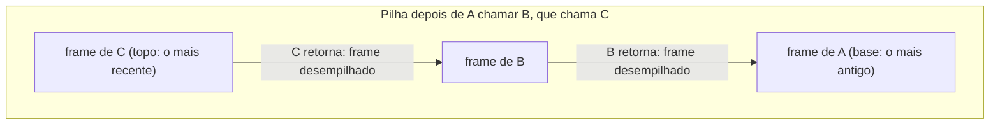

## Objetivos de Aprendizagem

- Definir armazenamento automático: memória cujo tempo de vida está preso exatamente ao bloco (normalmente uma chamada de função) em que foi declarada, alocada e recuperada sem nenhum pedido explícito do programador.
- Explicar por que a pilha, como estrutura LIFO, tem exatamente o formato certo para gerenciar chamadas de função, em que a função chamada mais recentemente é sempre a primeira a retornar.
- Rastrear como a pilha cresce um frame por chamada de função e encolhe um frame por retorno, numa curta cadeia de chamadas aninhadas.
- Dizer por que retornar um ponteiro para uma variável local (na pilha) é comportamento indefinido e identificar esse padrão num pequeno exemplo de código.
- Ligar explicitamente a disciplina LIFO da pilha ao TAD Pilha já visto em `data-structures-i`, identificando qual é a abstração e qual é o mecanismo concreto de hardware que a inspirou.

## Contexto e Motivação

`data-structures-i/the-stack-adt` apresentou a pilha como um tipo abstrato de dados (um contêiner LIFO que expõe só push e pop) e observou, sem detalhar, que o nome vem de algum lugar. Este conceito é esse lugar: a pilha de chamadas real e física que todo programa C em execução usa para gerenciar chamadas de função, uma região de memória genuinamente LIFO que antecede e inspirou o TAD, e não o contrário. Entendê-la é o que finalmente responde a uma pergunta que esta plataforma deixou em aberto desde que `programming-computational-thinking/recursion` pediu ao leitor que confiasse que uma função recursiva "lembra" o caminho de volta por uma cadeia de chamadas sem que nenhum código jamais tome nota.

A pilha também é a primeira instância totalmente concreta de "armazenamento automático", um termo que esta disciplina usa justamente porque nomeia *quando* a memória é recuperada, e não só onde ela mora. O armazenamento de uma variável local é reservado no instante em que a função que a contém é chamada e desmontado automaticamente, sem nenhum pedido explícito, no instante em que essa função retorna, em nítido contraste com a memória do heap (vista a seguir, em `the-heap-and-dynamic-allocation`), que persiste até o programa dizer explicitamente o contrário. Quase todo padrão de bug com raiz em "usar memória depois que ela não é mais válida" remonta a confundir os dois: tratar uma variável automática (na pilha) como se tivesse uma persistência de heap.

O CS:APP enquadra a pilha especificamente como a região que dá suporte às chamadas de procedimento (passagem de parâmetros, transferência de controle e armazenamento de variáveis locais), e o CS107 de Stanford faz de "Stack and Heap" uma única aula, deliberadamente pareada, justamente porque entender a disciplina automática e LIFO da pilha é o que torna legível, por contraste, a disciplina bem diferente e manual do heap (vista a seguir).

## Teoria Central

### Armazenamento automático: recuperado sem ser pedido

Uma variável declarada dentro de uma função, sem nenhuma palavra-chave especial, recebe **duração de armazenamento automática**: memória alocada automaticamente quando a execução chega à sua declaração e recuperada automaticamente no instante em que o bloco que a contém termina, mais comumente quando a função retorna:

```c
void example(void) {
    int x = 5;    /* o armazenamento de x existe a partir daqui... */
    /* ... até aqui, quando example() retorna e o armazenamento de x é recuperado */
}
```

Nada neste código pede que a memória de `x` seja liberada; ela simplesmente deixa de ser válida no momento em que `example` retorna, e essa memória fica disponível para o que a próxima chamada de função precisar. Essa recuperação automática é exatamente o que uma pilha, como estrutura de dados, é feita para oferecer com eficiência: como as chamadas de função se aninham numa ordem estrita de último a entrar, primeiro a sair, o armazenamento automático *alocado mais recentemente* é sempre o primeiro que precisa ser recuperado.

### A pilha é uma região LIFO, para um problema LIFO

As chamadas de função têm uma estrutura LIFO inerente: se a função `A` chama `B`, e `B` chama `C`, então `C` precisa terminar e retornar antes que `B` possa continuar, e `B` precisa terminar e retornar antes que `A` possa continuar; a chamada iniciada mais recentemente é sempre a primeira a terminar. A região da pilha do espaço de endereçamento do processo (apresentada em `the-process-address-space`) explora isso diretamente: cada chamada de função empilha um novo frame na pilha, guardando as variáveis locais e a contabilidade daquela chamada, e cada retorno desempilha o frame do topo. É exatamente a disciplina de push/pop que `data-structures-i/the-stack-adt` já descreveu como interface abstrata, agora revelada como o mecanismo literal de hardware que lhe deu nome.



### Crescimento e encolhimento, um frame por vez

Cada chamada de função **empilha** um novo frame (um pedaço contíguo de memória da pilha que guarda as variáveis locais daquela chamada, entre outras informações de contabilidade vistas em `the-x86-64-runtime-stack-call-and-ret` e `stack-frames-prologue-and-epilogue`), e cada retorno **desempilha** esse frame, deixando sua memória imediatamente disponível para a próxima chamada que acontecer:

```c
void third(void)  { int c = 3; }             /* empilha um frame pequeno e depois o desempilha */
void second(void) { int b = 2; third(); }    /* empilha um frame, chama third e depois desempilha */
void first(void)  { int a = 1; second(); }   /* empilha um frame, chama second e depois desempilha */
```

No ponto mais profundo dessa cadeia de chamadas (dentro de `third`), a pilha guarda três frames ao mesmo tempo: o de `first`, o de `second` e o de `third`, empilhados nessa ordem. Conforme cada função retorna, seu frame é desempilhado, exatamente na ordem inversa em que foram empilhados (primeiro o de `third`, depois o de `second`, depois o de `first`): uma disciplina LIFO direta, no nível do hardware, e não uma analogia com uma.

### Por que um ponteiro para uma variável local se torna inválido

Como o armazenamento automático é recuperado no instante em que sua função retorna, um ponteiro para uma variável local perde o sentido no momento em que essa função retorna: a memória para a qual ele aponta não está mais reservada para aquela variável e pode ser sobrescrita pelo frame da próxima chamada de função:

```c
int *dangerous(void) {
    int local = 42;
    return &local;      /* retorna o endereço de local... */
}                        /* ...mas o armazenamento de local é recuperado bem aqui */

int *p = dangerous();
printf("%d\n", *p);      /* comportamento indefinido: a memória de local pode já ter sido reaproveitada */
```

Isso não é só mau estilo: é comportamento indefinido, porque nada na linguagem garante o que (se é que algo) ainda está guardado naquele endereço depois que a função retornou. A correção é nunca retornar um ponteiro para uma variável local; se um valor precisa sobreviver à função que o criou, ele pertence ao heap (`the-heap-and-dynamic-allocation`).

## Exemplos Resolvidos

### Exemplo 1: vendo a pilha crescer e encolher numa recursão

```c
int factorial(int n) {
    if (n <= 1) return 1;
    return n * factorial(n - 1);
}

factorial(4);
```

Cada chamada recursiva a `factorial` empilha um novo frame com sua própria cópia de `n`, distinta da cópia de todas as outras chamadas. No ponto mais profundo, a pilha guarda quatro frames ao mesmo tempo (para `n = 4, 3, 2, 1`), cada um esperando a chamada acima dele terminar e informar um resultado. Conforme cada chamada retorna (começando por `n = 1`), seu frame é desempilhado, e a multiplicação (`n * factorial(n - 1)`) se completa usando o valor que o frame recém-desempilhado retornou. Esse é o mecanismo concreto por trás da confiança que `recursion` (`programming-computational-thinking`) pediu ao leitor que depositasse numa chamada recursiva "lembrar seu lugar": ela não lembra nada; a pilha, mecanicamente, guarda o estado de cada chamada até ele ser necessário de novo.

### Exemplo 2: duas chamadas irmãs, não aninhadas uma na outra

```c
void greet(void)   { int x = 1; printf("hi\n"); }
void farewell(void){ int y = 2; printf("bye\n"); }

void run(void) {
    greet();       /* o frame de greet é empilhado e desempilhado antes de farewell ser chamada */
    farewell();    /* o frame de farewell é empilhado do zero, sem relação com o frame já desempilhado de greet */
}
```

`greet` e `farewell` são irmãs, e não aninhadas: o frame de `greet` é completamente empilhado e desempilhado antes de `farewell` sequer ser chamada, então em nenhum momento os dois frames existem na pilha ao mesmo tempo. Isso contrasta com o Exemplo 1, em que o frame de cada chamada recursiva fica na pilha até aquela chamada específica retornar, justamente porque cada chamada está aninhada *dentro* da anterior, e não depois dela em sequência.

### Exemplo 3: o bug do ponteiro pendente, tornado concreto com um padrão real de falha

```c
int *getBadPointer(void) {
    int result = compute();
    return &result;    /* ERRADO: retorna o endereço de uma variável prestes a ser recuperada */
}

void useIt(void) {
    int otherLocal = 999;   /* provavelmente reaproveita exatamente o espaço da pilha que result acabou de liberar */
}

int *p = getBadPointer();
useIt();
printf("%d\n", *p);   /* pode imprimir 999, lixo ou travar: a memória de result foi reaproveitada */
```

A chamada a `useIt`, logo depois que `getBadPointer` retorna, provavelmente vai reaproveitar exatamente a mesma memória da pilha que `result` ocupava, porque a pilha sempre aloca o próximo frame começando exatamente onde o último foi desempilhado. `*p` pode imprimir 999 (o valor de `otherLocal`, por pura coincidência de reaproveitamento de memória), pode imprimir lixo ou pode travar; o ponto é que nenhum desses resultados é garantido nem tem significado, porque `p` aponta para uma memória que deixou de ser de `result` no instante em que `getBadPointer` retornou.

## Equívocos Comuns e Armadilhas

- **"O TAD Pilha de `data-structures-i` é só inspirado na pilha de chamadas real, ou análogo a ela."** Vale ser preciso sobre a relação inversa: a pilha de chamadas descrita aqui é o mecanismo literal e físico que deu ao TAD Pilha seu nome e sua interface de push/pop. O TAD é a abstração; este conceito é a estrutura concreta de hardware que ele modela.
- **"A memória de uma variável local é apagada ou zerada no momento em que sua função retorna."** Ela não é apagada ativamente; só é marcada como disponível para reaproveitamento pela próxima chamada. Os bytes podem ainda (por coincidência) guardar o valor antigo por um tempo, e é exatamente por isso que bugs de ponteiro pendente como o do Exemplo 3 podem parecer "funcionar" às vezes, tornando-os mais difíceis de notar que um bug que falha de forma consistente.
- **"Retornar `&local` não tem problema desde que quem chamou use o resultado imediatamente, antes de qualquer outra função ser chamada."** Mesmo assim é comportamento indefinido: a linguagem não dá nenhuma garantia sobre o que acontece com o armazenamento de uma variável depois que seu escopo termina, por mais rápido que o ponteiro seja usado. Pode por acaso funcionar num dado compilador e sistema, e é precisamente isso que torna esse bug perigoso, em vez de detectado de forma confiável.
- **"Toda chamada de função precisa de mais ou menos a mesma quantidade de espaço na pilha."** O tamanho do frame varia conforme quantas e quão grandes são as variáveis locais de uma função: uma função com um array local de 1000 elementos (como no exemplo de recursão de `the-process-address-space`) consome muito mais espaço na pilha por chamada que uma com um único `int`, afetando diretamente quantas chamadas aninhadas a pilha suporta antes de transbordar.

## Resumo

A pilha é uma região genuinamente LIFO do espaço de endereçamento do processo, que cresce um frame por chamada de função e encolhe um frame por retorno. É uma estrutura que existe especificamente porque as próprias chamadas de função se aninham numa ordem estrita de último a entrar, primeiro a sair, e porque o armazenamento automático (a memória de uma variável local) precisa ser recuperado no instante em que sua função retorna, sem nenhum pedido explícito do programador. Esse é o mecanismo literal e físico que deu nome e serviu de modelo ao TAD Pilha de `data-structures-i`, e é a resposta concreta para como a recursão "lembra" o caminho de volta por uma cadeia de chamadas aninhadas: o estado local de cada chamada fica na pilha, no seu próprio frame, até aquela chamada específica retornar. Retornar um ponteiro para uma variável local é comportamento indefinido exatamente por isso: a memória que ele referencia é recuperada no instante em que a função retorna e pode ser reaproveitada silenciosamente pela próxima chamada que acontecer.

## Documentation Links

- [Bryant & O'Hallaron: Computer Systems: A Programmer's Perspective (CS:APP)](https://csapp.cs.cmu.edu/): livro-texto que enquadra a pilha como a região que dá suporte a chamadas de procedimento, passagem de parâmetros e armazenamento automático.
- [Stanford CS107: General Information and Syllabus](https://web.stanford.edu/class/cs107/syllabus): curso que junta "Stack and Heap" numa única aula, contrastando diretamente o gerenciamento de memória automático e o manual.
