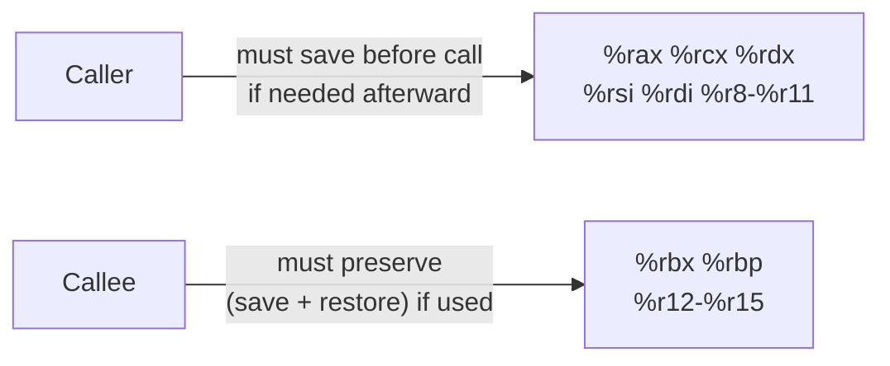

## Learning Objectives

- Name the six registers used to pass the first six integer/pointer arguments, in order, and the register used for a function's return value.
- Distinguish caller-saved from callee-saved registers, and state precisely what obligation each category places on which side of a function call.
- Explain the 16-byte stack alignment requirement at the point of every `call` instruction, and why an ABI needs to specify something this seemingly minor at all.
- Explain what an ABI is, as distinct from the ISA covered in `digital-logic-computer-organization`, and why independently compiled functions need one to interoperate correctly.
- Note the real terminological divergence between two of this discipline's own sources on how they describe caller/callee register obligations, and explain why it's the same rule under different words.

## Context & Motivation

`digital-logic-computer-organization/what-is-an-isa` established the ISA as the contract between hardware and software — what instructions exist and what they do. This concept covers a related but distinct kind of contract: the **ABI** (Application Binary Interface), specifically the **System V AMD64 ABI**, the real, standard convention followed by GCC, Clang, and every major compiler on Linux and macOS. Where the ISA specifies what an individual instruction does, the ABI specifies how independently compiled functions must cooperate to call each other correctly — which registers carry arguments, which carry a return value, which registers either side is allowed to clobber freely, and how the stack must be aligned at the moment of a call. None of this is dictated by the ISA itself; the hardware would execute a call made under a completely different convention just as readily. The ABI is a software-level agreement, not a hardware requirement, and it exists specifically so that a function compiled in one file, by one compiler, can be called correctly by code compiled in a completely different file, possibly by a different compiler entirely.

This is also the concept where `stack-frames-prologue-and-epilogue`'s pattern gets its full justification: a function's prologue and epilogue aren't just "good practice" — they're what a function must do to honor its side of this exact convention, so that the caller's assumptions about which registers survive the call remain valid.

CS107's guide to x86-64 documents this convention concretely — the exact six argument registers, the return-value register, and a specific split of registers into two categories based on who is responsible for preserving them across a call. Worth noting directly, because it's a genuine finding from this discipline's own research: CS107 frames the split as "callee-owned" (registers the callee is free to modify) versus "caller-owned" (registers the callee must preserve), while CS:APP and most other treatments of the same ABI use the more common terms "caller-saved" (the caller must save these before a call, if it needs them afterward) and "callee-saved" (the callee must preserve these). These are two different names, from opposite points of view, for the *exact same partition of registers* — not a genuine disagreement about which registers belong in which category.

## Core Theory

### An ABI, distinct from an ISA

The ISA (`what-is-an-isa`) specifies what each instruction does — `add`, `mov`, `call` — the same regardless of what convention any particular piece of software chooses to follow. The ABI is a layer on top of that: an agreement, followed voluntarily by compilers and hand-written assembly alike, about how those instructions are used consistently enough that separately compiled code can interoperate. Nothing in the hardware enforces the calling convention described in this concept — a program that violated it would still execute, instruction by instruction, exactly as written; it would simply fail to correctly call or be called by any code that expected the standard convention to be followed.

### Argument-passing registers

The first six integer or pointer arguments to a function are passed in a fixed, specific order of registers, rather than on the stack:

```text
Argument 1: %rdi
Argument 2: %rsi
Argument 3: %rdx
Argument 4: %rcx
Argument 5: %r8
Argument 6: %r9
```

A seventh or later argument (rare in practice, but a real case the ABI must define) is passed on the stack instead, pushed by the caller before the `call` instruction. The return value, for functions returning an integer or pointer, is always placed in `%rax` by the callee before it returns.

```c
int add(int a, int b, int c) { return a + b + c; }
```

```text
; caller: add(1, 2, 3)
movl $1, %edi     ; argument 1 → %edi (32-bit sub-register of %rdi)
movl $2, %esi     ; argument 2 → %esi
movl $3, %edx     ; argument 3 → %edx
call add
; %eax now holds the return value: 6
```

### Caller-saved vs. callee-saved registers

Not every register needs to survive a function call intact, and the ABI specifies exactly which ones do, splitting all the general-purpose registers into two categories:

```text
Caller-saved (the callee may freely modify; the caller must save these itself,
              before the call, if it still needs their values afterward):
    %rax, %rcx, %rdx, %rsi, %rdi, %r8, %r9, %r10, %r11

Callee-saved (the callee must preserve these — if it uses them internally,
              it must save their original values and restore them before returning):
    %rbx, %rbp, %r12, %r13, %r14, %r15
```

This split exists to avoid unnecessary saving and restoring: a function that never touches `%rbx` internally doesn't need to save it at all, and a caller that doesn't care about `%rax`'s value surviving a call doesn't need to preserve it either — the convention lets each side save only what it actually needs to, rather than every register being saved defensively on every call.



**A real, worth-naming terminology note**: Stanford CS107's own reference material describes this exact same split from the opposite grammatical direction — calling the first group "callee-owned" (the callee owns them, free to do as it likes) and the second group "caller-owned" (the caller owns them, so the callee must give them back unchanged). CS:APP and this concept's own Core Theory above use "caller-saved" / "callee-saved," naming *who is responsible for saving*, rather than *who owns* the register. Both describe the identical set of registers and the identical obligation; only the framing verb differs.

### Stack alignment: 16 bytes at every `call`

The ABI additionally requires that `%rsp` be a multiple of 16 at the moment a `call` instruction executes (equivalently, immediately *before* `call` pushes the 8-byte return address, `%rsp` must be 16-byte aligned, so it becomes 8-byte aligned — but not necessarily 16-byte aligned — for the first few instructions inside the callee, until the callee's own prologue realigns it if needed). This exists for a concrete, real reason: certain instructions, including some used for floating-point and vector (SIMD) operations, require their memory operands to be aligned to a 16-byte boundary to execute correctly or efficiently, and a function has no reliable way to guarantee that alignment for its own locals unless it can count on the stack already being aligned in a known way the moment it starts executing.

## Worked Examples

### Example 1: passing four arguments and reading a return value

```c
int compute(int a, int b, int c, int d) {
    return a + b - c * d;
}
```

```text
; caller: compute(10, 5, 2, 3)
movl $10, %edi
movl $5,  %esi
movl $2,  %edx
movl $3,  %ecx
call compute
; %eax now holds the result: 10 + 5 - 2*3 = 9
```

Each argument lands in its designated register, in the fixed order the ABI specifies (`%rdi`, `%rsi`, `%rdx`, `%rcx`, ...), and the function's result appears in `%eax` (the 32-bit portion of `%rax`) once `call` returns — no other convention (a different register order, arguments passed only on the stack) would be understood correctly by code compiled to expect this one.

### Example 2: a callee that must preserve a callee-saved register

```c
int useRbx(int x) {
    /* the compiler decides to use %rbx internally for some computation */
    return x * 2;
}
```

```text
useRbx:
    pushq %rbx           ; save the CALLER's %rbx value, since we're about to use it
    movl  %edi, %ebx       ; %ebx = x (borrowing %rbx for internal use)
    addl  %ebx, %ebx        ; %ebx = x * 2
    movl  %ebx, %eax         ; move the result into %eax for the return value
    popq  %rbx               ; restore the caller's original %rbx value
    ret
```

Because `%rbx` is callee-saved, `useRbx` is only allowed to use it internally if it first saves the caller's original value (with `push`) and restores it (with `pop`) before returning — exactly the discipline `stack-frames-prologue-and-epilogue` already established as part of a function's prologue/epilogue, now shown to be required specifically because of this ABI rule, not an arbitrary stylistic choice.

### Example 3: a caller that must save a caller-saved register itself

```c
int caller(int x) {
    int savedBeforeCall = x;      /* held in %eax, say */
    int result = helper(5);        /* helper() is free to clobber %eax entirely */
    return savedBeforeCall + result;
}
```

```text
    movl %edi, %r12d      ; move x OUT of %eax and into a CALLEE-saved register (%r12d)
                            ; specifically because %eax is caller-saved and helper() may destroy it
    movl $5, %edi
    call helper             ; %eax is now helper's return value, whatever x was in %eax is gone
    addl %r12d, %eax          ; safely add back the value we deliberately preserved
    ret
```

Because `%rax` is caller-saved, `helper` is entirely within its rights to overwrite it with anything, including its own return value — `caller` cannot assume `x`'s value survives the call if it was left in `%eax`. The fix shown here is exactly what a real compiler does automatically: move any value that needs to survive a call into a callee-saved register (like `%r12`) beforehand, since those registers carry the opposite, stronger guarantee.

## Common Misconceptions & Pitfalls

- **"The calling convention is enforced by the hardware, like an instruction's defined behavior is."** It isn't — the ABI is a software convention every well-behaved compiler follows voluntarily so separately compiled code can interoperate; the processor itself would execute code that violated this convention just as readily, it would simply fail to work correctly with any other code expecting the standard convention.
- **"CS107 and CS:APP disagree about which registers are caller-saved versus callee-saved."** They don't — they describe the exact same partition of registers, just from opposite directions ("who owns this register" versus "who must save it"), a genuine terminology difference this concept names explicitly rather than treating as either source being wrong.
- **"A caller-saved register's value is guaranteed to survive a function call as long as the callee doesn't obviously need it."** It is not guaranteed at all — caller-saved means precisely that the *callee* is free to overwrite it for any reason, including its own internal use, whether or not that use is "obvious" from the caller's perspective. Example 3 shows the caller's own responsibility to save such a value first, if it's needed afterward.
- **"16-byte stack alignment is an arbitrary, overly strict rule with no real consequence if skipped."** Certain instructions (including some floating-point and SIMD operations a compiler may emit) genuinely require this alignment to execute correctly, and violating it is a real, if sometimes silent-until-it-isn't, source of crashes in code that mixes conventions incorrectly, such as hand-written assembly calling into compiled C without maintaining this requirement.

## Summary

The System V AMD64 ABI is the real, standard convention x86-64 code on Linux and macOS follows so that independently compiled functions can call each other correctly — a software-level agreement layered on top of the ISA, not enforced by the hardware itself. It fixes the first six integer/pointer arguments to `%rdi`, `%rsi`, `%rdx`, `%rcx`, `%r8`, `%r9` in order, places the return value in `%rax`, splits the general-purpose registers into caller-saved (the callee may freely clobber; the caller must save these itself if needed afterward) and callee-saved (the callee must preserve these across the call), and requires 16-byte stack alignment at every `call` for certain instructions to execute correctly. CS107's "callee-owned"/"caller-owned" framing and CS:APP's "caller-saved"/"callee-saved" framing describe this exact same register split from opposite directions — a real terminological divergence worth recognizing, not a factual disagreement. Every prologue and epilogue this discipline has covered exists specifically to honor this convention correctly.

## Documentation Links

- [Stanford CS107 — Guide to x86-64](https://web.stanford.edu/class/cs107/guide/x86-64.html) — reference documenting the exact argument registers, return-value register, and the callee-owned/caller-owned register split.
- [Bryant & O'Hallaron — Computer Systems: A Programmer's Perspective (CS:APP)](https://csapp.cs.cmu.edu/) — textbook whose caller-saved/callee-saved terminology and calling-convention treatment this concept follows as its primary framing.
