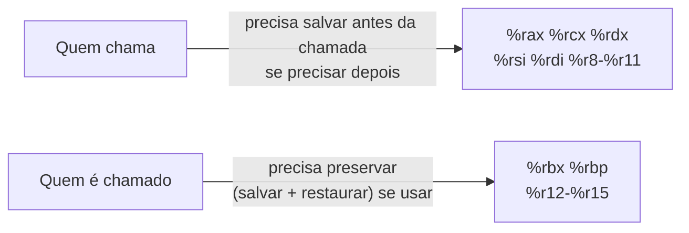

## Objetivos de Aprendizagem

- Nomear os seis registradores usados para passar os seis primeiros argumentos inteiros/ponteiros, em ordem, e o registrador usado para o valor de retorno de uma função.
- Distinguir registradores salvos por quem chama (caller-saved) de registradores salvos por quem é chamado (callee-saved) e dizer com precisão que obrigação cada categoria impõe a cada lado de uma chamada de função.
- Explicar a exigência de alinhamento da pilha em 16 bytes no ponto de cada instrução `call` e por que uma ABI precisa sequer especificar algo aparentemente tão menor.
- Explicar o que é uma ABI, distinta da ISA vista em `digital-logic-computer-organization`, e por que funções compiladas de forma independente precisam de uma para interoperar corretamente.
- Observar a divergência terminológica real entre duas das próprias fontes desta disciplina na forma como descrevem as obrigações de registradores entre quem chama e quem é chamado, e explicar por que é a mesma regra com palavras diferentes.

## Contexto e Motivação

`digital-logic-computer-organization/what-is-an-isa` estabeleceu a ISA como o contrato entre hardware e software: que instruções existem e o que elas fazem. Este conceito cobre um tipo de contrato relacionado, mas distinto: a **ABI** (Application Binary Interface), especificamente a **ABI System V AMD64**, a convenção real e padrão seguida pelo GCC, pelo Clang e por todo compilador importante no Linux e no macOS. Onde a ISA especifica o que uma instrução individual faz, a ABI especifica como funções compiladas de forma independente precisam cooperar para chamar umas às outras corretamente: quais registradores levam argumentos, qual leva um valor de retorno, quais registradores cada lado pode sobrescrever livremente e como a pilha precisa estar alinhada no momento de uma chamada. Nada disso é ditado pela própria ISA; o hardware executaria com a mesma facilidade uma chamada feita sob uma convenção completamente diferente. A ABI é um acordo no nível do software, e não uma exigência do hardware, e existe especificamente para que uma função compilada num arquivo, por um compilador, possa ser chamada corretamente por código compilado num arquivo completamente diferente, possivelmente por outro compilador.

Este também é o conceito em que o padrão de `stack-frames-prologue-and-epilogue` recebe sua justificativa completa: o prólogo e o epílogo de uma função não são só "boa prática"; são o que uma função precisa fazer para cumprir sua parte exatamente desta convenção, para que as suposições de quem chama sobre quais registradores sobrevivem à chamada continuem válidas.

O guia de x86-64 do CS107 documenta esta convenção de forma concreta: os seis registradores de argumento exatos, o registrador do valor de retorno e uma divisão específica dos registradores em duas categorias conforme quem é responsável por preservá-los durante uma chamada. Vale observar diretamente, porque é uma descoberta genuína da própria pesquisa desta disciplina: o CS107 enquadra a divisão como "callee-owned" (registradores que a função chamada pode modificar livremente) versus "caller-owned" (registradores que a função chamada precisa preservar), enquanto o CS:APP e a maioria dos outros tratamentos da mesma ABI usam os termos mais comuns "caller-saved" (quem chama precisa salvá-los antes de uma chamada, se precisar deles depois) e "callee-saved" (quem é chamado precisa preservá-los). São dois nomes diferentes, de pontos de vista opostos, para *exatamente a mesma partição de registradores*, e não uma discordância genuína sobre quais registradores pertencem a qual categoria.

## Teoria Central

### Uma ABI, distinta de uma ISA

A ISA (`what-is-an-isa`) especifica o que cada instrução faz (`add`, `mov`, `call`), da mesma forma qualquer que seja a convenção que um software específico escolha seguir. A ABI é uma camada por cima disso: um acordo, seguido voluntariamente tanto por compiladores quanto por assembly escrito à mão, sobre como essas instruções são usadas de forma consistente o bastante para que código compilado separadamente consiga interoperar. Nada no hardware impõe a convenção de chamada descrita neste conceito: um programa que a violasse ainda executaria, instrução por instrução, exatamente como escrito; simplesmente falharia em chamar corretamente, ou ser chamado por, qualquer código que esperasse que a convenção padrão fosse seguida.

### Registradores de passagem de argumentos

Os seis primeiros argumentos inteiros ou ponteiros de uma função são passados numa ordem fixa e específica de registradores, em vez de na pilha:

```text
Argumento 1: %rdi
Argumento 2: %rsi
Argumento 3: %rdx
Argumento 4: %rcx
Argumento 5: %r8
Argumento 6: %r9
```

Um sétimo argumento ou posterior (raro na prática, mas um caso real que a ABI precisa definir) é passado na pilha, empilhado por quem chama antes da instrução `call`. O valor de retorno, para funções que retornam um inteiro ou ponteiro, é sempre colocado em `%rax` pela função chamada antes de ela retornar.

```c
int add(int a, int b, int c) { return a + b + c; }
```

```text
; quem chama: add(1, 2, 3)
movl $1, %edi     ; argumento 1 → %edi (sub-registrador de 32 bits de %rdi)
movl $2, %esi     ; argumento 2 → %esi
movl $3, %edx     ; argumento 3 → %edx
call add
; %eax agora guarda o valor de retorno: 6
```

### Registradores caller-saved vs. callee-saved

Nem todo registrador precisa sobreviver intacto a uma chamada de função, e a ABI especifica exatamente quais precisam, dividindo todos os registradores de uso geral em duas categorias:

```text
Caller-saved (a função chamada pode modificá-los livremente; quem chama precisa salvá-los
              por conta própria, antes da chamada, se ainda precisar dos valores depois):
    %rax, %rcx, %rdx, %rsi, %rdi, %r8, %r9, %r10, %r11

Callee-saved (a função chamada precisa preservá-los: se os usar internamente,
              precisa salvar os valores originais e restaurá-los antes de retornar):
    %rbx, %rbp, %r12, %r13, %r14, %r15
```

Essa divisão existe para evitar salvar e restaurar sem necessidade: uma função que nunca toca `%rbx` internamente não precisa salvá-lo, e quem chama e não se importa com o valor de `%rax` sobreviver a uma chamada também não precisa preservá-lo. A convenção permite que cada lado salve só o que de fato precisa, em vez de todo registrador ser salvo defensivamente em toda chamada.



**Uma nota de terminologia real e que vale nomear**: o próprio material de referência do CS107 de Stanford descreve exatamente essa mesma divisão pela direção gramatical oposta, chamando o primeiro grupo de "callee-owned" (quem é chamado é dono deles, livre para fazer o que quiser) e o segundo grupo de "caller-owned" (quem chama é dono deles, então quem é chamado precisa devolvê-los inalterados). O CS:APP e a própria Teoria Central deste conceito acima usam "caller-saved" / "callee-saved", nomeando *quem é responsável por salvar*, em vez de *quem é dono* do registrador. Os dois descrevem o conjunto idêntico de registradores e a obrigação idêntica; só o verbo do enquadramento muda.

### Alinhamento da pilha: 16 bytes em todo `call`

A ABI também exige que `%rsp` seja múltiplo de 16 no momento em que uma instrução `call` executa (equivalentemente, imediatamente *antes* de `call` empilhar o endereço de retorno de 8 bytes, `%rsp` precisa estar alinhado em 16 bytes, então ele fica alinhado em 8 bytes, mas não necessariamente em 16, nas primeiras instruções dentro da função chamada, até o próprio prólogo dela realinhá-lo, se necessário). Isso existe por um motivo concreto e real: certas instruções, incluindo algumas usadas em operações de ponto flutuante e vetoriais (SIMD), exigem que seus operandos de memória estejam alinhados numa fronteira de 16 bytes para executar corretamente ou com eficiência, e uma função não tem como garantir de forma confiável esse alinhamento para suas próprias variáveis locais a menos que possa contar com a pilha já alinhada de um jeito conhecido no momento em que começa a executar.

## Exemplos Resolvidos

### Exemplo 1: passando quatro argumentos e lendo um valor de retorno

```c
int compute(int a, int b, int c, int d) {
    return a + b - c * d;
}
```

```text
; quem chama: compute(10, 5, 2, 3)
movl $10, %edi
movl $5,  %esi
movl $2,  %edx
movl $3,  %ecx
call compute
; %eax agora guarda o resultado: 10 + 5 - 2*3 = 9
```

Cada argumento cai no registrador designado, na ordem fixa que a ABI especifica (`%rdi`, `%rsi`, `%rdx`, `%rcx`, ...), e o resultado da função aparece em `%eax` (a porção de 32 bits de `%rax`) quando `call` retorna. Nenhuma outra convenção (uma ordem diferente de registradores, argumentos passados só na pilha) seria entendida corretamente por código compilado para esperar esta.

### Exemplo 2: uma função chamada que precisa preservar um registrador callee-saved

```c
int useRbx(int x) {
    /* o compilador decide usar %rbx internamente para algum cálculo */
    return x * 2;
}
```

```text
useRbx:
    pushq %rbx           ; salva o valor de %rbx de QUEM CHAMOU, já que vamos usá-lo
    movl  %edi, %ebx       ; %ebx = x (pegando %rbx emprestado para uso interno)
    addl  %ebx, %ebx        ; %ebx = x * 2
    movl  %ebx, %eax         ; move o resultado para %eax como valor de retorno
    popq  %rbx               ; restaura o valor original de %rbx de quem chamou
    ret
```

Como `%rbx` é callee-saved, `useRbx` só pode usá-lo internamente se primeiro salvar o valor original de quem chamou (com `push`) e restaurá-lo (com `pop`) antes de retornar. É exatamente a disciplina que `stack-frames-prologue-and-epilogue` já estabeleceu como parte do prólogo/epílogo de uma função, agora mostrada como exigida especificamente por causa desta regra da ABI, e não como uma escolha estilística arbitrária.

### Exemplo 3: quem chama precisa salvar por conta própria um registrador caller-saved

```c
int caller(int x) {
    int savedBeforeCall = x;      /* guardado em %eax, digamos */
    int result = helper(5);        /* helper() pode sobrescrever %eax por completo */
    return savedBeforeCall + result;
}
```

```text
    movl %edi, %r12d      ; tira x de %eax e o põe num registrador CALLEE-saved (%r12d)
                            ; especificamente porque %eax é caller-saved e helper() pode destruí-lo
    movl $5, %edi
    call helper             ; %eax agora é o valor de retorno de helper; o x que estava em %eax se foi
    addl %r12d, %eax          ; soma de volta, com segurança, o valor que preservamos de propósito
    ret
```

Como `%rax` é caller-saved, `helper` tem todo o direito de sobrescrevê-lo com qualquer coisa, incluindo seu próprio valor de retorno; `caller` não pode supor que o valor de `x` sobrevive à chamada se ele ficou em `%eax`. A correção mostrada aqui é exatamente o que um compilador real faz automaticamente: mover qualquer valor que precise sobreviver a uma chamada para um registrador callee-saved (como `%r12`) antes dela, já que esses registradores carregam a garantia oposta e mais forte.

## Equívocos Comuns e Armadilhas

- **"A convenção de chamada é imposta pelo hardware, como o comportamento definido de uma instrução."** Não é: a ABI é uma convenção de software que todo compilador bem-comportado segue voluntariamente para que código compilado separadamente consiga interoperar; o próprio processador executaria com a mesma facilidade código que violasse esta convenção, que simplesmente deixaria de funcionar corretamente com qualquer outro código que esperasse a convenção padrão.
- **"O CS107 e o CS:APP discordam sobre quais registradores são caller-saved e quais são callee-saved."** Não discordam: eles descrevem exatamente a mesma partição de registradores, só que de direções opostas ("quem é dono deste registrador" versus "quem precisa salvá-lo"), uma diferença genuína de terminologia que este conceito nomeia explicitamente, em vez de tratar alguma das fontes como errada.
- **"O valor de um registrador caller-saved tem garantia de sobreviver a uma chamada de função desde que a função chamada não precise obviamente dele."** Não há garantia nenhuma: caller-saved significa precisamente que a *função chamada* é livre para sobrescrevê-lo por qualquer motivo, incluindo uso interno próprio, seja esse uso "óbvio" ou não do ponto de vista de quem chama. O Exemplo 3 mostra a responsabilidade de quem chama de salvar esse valor antes, se precisar dele depois.
- **"O alinhamento da pilha em 16 bytes é uma regra arbitrária e rígida demais, sem consequência real se for ignorada."** Certas instruções (incluindo algumas operações de ponto flutuante e SIMD que um compilador pode emitir) de fato exigem esse alinhamento para executar corretamente, e violá-lo é uma fonte real, às vezes silenciosa até deixar de ser, de falhas em código que mistura convenções de forma incorreta, como assembly escrito à mão chamando C compilado sem manter essa exigência.

## Resumo

A ABI System V AMD64 é a convenção real e padrão que o código x86-64 no Linux e no macOS segue para que funções compiladas de forma independente consigam chamar umas às outras corretamente: um acordo no nível do software, em camada sobre a ISA, e não imposto pelo próprio hardware. Ela fixa os seis primeiros argumentos inteiros/ponteiros em `%rdi`, `%rsi`, `%rdx`, `%rcx`, `%r8`, `%r9`, nessa ordem, coloca o valor de retorno em `%rax`, divide os registradores de uso geral em caller-saved (a função chamada pode sobrescrevê-los livremente; quem chama precisa salvá-los por conta própria se precisar deles depois) e callee-saved (a função chamada precisa preservá-los durante a chamada), e exige alinhamento da pilha em 16 bytes em todo `call` para que certas instruções executem corretamente. O enquadramento "callee-owned"/"caller-owned" do CS107 e o enquadramento "caller-saved"/"callee-saved" do CS:APP descrevem exatamente essa mesma divisão de registradores de direções opostas: uma divergência terminológica real que vale reconhecer, e não uma discordância factual. Todo prólogo e epílogo que esta disciplina cobriu existe especificamente para cumprir esta convenção corretamente.

## Documentation Links

- [Stanford CS107: Guide to x86-64](https://web.stanford.edu/class/cs107/guide/x86-64.html): referência que documenta os registradores de argumento exatos, o registrador de valor de retorno e a divisão de registradores callee-owned/caller-owned.
- [Bryant & O'Hallaron: Computer Systems: A Programmer's Perspective (CS:APP)](https://csapp.cs.cmu.edu/): livro-texto cuja terminologia caller-saved/callee-saved e cujo tratamento da convenção de chamada este conceito segue como enquadramento principal.
