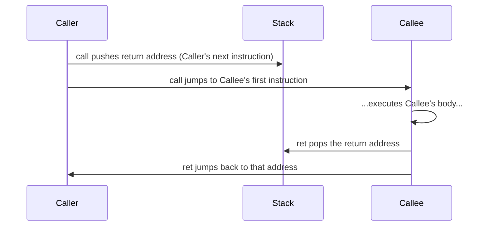

## Learning Objectives

- Explain what `push` and `pop` do to `%rsp` and to memory, and state which direction the stack grows as a result.
- Explain exactly what `call` does: pushing a return address and jumping, in that order, and state precisely what address gets pushed.
- Explain exactly what `ret` does: popping a value and jumping to it, and why this only works correctly if the stack is exactly as `call` left it.
- Trace, instruction by instruction, a short sequence of a `call` followed eventually by a `ret`, showing `%rsp` and the stack's contents at each step.
- Connect this concrete instruction-level mechanism directly to the abstract LIFO call-stack behavior already covered in `the-stack-and-automatic-storage`.

## Context & Motivation

`the-stack-and-automatic-storage` described the call stack's behavior — a frame pushed per call, popped per return, LIFO discipline — entirely in terms of what happens conceptually to local variables and function calls. This concept supplies the exact machine instructions that make that behavior real: `push`, `pop`, `call`, and `ret`, the specific x86-64 instructions that manipulate the stack pointer register (`%rsp`) and the memory it points into, moment by moment, as a program actually executes.

This is also the concept where the stack, as a region of the process address space (`the-process-address-space`), and `%rsp`, a register covered generically in `x86-64-registers-and-data-movement`, meet for the first time with a specific, dedicated purpose: `%rsp` is not just another general-purpose register available for arbitrary arithmetic — by architectural convention, it always holds the address of the current top of the stack, and `push`, `pop`, `call`, and `ret` all read and update it as their core behavior.

CS107's guide to x86-64 documents `push`, `pop`, `call`, and `ret` as the specific instructions this concept covers, in exactly the terms used here — `call` pushing `%rip` (the instruction pointer, holding the address of the next instruction) and jumping, `ret` popping that address back into `%rip`. CS:APP treats these same four instructions as the mechanical foundation the entire procedure-call discipline (parameter passing, local variables, returning a result) is built from.

## Core Theory

### `%rsp`: the stack pointer, by convention

`%rsp` is an ordinary 64-bit register, but x86-64's calling convention and its `push`/`pop`/`call`/`ret` instructions all treat it as holding one specific, meaningful value: the address of the current top of the stack. `the-process-address-space` already established that the stack grows toward lower addresses — which means "pushing" something onto the stack *decreases* `%rsp`, and "popping" something off *increases* it, the reverse of what "push" and "pop" might otherwise suggest.

### `push` and `pop`: the primitive stack operations

```text
pushq %rax     ; equivalent to: subq $8, %rsp ;  movq %rax, (%rsp)
                ;   (decrement %rsp by 8, then store %rax at the new top)

popq  %rax     ; equivalent to: movq (%rsp), %rax ;  addq $8, %rsp
                ;   (load the value at the current top into %rax, then increment %rsp by 8)
```

`push` first makes room (moving `%rsp` to a lower address) and then writes the value there; `pop` first reads the value at the current top and then reclaims that room (moving `%rsp` back to a higher address). These two instructions are the exact mechanical realization of the "push a frame / pop a frame" language `the-stack-and-automatic-storage` already used conceptually — here, applied to a single 8-byte value at a time rather than an entire frame.

### `call`: push the return address, then jump

```text
call someFunction    ; equivalent to: pushq %rip_next ; jmp someFunction
                       ;   where %rip_next is the address of the instruction
                       ;   immediately AFTER this call instruction
```

`call` does two things, in this exact order: it pushes the address of the instruction immediately following the `call` itself (this is the "return address" — where execution should resume once the called function is done) onto the stack, and then it jumps to the target function's address. This single instruction is entirely responsible for both halves of "calling a function": remembering where to come back to, and actually transferring control.

### `ret`: pop the return address, then jump to it

```text
ret    ; equivalent to: popq %rip
        ;   (pop the value at the current top of the stack into the instruction pointer)
```

`ret` pops whatever value currently sits at the top of the stack and jumps to it, treating that value as an address to resume execution at. Critically, `ret` does not independently verify that the value it pops is actually the return address `call` pushed earlier — it trusts the stack completely, which is exactly the assumption `stack-smashing-and-buffer-overflows` already showed can be violated by an out-of-bounds write that overwrites this exact value before `ret` ever executes.



### Why this only works if the stack is exactly as `call` left it

`call` and `ret` form a matched pair, and their correctness depends entirely on the stack pointer being in exactly the state `call` left it in by the time `ret` executes — if the callee pushes three values with `push` but only pops two of them back off before its `ret`, the value `ret` pops will be one of those three leftover values, not the actual return address, and the program will jump to a garbage address. This is precisely why `stack-frames-prologue-and-epilogue`, the next concept, is not optional bookkeeping — it is the discipline that guarantees every value a function pushes internally is popped again before that function's own `ret` executes.

## Worked Examples

### Example 1: tracing `%rsp` through a simple call and return

```text
; before: %rsp = 0x7ffe1000

    call myFunction    ; pushes return address (0x7ffe... , the next instruction here)
                        ; %rsp becomes 0x7ffe0ff8 (decreased by 8)
                        ; jumps to myFunction

myFunction:
    pushq %rbx          ; %rsp becomes 0x7ffe0ff0 (decreased by 8 again)
    ; ... myFunction's body ...
    popq  %rbx           ; %rsp becomes 0x7ffe0ff8 (back to where it was after call)
    ret                  ; pops the return address from 0x7ffe0ff8
                          ; %rsp becomes 0x7ffe1000 (back to the original value)
                          ; jumps back to the instruction right after the original call
```

By the time `ret` executes, `%rsp` has returned to exactly the value it held immediately after `call` pushed the return address — because `myFunction` popped `%rbx` back off before returning, undoing its one internal `push`. This exact balance (every `push` matched by a `pop`, restoring `%rsp` before `ret`) is what makes `ret`'s blind trust in the stack's top value correct.

### Example 2: what happens when a `push` isn't matched by a `pop`

```text
myBuggyFunction:
    pushq %rbx          ; %rsp decreases by 8
    ; ... forgot to pop %rbx before returning ...
    ret                  ; pops whatever value is currently on top —
                          ; but that's %rbx's saved value, NOT the actual return address!
```

`ret` has no way to know that the value on top of the stack is actually `%rbx`'s saved value rather than a genuine return address — it pops it and jumps to it unconditionally. The program will very likely crash (or, worse, appear to continue running while executing whatever garbage instructions happen to live at that "address"), because the mismatched `push` shifted every subsequent stack access by 8 bytes relative to what the code expected.

### Example 3: nested calls, and the LIFO order return addresses come back in

```text
main:
    call first     ; pushes main's return address; jumps to first

first:
    call second     ; pushes first's return address; jumps to second

second:
    ; ... body ...
    ret              ; pops first's return address; jumps back into first

first:
    ; (resuming right after "call second")
    ret              ; pops main's return address; jumps back into main
```

Two return addresses accumulate on the stack, in the order the calls were made: `main`'s (pushed first, so it ends up lower in the stack, farther from the top) and `first`'s (pushed second, ending up on top). The two `ret` instructions pop them off in the exact reverse order — `first`'s return address first, then `main`'s — which is precisely the LIFO discipline `the-stack-and-automatic-storage` already established conceptually, now shown as the direct, mechanical consequence of `push`/`call` always adding to the top and `pop`/`ret` always removing from the top.

## Common Misconceptions & Pitfalls

- **"`push` and `pop` grow the stack toward higher addresses, since 'push' sounds like adding something on top."** The stack grows toward *lower* addresses on x86-64 — `push` decreases `%rsp`, `pop` increases it. The everyday meaning of "push" (adding to the top) is preserved; only which direction is "up" (toward lower, not higher, addresses) is the part worth being deliberate about.
- **"`call` only jumps to the target function; the return address is tracked some other way."** `call` itself pushes the return address as part of its own definition, in the same instruction that performs the jump — there is no separate bookkeeping mechanism; the stack is where the return address lives, always.
- **"`ret` somehow verifies that the address it's about to jump to is a legitimate return address."** It performs no such check — it pops whatever value is currently on top of the stack and jumps to it unconditionally, trusting completely that the stack is in the state a matched `call` (and any function's own balanced `push`/`pop` pairs) would have left it in. This unconditional trust is exactly what `stack-smashing-and-buffer-overflows` exploits.
- **"An unmatched `push` inside a function is a minor bug, since the value is just left on the stack."** It shifts `%rsp` permanently relative to what the rest of the function (and its `ret`) expects, meaning `ret` pops the wrong value entirely — not a minor issue, but a corruption of the exact mechanism this concept depends on.

## Summary

`push` and `pop` are the primitive operations that move `%rsp` — toward lower addresses for `push`, higher for `pop` — while writing or reading a value at the stack's current top. `call` is defined as pushing the address of the instruction immediately following it (the return address) and then jumping to its target; `ret` is defined as popping whatever value currently sits on top of the stack and jumping to it, with absolutely no verification that this value is actually a legitimate return address. This pair of instructions only behaves correctly when every value a function pushes internally is popped again before its own `ret` executes, restoring `%rsp` to exactly the state `call` left it in — the exact discipline `stack-frames-prologue-and-epilogue` formalizes next, and the exact assumption a stack-smashing attack, covered earlier in this discipline, is built to violate.

## Documentation Links

- [Stanford CS107 — Guide to x86-64](https://web.stanford.edu/class/cs107/guide/x86-64.html) — reference documenting `push`, `pop`, `call`, and `ret` in exactly the terms used here, including `call` pushing `%rip` and `ret` popping it back.
- [Bryant & O'Hallaron — Computer Systems: A Programmer's Perspective (CS:APP)](https://csapp.cs.cmu.edu/) — textbook whose procedure-call mechanics this concept follows directly.
