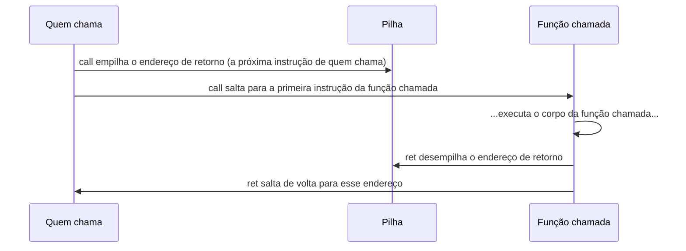

## Objetivos de Aprendizagem

- Explicar o que `push` e `pop` fazem com `%rsp` e com a memória e dizer, em consequência, em que direção a pilha cresce.
- Explicar exatamente o que `call` faz (empilhar um endereço de retorno e saltar, nessa ordem) e dizer com precisão qual endereço é empilhado.
- Explicar exatamente o que `ret` faz (desempilhar um valor e saltar para ele) e por que isso só funciona corretamente se a pilha estiver exatamente como `call` a deixou.
- Rastrear, instrução por instrução, uma curta sequência de um `call` seguido, em algum momento, de um `ret`, mostrando `%rsp` e o conteúdo da pilha em cada passo.
- Ligar esse mecanismo concreto, no nível das instruções, diretamente ao comportamento abstrato LIFO da pilha de chamadas já visto em `the-stack-and-automatic-storage`.

## Contexto e Motivação

`the-stack-and-automatic-storage` descreveu o comportamento da pilha de chamadas (um frame empilhado por chamada, desempilhado por retorno, disciplina LIFO) inteiramente em termos do que acontece conceitualmente com variáveis locais e chamadas de função. Este conceito fornece as instruções de máquina exatas que tornam esse comportamento real: `push`, `pop`, `call` e `ret`, as instruções específicas do x86-64 que manipulam o registrador stack pointer (`%rsp`) e a memória para a qual ele aponta, momento a momento, conforme um programa de fato executa.

Este também é o conceito em que a pilha, como região do espaço de endereçamento do processo (`the-process-address-space`), e `%rsp`, um registrador visto de forma genérica em `x86-64-registers-and-data-movement`, se encontram pela primeira vez com um propósito específico e dedicado: `%rsp` não é só mais um registrador de uso geral disponível para aritmética arbitrária. Por convenção arquitetural, ele sempre guarda o endereço do topo atual da pilha, e `push`, `pop`, `call` e `ret` o leem e o atualizam como parte central do seu comportamento.

O guia de x86-64 do CS107 documenta `push`, `pop`, `call` e `ret` como as instruções específicas que este conceito cobre, exatamente nos termos usados aqui: `call` empilhando `%rip` (o ponteiro de instrução, que guarda o endereço da próxima instrução) e saltando, `ret` desempilhando esse endereço de volta para `%rip`. O CS:APP trata essas mesmas quatro instruções como o fundamento mecânico a partir do qual toda a disciplina de chamada de procedimentos (passagem de parâmetros, variáveis locais, retorno de um resultado) é construída.

## Teoria Central

### `%rsp`: o stack pointer, por convenção

`%rsp` é um registrador comum de 64 bits, mas a convenção de chamada do x86-64 e suas instruções `push`/`pop`/`call`/`ret` o tratam como guardando um valor específico e com significado: o endereço do topo atual da pilha. `the-process-address-space` já estabeleceu que a pilha cresce em direção aos endereços mais baixos, o que significa que "empilhar" algo na pilha *diminui* `%rsp`, e "desempilhar" algo *aumenta* `%rsp`, o inverso do que "push" e "pop" poderiam sugerir.

### `push` e `pop`: as operações primitivas de pilha

```text
pushq %rax     ; equivalente a: subq $8, %rsp ;  movq %rax, (%rsp)
                ;   (decrementa %rsp em 8 e depois guarda %rax no novo topo)

popq  %rax     ; equivalente a: movq (%rsp), %rax ;  addq $8, %rsp
                ;   (carrega o valor do topo atual em %rax e depois incrementa %rsp em 8)
```

`push` primeiro abre espaço (movendo `%rsp` para um endereço mais baixo) e depois escreve o valor ali; `pop` primeiro lê o valor do topo atual e depois recupera esse espaço (movendo `%rsp` de volta para um endereço mais alto). Essas duas instruções são a realização mecânica exata da linguagem de "empilhar um frame / desempilhar um frame" que `the-stack-and-automatic-storage` já usou conceitualmente; aqui, aplicadas a um único valor de 8 bytes por vez, em vez de um frame inteiro.

### `call`: empilha o endereço de retorno e depois salta

```text
call someFunction    ; equivalente a: pushq %rip_next ; jmp someFunction
                       ;   em que %rip_next é o endereço da instrução
                       ;   imediatamente DEPOIS desta instrução call
```

`call` faz duas coisas, exatamente nesta ordem: empilha o endereço da instrução imediatamente seguinte ao próprio `call` (este é o "endereço de retorno": onde a execução deve continuar quando a função chamada terminar) e então salta para o endereço da função de destino. Essa única instrução é inteiramente responsável pelas duas metades de "chamar uma função": lembrar para onde voltar e de fato transferir o controle.

### `ret`: desempilha o endereço de retorno e salta para ele

```text
ret    ; equivalente a: popq %rip
        ;   (desempilha o valor do topo atual da pilha para o ponteiro de instrução)
```

`ret` desempilha o valor que estiver no topo da pilha naquele momento e salta para ele, tratando esse valor como o endereço em que a execução deve continuar. Crucialmente, `ret` não verifica de forma independente se o valor que desempilha é de fato o endereço de retorno que `call` empilhou antes: ela confia totalmente na pilha, e essa é exatamente a suposição que `stack-smashing-and-buffer-overflows` já mostrou poder ser violada por uma escrita fora dos limites que sobrescreve exatamente esse valor antes de `ret` sequer executar.



### Por que isso só funciona se a pilha estiver exatamente como `call` a deixou

`call` e `ret` formam um par casado, e sua correção depende inteiramente de o stack pointer estar exatamente no estado em que `call` o deixou quando `ret` executar. Se a função chamada empilhar três valores com `push`, mas só desempilhar dois deles antes do seu `ret`, o valor que `ret` vai desempilhar será um desses três valores que sobraram, e não o endereço de retorno real, e o programa vai saltar para um endereço lixo. É precisamente por isso que `stack-frames-prologue-and-epilogue`, o próximo conceito, não é contabilidade opcional: é a disciplina que garante que todo valor que uma função empilha internamente é desempilhado de novo antes de o `ret` dessa função executar.

## Exemplos Resolvidos

### Exemplo 1: rastreando `%rsp` numa chamada e num retorno simples

```text
; antes: %rsp = 0x7ffe1000

    call myFunction    ; empilha o endereço de retorno (0x7ffe... , a próxima instrução aqui)
                        ; %rsp vira 0x7ffe0ff8 (diminuído em 8)
                        ; salta para myFunction

myFunction:
    pushq %rbx          ; %rsp vira 0x7ffe0ff0 (diminuído em 8 de novo)
    ; ... corpo de myFunction ...
    popq  %rbx           ; %rsp vira 0x7ffe0ff8 (de volta a onde estava depois do call)
    ret                  ; desempilha o endereço de retorno de 0x7ffe0ff8
                          ; %rsp vira 0x7ffe1000 (de volta ao valor original)
                          ; salta de volta para a instrução logo depois do call original
```

Quando `ret` executa, `%rsp` já voltou exatamente ao valor que tinha logo depois de `call` empilhar o endereço de retorno, porque `myFunction` desempilhou `%rbx` antes de retornar, desfazendo seu único `push` interno. Esse equilíbrio exato (todo `push` casado com um `pop`, restaurando `%rsp` antes do `ret`) é o que torna correta a confiança cega de `ret` no valor do topo da pilha.

### Exemplo 2: o que acontece quando um `push` não é casado com um `pop`

```text
myBuggyFunction:
    pushq %rbx          ; %rsp diminui em 8
    ; ... esqueceu de desempilhar %rbx antes de retornar ...
    ret                  ; desempilha o valor que estiver no topo agora,
                          ; mas esse é o valor salvo de %rbx, e NÃO o endereço de retorno real!
```

`ret` não tem como saber que o valor no topo da pilha é na verdade o valor salvo de `%rbx`, e não um endereço de retorno genuíno: ela o desempilha e salta para ele incondicionalmente. O programa muito provavelmente vai travar (ou, pior, parecer continuar rodando enquanto executa quaisquer instruções lixo que por acaso morem naquele "endereço"), porque o `push` sem par deslocou todo acesso posterior à pilha em 8 bytes em relação ao que o código esperava.

### Exemplo 3: chamadas aninhadas, e a ordem LIFO em que os endereços de retorno voltam

```text
main:
    call first     ; empilha o endereço de retorno de main; salta para first

first:
    call second     ; empilha o endereço de retorno de first; salta para second

second:
    ; ... corpo ...
    ret              ; desempilha o endereço de retorno de first; salta de volta para first

first:
    ; (continuando logo depois de "call second")
    ret              ; desempilha o endereço de retorno de main; salta de volta para main
```

Dois endereços de retorno se acumulam na pilha, na ordem em que as chamadas foram feitas: o de `main` (empilhado primeiro, então fica mais embaixo na pilha, mais longe do topo) e o de `first` (empilhado em segundo, ficando no topo). As duas instruções `ret` os desempilham exatamente na ordem inversa (primeiro o endereço de retorno de `first`, depois o de `main`), que é precisamente a disciplina LIFO que `the-stack-and-automatic-storage` já estabeleceu conceitualmente, agora mostrada como a consequência direta e mecânica de `push`/`call` sempre acrescentarem no topo e `pop`/`ret` sempre removerem do topo.

## Equívocos Comuns e Armadilhas

- **"`push` e `pop` fazem a pilha crescer em direção aos endereços mais altos, já que 'push' soa como acrescentar algo em cima."** A pilha cresce em direção aos endereços *mais baixos* no x86-64: `push` diminui `%rsp`, `pop` o aumenta. O sentido cotidiano de "push" (acrescentar no topo) é preservado; o que merece atenção deliberada é só qual direção é "para cima" (em direção aos endereços mais baixos, e não aos mais altos).
- **"`call` só salta para a função de destino; o endereço de retorno é acompanhado de algum outro jeito."** O próprio `call` empilha o endereço de retorno como parte da sua definição, na mesma instrução que faz o salto. Não existe mecanismo de contabilidade separado; a pilha é onde o endereço de retorno mora, sempre.
- **"`ret` de algum modo verifica se o endereço para o qual vai saltar é um endereço de retorno legítimo."** Ela não faz verificação nenhuma: desempilha o valor que estiver no topo da pilha e salta para ele incondicionalmente, confiando totalmente que a pilha está no estado em que um `call` casado (e os pares equilibrados de `push`/`pop` de cada função) a teriam deixado. Essa confiança incondicional é exatamente o que `stack-smashing-and-buffer-overflows` explora.
- **"Um `push` sem par dentro de uma função é um bug menor, já que o valor só fica largado na pilha."** Ele desloca `%rsp` de forma permanente em relação ao que o resto da função (e seu `ret`) espera, o que significa que `ret` desempilha o valor errado por completo. Não é um problema menor, e sim uma corrupção exatamente do mecanismo do qual este conceito depende.

## Resumo

`push` e `pop` são as operações primitivas que movem `%rsp` (em direção aos endereços mais baixos no `push`, mais altos no `pop`) enquanto escrevem ou leem um valor no topo atual da pilha. `call` é definida como empilhar o endereço da instrução imediatamente seguinte a ela (o endereço de retorno) e então saltar para o destino; `ret` é definida como desempilhar o valor que estiver no topo da pilha e saltar para ele, sem absolutamente nenhuma verificação de que esse valor seja de fato um endereço de retorno legítimo. Esse par de instruções só se comporta corretamente quando todo valor que uma função empilha internamente é desempilhado de novo antes de o seu próprio `ret` executar, restaurando `%rsp` exatamente ao estado em que `call` o deixou: exatamente a disciplina que `stack-frames-prologue-and-epilogue` formaliza a seguir, e exatamente a suposição que um ataque de stack smashing, visto antes nesta disciplina, é construído para violar.

## Documentation Links

- [Stanford CS107: Guide to x86-64](https://web.stanford.edu/class/cs107/guide/x86-64.html): referência que documenta `push`, `pop`, `call` e `ret` exatamente nos termos usados aqui, incluindo `call` empilhando `%rip` e `ret` desempilhando-o de volta.
- [Bryant & O'Hallaron: Computer Systems: A Programmer's Perspective (CS:APP)](https://csapp.cs.cmu.edu/): livro-texto cuja mecânica de chamada de procedimentos este conceito segue diretamente.
