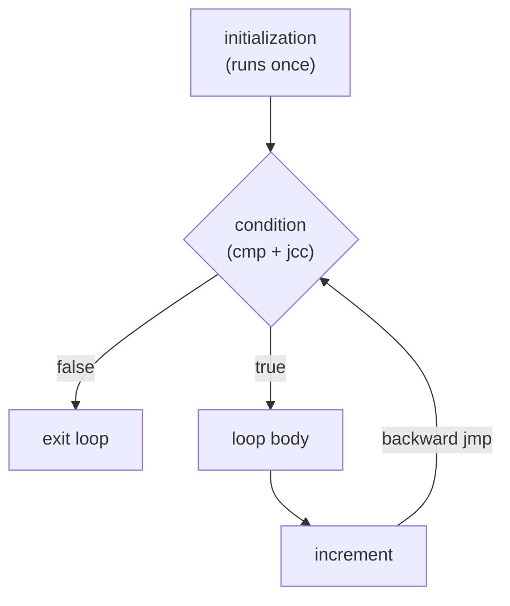

## Learning Objectives

- Translate a simple C `if`/`else` statement by hand into the equivalent `cmp` + `jcc` + label sequence.
- Translate a `while` loop by hand, correctly identifying the loop-condition test and the backward jump that repeats the loop body.
- Translate a `for` loop by hand, showing how its initialization, condition, and increment map onto the same primitive building blocks as a `while` loop.
- Explain why, at the ISA level, there is no dedicated "if statement" or "loop" instruction — every high-level control-flow construct compiles down to the same small vocabulary of comparisons and jumps.
- State this concept's exact source in ACM/IEEE CS2013 and explain why it names this specific translation as a core learning outcome.

## Context & Motivation

Every high-level control-flow construct a C program can write — `if`, `else`, `while`, `for`, even `switch` — is, from the ISA's point of view, built from exactly the same small set of primitives already covered in `condition-codes-and-conditional-branches`: a comparison instruction that sets flags, and a conditional jump that reads them. There is no separate machine instruction for "if," no dedicated hardware for "while" — a compiler's job, at this level, is entirely a translation problem: take a structured, nested control-flow construct and lower it into a flat sequence of labeled instructions and jumps that produces the same observable behavior.

This concept is named directly and explicitly by ACM/IEEE CS2013's Architecture and Organization knowledge area, which lists, as a core learning outcome, the ability to "show how fundamental high-level programming constructs are implemented at the machine-language level" — one of the few places in this discipline's research where a curriculum body names almost this exact concept by its exact intended content, rather than this discipline having to infer scope from a course's general topic list. (CS2013's Systems Fundamentals knowledge area, by contrast, was checked directly during this discipline's research and does *not* cover this translation — confirming that Architecture and Organization, already cited in `digital-logic-computer-organization` for the analogous RISC-V translation, is the correct knowledge area to anchor this concept to.)

Seeing this translation done by hand, for `if`, `while`, and `for` in turn, is what makes the earlier, more abstract idea of "a compiler lowers code into machine instructions" — already introduced conceptually in `digital-logic-computer-organization/assembly-to-machine-code-translation` for a small teaching ISA — fully concrete for the real x86-64 assembly this discipline actually uses.

## Core Theory

### `if`/`else`: one comparison, one conditional jump, one unconditional jump

```c
if (a > b) {
    x = 1;
} else {
    x = 2;
}
```

```text
    cmpl %ebx, %eax      ; compare a (%eax) to b (%ebx)
    jg   .L_then          ; if a > b, jump to the then-branch
    movl $2, %ecx          ; else-branch: x = 2
    jmp  .L_end
.L_then:
    movl $1, %ecx          ; then-branch: x = 1
.L_end:
```

The pattern is fixed: a comparison, a conditional jump to the "then" branch, the "else" code inline (falling through when the condition is false), an unconditional jump past the "then" code, and finally the "then" code itself under its label. This layout — placing the else-branch first, inline, and the then-branch after a jump — is a specific, common compiler convention, not the only possible correct ordering; the reverse (then-branch inline, else-branch after a jump) is equally valid and equally common.

### `while`: test-then-loop, with a backward jump

```c
while (i < n) {
    sum = sum + i;
    i = i + 1;
}
```

```text
.L_test:
    cmpl %edx, %ecx        ; compare i (%ecx) to n (%edx)
    jge  .L_end             ; if i >= n, exit the loop
    addl %ecx, %eax          ; sum = sum + i
    addl $1, %ecx             ; i = i + 1
    jmp  .L_test
.L_end:
```

The defining feature of a loop, at this level, is a **backward** jump (`jmp .L_test`, pointing to an address earlier in the program than the jump instruction itself) — an unconditional jump back to re-check the loop's condition, repeating the whole test-and-body sequence for as long as the condition holds. A conditional forward jump (`jge .L_end`) is what actually exits the loop, exactly like the `if` translation above.

### `for`: the same primitives, with initialization and increment folded in

```c
for (int i = 0; i < n; i++) {
    sum = sum + i;
}
```

```text
    movl $0, %ecx            ; initialization: i = 0
.L_test:
    cmpl %edx, %ecx          ; condition: i < n
    jge  .L_end
    addl %ecx, %eax           ; body: sum = sum + i
    addl $1, %ecx              ; increment: i = i + 1
    jmp  .L_test
.L_end:
```

A `for` loop's three clauses map onto the exact same shape as the `while` translation above, with the initialization placed once, before the loop's test label, and the increment placed at the end of the body, just before the backward jump — a `for` loop is not a structurally different machine-level construct from a `while` loop; it is the same primitive pattern with a specific, conventional placement for two extra pieces of code a `while` loop would otherwise require the programmer to write by hand around it.



## Worked Examples

### Example 1: a `for` loop that also contains an `if`, nested and translated together

```c
for (int i = 0; i < n; i++) {
    if (arr[i] < 0) {
        count = count + 1;
    }
}
```

```text
    movl $0, %ecx                  ; i = 0
.L_loop_test:
    cmpl %edx, %ecx                ; i < n ?
    jge  .L_loop_end
    movl (%rsi, %rcx, 4), %r8d      ; load arr[i]  (address arithmetic from pointer-arithmetic-and-array-decay)
    cmpl $0, %r8d                   ; arr[i] < 0 ?
    jge  .L_skip_if
    addl $1, %eax                    ; count = count + 1
.L_skip_if:
    addl $1, %ecx                    ; i = i + 1
    jmp  .L_loop_test
.L_loop_end:
```

The nested `if` inside the `for` loop's body is translated exactly the same way an `if` at the top level would be — its own `cmp`/`jcc`/label sequence, simply placed inside the loop body between the increment-preceding code and the backward jump. Nesting control-flow constructs at the C level produces nested, but not fundamentally different, blocks of comparisons and jumps at the assembly level — there is no separate mechanism for "control flow inside other control flow."

### Example 2: a `while` loop with an early exit (`break`)

```c
while (i < n) {
    if (arr[i] == target) {
        break;
    }
    i = i + 1;
}
```

```text
.L_loop_test:
    cmpl %edx, %ecx              ; i < n ?
    jge  .L_loop_end
    movl (%rsi, %rcx, 4), %r8d    ; load arr[i]
    cmpl %r9d, %r8d                ; arr[i] == target ?
    je   .L_loop_end                ; break: jump directly out of the loop
    addl $1, %ecx
    jmp  .L_loop_test
.L_loop_end:
```

`break` compiles to exactly what it conceptually means: an unconditional jump straight to the loop's exit label, skipping whatever remaining code (here, the increment) would otherwise run for that iteration — no new instruction type is needed, only a jump target chosen to land past the loop entirely rather than back at its test.

### Example 3: why the "then" and "else" ordering is a convention, not a rule

```text
; Version A (else inline, then after a jump — used throughout this concept)
    jg   .L_then
    ; else code
    jmp  .L_end
.L_then:
    ; then code
.L_end:

; Version B (then inline, else after a jump — equally correct)
    jle  .L_else       ; note: inverted condition
    ; then code
    jmp  .L_end
.L_else:
    ; else code
.L_end:
```

Both versions produce identical observable behavior for the same C source; Version B simply inverts the condition being tested (`jle` instead of `jg`) and swaps which branch is written inline versus after a jump. Real compilers choose between layouts like these based on considerations (branch prediction heuristics, code size) that belong to `computer-architecture`, not this discipline — the point here is only that the *translation* is a mechanical process with more than one valid, equivalent output, not that one specific layout is the single correct answer.

## Common Misconceptions & Pitfalls

- **"There's a single, dedicated x86-64 instruction for `if` and a different one for `while`."** There isn't — both compile down to the exact same two primitives already covered in `condition-codes-and-conditional-branches`: a comparison and a conditional jump. The only structural difference between an `if` and a loop, at this level, is whether a jump points forward (skipping code once) or backward (repeating code).
- **"A `for` loop is a fundamentally different machine-level construct from a `while` loop."** It compiles to the identical test-jump-body-jump shape; the only difference is where the initialization and increment code are conventionally placed relative to that shape, not a difference in the primitives used.
- **"Nested control flow (an `if` inside a loop) requires a special mechanism."** It requires nothing beyond placing one comparison-and-jump block inside another — Example 1 shows the nested `if`'s own `cmp`/`jcc` sequence sitting entirely within the loop's body, using labels local to that nested structure.
- **"There's exactly one correct way to lay out the then/else branches in assembly."** Example 3 shows two layouts that differ only in which condition is tested and which branch is placed inline, producing identical observable behavior — the "correct" layout is whichever a specific compiler's heuristics choose, not a fact about the C source itself.

## Summary

Every high-level control-flow construct in C — `if`/`else`, `while`, `for`, and their nested combinations — compiles down to the same small vocabulary already covered in `condition-codes-and-conditional-branches`: a comparison instruction setting flags, and a conditional jump reading them, arranged as either a forward jump (skipping code once, the shape of `if`) or a backward jump (repeating code, the shape of a loop). A `for` loop is not a separate primitive from a `while` loop; it is the identical test-jump-body-jump pattern with its initialization and increment placed at conventional points around it. This translation — named directly by ACM/IEEE CS2013's Architecture and Organization knowledge area as a core learning outcome — is the mechanical link between the structured code a C programmer writes and the flat, labeled sequence of instructions a real processor actually executes, one instruction at a time, exactly as `the-fetch-decode-execute-cycle` (`digital-logic-computer-organization`) already described for any ISA.

## Documentation Links

- [ACM/IEEE CS2013 — Architecture and Organization Knowledge Area](https://csed.acm.org/knowledge-areas-architecture-and-organization-ar-cs2013-version/) — curriculum guidelines naming this exact translation ("how fundamental high-level programming constructs are implemented at the machine-language level") as a core learning outcome.
- [Bryant & O'Hallaron — Computer Systems: A Programmer's Perspective (CS:APP)](https://csapp.cs.cmu.edu/) — textbook whose treatment of control-flow translation for `if`, `while`, and `for` this discipline's examples follow.
