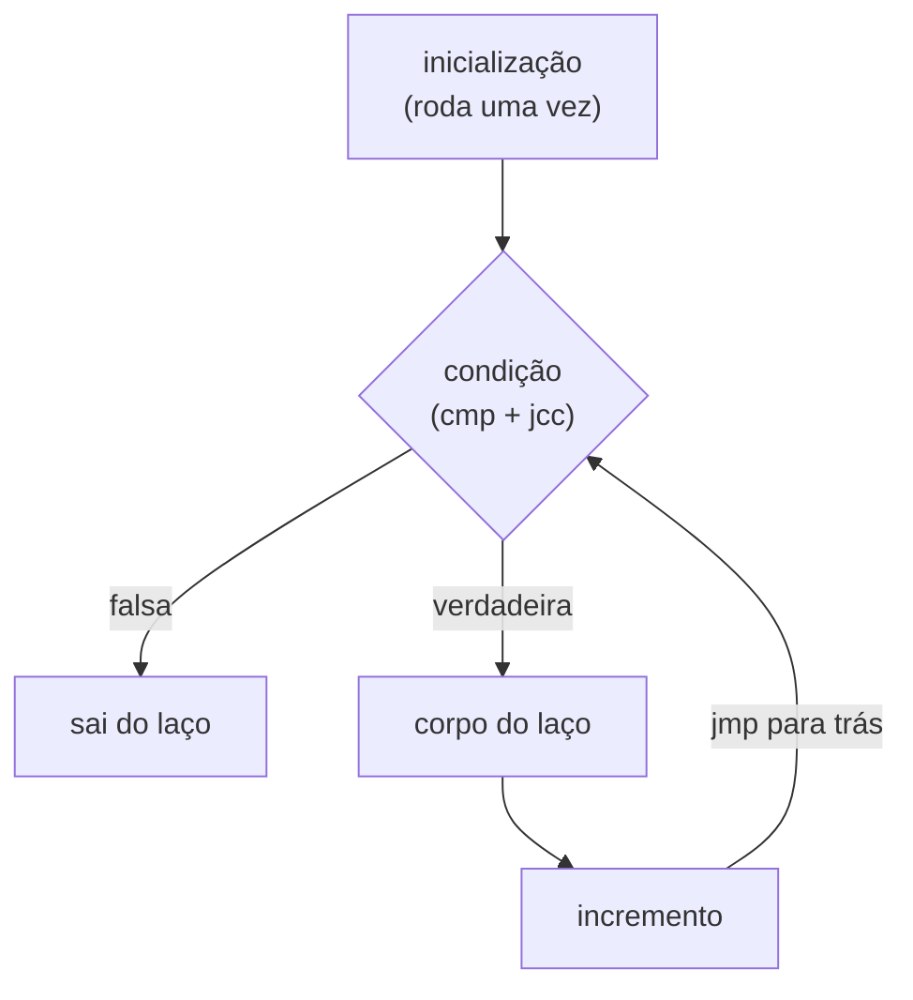

## Objetivos de Aprendizagem

- Traduzir à mão um comando C `if`/`else` simples para a sequência equivalente de `cmp` + `jcc` + rótulo.
- Traduzir à mão um laço `while`, identificando corretamente o teste da condição do laço e o salto para trás que repete o corpo do laço.
- Traduzir à mão um laço `for`, mostrando como sua inicialização, condição e incremento correspondem aos mesmos blocos de construção primitivos de um laço `while`.
- Explicar por que, no nível da ISA, não existe uma instrução dedicada de "comando if" ou de "laço": toda construção de controle de fluxo de alto nível é compilada para o mesmo pequeno vocabulário de comparações e saltos.
- Indicar a fonte exata deste conceito no ACM/IEEE CS2013 e explicar por que ele nomeia esta tradução específica como um resultado de aprendizagem central.

## Contexto e Motivação

Toda construção de controle de fluxo de alto nível que um programa C pode escrever (`if`, `else`, `while`, `for`, até `switch`) é, do ponto de vista da ISA, construída exatamente com o mesmo pequeno conjunto de primitivas já visto em `condition-codes-and-conditional-branches`: uma instrução de comparação que liga as flags e um salto condicional que as lê. Não existe instrução de máquina separada para "if", nem hardware dedicado para "while"; o trabalho de um compilador, neste nível, é inteiramente um problema de tradução: pegar uma construção de controle de fluxo estruturada e aninhada e reduzi-la a uma sequência plana de instruções rotuladas e saltos que produz o mesmo comportamento observável.

Este conceito é nomeado direta e explicitamente pela área de conhecimento Architecture and Organization do ACM/IEEE CS2013, que lista, como resultado de aprendizagem central, a capacidade de "mostrar como construções fundamentais de programação de alto nível são implementadas no nível da linguagem de máquina". É um dos poucos lugares na pesquisa desta disciplina em que um órgão curricular nomeia quase exatamente este conceito pelo seu conteúdo pretendido, em vez de esta disciplina ter de inferir o escopo a partir da lista geral de tópicos de um curso. (A área de conhecimento Systems Fundamentals do CS2013, por contraste, foi verificada diretamente durante a pesquisa desta disciplina e *não* cobre esta tradução, confirmando que Architecture and Organization, já citada em `digital-logic-computer-organization` para a tradução análoga em RISC-V, é a área de conhecimento correta para ancorar este conceito.)

Ver esta tradução feita à mão, para `if`, `while` e `for`, um de cada vez, é o que torna totalmente concreta, para o assembly x86-64 real que esta disciplina de fato usa, a ideia anterior e mais abstrata de "um compilador reduz código a instruções de máquina", já apresentada conceitualmente em `digital-logic-computer-organization/assembly-to-machine-code-translation` para uma pequena ISA didática.

## Teoria Central

### `if`/`else`: uma comparação, um salto condicional, um salto incondicional

```c
if (a > b) {
    x = 1;
} else {
    x = 2;
}
```

```text
    cmpl %ebx, %eax      ; compara a (%eax) com b (%ebx)
    jg   .L_then          ; se a > b, salta para o ramo then
    movl $2, %ecx          ; ramo else: x = 2
    jmp  .L_end
.L_then:
    movl $1, %ecx          ; ramo then: x = 1
.L_end:
```

O padrão é fixo: uma comparação, um salto condicional para o ramo "then", o código do "else" em linha (seguido direto quando a condição é falsa), um salto incondicional por cima do código do "then" e, por fim, o próprio código do "then" sob seu rótulo. Esse layout (colocar o ramo else primeiro, em linha, e o ramo then depois de um salto) é uma convenção de compilador específica e comum, e não a única ordem correta possível; a inversa (ramo then em linha, ramo else depois de um salto) é igualmente válida e igualmente comum.

### `while`: testar e depois repetir, com um salto para trás

```c
while (i < n) {
    sum = sum + i;
    i = i + 1;
}
```

```text
.L_test:
    cmpl %edx, %ecx        ; compara i (%ecx) com n (%edx)
    jge  .L_end             ; se i >= n, sai do laço
    addl %ecx, %eax          ; sum = sum + i
    addl $1, %ecx             ; i = i + 1
    jmp  .L_test
.L_end:
```

A característica que define um laço, neste nível, é um salto **para trás** (`jmp .L_test`, apontando para um endereço anterior à própria instrução de salto no programa): um salto incondicional de volta para reavaliar a condição do laço, repetindo toda a sequência de teste e corpo enquanto a condição valer. Um salto condicional para a frente (`jge .L_end`) é o que de fato sai do laço, exatamente como na tradução do `if` acima.

### `for`: as mesmas primitivas, com inicialização e incremento embutidos

```c
for (int i = 0; i < n; i++) {
    sum = sum + i;
}
```

```text
    movl $0, %ecx            ; inicialização: i = 0
.L_test:
    cmpl %edx, %ecx          ; condição: i < n
    jge  .L_end
    addl %ecx, %eax           ; corpo: sum = sum + i
    addl $1, %ecx              ; incremento: i = i + 1
    jmp  .L_test
.L_end:
```

As três cláusulas de um laço `for` correspondem exatamente à mesma forma da tradução do `while` acima, com a inicialização colocada uma vez, antes do rótulo de teste do laço, e o incremento colocado no fim do corpo, logo antes do salto para trás. Um laço `for` não é uma construção estruturalmente diferente de um laço `while` no nível de máquina; é o mesmo padrão primitivo, com uma posição específica e convencional para dois pedaços extras de código que um laço `while` exigiria que o programador escrevesse à mão ao redor dele.



## Exemplos Resolvidos

### Exemplo 1: um laço `for` que também contém um `if`, aninhados e traduzidos juntos

```c
for (int i = 0; i < n; i++) {
    if (arr[i] < 0) {
        count = count + 1;
    }
}
```

```text
    movl $0, %ecx                  ; i = 0
.L_loop_test:
    cmpl %edx, %ecx                ; i < n ?
    jge  .L_loop_end
    movl (%rsi, %rcx, 4), %r8d      ; carrega arr[i]  (aritmética de endereços de pointer-arithmetic-and-array-decay)
    cmpl $0, %r8d                   ; arr[i] < 0 ?
    jge  .L_skip_if
    addl $1, %eax                    ; count = count + 1
.L_skip_if:
    addl $1, %ecx                    ; i = i + 1
    jmp  .L_loop_test
.L_loop_end:
```

O `if` aninhado dentro do corpo do laço `for` é traduzido exatamente do mesmo jeito que um `if` no nível de cima seria: sua própria sequência de `cmp`/`jcc`/rótulo, simplesmente colocada dentro do corpo do laço, entre o código que precede o incremento e o salto para trás. Aninhar construções de controle de fluxo no nível de C produz blocos de comparações e saltos aninhados, mas não fundamentalmente diferentes, no nível de assembly; não existe um mecanismo separado para "controle de fluxo dentro de outro controle de fluxo".

### Exemplo 2: um laço `while` com saída antecipada (`break`)

```c
while (i < n) {
    if (arr[i] == target) {
        break;
    }
    i = i + 1;
}
```

```text
.L_loop_test:
    cmpl %edx, %ecx              ; i < n ?
    jge  .L_loop_end
    movl (%rsi, %rcx, 4), %r8d    ; carrega arr[i]
    cmpl %r9d, %r8d                ; arr[i] == target ?
    je   .L_loop_end                ; break: salta direto para fora do laço
    addl $1, %ecx
    jmp  .L_loop_test
.L_loop_end:
```

`break` é compilado exatamente para o que significa conceitualmente: um salto incondicional direto para o rótulo de saída do laço, pulando o código que ainda rodaria naquela iteração (aqui, o incremento). Nenhum tipo novo de instrução é necessário, só um destino de salto escolhido para cair depois do laço inteiro, em vez de voltar para o seu teste.

### Exemplo 3: por que a ordem dos ramos "then" e "else" é uma convenção, e não uma regra

```text
; Versão A (else em linha, then depois de um salto: usada ao longo deste conceito)
    jg   .L_then
    ; código do else
    jmp  .L_end
.L_then:
    ; código do then
.L_end:

; Versão B (then em linha, else depois de um salto: igualmente correta)
    jle  .L_else       ; repare: condição invertida
    ; código do then
    jmp  .L_end
.L_else:
    ; código do else
.L_end:
```

As duas versões produzem comportamento observável idêntico para o mesmo código-fonte C; a Versão B simplesmente inverte a condição testada (`jle` em vez de `jg`) e troca qual ramo é escrito em linha e qual vem depois de um salto. Compiladores reais escolhem entre layouts como esses com base em considerações (heurísticas de previsão de desvio, tamanho do código) que pertencem a `computer-architecture`, e não a esta disciplina. O ponto aqui é só que a *tradução* é um processo mecânico com mais de uma saída válida e equivalente, e não que um layout específico seja a única resposta correta.

## Equívocos Comuns e Armadilhas

- **"Existe uma única instrução x86-64 dedicada para `if` e outra diferente para `while`."** Não existe: os dois são compilados para exatamente as mesmas duas primitivas já vistas em `condition-codes-and-conditional-branches`, uma comparação e um salto condicional. A única diferença estrutural entre um `if` e um laço, neste nível, é se um salto aponta para a frente (pulando código uma vez) ou para trás (repetindo código).
- **"Um laço `for` é uma construção fundamentalmente diferente de um laço `while` no nível de máquina."** Ele é compilado para a forma idêntica de teste-salto-corpo-salto; a única diferença é onde o código de inicialização e de incremento fica, por convenção, em relação a essa forma, e não uma diferença nas primitivas usadas.
- **"Controle de fluxo aninhado (um `if` dentro de um laço) exige um mecanismo especial."** Não exige nada além de colocar um bloco de comparação e salto dentro de outro: o Exemplo 1 mostra a sequência própria de `cmp`/`jcc` do `if` aninhado inteiramente dentro do corpo do laço, usando rótulos locais a essa estrutura aninhada.
- **"Existe exatamente um jeito correto de dispor os ramos then/else em assembly."** O Exemplo 3 mostra dois layouts que diferem só em qual condição é testada e qual ramo fica em linha, produzindo comportamento observável idêntico. O layout "correto" é o que as heurísticas de um compilador específico escolhem, e não um fato sobre o próprio código-fonte C.

## Resumo

Toda construção de controle de fluxo de alto nível em C (`if`/`else`, `while`, `for` e suas combinações aninhadas) é compilada para o mesmo pequeno vocabulário já visto em `condition-codes-and-conditional-branches`: uma instrução de comparação que liga as flags e um salto condicional que as lê, dispostos como um salto para a frente (pulando código uma vez, a forma do `if`) ou um salto para trás (repetindo código, a forma de um laço). Um laço `for` não é uma primitiva separada de um laço `while`; é o padrão idêntico de teste-salto-corpo-salto, com sua inicialização e seu incremento colocados em pontos convencionais ao redor dele. Esta tradução (nomeada diretamente pela área de conhecimento Architecture and Organization do ACM/IEEE CS2013 como um resultado de aprendizagem central) é o elo mecânico entre o código estruturado que um programador C escreve e a sequência plana e rotulada de instruções que um processador real de fato executa, uma instrução por vez, exatamente como `the-fetch-decode-execute-cycle` (`digital-logic-computer-organization`) já descreveu para qualquer ISA.

## Documentation Links

- [ACM/IEEE CS2013: Architecture and Organization Knowledge Area](https://csed.acm.org/knowledge-areas-architecture-and-organization-ar-cs2013-version/): diretrizes curriculares que nomeiam exatamente esta tradução ("como construções fundamentais de programação de alto nível são implementadas no nível da linguagem de máquina") como um resultado de aprendizagem central.
- [Bryant & O'Hallaron: Computer Systems: A Programmer's Perspective (CS:APP)](https://csapp.cs.cmu.edu/): livro-texto cujo tratamento da tradução de controle de fluxo para `if`, `while` e `for` os exemplos desta disciplina seguem.
