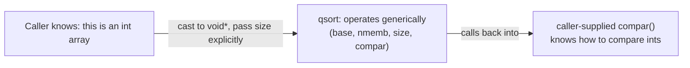

## Learning Objectives

- Explain what `void *` means: a pointer known to hold some address, deliberately without any information about what type of object lives there.
- State why a `void *` cannot be dereferenced directly, and why it must be cast to a concrete pointer type before the object it points to can be read or written.
- Read and explain the signature of `malloc`, `memcpy`, and `qsort`, identifying exactly where and why each uses `void *` to stay generic.
- Implement a simple generic container function (e.g., a byte-for-byte swap of two arbitrary objects) using `void *` and an explicit size parameter.
- Contrast this technique with genuine compile-time generics, explaining what `void *` gives up (type safety, compile-time checking) in exchange for generality.

## Context & Motivation

Every pointer covered so far in this discipline has known, at compile time, exactly what kind of object it points to — `int *`, `struct Node *`, a function pointer with a fixed signature. `void *` breaks that pattern deliberately: it is a pointer guaranteed to hold *some* valid address, while saying nothing at all about what type of object is stored there. This is not a gap in the type system; it is C's mechanism for writing code that needs to work on data of any type, decided later, without knowing that type in advance.

This matters immediately and concretely, because the standard library functions used constantly throughout this discipline are only possible because of `void *`. `malloc`, covered in `the-heap-and-dynamic-allocation`, returns `void *` because it has no idea, at the moment it allocates memory, what the caller intends to store there — a block of raw memory is not inherently an array of `int`s or a `struct Node`, until the caller decides. `memcpy` copies bytes between two `void *` arguments because a byte-for-byte copy doesn't care what type either side actually is. `qsort`, the C standard library's generic sort, takes an array as `void *` and a comparison function (a function pointer, covered in `function-pointers`) precisely so it can sort an array of any element type without being rewritten for each one.

CS107 and CS:APP both treat `void *` as the practical answer to a real design tension: C has no templates or generics built into the language (unlike, say, C++), so any function meant to operate on arbitrary types needs some way to accept "a pointer to something, type unspecified" — and `void *`, paired with an explicit size (in bytes) telling the function how much data to actually touch, is that answer.

## Core Theory

### `void *`: an address with its type deliberately erased

A `void *` is declared and assigned exactly like any other pointer, holding the address of some real object — but the compiler tracks no information about what that object's type is:

```c
int x = 5;
void *vp = &x;   /* vp holds x's address, but "forgets" that it points to an int */
```

Because the compiler no longer knows the pointee's type, it has no way to determine how many bytes to read or how to interpret them — which is exactly why a `void *` cannot be dereferenced directly. `*vp` is a compile error; the pointer must first be cast back to a concrete type:

```c
int y = *(int *)vp;   /* cast vp back to int*, then dereference: y == 5 */
```

The cast is the caller's promise to the compiler: "trust me, the object at this address really is an `int`." C performs no runtime check that this promise is true — getting the cast wrong (casting to the wrong type, or a type of the wrong size) is undefined behavior, not a caught error.

### `malloc`'s signature is the clearest real example

```c
void *malloc(size_t size);
```

`malloc` allocates `size` bytes of raw, uninitialized memory and returns a `void *` pointing at the start of that block. It cannot return, say, an `int *`, because `malloc` has no idea whether the caller intends to store `int`s, `struct Node`s, or raw bytes there — the return type has to stay generic, and the caller supplies the missing type information themselves, by casting the result:

```c
int *nums = (int *)malloc(10 * sizeof(int));   /* 10 ints' worth of raw memory, cast to int* */
```

The size passed to `malloc` (`10 * sizeof(int)`) is itself computed using `sizeof`, exactly because a `void *` alone carries no size information the caller could otherwise ask for — the caller must always track, separately, how much memory they asked for and what they intend to do with it.

### `memcpy`: generic because it operates one byte at a time

```c
void *memcpy(void *dest, const void *src, size_t n);
```

`memcpy` copies `n` bytes from `src` to `dest`, without ever needing to know what type either pointer actually points to — a byte-for-byte copy is meaningful regardless of the pointee's type, so `memcpy` stays generic by operating purely in terms of raw bytes and an explicit count, never trying to interpret the data it moves.

### `qsort`: generic sorting via `void *` plus a function pointer

```c
void qsort(void *base, size_t nmemb, size_t size,
           int (*compar)(const void *, const void *));
```

`qsort` sorts an array of `nmemb` elements, each `size` bytes, starting at `base` — all three parameters together replace the type information a generic sort would otherwise need: `base` is where the data lives, `size` is how far to move to get from one element to the next (since `qsort` cannot use typed pointer arithmetic, covered in `pointer-arithmetic-and-array-decay`, on a `void *`), and `compar` (a function pointer, covered in `function-pointers`) is how to compare any two elements, supplied by the caller since `qsort` itself has no idea what "less than" means for an arbitrary type.



## Worked Examples

### Example 1: a generic byte-swap using `void *`

```c
void genericSwap(void *a, void *b, size_t size) {
    unsigned char *pa = (unsigned char *)a;
    unsigned char *pb = (unsigned char *)b;

    for (size_t i = 0; i < size; i++) {
        unsigned char tmp = pa[i];
        pa[i] = pb[i];
        pb[i] = tmp;
    }
}

int x = 1, y = 2;
genericSwap(&x, &y, sizeof(int));      /* swaps two ints */

struct Point { int x, y; };
struct Point p1 = {1, 1}, p2 = {2, 2};
genericSwap(&p1, &p2, sizeof(struct Point));   /* swaps two structs, same function */
```

`genericSwap` never mentions `int` or `struct Point` anywhere in its body — it treats whatever it's given as a sequence of raw bytes (`unsigned char *`, chosen specifically because `sizeof(unsigned char)` is always exactly 1 byte) and swaps them one byte at a time. The same function correctly swaps two integers or two structs, because a byte-for-byte swap produces the correct result regardless of what those bytes mean.

### Example 2: calling `qsort` with a real comparator

```c
int compareInts(const void *a, const void *b) {
    int ia = *(const int *)a;    /* cast back to int* to actually compare */
    int ib = *(const int *)b;
    return ia - ib;
}

int nums[5] = {5, 2, 4, 1, 3};
qsort(nums, 5, sizeof(int), compareInts);
/* nums is now {1, 2, 3, 4, 5} */
```

`qsort` calls `compareInts` internally, passing it two `void *` arguments pointing at whichever two elements it currently needs to compare. `compareInts` immediately casts both back to `const int *` and dereferences them — the exact same cast-then-dereference pattern from the Core Theory section — because `qsort` itself has erased the element type, and only the caller-supplied comparator knows how to restore it.

### Example 3: what `void *` gives up, compared to real generics

```c
/* void* version: compiles fine even with a mismatched cast — no error until runtime */
double *bad = (double *)malloc(sizeof(int));
*bad = 3.14;   /* undefined behavior: only sizeof(int) bytes were actually allocated */
```

There is no way for the compiler to catch this mistake: `malloc(sizeof(int))` genuinely returns a `void *`, and casting it to `double *` is accepted without complaint, even though a `double` needs more bytes than were allocated. This is the real cost of `void *`-based genericity: it buys the ability to write one function for many types, but at the price of every type-safety check a real generics system (compile-time templates, or Python's dynamic typing catching a mismatch at the point of use) would normally provide. The programmer's cast is the only thing standing between correct and undefined behavior.

## Common Misconceptions & Pitfalls

- **"`void *` means 'a pointer to nothing' or 'a null pointer'."** It means "a pointer to something, of unspecified type" — very different from `NULL`, which means "a pointer to nothing at all." A `void *` can (and usually does) hold a perfectly valid, non-null address; it has simply lost its type information.
- **"You can dereference a `void *` directly, like any other pointer."** You cannot — the compiler has no idea how many bytes to read or how to interpret them. A `void *` must first be cast to a concrete pointer type before dereferencing.
- **"`void *`-based genericity is just as safe as real generics."** It is not — casting a `void *` to the wrong type compiles without error and produces undefined behavior at runtime, exactly as shown in Example 3. Real generics (compile-time templates in other languages) catch this class of mistake before the program ever runs.
- **"`memcpy` and `qsort` are unrelated techniques."** Both solve the same underlying problem — writing one function that works across many types — using the same core idea: erase the type with `void *`, and pass whatever extra information (a byte count for `memcpy`, a size and comparator for `qsort`) the function needs to operate correctly without that type information.

## Summary

`void *` is a pointer that C guarantees holds some valid address while deliberately discarding any information about what type of object lives there — it cannot be dereferenced directly and must be cast to a concrete type first, a cast the compiler never verifies for correctness. This is the mechanism behind every genuinely generic function in the C standard library: `malloc` returns `void *` because it cannot know what the caller intends to store; `memcpy` operates on `void *` because a byte-for-byte copy doesn't need to know either side's type; `qsort` combines a `void *` array, an explicit element size, and a caller-supplied comparison function pointer to sort data of any type without ever knowing what that type is. The tradeoff is real and unavoidable: `void *`-based genericity buys flexibility at the direct cost of every compile-time type check a real generics system would otherwise provide.

## Documentation Links

- [Bryant & O'Hallaron — Computer Systems: A Programmer's Perspective (CS:APP)](https://csapp.cs.cmu.edu/) — textbook covering `void *` and the standard library functions built around it.
- [Stanford CS107 — General Information and Syllabus](https://web.stanford.edu/class/cs107/syllabus) — course treating `void *` as core early material, alongside pointers and function pointers.
