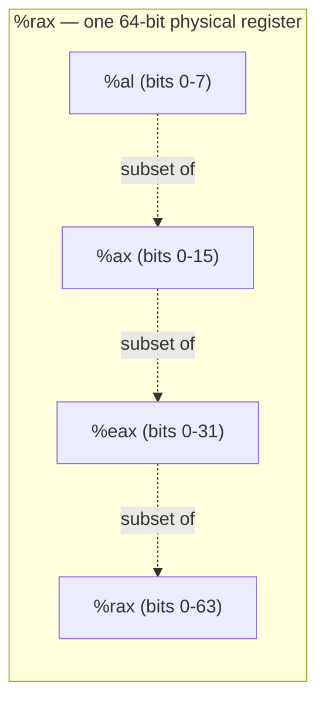

## Learning Objectives

- Name the 16 general-purpose x86-64 registers and explain how a single physical register can be addressed at 64-, 32-, 16-, or 8-bit widths (e.g., `%rax`/`%eax`/`%ax`/`%al`).
- Read and write simple `mov` instructions in AT&T syntax, correctly identifying source and destination operands and the `%`/`$` prefixes.
- Explain what the size suffixes (`b`, `w`, `l`, `q`) on an instruction mnemonic mean, and why they're sometimes necessary to disambiguate an operation.
- Distinguish `movzbl`/`movzwl`-style zero-extension from a plain same-size `mov`, and explain why moving a smaller value into a larger register needs an explicit instruction.
- Connect the register file described here to the hardware register file already covered in `digital-logic-computer-organization`, identifying which concept is the circuit and which is its real, named instantiation.

## Context & Motivation

`digital-logic-computer-organization/from-flip-flops-to-a-register-file` built a register file as a hardware circuit: a small, fast bank of individually addressable storage, each register wide enough to hold one word, selected by a decoder. That discipline used an abstract, teaching-oriented RISC-V-style ISA to keep the underlying datapath buildable within a single course. This concept picks up exactly where that left off, but for a real, physical ISA in daily use: x86-64, the instruction set nearly every desktop, laptop, and server processor a C program in this discipline actually compiles for and runs on.

Learning the real register names and the real data-movement instruction is not a detour from the earlier, more abstract material — it is the direct, concrete payoff of it. Every fact this concept states (16 registers, sub-register widths, `mov` and its variants) is a fact about the *exact same kind of circuit* `from-flip-flops-to-a-register-file` already explained structurally, now given real names and a real assembly syntax so the rest of this discipline (arithmetic, control flow, the calling convention) has something concrete to operate on.

This concept, and the three that follow it in the "x86-64 Assembly" cluster, use **AT&T syntax** — source operand first, destination second, registers prefixed with `%`, immediates with `$` — because that is the syntax both of this discipline's primary sources use: CS:APP's assembly listings and Stanford CS107's guide to x86-64 (which explicitly documents this exact register table and syntax) are both written in AT&T syntax, and GCC on Linux emits it by default when asked to show assembly output. Intel syntax exists and is used elsewhere (Windows tooling, Intel's own documentation), but this discipline follows its sources consistently rather than switching conventions partway through.

## Core Theory

### 16 general-purpose registers, each addressable at four widths

x86-64 provides 16 general-purpose registers, each a full 64 bits wide, but each one also exposes smaller, named sub-portions — the low 32, 16, or 8 bits of the *same physical storage*, not a separate register:

```text
64-bit    32-bit    16-bit    8-bit
%rax      %eax      %ax       %al
%rbx      %ebx      %bx       %bl
%rcx      %ecx      %cx       %cl
%rdx      %edx      %dx       %dl
%rsi      %esi      %si       %sil
%rdi      %edi      %di       %dil
%rsp      %esp      %sp       %spl    (stack pointer — special role)
%rbp      %ebp      %bp       %bpl    (frame pointer — special role)
%r8       %r8d      %r8w      %r8b
...       ...       ...       ...
%r15      %r15d     %r15w     %r15b
```

Writing to a 32-bit sub-register (e.g., `%eax`) on x86-64 has a specific, real quirk worth knowing: it always zeroes the upper 32 bits of the full 64-bit register, while writing to the 16- or 8-bit sub-portions leaves the upper bits of the register completely untouched. This asymmetry is a real property of the ISA, not an inconsistency in this material.

### `mov`: the fundamental data-movement instruction, in AT&T syntax

```text
mov src, dst      ; copies the value of src into dst
```

AT&T syntax always places the source operand first and the destination second — the reverse of Intel syntax, which is exactly why reading assembly from an unfamiliar source without first confirming its syntax convention is a real, easy mistake:

```text
movq %rax, %rbx      ; copy the full 64-bit value of %rax into %rbx
movl %eax, %ebx      ; copy the 32-bit value of %eax into %ebx
movq $5, %rax          ; copy the immediate value 5 into %rax
movq (%rbx), %rax      ; copy the 8 bytes AT THE ADDRESS held in %rbx into %rax
movq %rax, (%rbx)      ; copy %rax's value INTO the memory at the address held in %rbx
```

The last two lines make a distinction that maps directly onto pointers and dereferencing, already covered in `pointers-addresses-and-dereferencing`: `%rbx` alone is a register holding an address (a pointer's value); `(%rbx)`, in parentheses, means "the memory *at* that address" (a dereference). `mov %rax, (%rbx)` is the assembly-level equivalent of a C statement like `*p = x;`, and `mov (%rbx), %rax` is the equivalent of `x = *p;`.

### Size suffixes: `b`, `w`, `l`, `q`

Because the same mnemonic (`mov`) can operate on data of different widths, AT&T syntax attaches a suffix naming the operation's size explicitly:

```text
b — byte      (1 byte,  8 bits)
w — word      (2 bytes, 16 bits)
l — long      (4 bytes, 32 bits)
q — quad word (8 bytes, 64 bits)
```

`movb`, `movw`, `movl`, and `movq` are the same underlying operation (copy a value), differing only in how many bytes they move. In practice, the suffix is often inferable from the registers involved (`movq %rax, %rbx` is unambiguously a 64-bit move, since `%rax` and `%rbx` are only ever 64-bit names) and can be omitted in some assemblers when the register names already disambiguate the size — but it becomes essential whenever an instruction's operands don't fully determine the size on their own, such as moving an immediate value into a memory location.

### Zero-extension: moving a smaller value into a larger register

Copying a smaller value into a larger destination needs to decide what happens to the extra, higher-order bits the source didn't provide — and a plain `mov` between mismatched sizes isn't legal, so a dedicated instruction handles it explicitly:

```text
movzbl %al, %eax     ; move-zero-extend: byte (%al) into long (%eax), zero-fill the top 24 bits
movzwl %ax, %eax      ; move-zero-extend: word (%ax) into long (%eax), zero-fill the top 16 bits
```

`movz` (zero-extend) fills every bit above the source's original width with 0 — appropriate for values known to be unsigned. A parallel `movs` (sign-extend) family exists for signed values, filling the extra bits with copies of the source's sign bit instead, so a negative signed value stays negative at the larger width — the exact same two's-complement sign-extension idea `digital-logic-computer-organization/unsigned-and-twos-complement-integers` already covered arithmetically, now appearing as a concrete assembly instruction.



## Worked Examples

### Example 1: reading a short instruction sequence

```text
movq $10, %rax     ; %rax = 10
movq $20, %rbx     ; %rbx = 20
movq %rbx, %rax    ; %rax = %rbx's value = 20 (overwrites the previous 10)
```

Reading this in AT&T order (source, then destination): the first instruction places the immediate 10 into `%rax`; the second places 20 into `%rbx`; the third copies `%rbx`'s current value (20) into `%rax`, overwriting the 10 that was there. After these three instructions, both `%rax` and `%rbx` hold 20.

### Example 2: distinguishing a register value from a memory dereference

```c
int x = 5;
int *p = &x;
int y = *p;
```

```text
; assuming x already has its value 5 stored at some address,
; and %rax holds the address of x (i.e., %rax plays the role of p):

movl (%rax), %ecx   ; %ecx = the int stored AT the address in %rax  (this is y = *p)
```

`%rax` here plays the role of the pointer `p` — it holds `x`'s address, not `x`'s value. `(%rax)` is the dereference: "go to the address in `%rax` and read the 4-byte `int` stored there." This single instruction is the assembly-level realization of `y = *p;`, connecting the address/dereference vocabulary from `pointers-addresses-and-dereferencing` directly to a real instruction.

### Example 3: the zero-extension quirk, made concrete

```text
movl $-1, %eax      ; %eax = 0xFFFFFFFF (32-bit representation of -1), and this
                      ; ALSO zeroes the upper 32 bits of %rax automatically
movq %rax, %rbx      ; %rbx now holds 0x00000000FFFFFFFF, NOT the 64-bit -1
```

Because writing to the 32-bit `%eax` always zeroes the upper 32 bits of the full `%rax`, the value copied into `%rbx` in the second instruction is `0x00000000FFFFFFFF` — the unsigned 64-bit number roughly 4.3 billion, not the 64-bit two's-complement representation of -1 (which would be `0xFFFFFFFFFFFFFFFF`). Correctly sign-extending -1 to a full 64-bit register requires an explicit sign-extending instruction (`movslq`, moving a signed long into a quad word), not a plain `movl` followed by treating the result as 64-bit — a real, easy-to-miss detail this quirk causes in practice.

## Common Misconceptions & Pitfalls

- **"`%rax` and `%eax` are two different registers."** They are the same physical 64-bit register; `%eax` simply names its lower 32 bits. Writing to `%eax` writes to (and, per the quirk in Example 3, zeroes the upper half of) the exact same storage `%rax` refers to.
- **"AT&T syntax and Intel syntax just use different punctuation for the same operand order."** The operand *order itself* differs — AT&T is source-then-destination, Intel is destination-then-source — not merely the `%`/`$` prefixes. Misreading one syntax's instruction as if it were the other silently reverses which operand is being written to.
- **"Any `mov` between differently-sized operands works, and the machine figures out the rest."** It does not — moving a smaller value into a larger destination requires an explicit extension instruction (`movz...` or `movs...`), specifying exactly how the extra bits should be filled (zeros, or copies of the sign bit). A plain `mov` between mismatched sizes is not a legal instruction at all.
- **"`(%rax)` and `%rax` mean the same thing in an instruction."** `%rax` refers to the register's own value (an address, in pointer contexts); `(%rax)` means the memory *at* that address — exactly the register-versus-dereference distinction that separates a pointer's value from its pointee, covered in `pointers-addresses-and-dereferencing`.

## Summary

x86-64 provides 16 general-purpose 64-bit registers, each also addressable at 32-, 16-, and 8-bit widths that name sub-portions of the same physical storage — the real, concrete instantiation of the register file already built as a hardware circuit in `digital-logic-computer-organization`. `mov`, in AT&T syntax (source first, destination second, `%` for registers, `$` for immediates, parentheses for a memory dereference), is the fundamental data-movement instruction, disambiguated by size suffixes (`b`/`w`/`l`/`q`) whenever the operation's width isn't already clear from its operands, and paired with explicit zero- or sign-extension instructions whenever a smaller value needs to be moved into a wider destination. Every remaining x86-64 concept in this discipline — arithmetic, condition codes, the calling convention — builds directly on this register vocabulary and this same `mov` mechanism.

## Documentation Links

- [Stanford CS107 — Guide to x86-64](https://web.stanford.edu/class/cs107/guide/x86-64.html) — reference this discipline follows for register names, sub-register widths, and AT&T syntax conventions.
- [Bryant & O'Hallaron — Computer Systems: A Programmer's Perspective (CS:APP)](https://csapp.cs.cmu.edu/) — textbook whose x86-64 assembly listings, written in AT&T syntax, this discipline's examples follow.
