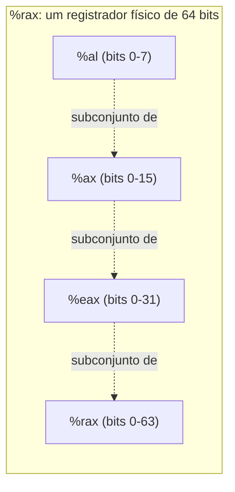

## Objetivos de Aprendizagem

- Nomear os 16 registradores de uso geral do x86-64 e explicar como um único registrador físico pode ser endereçado nas larguras de 64, 32, 16 ou 8 bits (por exemplo, `%rax`/`%eax`/`%ax`/`%al`).
- Ler e escrever instruções `mov` simples na sintaxe AT&T, identificando corretamente os operandos de origem e de destino e os prefixos `%`/`$`.
- Explicar o que significam os sufixos de tamanho (`b`, `w`, `l`, `q`) num mnemônico de instrução e por que às vezes são necessários para tirar a ambiguidade de uma operação.
- Distinguir a extensão de zeros no estilo `movzbl`/`movzwl` de um `mov` comum de mesmo tamanho e explicar por que mover um valor menor para um registrador maior exige uma instrução explícita.
- Ligar o banco de registradores descrito aqui ao banco de registradores de hardware já visto em `digital-logic-computer-organization`, identificando qual conceito é o circuito e qual é sua instância real e nomeada.

## Contexto e Motivação

`digital-logic-computer-organization/from-flip-flops-to-a-register-file` construiu um banco de registradores como circuito de hardware: um conjunto pequeno e rápido de armazenamento endereçável individualmente, cada registrador largo o bastante para guardar uma palavra, selecionado por um decodificador. Aquela disciplina usou uma ISA abstrata e didática, no estilo RISC-V, para manter o datapath subjacente construível dentro de um único curso. Este conceito continua exatamente de onde aquela parou, mas para uma ISA real e física em uso diário: x86-64, o conjunto de instruções de quase todo processador de desktop, notebook e servidor para o qual um programa C desta disciplina de fato é compilado e no qual roda.

Aprender os nomes reais dos registradores e a instrução real de movimentação de dados não é um desvio do material anterior, mais abstrato: é o retorno direto e concreto dele. Todo fato que este conceito enuncia (16 registradores, larguras de sub-registradores, `mov` e suas variantes) é um fato sobre *exatamente o mesmo tipo de circuito* que `from-flip-flops-to-a-register-file` já explicou estruturalmente, agora com nomes reais e uma sintaxe de assembly real, para que o resto desta disciplina (aritmética, controle de fluxo, a convenção de chamada) tenha algo concreto sobre o que operar.

Este conceito, e os três que vêm depois dele no bloco "Assembly x86-64", usam a **sintaxe AT&T** (operando de origem primeiro, destino depois, registradores com o prefixo `%`, imediatos com `$`) porque é a sintaxe que as duas fontes principais desta disciplina usam: as listagens de assembly do CS:APP e o guia de x86-64 do CS107 de Stanford (que documenta explicitamente exatamente esta tabela de registradores e esta sintaxe) são ambos escritos em sintaxe AT&T, e o GCC no Linux a emite por padrão quando se pede a saída em assembly. A sintaxe Intel existe e é usada em outros lugares (ferramentas do Windows, a própria documentação da Intel), mas esta disciplina segue suas fontes de forma consistente, em vez de trocar de convenção no meio do caminho.

## Teoria Central

### 16 registradores de uso geral, cada um endereçável em quatro larguras

O x86-64 oferece 16 registradores de uso geral, cada um com 64 bits completos, mas cada um também expõe sub-porções menores e nomeadas: os 32, 16 ou 8 bits mais baixos *do mesmo armazenamento físico*, e não um registrador separado:

```text
64 bits   32 bits   16 bits   8 bits
%rax      %eax      %ax       %al
%rbx      %ebx      %bx       %bl
%rcx      %ecx      %cx       %cl
%rdx      %edx      %dx       %dl
%rsi      %esi      %si       %sil
%rdi      %edi      %di       %dil
%rsp      %esp      %sp       %spl    (stack pointer: papel especial)
%rbp      %ebp      %bp       %bpl    (frame pointer: papel especial)
%r8       %r8d      %r8w      %r8b
...       ...       ...       ...
%r15      %r15d     %r15w     %r15b
```

Escrever num sub-registrador de 32 bits (por exemplo, `%eax`) no x86-64 tem uma peculiaridade real e específica que vale conhecer: isso sempre zera os 32 bits superiores do registrador completo de 64 bits, enquanto escrever nas sub-porções de 16 ou 8 bits deixa os bits superiores do registrador totalmente intocados. Essa assimetria é uma propriedade real da ISA, e não uma inconsistência deste material.

### `mov`: a instrução fundamental de movimentação de dados, na sintaxe AT&T

```text
mov src, dst      ; copia o valor de src para dst
```

A sintaxe AT&T sempre coloca o operando de origem primeiro e o de destino depois, o inverso da sintaxe Intel, e é exatamente por isso que ler assembly de uma fonte desconhecida sem antes confirmar sua convenção de sintaxe é um erro real e fácil de cometer:

```text
movq %rax, %rbx      ; copia o valor completo de 64 bits de %rax para %rbx
movl %eax, %ebx      ; copia o valor de 32 bits de %eax para %ebx
movq $5, %rax          ; copia o valor imediato 5 para %rax
movq (%rbx), %rax      ; copia os 8 bytes NO ENDEREÇO guardado em %rbx para %rax
movq %rax, (%rbx)      ; copia o valor de %rax PARA a memória no endereço guardado em %rbx
```

As duas últimas linhas fazem uma distinção que corresponde diretamente a ponteiros e desreferência, já vistos em `pointers-addresses-and-dereferencing`: `%rbx` sozinho é um registrador que guarda um endereço (o valor de um ponteiro); `(%rbx)`, entre parênteses, significa "a memória *naquele* endereço" (uma desreferência). `mov %rax, (%rbx)` é o equivalente em assembly de um comando C como `*p = x;`, e `mov (%rbx), %rax` é o equivalente de `x = *p;`.

### Sufixos de tamanho: `b`, `w`, `l`, `q`

Como o mesmo mnemônico (`mov`) pode operar sobre dados de larguras diferentes, a sintaxe AT&T acrescenta um sufixo que nomeia explicitamente o tamanho da operação:

```text
b: byte       (1 byte,  8 bits)
w: word       (2 bytes, 16 bits)
l: long       (4 bytes, 32 bits)
q: quad word  (8 bytes, 64 bits)
```

`movb`, `movw`, `movl` e `movq` são a mesma operação subjacente (copiar um valor), diferindo só em quantos bytes movem. Na prática, o sufixo muitas vezes pode ser inferido pelos registradores envolvidos (`movq %rax, %rbx` é sem ambiguidade uma movimentação de 64 bits, já que `%rax` e `%rbx` são sempre nomes de 64 bits) e pode ser omitido em alguns montadores quando os nomes dos registradores já tiram a ambiguidade do tamanho, mas ele se torna essencial sempre que os operandos de uma instrução não determinam o tamanho sozinhos, como ao mover um valor imediato para um local de memória.

### Extensão de zeros: movendo um valor menor para um registrador maior

Copiar um valor menor para um destino maior precisa decidir o que acontece com os bits extras, de ordem mais alta, que a origem não forneceu, e um `mov` comum entre tamanhos diferentes não é válido, então uma instrução dedicada trata disso explicitamente:

```text
movzbl %al, %eax     ; move com extensão de zeros: byte (%al) para long (%eax), preenche com zero os 24 bits de cima
movzwl %ax, %eax      ; move com extensão de zeros: word (%ax) para long (%eax), preenche com zero os 16 bits de cima
```

`movz` (extensão de zeros) preenche com 0 todo bit acima da largura original da origem, o adequado para valores sabidamente sem sinal. Existe uma família paralela, `movs` (extensão de sinal), para valores com sinal, que preenche os bits extras com cópias do bit de sinal da origem, para que um valor com sinal negativo continue negativo na largura maior. É exatamente a mesma ideia de extensão de sinal em complemento de dois que `digital-logic-computer-organization/unsigned-and-twos-complement-integers` já cobriu aritmeticamente, agora aparecendo como uma instrução de assembly concreta.



## Exemplos Resolvidos

### Exemplo 1: lendo uma curta sequência de instruções

```text
movq $10, %rax     ; %rax = 10
movq $20, %rbx     ; %rbx = 20
movq %rbx, %rax    ; %rax = o valor de %rbx = 20 (sobrescreve o 10 anterior)
```

Lendo na ordem AT&T (origem, depois destino): a primeira instrução coloca o imediato 10 em `%rax`; a segunda coloca 20 em `%rbx`; a terceira copia o valor atual de `%rbx` (20) para `%rax`, sobrescrevendo o 10 que estava lá. Depois dessas três instruções, tanto `%rax` quanto `%rbx` guardam 20.

### Exemplo 2: distinguindo o valor de um registrador de uma desreferência de memória

```c
int x = 5;
int *p = &x;
int y = *p;
```

```text
; supondo que x já tenha seu valor 5 guardado em algum endereço,
; e que %rax guarde o endereço de x (ou seja, %rax faz o papel de p):

movl (%rax), %ecx   ; %ecx = o int guardado NO endereço em %rax  (isto é y = *p)
```

`%rax` aqui faz o papel do ponteiro `p`: ele guarda o endereço de `x`, e não o valor de `x`. `(%rax)` é a desreferência: "vá ao endereço em `%rax` e leia o `int` de 4 bytes guardado lá". Essa única instrução é a realização em assembly de `y = *p;`, ligando o vocabulário de endereço/desreferência de `pointers-addresses-and-dereferencing` diretamente a uma instrução real.

### Exemplo 3: a peculiaridade da extensão de zeros, tornada concreta

```text
movl $-1, %eax      ; %eax = 0xFFFFFFFF (representação de -1 em 32 bits), e isso
                      ; TAMBÉM zera automaticamente os 32 bits de cima de %rax
movq %rax, %rbx      ; %rbx agora guarda 0x00000000FFFFFFFF, e NÃO o -1 de 64 bits
```

Como escrever no `%eax` de 32 bits sempre zera os 32 bits de cima do `%rax` completo, o valor copiado para `%rbx` na segunda instrução é `0x00000000FFFFFFFF`, o número sem sinal de 64 bits de cerca de 4.3 bilhões, e não a representação em complemento de dois de 64 bits de -1 (que seria `0xFFFFFFFFFFFFFFFF`). Estender corretamente o sinal de -1 para um registrador completo de 64 bits exige uma instrução explícita de extensão de sinal (`movslq`, que move um long com sinal para uma quad word), e não um `movl` comum seguido de tratar o resultado como 64 bits: um detalhe real e fácil de deixar passar que essa peculiaridade causa na prática.

## Equívocos Comuns e Armadilhas

- **"`%rax` e `%eax` são dois registradores diferentes."** São o mesmo registrador físico de 64 bits; `%eax` simplesmente nomeia seus 32 bits mais baixos. Escrever em `%eax` escreve exatamente no mesmo armazenamento a que `%rax` se refere (e, conforme a peculiaridade do Exemplo 3, zera sua metade de cima).
- **"As sintaxes AT&T e Intel só usam pontuação diferente para a mesma ordem de operandos."** A *própria ordem* dos operandos difere (AT&T é origem e depois destino, Intel é destino e depois origem), e não só os prefixos `%`/`$`. Ler a instrução de uma sintaxe como se fosse da outra inverte silenciosamente qual operando está sendo escrito.
- **"Qualquer `mov` entre operandos de tamanhos diferentes funciona, e a máquina resolve o resto."** Não funciona: mover um valor menor para um destino maior exige uma instrução de extensão explícita (`movz...` ou `movs...`), especificando exatamente como os bits extras devem ser preenchidos (zeros, ou cópias do bit de sinal). Um `mov` comum entre tamanhos diferentes nem é uma instrução válida.
- **"`(%rax)` e `%rax` significam a mesma coisa numa instrução."** `%rax` se refere ao próprio valor do registrador (um endereço, em contextos de ponteiro); `(%rax)` significa a memória *naquele* endereço: exatamente a distinção entre registrador e desreferência que separa o valor de um ponteiro do seu alvo, vista em `pointers-addresses-and-dereferencing`.

## Resumo

O x86-64 oferece 16 registradores de uso geral de 64 bits, cada um também endereçável nas larguras de 32, 16 e 8 bits, que nomeiam sub-porções do mesmo armazenamento físico: a instância real e concreta do banco de registradores já construído como circuito de hardware em `digital-logic-computer-organization`. `mov`, na sintaxe AT&T (origem primeiro, destino depois, `%` para registradores, `$` para imediatos, parênteses para uma desreferência de memória), é a instrução fundamental de movimentação de dados, com a ambiguidade desfeita por sufixos de tamanho (`b`/`w`/`l`/`q`) sempre que a largura da operação não estiver clara pelos operandos, e acompanhada de instruções explícitas de extensão de zeros ou de sinal sempre que um valor menor precisar ser movido para um destino mais largo. Todo conceito restante de x86-64 desta disciplina (aritmética, códigos de condição, a convenção de chamada) se constrói diretamente sobre esse vocabulário de registradores e esse mesmo mecanismo de `mov`.

## Documentation Links

- [Stanford CS107: Guide to x86-64](https://web.stanford.edu/class/cs107/guide/x86-64.html): referência que esta disciplina segue para os nomes dos registradores, as larguras dos sub-registradores e as convenções da sintaxe AT&T.
- [Bryant & O'Hallaron: Computer Systems: A Programmer's Perspective (CS:APP)](https://csapp.cs.cmu.edu/): livro-texto cujas listagens de assembly x86-64, escritas em sintaxe AT&T, os exemplos desta disciplina seguem.
