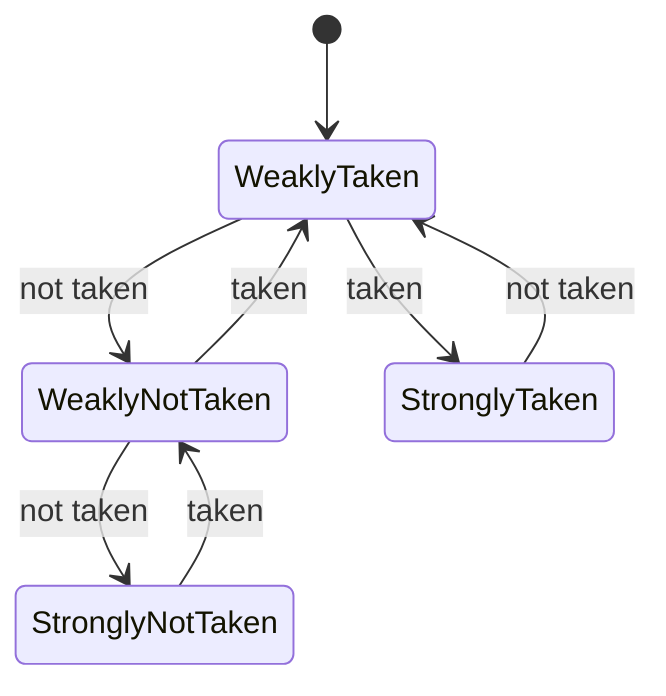

## Learning Objectives

- Distinguish static branch prediction (fixed at compile time or by simple convention) from dynamic branch prediction (adapts at runtime based on history).
- Explain the 1-bit predictor, and the specific failure mode (the "loop edge" problem) that motivates the 2-bit saturating counter.
- Trace a 2-bit saturating counter's state transitions across a sequence of taken/not-taken outcomes.
- Explain what a branch history table stores and how it's indexed.
- Compute the effective CPI improvement from a given prediction accuracy, connecting back to the penalty analysis in the previous concept.

## Context & Motivation

The previous concept established the shape of the tradeoff: predicting a branch's direction and flushing on a misprediction can turn a guaranteed per-branch penalty into an occasional one, but only if the predictions are actually good. This concept is about *how* a real processor decides which way to guess — and it turns out that even a very simple piece of hardware, remembering only a couple of bits per branch, predicts real program branches correctly the overwhelming majority of the time, because real branches are not random: loop-closing branches are taken far more often than not, and many `if` conditions correlate strongly with recent history at the same code location.

ACM/IEEE CS2013's Architecture and Organization Knowledge Area names "branch prediction" directly as a required learning outcome under Performance Enhancements — a curriculum-level confirmation that this is core content, not an optional deep cut, precisely because of how much CPI it can recover once real branch behavior is exploited rather than guessed blindly.

## Core Theory

### Static prediction: a fixed guess, made once

The simplest possible prediction strategy requires no runtime state at all: always guess "not taken" (keep fetching sequentially), or always guess "taken." A slightly better static strategy, easy for a compiler or assembler to apply without any hardware history at all, is **backward-taken, forward-not-taken (BTFNT)**: predict a branch as taken if its target address is *behind* the branch (the classic shape of a loop backedge, which is taken on every iteration but the last) and not-taken if the target is *ahead* (the classic shape of a forward `if` skip, which is often not taken). Static prediction costs no extra hardware state per branch, but it can never adapt if a specific branch's actual behavior doesn't match the general pattern it assumes.

### Dynamic prediction: a 1-bit predictor, and why it has a specific weakness

A dynamic predictor remembers, per branch, what that branch actually did most recently, and predicts it will do the same thing again. The simplest version is a single bit per branch: 1 means "predict taken," 0 means "predict not-taken," updated after every actual outcome to match what just happened.

This 1-bit scheme has a specific, well-known failure mode at loop boundaries. Consider a loop that iterates 10 times: the branch is taken on iterations 1 through 9, then not-taken on the 10th (loop exit), and then — if the loop is entered again later — taken again on the very first iteration of the next pass. A 1-bit predictor correctly predicts "taken" for iterations 2 through 9 (each one matches the previous outcome), but **mispredicts twice** every time the loop is entered or exited: once on the final iteration (predicts taken, based on iteration 9, but the branch is actually not-taken) and once again on the very next entry into the loop (predicts not-taken, based on the exit, but the branch is now taken again).

### The 2-bit saturating counter: tolerating one exception

A **2-bit saturating counter** fixes exactly this weakness by requiring *two* consecutive wrong outcomes before it changes its prediction, rather than flipping on the very first one. The counter has four states, arranged so that only the two extreme states change the actual prediction:

```text
00 (Strongly Not-Taken) → predict NOT TAKEN
01 (Weakly Not-Taken)   → predict NOT TAKEN
10 (Weakly Taken)       → predict TAKEN
11 (Strongly Taken)     → predict TAKEN
```

On a taken outcome, the counter increments (saturating at 11); on a not-taken outcome, it decrements (saturating at 00).



Returning to the same 10-iteration loop: the counter reaches "Strongly Taken" (11) well before the loop's final iteration, so the single not-taken outcome on iteration 10 only demotes it to "Weakly Taken" (10) — which still *predicts* taken, correctly, for the next loop entry's first iteration, and only genuinely mispredicts on the one truly anomalous exit itself. A single exception to an otherwise-consistent pattern costs one misprediction with a 2-bit counter, instead of the two the 1-bit scheme pays on every single loop pass.

### The branch history table

A real predictor cannot store one counter per branch address in an unbounded table — real programs have far too many distinct branch instructions for that to be practical. Instead, a **branch history table (BHT)**, a fixed-size array of 2-bit counters, is indexed by some fast-to-compute function of the branch's own address (commonly, the low-order bits of the PC). Two genuinely different branches can, by coincidence, map to the same table entry (aliasing), causing their history to interfere with each other, a real, accepted tradeoff for keeping the table small and fast to look up on every single fetch.

## Worked Examples

### Example 1: Tracing the 2-bit counter through a 10-iteration loop, twice

Starting in state 10 (Weakly Taken), and given the outcome sequence T,T,T,T,T,T,T,T,T,N (9 taken, then the exit), T,T,... (re-entering):

```text
Outcome:  T   T   T   T   T   T   T   T   T   N   T   T ...
State:    11  11  11  11  11  11  11  11  11  10  11  11 ...
Predict:  T   T   T   T   T   T   T   T   T   T   T   T ...
Correct?  -   Y   Y   Y   Y   Y   Y   Y   Y   N   Y   Y ...
```

Only the single exit iteration (predicted T, actual N) is a misprediction — the very next loop entry is correctly predicted taken again, because the counter only dropped to "Weakly Taken" (10), not all the way to a not-taken-predicting state. Exactly one misprediction per full loop pass, versus the 1-bit scheme's two.

### Example 2: A 1-bit predictor on the same sequence

```text
Outcome:  T   T   T   T   T   T   T   T   T   N   T   T ...
State:    1   1   1   1   1   1   1   1   1   0   1   1 ...
Predict:  T   T   T   T   T   T   T   T   T   T   N   T ...
Correct?  -   Y   Y   Y   Y   Y   Y   Y   Y   N   N   Y ...
```

The 1-bit predictor mispredicts on the exit (same as the 2-bit version) *and* on the very next re-entry (predicting not-taken, based on the exit, when the branch is actually taken again) — two mispredictions per loop pass instead of one, confirming the specific advantage the extra bit buys.

### Example 3: Effective CPI with a realistic 2-bit-counter accuracy

Real 2-bit saturating-counter predictors, on typical real programs, commonly achieve somewhere around 90-95% accuracy. Using the same setup as the previous concept's Example 2 (15% of instructions are branches, 2-cycle flush penalty per misprediction), but now with 92% accuracy (8% mispredicted):

```text
Extra cycles per instruction, on average = 0.15 × (0.08 × 2) = 0.15 × 0.16 = 0.024
Effective CPI = 1 + 0.024 = 1.024
```

Compare this to the previous concept's Example 2 (80% accuracy, effective CPI 1.06) and Example 1 (naive always-stall, effective CPI 1.30): a realistic 2-bit predictor's accuracy pushes the branch-related CPI cost down to barely above the ideal CPI of 1 — a direct, quantitative payoff from a genuinely small amount of extra hardware (2 bits × however many table entries) per branch.

## Common Misconceptions & Pitfalls

- **"A 2-bit counter is twice as accurate as a 1-bit predictor in general."** Its advantage is specific and structural — tolerating a single anomalous outcome without flipping the prediction — which matters enormously for loop-edge patterns (Examples 1 and 2) but provides no benefit at all for a genuinely unpredictable, coin-flip branch, where both schemes converge to roughly 50% accuracy.
- **"The branch history table stores one entry per unique branch instruction, guaranteed."** It's indexed by a hash of the branch's address into a fixed-size table, so distinct branches can alias to the same entry and interfere with each other's history — a real, accepted engineering tradeoff, not a flaw unique to a poor implementation.
- **"Static prediction is obsolete now that dynamic prediction exists."** Static schemes like backward-taken/forward-not-taken still see use as a sensible default the very first time a branch is ever encountered (before any dynamic history exists for it), and remain relevant in simpler or more predictable embedded designs where the extra hardware for dynamic prediction isn't justified.
- **"Higher prediction accuracy always means proportionally higher performance."** Example 3's numbers show the relationship is real but not one-to-one — going from 80% to 92% accuracy (a 12-point accuracy gain) drops the effective CPI from 1.06 to 1.024, a smaller absolute CPI change than the accuracy gain alone might suggest, because the accuracy improvement is scaled by both the branch frequency and the fixed per-misprediction penalty.

## Summary

Static prediction (a fixed guess, like backward-taken/forward-not-taken) costs no hardware state but cannot adapt; dynamic prediction remembers each branch's own recent behavior, most simply with a single bit, but a 1-bit scheme mispredicts twice at every loop entry/exit boundary because it flips its guess on the very first anomalous outcome. A 2-bit saturating counter fixes this by requiring two consecutive wrong outcomes before changing its prediction, cutting the loop-boundary misprediction cost in half, and — stored in a fixed-size branch history table indexed by branch address — is the standard building block of real dynamic branch predictors, closing most of the gap this cluster's Iron Law analysis identified between a naive always-stall policy and the ideal, hazard-free CPI. The next concept, Speculative and Out-of-Order Execution, extends this same "predict now, correct later if wrong" philosophy from just the branch direction to entire streams of instructions executed ahead of a not-yet-fully-confirmed control decision.

## Documentation Links

- [ACM/IEEE CS2013 — Architecture and Organization Knowledge Area](https://csed.acm.org/knowledge-areas-architecture-and-organization-ar-cs2013-version/) — names branch prediction as a required Performance Enhancements learning outcome.
- [Berkeley CS61C — Great Ideas in Computer Architecture](https://cs61c.org/fa26/) — covers dynamic branch prediction and saturating counters as part of its pipelining and performance unit.
