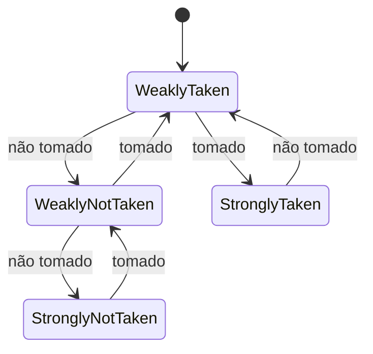

## Objetivos de Aprendizagem

- Distinguir a previsão estática de desvios (fixada em tempo de compilação ou por convenção simples) da previsão dinâmica de desvios (que se adapta em tempo de execução com base no histórico).
- Explicar o preditor de 1 bit e o modo de falha específico (o problema da "borda do laço") que motiva o contador saturante de 2 bits.
- Rastrear as transições de estado de um contador saturante de 2 bits ao longo de uma sequência de resultados tomado/não tomado.
- Explicar o que uma tabela de histórico de desvios guarda e como ela é indexada.
- Calcular a melhora efetiva do CPI a partir de uma dada precisão de previsão, retomando a análise de penalidades do conceito anterior.

## Contexto e Motivação

O conceito anterior estabeleceu a forma da troca: prever a direção de um desvio e descartar (flush) em caso de erro de previsão pode transformar uma penalidade garantida por desvio numa penalidade ocasional, mas só se as previsões forem de fato boas. Este conceito trata de *como* um processador real decide para que lado apostar, e acontece que até um hardware muito simples, lembrando só um par de bits por desvio, prevê corretamente desvios de programas reais na esmagadora maioria das vezes, porque desvios reais não são aleatórios: os desvios que fecham laços são tomados muito mais vezes do que não, e muitas condições de `if` se correlacionam fortemente com o histórico recente no mesmo ponto do código.

A área de conhecimento Architecture and Organization do ACM/IEEE CS2013 nomeia a "previsão de desvios" diretamente como resultado de aprendizagem obrigatório em Performance Enhancements: uma confirmação, no nível curricular, de que este é conteúdo central, e não um aprofundamento opcional, justamente pelo quanto de CPI ela consegue recuperar quando o comportamento real dos desvios é explorado, em vez de adivinhado às cegas.

## Teoria Central

### Previsão estática: um palpite fixo, feito uma vez

A estratégia de previsão mais simples possível não exige nenhum estado em tempo de execução: sempre apostar "não tomado" (continuar buscando em sequência), ou sempre apostar "tomado". Uma estratégia estática um pouco melhor, fácil para um compilador ou montador aplicar sem nenhum histórico em hardware, é **tomado para trás, não tomado para a frente (BTFNT)**: prever um desvio como tomado se seu endereço de destino estiver *atrás* do desvio (a forma clássica do desvio de volta de um laço, tomado em toda iteração menos a última) e como não tomado se o destino estiver *à frente* (a forma clássica de um `if` que pula código para a frente, muitas vezes não tomado). A previsão estática não custa nenhum estado extra de hardware por desvio, mas nunca consegue se adaptar se o comportamento real de um desvio específico não corresponder ao padrão geral que ela supõe.

### Previsão dinâmica: um preditor de 1 bit, e por que ele tem uma fraqueza específica

Um preditor dinâmico lembra, por desvio, o que esse desvio de fato fez mais recentemente e prevê que ele vai fazer a mesma coisa de novo. A versão mais simples é um único bit por desvio: 1 significa "prever tomado", 0 significa "prever não tomado", atualizado depois de cada resultado real para corresponder ao que acabou de acontecer.

Esse esquema de 1 bit tem um modo de falha específico e bem conhecido nas fronteiras de laço. Considere um laço que itera 10 vezes: o desvio é tomado nas iterações 1 a 9 e não tomado na 10ª (saída do laço) e então, se o laço for reiniciado mais tarde, tomado de novo na primeiríssima iteração da próxima passada. Um preditor de 1 bit prevê corretamente "tomado" nas iterações 2 a 9 (cada uma corresponde ao resultado anterior), mas **erra duas vezes** toda vez que o laço é iniciado ou encerrado: uma vez na iteração final (prevê tomado, com base na iteração 9, mas o desvio de fato não é tomado) e de novo na próxima entrada no laço (prevê não tomado, com base na saída, mas agora o desvio é tomado de novo).

### O contador saturante de 2 bits: tolerando uma exceção

Um **contador saturante de 2 bits** corrige exatamente essa fraqueza exigindo *dois* resultados errados consecutivos antes de mudar sua previsão, em vez de virar logo no primeiro. O contador tem quatro estados, dispostos de modo que só os dois estados extremos mudam a previsão de fato:

```text
00 (Fortemente Não Tomado) → prevê NÃO TOMADO
01 (Fracamente Não Tomado) → prevê NÃO TOMADO
10 (Fracamente Tomado)     → prevê TOMADO
11 (Fortemente Tomado)     → prevê TOMADO
```

Num resultado tomado, o contador é incrementado (saturando em 11); num resultado não tomado, é decrementado (saturando em 00).



Voltando ao mesmo laço de 10 iterações: o contador chega a "Fortemente Tomado" (11) bem antes da iteração final do laço, então o único resultado não tomado na iteração 10 só o rebaixa para "Fracamente Tomado" (10), que ainda *prevê* tomado, corretamente, para a primeira iteração da próxima entrada no laço, e só erra de verdade na única saída genuinamente anômala. Uma única exceção a um padrão de resto consistente custa um erro de previsão com um contador de 2 bits, em vez dos dois que o esquema de 1 bit paga em toda passada do laço.

### A tabela de histórico de desvios

Um preditor real não pode guardar um contador por endereço de desvio numa tabela ilimitada: programas reais têm instruções de desvio distintas demais para isso ser prático. Em vez disso, uma **tabela de histórico de desvios (BHT, branch history table)**, um array de tamanho fixo de contadores de 2 bits, é indexada por alguma função rápida de calcular do próprio endereço do desvio (comumente, os bits de ordem baixa do PC). Dois desvios genuinamente diferentes podem, por coincidência, cair na mesma entrada da tabela (aliasing), fazendo seus históricos interferirem um no outro, uma troca real e aceita para manter a tabela pequena e rápida de consultar a cada busca.

## Exemplos Resolvidos

### Exemplo 1: rastreando o contador de 2 bits num laço de 10 iterações, duas vezes

Começando no estado 10 (Fracamente Tomado), e dada a sequência de resultados T,T,T,T,T,T,T,T,T,N (9 tomados, depois a saída), T,T,... (reentrando):

```text
Resultado: T   T   T   T   T   T   T   T   T   N   T   T ...
Estado:    11  11  11  11  11  11  11  11  11  10  11  11 ...
Previsão:  T   T   T   T   T   T   T   T   T   T   T   T ...
Correto?   -   S   S   S   S   S   S   S   S   N   S   S ...
```

Só a única iteração de saída (previsto T, real N) é um erro de previsão: a próxima entrada no laço é corretamente prevista como tomada de novo, porque o contador só caiu para "Fracamente Tomado" (10), e não até um estado que prevê não tomado. Exatamente um erro de previsão por passada completa do laço, contra os dois do esquema de 1 bit.

### Exemplo 2: um preditor de 1 bit na mesma sequência

```text
Resultado: T   T   T   T   T   T   T   T   T   N   T   T ...
Estado:    1   1   1   1   1   1   1   1   1   0   1   1 ...
Previsão:  T   T   T   T   T   T   T   T   T   T   N   T ...
Correto?   -   S   S   S   S   S   S   S   S   N   N   S ...
```

O preditor de 1 bit erra na saída (como a versão de 2 bits) *e* na reentrada logo em seguida (prevendo não tomado, com base na saída, quando o desvio é de fato tomado de novo): dois erros de previsão por passada do laço em vez de um, confirmando a vantagem específica que o bit extra compra.

### Exemplo 3: CPI efetivo com uma precisão realista de contador de 2 bits

Preditores reais com contadores saturantes de 2 bits, em programas reais típicos, costumam atingir algo em torno de 90-95% de precisão. Usando a mesma configuração do Exemplo 2 do conceito anterior (15% das instruções são desvios, penalidade de flush de 2 ciclos por erro de previsão), mas agora com 92% de precisão (8% de erros):

```text
Ciclos extras por instrução, em média = 0.15 × (0.08 × 2) = 0.15 × 0.16 = 0.024
CPI efetivo = 1 + 0.024 = 1.024
```

Compare com o Exemplo 2 do conceito anterior (80% de precisão, CPI efetivo de 1.06) e com o Exemplo 1 (sempre parar, de forma ingênua, CPI efetivo de 1.30): a precisão de um preditor realista de 2 bits leva o custo de CPI relacionado a desvios para logo acima do CPI ideal de 1. É um retorno direto e quantitativo de uma quantidade genuinamente pequena de hardware extra (2 bits × quantas entradas a tabela tiver) por desvio.

## Equívocos Comuns e Armadilhas

- **"Um contador de 2 bits é, em geral, duas vezes mais preciso que um preditor de 1 bit."** Sua vantagem é específica e estrutural (tolerar um único resultado anômalo sem virar a previsão), o que importa muitíssimo para padrões de borda de laço (Exemplos 1 e 2), mas não traz benefício algum para um desvio genuinamente imprevisível, tipo cara ou coroa, em que os dois esquemas convergem para cerca de 50% de precisão.
- **"A tabela de histórico de desvios guarda garantidamente uma entrada por instrução de desvio única."** Ela é indexada por um hash do endereço do desvio numa tabela de tamanho fixo, então desvios distintos podem cair na mesma entrada e interferir no histórico um do outro: uma troca de engenharia real e aceita, e não uma falha exclusiva de uma implementação ruim.
- **"A previsão estática ficou obsoleta agora que existe a previsão dinâmica."** Esquemas estáticos como tomado para trás/não tomado para a frente ainda são usados como padrão sensato na primeiríssima vez que um desvio é encontrado (antes que exista qualquer histórico dinâmico para ele) e continuam relevantes em projetos embarcados mais simples ou mais previsíveis, em que o hardware extra da previsão dinâmica não se justifica.
- **"Uma precisão de previsão maior sempre significa desempenho proporcionalmente maior."** Os números do Exemplo 3 mostram que a relação é real, mas não um para um: ir de 80% para 92% de precisão (um ganho de 12 pontos) derruba o CPI efetivo de 1.06 para 1.024, uma mudança absoluta de CPI menor do que o ganho de precisão sozinho poderia sugerir, porque a melhora de precisão é escalada tanto pela frequência dos desvios quanto pela penalidade fixa por erro de previsão.

## Resumo

A previsão estática (um palpite fixo, como tomado para trás/não tomado para a frente) não custa estado de hardware, mas não consegue se adaptar; a previsão dinâmica lembra o comportamento recente de cada desvio, no caso mais simples com um único bit, mas um esquema de 1 bit erra duas vezes em toda fronteira de entrada/saída de laço porque vira o palpite logo no primeiro resultado anômalo. Um contador saturante de 2 bits corrige isso exigindo dois resultados errados consecutivos antes de mudar a previsão, cortando pela metade o custo de erro de previsão na fronteira do laço, e, guardado numa tabela de histórico de desvios de tamanho fixo indexada pelo endereço do desvio, é o bloco de construção padrão dos preditores dinâmicos reais, fechando a maior parte da distância que a análise da Lei de Ferro deste bloco identificou entre uma política ingênua de sempre parar e o CPI ideal, sem hazards. O próximo conceito, Execução Especulativa e Fora de Ordem, estende essa mesma filosofia de "prever agora, corrigir depois se errar" da direção do desvio para fluxos inteiros de instruções executadas à frente de uma decisão de controle ainda não totalmente confirmada.

## Documentation Links

- [ACM/IEEE CS2013: Architecture and Organization Knowledge Area](https://csed.acm.org/knowledge-areas-architecture-and-organization-ar-cs2013-version/): nomeia a previsão de desvios como resultado de aprendizagem obrigatório de Performance Enhancements.
- [Berkeley CS61C: Great Ideas in Computer Architecture](https://cs61c.org/fa26/): cobre a previsão dinâmica de desvios e contadores saturantes como parte da sua unidade de pipelining e desempenho.
