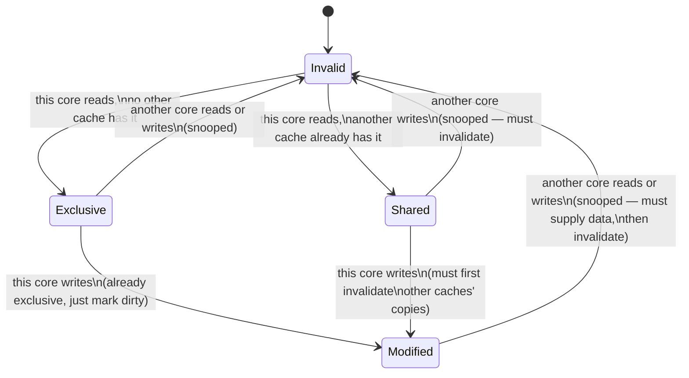

## Learning Objectives

- State the cache coherence problem precisely: what guarantee must hold across multiple private caches sharing memory.
- Name and define MESI's four per-line states: Modified, Exclusive, Shared, Invalid.
- Explain what a "snoop" is, and why every cache must watch every other cache's bus traffic for this protocol to work.
- Trace a concrete sequence of reads and writes across two cores' caches, showing each line's MESI state transition at every step.
- Connect MESI's Modified/dirty state directly back to the single-cache dirty bit from Write Policies, and explain what MESI adds beyond it.

## Context & Motivation

The previous concept ended by naming the problem precisely: multiple cores' private caches can each hold their own copy of the same memory address, and nothing in that layout, on its own, keeps those copies consistent once one core writes to its copy. This concept states that problem formally as the **cache coherence problem**, and develops the real, standard solution — MESI, named for its four possible states — that essentially every real shared-memory multicore processor implements in some close variant.

CMU 15-418's cache coherence lectures, and the broader parallel-computer-architecture literature they draw from, treat MESI as the canonical teaching protocol for exactly this reason: it is simple enough to trace completely by hand, as this concept does, while being genuinely representative of what real hardware actually implements.

## Core Theory

### The coherence problem, stated precisely

A coherent multi-cache system must guarantee: any read of a given memory location, by any core, returns the value of the most recent write to that location, by any core — and all cores agree on the relative order of writes to the same location. Without such a guarantee, two cores could legitimately disagree, at the same moment, about the current value of the same address — not a performance problem, but a correctness one, capable of silently producing wrong program results.

### Snooping: every cache watches every other cache's traffic

MESI is a **snooping** protocol: every core's cache controller watches (snoops on) a shared bus that every other core's cache uses to announce certain actions — in particular, when a core is about to read or write a line it doesn't currently have permission for. Every cache, on seeing such an announcement for a line it happens to also hold, reacts by changing its own copy's state accordingly, without needing to be explicitly told to do so by the requesting core — coherence emerges from every cache reacting consistently to the same broadcast traffic, not from any centralized coordinator.

### The four MESI states, per cache line

Each cache line, in each individual core's cache, is tagged with exactly one of four states at any moment:

- **Modified (M)**: this cache has the *only* copy, and it has been written to — it differs from main memory (this is exactly the single-cache dirty bit from Write Policies, generalized: "dirty," but now also implying "and no other cache has a copy at all").
- **Exclusive (E)**: this cache has the *only* copy, and it matches main memory exactly (clean) — no other cache holds it, but this cache hasn't written to it yet either.
- **Shared (S)**: this cache has a copy, and matches main memory — but one or more *other* caches may also hold this same, consistent copy.
- **Invalid (I)**: this cache either never had this line, or had it but it's no longer valid (some other core's write has since made this copy stale) — must be re-fetched before use.



### Why the Exclusive/Shared distinction exists at all

A line held Exclusive can transition directly to Modified on a local write with no bus traffic needed at all — since no other cache has a copy, there's nothing to invalidate. A line held Shared, in contrast, must first broadcast an invalidation to every other cache holding it before the local write can proceed, since those other copies would otherwise become silently stale. This distinction is exactly why MESI improves on a simpler three-state (MSI) protocol that lacks it: a core that reads, and then immediately writes, a line no other core is touching (a very common real pattern) pays for an invalidation broadcast under MSI that MESI's Exclusive state lets it skip entirely.

## Worked Examples

### Example 1: A clean read-then-write sequence on one core, uncontended

Core 0 reads address X (no other core has ever cached it), then writes to X:

```text
Step 1: Core 0 reads X.
        No other cache has X → Core 0's cache brings it in as EXCLUSIVE.
Step 2: Core 0 writes X.
        Already Exclusive (no other cache holds it) → transitions directly
        to MODIFIED, with NO bus broadcast needed — nothing else to invalidate.
```

This is the case the Exclusive state exists specifically to optimize — a private read-modify sequence with zero coherence traffic overhead, exactly as if there were only one core in the system at all.

### Example 2: Two cores reading, then one writing

Core 0 reads X (brings it in Exclusive, as in Example 1). Core 1 then also reads X. Core 0 then writes X.

```text
Step 1: Core 0 reads X → Exclusive (no one else has it).
Step 2: Core 1 reads X → Core 0's copy transitions Exclusive → Shared
        (Core 0 snoops Core 1's read announcement, downgrades its own
        state); Core 1's new copy is also Shared (memory or Core 0
        supplies the data).
Step 3: Core 0 writes X → since Core 0's copy is only Shared (not
        Exclusive), Core 0 must FIRST broadcast an invalidation; Core 1
        snoops this and transitions its own copy Shared → Invalid; only
        THEN does Core 0's copy transition Shared → Modified.
```

If Core 1 later tries to read X again, it will miss (its copy is Invalid) and must re-fetch — at which point Core 0, holding the only valid (Modified) copy, must supply the up-to-date data directly (rather than stale main memory), and both caches typically settle into Shared again.

### Example 3: Distinguishing MESI's Modified state from the single-cache dirty bit

Recall from Write Policies: Write-Through and Write-Back that a single cache's dirty bit meant "this copy differs from memory." MESI's Modified state means that, **plus** something the single-cache dirty bit never had to consider at all: "and this is the *only* cached copy anywhere in the system — no other core's cache holds a version of this line, valid or otherwise."

```text
Single-cache dirty bit: "my copy ≠ memory" (that's the whole guarantee needed)
MESI Modified state:     "my copy ≠ memory, AND every other cache's copy of
                          this line is Invalid (or nonexistent)" — a
                          guarantee that must be actively maintained via
                          snooped invalidation broadcasts, precisely
                          because MULTIPLE caches now exist at all.
```

This is exactly the generalization this cluster's Write Policies concept previewed: the same "which copy is authoritative" bookkeeping, extended from one cache-vs-memory relationship to several caches-vs-each-other-and-memory simultaneously.

## Common Misconceptions & Pitfalls

- **"MESI prevents two cores from ever wanting to write to the same line at the same time."** MESI resolves such conflicts (by serializing the invalidation-then-modify sequence, as in Example 2's Step 3) rather than preventing the *attempt* — two cores can absolutely both try to write the same address; MESI's job is to guarantee the result is coherent (one write clearly happens before the other, from every core's point of view), not to forbid the situation from arising.
- **"A Shared line can be written to directly, since it's already cached."** Example 2's Step 3 shows a write to a Shared line requires first broadcasting an invalidation to every other holder — writing directly without doing so would leave other cores' copies silently stale, exactly the coherence violation this whole protocol exists to prevent.
- **"Exclusive and Modified are basically the same state."** Both guarantee "no other cache has a copy," but Exclusive additionally guarantees the data still matches memory (clean), while Modified means it's been written and differs from memory (dirty) — the distinction matters for what has to happen if the line is evicted (a Modified line must be written back to memory first; an Exclusive line can simply be dropped, since memory already has the correct value).
- **"Coherence and consistency are the same guarantee."** Coherence (this concept) is about a single memory location: every core eventually agrees on its current value and the order of writes to it. Broader memory *consistency* models (how operations on *different* locations by different cores appear ordered to each other) are a related but distinct, harder topic, genuinely outside this concept's scope.

## Summary

The cache coherence problem — keeping several cores' private cached copies of the same address consistent — is solved by MESI, a snooping protocol in which every cache watches every other cache's bus traffic and tags each line Modified (dirty, sole copy), Exclusive (clean, sole copy), Shared (clean, possibly multiple copies), or Invalid (stale or absent), transitioning between these states automatically as reads and writes from any core are observed. The Exclusive state exists specifically to let an uncontended read-then-write sequence skip invalidation broadcasts entirely, while a write to a genuinely Shared line must first invalidate every other holder — the same dirty-copy bookkeeping from this cluster's single-cache Write Policies concept, now generalized across multiple simultaneously caching cores. This protocol, essential as it is for correctness, has a real performance cost of its own — the next concept, False Sharing, shows exactly how that cost can bite even code that never intended to share any data across cores at all.

## Documentation Links

- [CMU 15-418 — Snooping Cache Coherence Lecture](https://www.cs.cmu.edu/afs/cs/academic/class/15418-s12/www/lectures/11_coherence2.pdf) — develops the MESI protocol and its state transitions in the same snooping-bus framework used here.
- [ACM/IEEE CS2013 — Architecture and Organization Knowledge Area](https://csed.acm.org/knowledge-areas-architecture-and-organization-ar-cs2013-version/) — lists multiprocessor cache coherence as a required Architecture and Organization topic.
