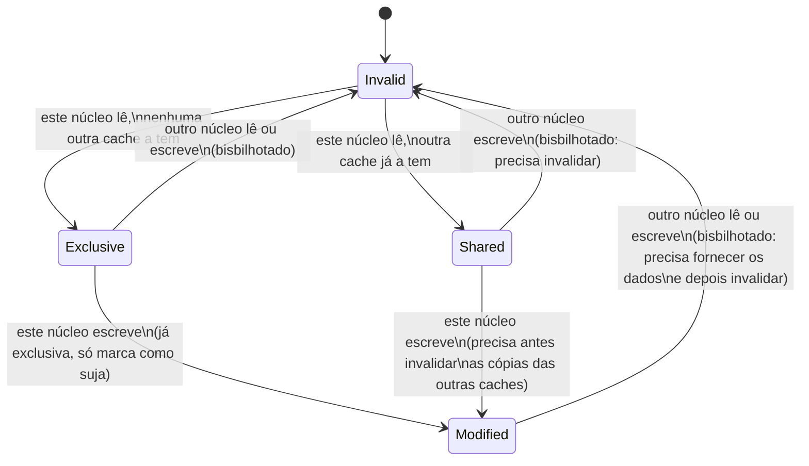

## Objetivos de Aprendizagem

- Enunciar com precisão o problema da coerência de cache: que garantia precisa valer entre várias caches privadas que compartilham a memória.
- Nomear e definir os quatro estados por linha do MESI: Modified, Exclusive, Shared, Invalid.
- Explicar o que é um "snoop" e por que toda cache precisa observar o tráfego de barramento de todas as outras para que este protocolo funcione.
- Rastrear uma sequência concreta de leituras e escritas nas caches de dois núcleos, mostrando a transição de estado MESI de cada linha em cada passo.
- Ligar o estado Modified/sujo do MESI diretamente ao bit de sujeira (dirty bit) de cache única de Políticas de Escrita e explicar o que o MESI acrescenta além dele.

## Contexto e Motivação

O conceito anterior terminou nomeando o problema com precisão: as caches privadas de vários núcleos podem cada uma guardar sua própria cópia do mesmo endereço de memória, e nada nesse layout, por si só, mantém essas cópias consistentes quando um núcleo escreve na sua cópia. Este conceito enuncia esse problema formalmente como o **problema da coerência de cache** e desenvolve a solução real e padrão (o MESI, nomeado pelos seus quatro estados possíveis) que essencialmente todo processador multinúcleo real de memória compartilhada implementa em alguma variante próxima.

As aulas de coerência de cache do CMU 15-418, e a literatura mais ampla de arquitetura de computadores paralelos em que elas se apoiam, tratam o MESI como o protocolo didático canônico exatamente por isso: ele é simples o bastante para ser rastreado por completo à mão, como este conceito faz, e ao mesmo tempo genuinamente representativo do que o hardware real de fato implementa.

## Teoria Central

### O problema da coerência, enunciado com precisão

Um sistema coerente com várias caches precisa garantir: qualquer leitura de um dado local de memória, por qualquer núcleo, retorna o valor da escrita mais recente nesse local, por qualquer núcleo, e todos os núcleos concordam sobre a ordem relativa das escritas no mesmo local. Sem essa garantia, dois núcleos poderiam legitimamente discordar, no mesmo momento, sobre o valor atual do mesmo endereço: não é um problema de desempenho, e sim de correção, capaz de produzir silenciosamente resultados errados num programa.

### Snooping: toda cache observa o tráfego de todas as outras

O MESI é um protocolo de **snooping** (bisbilhotagem): o controlador de cache de cada núcleo observa (bisbilhota) um barramento compartilhado que a cache de todos os outros núcleos usa para anunciar certas ações, em particular quando um núcleo está prestes a ler ou escrever uma linha para a qual ainda não tem permissão. Toda cache, ao ver um anúncio desses para uma linha que por acaso também guarda, reage mudando o estado da sua própria cópia de forma adequada, sem precisar ser explicitamente avisada pelo núcleo que fez o pedido: a coerência surge de toda cache reagir de forma consistente ao mesmo tráfego difundido, e não de algum coordenador centralizado.

### Os quatro estados MESI, por linha de cache

Cada linha de cache, na cache de cada núcleo individual, é marcada com exatamente um de quatro estados a cada momento:

- **Modified (M)**: esta cache tem a *única* cópia, e ela foi escrita; difere da memória principal (é exatamente o bit de sujeira de cache única de Políticas de Escrita, generalizado: "suja", mas agora também implicando "e nenhuma outra cache tem cópia alguma").
- **Exclusive (E)**: esta cache tem a *única* cópia, e ela corresponde exatamente à memória principal (limpa); nenhuma outra cache a guarda, mas esta cache também ainda não escreveu nela.
- **Shared (S)**: esta cache tem uma cópia, que corresponde à memória principal, mas uma ou mais *outras* caches também podem guardar essa mesma cópia consistente.
- **Invalid (I)**: esta cache nunca teve esta linha, ou a teve mas ela não é mais válida (a escrita de outro núcleo tornou esta cópia velha desde então); precisa ser buscada de novo antes do uso.



### Por que a distinção entre Exclusive e Shared sequer existe

Uma linha mantida em Exclusive pode passar diretamente para Modified numa escrita local sem nenhum tráfego de barramento: como nenhuma outra cache tem uma cópia, não há nada a invalidar. Uma linha mantida em Shared, em contraste, precisa primeiro difundir uma invalidação para toda outra cache que a guarda antes de a escrita local poder prosseguir, já que essas outras cópias ficariam, de outro modo, silenciosamente velhas. Essa distinção é exatamente o motivo pelo qual o MESI melhora um protocolo mais simples de três estados (MSI) que não a tem: um núcleo que lê e logo em seguida escreve uma linha que nenhum outro núcleo está tocando (um padrão real muito comum) paga, no MSI, por uma difusão de invalidação que o estado Exclusive do MESI permite pular por completo.

## Exemplos Resolvidos

### Exemplo 1: uma sequência limpa de leitura e escrita num núcleo, sem disputa

O Núcleo 0 lê o endereço X (nenhum outro núcleo jamais o guardou em cache) e depois escreve em X:

```text
Passo 1: O Núcleo 0 lê X.
         Nenhuma outra cache tem X → a cache do Núcleo 0 o traz como EXCLUSIVE.
Passo 2: O Núcleo 0 escreve X.
         Já é Exclusive (nenhuma outra cache o guarda) → passa diretamente
         para MODIFIED, SEM nenhuma difusão no barramento: não há mais nada a invalidar.
```

Este é o caso que o estado Exclusive existe especificamente para otimizar: uma sequência privada de leitura e modificação com zero sobrecarga de tráfego de coerência, exatamente como se houvesse um único núcleo no sistema.

### Exemplo 2: dois núcleos lendo, depois um escrevendo

O Núcleo 0 lê X (trazendo-o como Exclusive, como no Exemplo 1). O Núcleo 1 então também lê X. O Núcleo 0 então escreve X.

```text
Passo 1: O Núcleo 0 lê X → Exclusive (ninguém mais o tem).
Passo 2: O Núcleo 1 lê X → a cópia do Núcleo 0 passa de Exclusive → Shared
         (o Núcleo 0 bisbilhota o anúncio de leitura do Núcleo 1 e rebaixa seu
         próprio estado); a nova cópia do Núcleo 1 também é Shared (a memória ou
         o Núcleo 0 fornece os dados).
Passo 3: O Núcleo 0 escreve X → como a cópia do Núcleo 0 é só Shared (e não
         Exclusive), o Núcleo 0 precisa PRIMEIRO difundir uma invalidação; o Núcleo 1
         bisbilhota isso e passa a própria cópia de Shared → Invalid; só
         ENTÃO a cópia do Núcleo 0 passa de Shared → Modified.
```

Se o Núcleo 1 tentar ler X de novo mais tarde, vai falhar (sua cópia é Invalid) e precisará buscá-lo de novo; nesse momento o Núcleo 0, que guarda a única cópia válida (Modified), precisa fornecer diretamente os dados atualizados (em vez da memória principal, velha), e as duas caches normalmente se acomodam em Shared de novo.

### Exemplo 3: distinguindo o estado Modified do MESI do bit de sujeira de cache única

Lembre de Políticas de Escrita: Write-Through e Write-Back que o bit de sujeira de uma única cache significava "esta cópia difere da memória". O estado Modified do MESI significa isso **mais** algo que o bit de sujeira de cache única nunca precisou considerar: "e esta é a *única* cópia em cache em todo o sistema; a cache de nenhum outro núcleo guarda uma versão desta linha, válida ou não".

```text
Bit de sujeira de cache única: "minha cópia ≠ memória" (essa é toda a garantia necessária)
Estado Modified do MESI:       "minha cópia ≠ memória, E a cópia desta linha em toda
                                outra cache é Invalid (ou não existe)": uma garantia
                                que precisa ser mantida ativamente por difusões de
                                invalidação bisbilhotadas, justamente porque agora
                                existem VÁRIAS caches.
```

É exatamente a generalização que o conceito de Políticas de Escrita deste bloco antecipou: a mesma contabilidade de "qual cópia tem autoridade", estendida de uma relação cache-contra-memória para várias caches-entre-si-e-a-memória ao mesmo tempo.

## Equívocos Comuns e Armadilhas

- **"O MESI impede que dois núcleos queiram escrever na mesma linha ao mesmo tempo."** O MESI resolve esses conflitos (serializando a sequência de invalidar e depois modificar, como no Passo 3 do Exemplo 2), em vez de impedir a *tentativa*: dois núcleos podem perfeitamente tentar escrever no mesmo endereço; o trabalho do MESI é garantir que o resultado seja coerente (uma escrita claramente acontece antes da outra, do ponto de vista de todo núcleo), e não proibir que a situação surja.
- **"Uma linha Shared pode ser escrita diretamente, já que está em cache."** O Passo 3 do Exemplo 2 mostra que uma escrita numa linha Shared exige primeiro difundir uma invalidação para todo outro detentor; escrever diretamente sem fazer isso deixaria as cópias dos outros núcleos silenciosamente velhas, exatamente a violação de coerência que todo este protocolo existe para impedir.
- **"Exclusive e Modified são basicamente o mesmo estado."** Os dois garantem "nenhuma outra cache tem uma cópia", mas Exclusive garante, além disso, que os dados ainda correspondem à memória (limpos), enquanto Modified significa que foram escritos e diferem da memória (sujos). A distinção importa para o que precisa acontecer se a linha for despejada: uma linha Modified precisa ser escrita de volta na memória antes; uma linha Exclusive pode simplesmente ser descartada, já que a memória já tem o valor correto.
- **"Coerência e consistência são a mesma garantia."** A coerência (este conceito) trata de um único local de memória: todo núcleo acaba concordando sobre seu valor atual e sobre a ordem das escritas nele. Os modelos mais amplos de *consistência* de memória (como operações em locais *diferentes*, feitas por núcleos diferentes, parecem ordenadas umas em relação às outras) são um tema relacionado, mas distinto e mais difícil, genuinamente fora do escopo deste conceito.

## Resumo

O problema da coerência de cache (manter consistentes as cópias privadas em cache do mesmo endereço em vários núcleos) é resolvido pelo MESI, um protocolo de snooping em que toda cache observa o tráfego de barramento de todas as outras e marca cada linha como Modified (suja, cópia única), Exclusive (limpa, cópia única), Shared (limpa, possivelmente várias cópias) ou Invalid (velha ou ausente), passando entre esses estados automaticamente conforme leituras e escritas de qualquer núcleo são observadas. O estado Exclusive existe especificamente para permitir que uma sequência de leitura e escrita sem disputa pule por completo as difusões de invalidação, enquanto uma escrita numa linha genuinamente Shared precisa primeiro invalidar todo outro detentor: a mesma contabilidade de cópia suja do conceito de Políticas de Escrita de cache única deste bloco, agora generalizada para vários núcleos guardando em cache ao mesmo tempo. Esse protocolo, por mais essencial que seja para a correção, tem um custo real de desempenho próprio: o próximo conceito, Falso Compartilhamento, mostra exatamente como esse custo pode atingir até código que nunca pretendeu compartilhar dados entre núcleos.

## Documentation Links

- [CMU 15-418: Snooping Cache Coherence Lecture](https://www.cs.cmu.edu/afs/cs/academic/class/15418-s12/www/lectures/11_coherence2.pdf): desenvolve o protocolo MESI e suas transições de estado no mesmo arcabouço de barramento com snooping usado aqui.
- [ACM/IEEE CS2013: Architecture and Organization Knowledge Area](https://csed.acm.org/knowledge-areas-architecture-and-organization-ar-cs2013-version/): lista a coerência de cache em multiprocessadores como tema obrigatório de Architecture and Organization.
