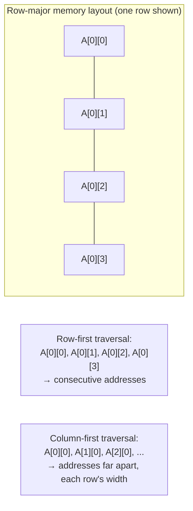

## Learning Objectives

- Explain why row-major array storage makes traversal order (row-first vs. column-first) a real performance difference, not just a stylistic one.
- Trace a cache-unfriendly matrix traversal and identify exactly where it wastes fetched cache lines.
- Explain cache blocking (tiling) as a technique for keeping a working set within cache capacity during a computation that would otherwise exceed it.
- Connect this concept's real, measurable effects back to every mechanism developed earlier in this cluster: blocks, associativity, AMAT.
- Explain why this is the same asymptotic complexity, same correct output, and yet a genuinely different wall-clock performance — the central point of the whole cluster made concrete.

## Context & Motivation

Every concept in this cluster so far has built a mental model of how a cache behaves — but it's easy to treat that model as a hardware curiosity, interesting for understanding a chip's internals but disconnected from how anyone actually writes code. This concept exists specifically to close that gap: real, ordinary code, with no algorithmic change at all, can run measurably faster or slower purely based on the order in which it touches memory, and that difference is entirely explained by the machinery this cluster has just spent several concepts building.

CS:APP uses exactly this framing — a matrix multiplication case study — as the payoff of its entire memory hierarchy chapter, precisely because it's concrete, easily reproduced, and undeniable: the same mathematical operation, computing the exact same result, can differ by a large, measurable factor in real run time depending only on loop order and blocking, with zero changes to what is actually being computed.

## Core Theory

### Row-major storage makes traversal order matter

Static Arrays and Random Access, in Data Structures I, and RAM Organization and Address Decoding, in Digital Logic & Computer Organization, both establish that a 2D array is, underneath, laid out as one contiguous 1D block of memory, in **row-major** order: an entire row's elements occupy consecutive addresses before the next row begins. This single fact is the whole reason traversal order matters for cache performance: iterating across a row (`A[i][0], A[i][1], A[i][2], ...`) touches consecutive addresses, exploiting the spatial locality this cluster's very first concept described; iterating down a column (`A[0][j], A[1][j], A[2][j], ...`) jumps by an entire row's width on every single step, touching addresses that are nowhere near each other.



### Where a cache-unfriendly traversal wastes fetched blocks

Recall from `cache-organization-blocks-and-mapping` that a cache fetches an entire block (say, 64 bytes — enough for several consecutive array elements) on any single access, on the bet that the *neighboring* elements it just brought in for free will also be needed soon. A row-first traversal honors that bet perfectly: after fetching one block for `A[i][0]`, the next several accesses (`A[i][1]`, `A[i][2]`, ...) are already sitting in that same block, all hits. A column-first traversal breaks that bet completely: `A[0][0]` and `A[1][0]` are (for anything but a tiny row width) in *different* cache blocks entirely, so every single access potentially misses, fetching a whole block's worth of neighboring data that will never actually be used before that block is evicted.

### Cache blocking (tiling): fitting the working set inside the cache

For a computation whose natural working set is larger than the cache — the classic case being matrix multiplication, where computing one output row can require touching an entire second matrix — blocking (also called tiling) restructures the computation to work on small sub-blocks of each matrix at a time, sized so that all the data actively needed for one sub-block's worth of computation fits comfortably within a given cache level, before moving on to the next sub-block. This trades a single pass with poor locality for several passes, each with excellent locality within its own small tile, at the cost of some extra loop-control bookkeeping — a real, standard technique in high-performance numerical code, and the direct practical application of the AMAT formula from the previous concept: intentionally keeping the effective working set small enough to hold miss rate near a fast level's hit rate, rather than accepting whatever miss rate an unblocked traversal happens to produce.

## Worked Examples

### Example 1: Row-major vs. column-major traversal of the same sum

```python
# Row-first (cache-friendly): consecutive addresses, few misses
total = 0
for i in range(N):
    for j in range(N):
        total += A[i][j]     # A[i][0], A[i][1], A[i][2], ... — consecutive

# Column-first (cache-unfriendly): same sum, addresses far apart
total = 0
for j in range(N):
    for i in range(N):
        total += A[i][j]     # A[0][j], A[1][j], A[2][j], ... — N elements apart
```

Both loops compute the identical sum of every element in `A`, with the identical O(N²) asymptotic complexity — nothing about the *algorithm* differs. For a large enough N (larger than what fits comfortably in cache), the column-first version measurably runs slower on real hardware, purely because its access pattern squanders the spatial locality a cache block is built to exploit, exactly as described in the Core Theory section above.

### Example 2: Quantifying the miss-rate gap with AMAT

Suppose, for a large N, the row-first traversal achieves a 98% hit rate (most accesses land in an already-fetched block) while the column-first traversal, jumping to a new block on nearly every access, achieves only a 5% hit rate. Using the single-level AMAT formula from the previous concept, with hit time 1 cycle and miss penalty 100 cycles:

```text
AMAT (row-first)    = 1 + 0.02 × 100 = 1 + 2   = 3 cycles per access
AMAT (column-first) = 1 + 0.95 × 100 = 1 + 95  = 96 cycles per access
```

A roughly 32× difference in average memory access time, for the exact same computation — this is not a hypothetical exaggeration; gaps of this general magnitude are genuinely observed on real hardware for exactly this kind of traversal-order comparison on large arrays, which is precisely why CS:APP treats this example as the definitive, concrete payoff of its entire memory hierarchy chapter.

### Example 3: Blocking a matrix multiply, sketched

```text
Unblocked matrix multiply: for each output row i, the inner loop touches
an entire column of B — for a large matrix, that column no longer fits
in cache by the time the next output row starts, and the same columns
of B are re-fetched from a slower level over and over.

Blocked matrix multiply: split A, B, and the output C into small
sub-blocks (say, 32×32) sized so that the sub-blocks of A and B actively
needed for one sub-block of the output ALL fit within, say, the L1
cache at once. Compute each output sub-block fully using only its
already-cached inputs before moving to the next sub-block.
```

Each sub-block's computation now enjoys near-perfect locality — the exact same total amount of arithmetic is performed, but with dramatically fewer cache misses overall, since the same small sub-blocks of A and B are reused repeatedly from cache rather than being evicted and re-fetched from a slower level between output rows.

## Common Misconceptions & Pitfalls

- **"This is a compiler's job, not something a programmer needs to think about."** Modern compilers do apply some loop transformations automatically, but they cannot always safely reorder loops or introduce blocking (aliasing concerns, or genuinely data-dependent access patterns can make this unsafe to do automatically) — understanding this cluster's mechanics well enough to write cache-friendly code by hand remains a real, practical skill, not an obsolete one.
- **"A cache miss just means the answer is wrong or delayed until fixed."** A miss never produces an incorrect result — the requested data is always eventually fetched correctly. The cost is purely in time (the miss penalty from AMAT), never in correctness; Example 1's two traversals produce bit-for-bit identical sums, differing only in speed.
- **"Blocking always helps, regardless of tile size."** A tile chosen too large still won't fit in the target cache level (no benefit over the unblocked version); a tile chosen far too small adds loop-control overhead without meaningfully improving locality (since even the unblocked version already fits small working sets in cache) — real blocked code tunes the tile size to the actual cache size being targeted.
- **"Since row-major storage is a fixed hardware/language convention, nothing about traversal order is actually a choice."** The storage layout (row-major) is indeed fixed by the language/compiler convention (as established in Digital Logic & Computer Organization and Data Structures I), but the *order in which a program chooses to iterate* over that fixed layout — row-first or column-first, blocked or unblocked — is entirely a programmer's choice, and Examples 1 and 2 show it's a choice with a real, measurable consequence.

## Summary

Row-major array storage means row-first traversal touches consecutive addresses (exploiting spatial locality and the cache's block-fetching bet) while column-first traversal jumps by an entire row's width on every access (defeating that same bet) — the same algorithm, same output, same asymptotic complexity, yet a measurably different real hit rate and, via the AMAT formula from the previous concept, a dramatically different real average access time. Cache blocking (tiling) extends this same principle to computations whose full working set exceeds cache capacity, restructuring the computation into small sub-blocks that each fit comfortably in a cache level, trading extra loop bookkeeping for a large reduction in real cache misses. This concept closes the Memory Hierarchy & Cache cluster by making its entire abstract machinery — locality, blocks, associativity, replacement, write policy, AMAT — visible in ordinary, reproducible code; the discipline now turns to a different bottleneck the Iron Law's factors don't directly capture at all: what happens when a single core simply isn't enough, starting with Why Multicore: The Power Wall.

## Documentation Links

- [Bryant & O'Hallaron — Computer Systems: A Programmer's Perspective (CS:APP)](https://csapp.cs.cmu.edu/) — Chapter 6's matrix-multiplication case study is the direct real-world source for this concept's row-major traversal and blocking examples.
- [CMU 15-213 — Cache Memories Lecture](http://www.cs.cmu.edu/afs/cs/academic/class/15213-s14/www/lectures/11-cache-memories.pdf) — covers cache-friendly code patterns as the practical payoff of the same cache mechanics developed across this cluster.
