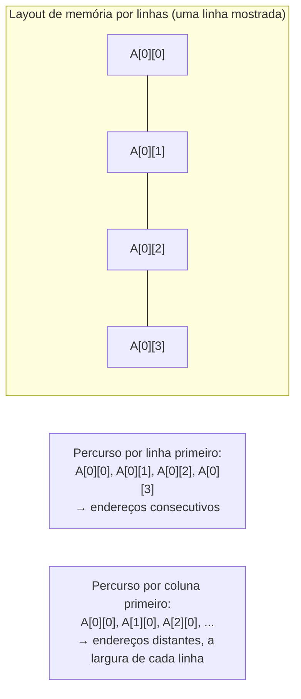

## Objetivos de Aprendizagem

- Explicar por que o armazenamento de arrays por linhas (row-major) torna a ordem de percurso (linha primeiro vs. coluna primeiro) uma diferença real de desempenho, e não só de estilo.
- Rastrear um percurso de matriz pouco amigável à cache e identificar exatamente onde ele desperdiça linhas de cache buscadas.
- Explicar o bloqueio de cache (tiling) como técnica para manter um conjunto de trabalho dentro da capacidade da cache durante um cálculo que, de outro modo, a ultrapassaria.
- Ligar os efeitos reais e mensuráveis deste conceito a cada mecanismo desenvolvido antes neste bloco: blocos, associatividade, AMAT.
- Explicar por que esta é a mesma complexidade assintótica, a mesma saída correta e, ainda assim, um desempenho de relógio genuinamente diferente: o ponto central de todo o bloco tornado concreto.

## Contexto e Motivação

Todo conceito deste bloco até aqui construiu um modelo mental de como uma cache se comporta, mas é fácil tratar esse modelo como uma curiosidade de hardware, interessante para entender o interior de um chip, mas desligada de como alguém de fato escreve código. Este conceito existe especificamente para fechar essa lacuna: código real e comum, sem nenhuma mudança algorítmica, pode rodar de forma mensuravelmente mais rápida ou mais lenta só por causa da ordem em que toca a memória, e essa diferença é inteiramente explicada pela maquinaria que este bloco acabou de passar vários conceitos construindo.

O CS:APP usa exatamente esse enquadramento (um estudo de caso de multiplicação de matrizes) como o retorno de todo o seu capítulo sobre hierarquia de memória, justamente por ser concreto, fácil de reproduzir e inegável: a mesma operação matemática, calculando exatamente o mesmo resultado, pode diferir por um fator grande e mensurável no tempo real de execução dependendo só da ordem dos laços e do bloqueio, sem nenhuma mudança no que está de fato sendo calculado.

## Teoria Central

### O armazenamento por linhas faz a ordem de percurso importar

Static Arrays and Random Access, em Estruturas de Dados I, e RAM Organization and Address Decoding, em Lógica Digital e Organização de Computadores, estabelecem que um array 2D é, por baixo, disposto como um bloco 1D contíguo de memória, na ordem **por linhas** (row-major): todos os elementos de uma linha ocupam endereços consecutivos antes de a próxima linha começar. Esse único fato é todo o motivo pelo qual a ordem de percurso importa para o desempenho da cache: iterar ao longo de uma linha (`A[i][0], A[i][1], A[i][2], ...`) toca endereços consecutivos, explorando a localidade espacial que o primeiro conceito deste bloco descreveu; iterar descendo uma coluna (`A[0][j], A[1][j], A[2][j], ...`) salta a largura de uma linha inteira a cada passo, tocando endereços que não estão nem perto uns dos outros.



### Onde um percurso pouco amigável à cache desperdiça blocos buscados

Lembre de `cache-organization-blocks-and-mapping` que uma cache busca um bloco inteiro (digamos, 64 bytes, o suficiente para vários elementos consecutivos do array) em qualquer acesso isolado, apostando que os elementos *vizinhos* que acabou de trazer de graça também vão ser necessários em breve. Um percurso por linha primeiro honra essa aposta perfeitamente: depois de buscar um bloco para `A[i][0]`, os próximos vários acessos (`A[i][1]`, `A[i][2]`, ...) já estão nesse mesmo bloco, todos acertos. Um percurso por coluna primeiro quebra essa aposta por completo: `A[0][0]` e `A[1][0]` estão (para qualquer largura de linha que não seja minúscula) em blocos de cache *diferentes*, então cada acesso potencialmente falha, buscando um bloco inteiro de dados vizinhos que nunca vão ser usados antes de esse bloco ser despejado.

### Bloqueio de cache (tiling): fazendo o conjunto de trabalho caber na cache

Para um cálculo cujo conjunto de trabalho natural é maior que a cache (o caso clássico é a multiplicação de matrizes, em que calcular uma linha de saída pode exigir tocar uma segunda matriz inteira), o bloqueio (também chamado de tiling) reestrutura o cálculo para trabalhar em pequenos sub-blocos de cada matriz por vez, dimensionados de modo que todos os dados ativamente necessários para o cálculo de um sub-bloco caibam com folga num dado nível de cache, antes de passar ao próximo sub-bloco. Isso troca uma única passada com localidade ruim por várias passadas, cada uma com localidade excelente dentro do seu pequeno bloco, ao custo de alguma contabilidade extra de controle de laços. É uma técnica real e padrão em código numérico de alto desempenho, e a aplicação prática direta da fórmula do AMAT do conceito anterior: manter intencionalmente o conjunto de trabalho efetivo pequeno o bastante para segurar a taxa de falha perto da taxa de acerto de um nível rápido, em vez de aceitar qualquer taxa de falha que um percurso sem bloqueio acabe produzindo.

## Exemplos Resolvidos

### Exemplo 1: percurso por linhas vs. por colunas da mesma soma

```python
# Linha primeiro (amigável à cache): endereços consecutivos, poucas falhas
total = 0
for i in range(N):
    for j in range(N):
        total += A[i][j]     # A[i][0], A[i][1], A[i][2], ...: consecutivos

# Coluna primeiro (pouco amigável à cache): a mesma soma, endereços distantes
total = 0
for j in range(N):
    for i in range(N):
        total += A[i][j]     # A[0][j], A[1][j], A[2][j], ...: N elementos de distância
```

Os dois laços calculam a soma idêntica de todos os elementos de `A`, com a complexidade assintótica idêntica de O(N²): nada no *algoritmo* difere. Para um N grande o bastante (maior do que cabe com folga na cache), a versão por coluna primeiro roda de forma mensuravelmente mais lenta em hardware real, só porque seu padrão de acesso desperdiça a localidade espacial que um bloco de cache é feito para explorar, exatamente como descrito na seção de Teoria Central acima.

### Exemplo 2: quantificando a diferença de taxa de falha com o AMAT

Suponha que, para um N grande, o percurso por linha primeiro atinja 98% de taxa de acerto (a maioria dos acessos cai num bloco já buscado), enquanto o percurso por coluna primeiro, saltando para um bloco novo em quase todo acesso, atinja só 5% de taxa de acerto. Usando a fórmula do AMAT de um nível do conceito anterior, com tempo de acerto de 1 ciclo e penalidade de falha de 100 ciclos:

```text
AMAT (linha primeiro)  = 1 + 0.02 × 100 = 1 + 2   = 3 ciclos por acesso
AMAT (coluna primeiro) = 1 + 0.95 × 100 = 1 + 95  = 96 ciclos por acesso
```

Uma diferença de aproximadamente 32× no tempo médio de acesso à memória, para exatamente o mesmo cálculo. Isso não é um exagero hipotético: diferenças dessa ordem de grandeza são de fato observadas em hardware real exatamente nesse tipo de comparação de ordem de percurso em arrays grandes, e é precisamente por isso que o CS:APP trata este exemplo como o retorno definitivo e concreto de todo o seu capítulo de hierarquia de memória.

### Exemplo 3: bloqueando uma multiplicação de matrizes, em esboço

```text
Multiplicação de matrizes sem bloqueio: para cada linha de saída i, o laço interno toca
uma coluna inteira de B; numa matriz grande, essa coluna não cabe mais
na cache quando a próxima linha de saída começa, e as mesmas colunas
de B são buscadas de novo num nível mais lento, repetidas vezes.

Multiplicação de matrizes com bloqueio: dividir A, B e a saída C em pequenos
sub-blocos (digamos, 32×32) dimensionados de modo que os sub-blocos de A e B ativamente
necessários para um sub-bloco da saída caibam TODOS, digamos, na cache L1
ao mesmo tempo. Calcular por completo cada sub-bloco de saída usando só suas
entradas já em cache antes de passar ao próximo sub-bloco.
```

O cálculo de cada sub-bloco agora desfruta de localidade quase perfeita: exatamente a mesma quantidade total de aritmética é feita, mas com drasticamente menos falhas de cache no geral, já que os mesmos pequenos sub-blocos de A e B são reaproveitados repetidamente da cache, em vez de serem despejados e buscados de novo num nível mais lento entre uma linha de saída e outra.

## Equívocos Comuns e Armadilhas

- **"Isso é trabalho do compilador, não algo em que um programador precise pensar."** Compiladores modernos aplicam algumas transformações de laço automaticamente, mas nem sempre conseguem reordenar laços ou introduzir bloqueio com segurança (preocupações de aliasing, ou padrões de acesso genuinamente dependentes dos dados, podem tornar isso inseguro de fazer automaticamente). Entender a mecânica deste bloco o bastante para escrever código amigável à cache à mão continua sendo uma habilidade real e prática, e não obsoleta.
- **"Uma falha de cache só significa que a resposta está errada ou atrasada até ser corrigida."** Uma falha nunca produz um resultado incorreto: o dado pedido sempre acaba sendo buscado corretamente. O custo é puramente de tempo (a penalidade de falha do AMAT), nunca de correção; os dois percursos do Exemplo 1 produzem somas idênticas bit a bit, diferindo só na velocidade.
- **"O bloqueio sempre ajuda, qualquer que seja o tamanho do bloco."** Um bloco escolhido grande demais ainda não cabe no nível de cache alvo (nenhum benefício em relação à versão sem bloqueio); um bloco escolhido pequeno demais acrescenta sobrecarga de controle de laços sem melhorar a localidade de forma significativa (já que até a versão sem bloqueio já cabe na cache com conjuntos de trabalho pequenos). Código real com bloqueio ajusta o tamanho do bloco ao tamanho real da cache que está sendo visada.
- **"Como o armazenamento por linhas é uma convenção fixa de hardware/linguagem, nada sobre a ordem de percurso é de fato uma escolha."** O layout de armazenamento (por linhas) é de fato fixado pela convenção da linguagem/compilador (como estabelecido em Lógica Digital e Organização de Computadores e em Estruturas de Dados I), mas a *ordem em que um programa escolhe iterar* sobre esse layout fixo (linha primeiro ou coluna primeiro, com ou sem bloqueio) é inteiramente escolha do programador, e os Exemplos 1 e 2 mostram que é uma escolha com consequência real e mensurável.

## Resumo

O armazenamento de arrays por linhas significa que o percurso por linha primeiro toca endereços consecutivos (explorando a localidade espacial e a aposta da cache em buscar blocos), enquanto o percurso por coluna primeiro salta a largura de uma linha inteira a cada acesso (derrotando essa mesma aposta): o mesmo algoritmo, a mesma saída, a mesma complexidade assintótica e, ainda assim, uma taxa de acerto real mensuravelmente diferente e, pela fórmula do AMAT do conceito anterior, um tempo médio de acesso real drasticamente diferente. O bloqueio de cache (tiling) estende esse mesmo princípio a cálculos cujo conjunto de trabalho completo ultrapassa a capacidade da cache, reestruturando o cálculo em pequenos sub-blocos que cabem com folga num nível de cache, trocando contabilidade extra de laços por uma grande redução nas falhas de cache reais. Este conceito fecha o bloco de Hierarquia de Memória e Cache tornando toda a sua maquinaria abstrata (localidade, blocos, associatividade, substituição, política de escrita, AMAT) visível em código comum e reproduzível; a disciplina agora se volta para um gargalo diferente, que os fatores da Lei de Ferro não capturam diretamente: o que acontece quando um único núcleo simplesmente não basta, começando por Why Multicore: The Power Wall.

## Documentation Links

- [Bryant & O'Hallaron: Computer Systems: A Programmer's Perspective (CS:APP)](https://csapp.cs.cmu.edu/): o estudo de caso de multiplicação de matrizes do Capítulo 6 é a fonte direta, do mundo real, dos exemplos de percurso por linhas e de bloqueio deste conceito.
- [CMU 15-213: Cache Memories Lecture](http://www.cs.cmu.edu/afs/cs/academic/class/15213-s14/www/lectures/11-cache-memories.pdf): cobre padrões de código amigáveis à cache como o retorno prático da mesma mecânica de cache desenvolvida ao longo deste bloco.
