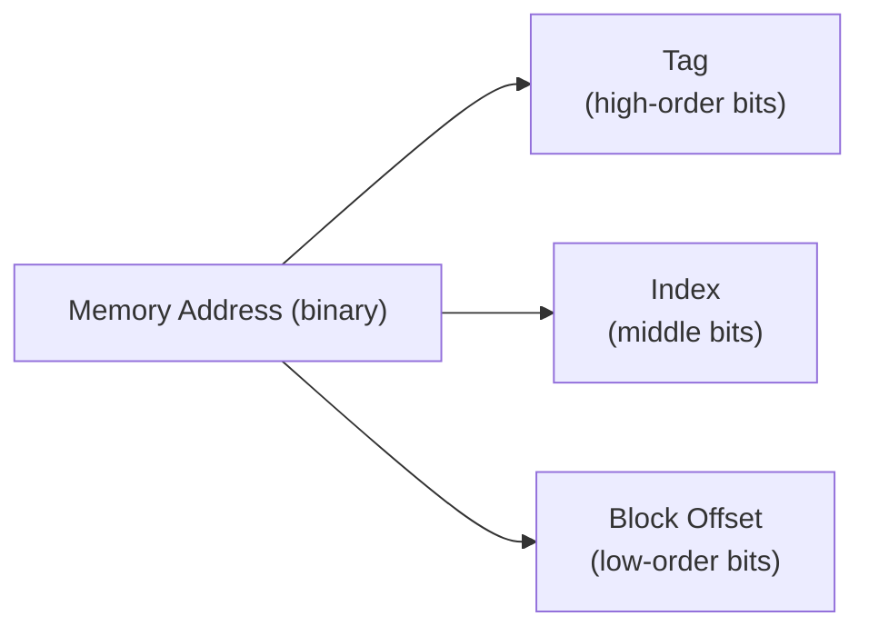
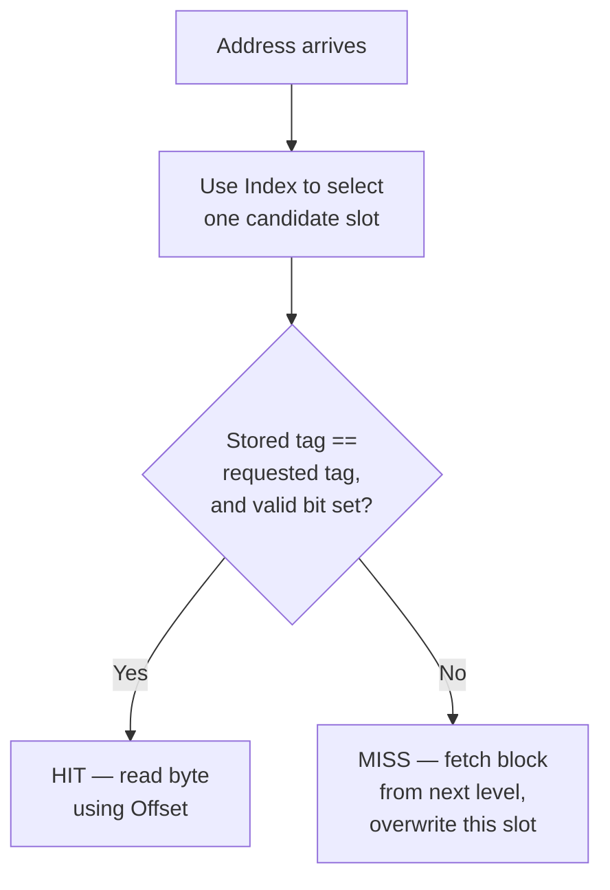

## Learning Objectives

- Explain why a cache holds fixed-size blocks (cache lines) rather than individual bytes or words.
- Split a memory address into tag, index, and offset fields, and explain what each field is used for.
- Trace a direct-mapped cache lookup for a given address: which slot it maps to, and how a hit or miss is determined.
- Compute the number of index bits, offset bits, and tag bits for a cache of given size, block size, and associativity (direct-mapped case).
- Explain conflict misses — the specific weakness direct mapping introduces — as motivation for the next concept.

## Context & Motivation

The previous concept established *why* a cache helps (locality) without saying anything about how one is actually built. This concept starts answering that question with the simplest possible organization — direct mapping — which, despite its simplicity, already contains every structural idea (blocks, tags, indices) that the more sophisticated organizations in the rest of this cluster build on.

CMU 15-213's cache memories lecture, and CS:APP's Chapter 6, both develop this exact address-splitting scheme (tag/index/offset) as the foundation for every cache design discussed afterward — it is worth understanding precisely here because every later concept in this cluster (associativity, replacement, write policy, AMAT) is stated in terms of the vocabulary this concept introduces.

## Core Theory

### Blocks, not bytes: exploiting spatial locality directly in the data structure

A cache does not fetch and store individual bytes or words from main memory one at a time — it fetches and stores fixed-size, contiguous chunks called **blocks** (or cache lines), typically 64 bytes on real modern processors. This directly encodes spatial locality, from the previous concept, into the cache's own data structure: requesting one byte automatically brings its neighbors along for free, so a subsequent access to a nearby address (very likely, given real programs' spatial locality) is already a hit without any additional main-memory access.

### Splitting an address into tag, index, and offset

A memory address, viewed by the cache, is split into three contiguous bit fields:



- **Block offset**: the low-order bits, wide enough to select one specific byte within a block. For a 64-byte block, this needs log₂(64) = 6 bits.
- **Index**: the next bits up, used to select *which cache slot* this address maps to — exactly one slot, in a direct-mapped cache. For a cache with N slots, this needs log₂(N) bits.
- **Tag**: all the remaining, high-order bits, stored alongside the cached data specifically to distinguish which of the (many) possible memory blocks that could map to this one slot is the one actually resident right now.

### Direct mapping: exactly one possible slot per address

In a **direct-mapped** cache, the index bits alone completely determine which single slot an address's block must reside in — there is no choice, no lookup among alternatives. A lookup proceeds in three steps: use the index to find the one candidate slot; compare the stored tag in that slot against the tag bits of the requested address; if they match *and* the slot's valid bit is set, it's a **hit** — read the requested byte using the offset. If the tags don't match, or the valid bit is unset (the slot has never been filled, or has been invalidated), it's a **miss** — the block must be fetched from the next level down (main memory, or a lower cache level), placed into that one slot (evicting whatever was there before, unconditionally, since there is nowhere else for it to go), and the tag updated to match.



## Worked Examples

### Example 1: Deriving the address split for a concrete cache

A direct-mapped cache has 256 slots, each holding a 64-byte block, using 32-bit addresses.

```text
Offset bits  = log2(block size)  = log2(64)  = 6 bits
Index bits   = log2(number of slots) = log2(256) = 8 bits
Tag bits     = total address bits − offset bits − index bits
             = 32 − 6 − 8 = 18 bits
```

```text
31                        14 13        6 5         0
+---------------------------+------------+-----------+
|      Tag (18 bits)        | Index (8)  | Offset (6)|
+---------------------------+------------+-----------+
```

Every 32-bit address in this system decomposes into exactly these three fields, regardless of what data happens to live at that address — the split is a fixed property of the cache's size and block size, not of any particular access.

### Example 2: Tracing a hit and a miss

Using the cache from Example 1, suppose slot 5 currently holds a block with tag `0x1A2` (valid bit set), and the following address arrives: binary tag bits = `0x1A2`, index = 5.

```text
Requested tag (0x1A2) == stored tag (0x1A2)?  Yes.
Valid bit set?                                 Yes.
Result: HIT — read the requested byte directly from slot 5's cached block.
```

Now suppose a different address arrives with the same index (5) but a different tag, `0x1A3`:

```text
Requested tag (0x1A3) == stored tag (0x1A2)?  No.
Result: MISS — fetch the block containing tag 0x1A3 from main memory,
        overwrite slot 5's contents (discarding the 0x1A2 block entirely,
        even though it might still be needed soon), update slot 5's tag to 0x1A3.
```

### Example 3: Conflict misses — direct mapping's specific weakness

Suppose a program alternates between two arrays, `A` and `B`, whose addresses happen to produce the *same index* bits (a real, common occurrence for arrays that are the same size and allocated a fixed distance apart in memory) but different tags:

```python
for i in range(1000):
    total += A[i] + B[i]     # A[i] and B[i] map to the SAME direct-mapped slot
```

Every single access to `A[i]` evicts the block just brought in for `B[i]` (same index, different tag — a guaranteed miss under direct mapping's rule of exactly one candidate slot), and vice versa on the very next access — even though the cache overall has plenty of *other*, completely unused slots sitting idle. This is a **conflict miss**: a miss caused not by the working set being too large for the cache overall (that would be a *capacity* miss), but by direct mapping's rigid rule that an address has exactly one possible home, regardless of whether other slots are free. This specific weakness — real, measurable, and common in exactly the pattern shown here — is precisely what the next concept, Set-Associative and Fully Associative Caches, exists to reduce.

## Common Misconceptions & Pitfalls

- **"A cache stores individual bytes, looked up one at a time."** It stores whole fixed-size blocks, fetched and evicted as a unit — a single byte access still brings in (and later evicts) its entire surrounding block, which is precisely what lets spatial locality pay off on subsequent nearby accesses.
- **"The tag alone determines whether a request hits."** The index first determines *which single slot* is even checked; the tag comparison only happens against that one candidate. A matching tag stored in the wrong slot (which can never actually happen under direct mapping, precisely because index determines slot deterministically) is not what a hit means here.
- **"A conflict miss means the cache is too small for the program's data."** That's a capacity miss — a genuinely different cause. A conflict miss (Example 3) can happen even when the cache has ample *total* space free, purely because direct mapping forces two different, actively-used blocks to fight over the exact same one slot.
- **"More index bits are always better because they support a bigger cache."** More index bits do mean more slots (a bigger cache, all else equal) — but they also mean fewer tag bits are available (for a fixed address width) unless the block size or total address space also changes; the tradeoff in Example 1's arithmetic is a fixed, mechanical consequence of a chosen cache size and block size, not an independent free choice.

## Summary

A direct-mapped cache splits every address into a tag, an index, and a block offset: the index picks exactly one candidate slot, the offset selects a byte within that slot's cached block, and the tag — compared against what's actually stored in that slot — determines whether the access is a hit or a miss. This organization is simple and fast to check (only one comparison needed per lookup) but suffers from conflict misses whenever two frequently used blocks happen to share the same index, evicting each other repeatedly even while other slots sit unused — exactly the weakness the next concept, Set-Associative and Fully Associative Caches, is designed to reduce.

## Documentation Links

- [CMU 15-213 — Cache Memories Lecture](http://www.cs.cmu.edu/afs/cs/academic/class/15213-s14/www/lectures/11-cache-memories.pdf) — develops the tag/index/offset address split and direct-mapped lookup mechanics in detail.
- [Bryant & O'Hallaron — Computer Systems: A Programmer's Perspective (CS:APP)](https://csapp.cs.cmu.edu/) — Chapter 6 covers direct-mapped cache organization and conflict misses with the same address-splitting framework.
