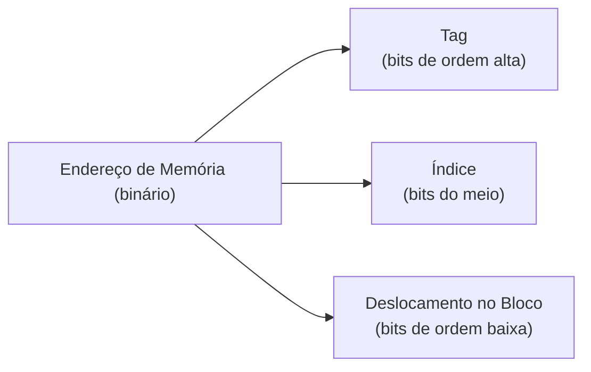
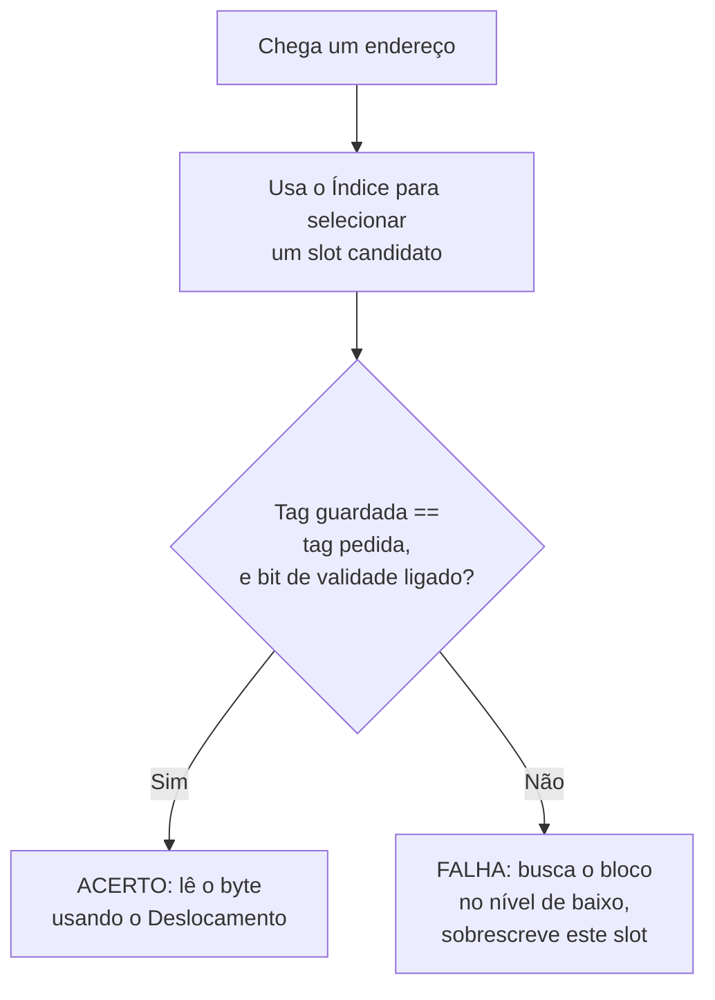

## Objetivos de Aprendizagem

- Explicar por que uma cache guarda blocos de tamanho fixo (linhas de cache), e não bytes ou palavras individuais.
- Dividir um endereço de memória nos campos de tag, índice e deslocamento e explicar para que cada campo é usado.
- Rastrear uma consulta numa cache de mapeamento direto para um dado endereço: para qual slot ele mapeia e como se determina um acerto ou uma falha.
- Calcular o número de bits de índice, de deslocamento e de tag para uma cache de tamanho, tamanho de bloco e associatividade dados (caso de mapeamento direto).
- Explicar as falhas por conflito (a fraqueza específica que o mapeamento direto introduz) como motivação para o próximo conceito.

## Contexto e Motivação

O conceito anterior estabeleceu *por que* uma cache ajuda (a localidade), sem dizer nada sobre como uma cache é de fato construída. Este conceito começa a responder essa pergunta com a organização mais simples possível, o mapeamento direto, que, apesar da simplicidade, já contém toda ideia estrutural (blocos, tags, índices) sobre a qual as organizações mais sofisticadas do resto deste bloco se constroem.

A aula de memórias cache do CMU 15-213 e o Capítulo 6 do CS:APP desenvolvem exatamente este esquema de divisão de endereços (tag/índice/deslocamento) como o fundamento de todo projeto de cache discutido depois. Vale entendê-lo com precisão aqui porque todo conceito posterior deste bloco (associatividade, substituição, política de escrita, AMAT) é enunciado em termos do vocabulário que este conceito apresenta.

## Teoria Central

### Blocos, e não bytes: explorando a localidade espacial diretamente na estrutura de dados

Uma cache não busca nem guarda bytes ou palavras individuais da memória principal, um de cada vez: ela busca e guarda pedaços contíguos de tamanho fixo chamados **blocos** (ou linhas de cache), normalmente de 64 bytes em processadores modernos reais. Isso codifica a localidade espacial, do conceito anterior, diretamente na própria estrutura de dados da cache: pedir um byte traz automaticamente seus vizinhos de graça, então um acesso seguinte a um endereço próximo (muito provável, dada a localidade espacial dos programas reais) já é um acerto, sem nenhum acesso adicional à memória principal.

### Dividindo um endereço em tag, índice e deslocamento

Um endereço de memória, visto pela cache, é dividido em três campos de bits contíguos:



- **Deslocamento no bloco**: os bits de ordem baixa, largos o bastante para selecionar um byte específico dentro de um bloco. Para um bloco de 64 bytes, isso exige log₂(64) = 6 bits.
- **Índice**: os bits logo acima, usados para selecionar *para qual slot da cache* este endereço mapeia (exatamente um slot, numa cache de mapeamento direto). Para uma cache com N slots, isso exige log₂(N) bits.
- **Tag**: todos os bits restantes, de ordem alta, guardados junto com os dados em cache especificamente para distinguir qual dos (muitos) blocos de memória possíveis que poderiam mapear para este único slot é o que está de fato residente agora.

### Mapeamento direto: exatamente um slot possível por endereço

Numa cache de **mapeamento direto**, só os bits de índice já determinam por completo o único slot em que o bloco de um endereço precisa residir: não há escolha, nem consulta entre alternativas. Uma consulta procede em três passos: usar o índice para encontrar o único slot candidato; comparar a tag guardada nesse slot com os bits de tag do endereço pedido; se baterem *e* o bit de validade do slot estiver ligado, é um **acerto**: lê-se o byte pedido usando o deslocamento. Se as tags não baterem, ou o bit de validade estiver desligado (o slot nunca foi preenchido, ou foi invalidado), é uma **falha**: o bloco precisa ser buscado no nível de baixo (memória principal, ou um nível de cache inferior), colocado naquele único slot (despejando incondicionalmente o que estava lá antes, já que não há outro lugar para ele ir) e a tag atualizada para corresponder.



## Exemplos Resolvidos

### Exemplo 1: derivando a divisão do endereço para uma cache concreta

Uma cache de mapeamento direto tem 256 slots, cada um guardando um bloco de 64 bytes, usando endereços de 32 bits.

```text
Bits de deslocamento = log2(tamanho do bloco)   = log2(64)  = 6 bits
Bits de índice       = log2(número de slots)    = log2(256) = 8 bits
Bits de tag          = total de bits do endereço − bits de deslocamento − bits de índice
                     = 32 − 6 − 8 = 18 bits
```

```text
31                        14 13        6 5         0
+---------------------------+------------+-----------+
|      Tag (18 bits)        | Índice (8) | Desl. (6) |
+---------------------------+------------+-----------+
```

Todo endereço de 32 bits deste sistema se decompõe exatamente nesses três campos, quaisquer que sejam os dados que morem nesse endereço: a divisão é uma propriedade fixa do tamanho da cache e do tamanho do bloco, e não de algum acesso específico.

### Exemplo 2: rastreando um acerto e uma falha

Usando a cache do Exemplo 1, suponha que o slot 5 guarde no momento um bloco com tag `0x1A2` (bit de validade ligado), e que chegue o seguinte endereço: bits de tag em binário = `0x1A2`, índice = 5.

```text
Tag pedida (0x1A2) == tag guardada (0x1A2)?  Sim.
Bit de validade ligado?                       Sim.
Resultado: ACERTO: lê o byte pedido diretamente do bloco em cache do slot 5.
```

Agora suponha que chegue um endereço diferente, com o mesmo índice (5), mas outra tag, `0x1A3`:

```text
Tag pedida (0x1A3) == tag guardada (0x1A2)?  Não.
Resultado: FALHA: busca na memória principal o bloco que contém a tag 0x1A3,
           sobrescreve o conteúdo do slot 5 (descartando por completo o bloco 0x1A2,
           mesmo que ele ainda possa ser necessário em breve), atualiza a tag do slot 5 para 0x1A3.
```

### Exemplo 3: falhas por conflito, a fraqueza específica do mapeamento direto

Suponha que um programa alterne entre dois arrays, `A` e `B`, cujos endereços por acaso produzem os *mesmos* bits de índice (algo real e comum para arrays do mesmo tamanho alocados a uma distância fixa na memória), mas tags diferentes:

```python
for i in range(1000):
    total += A[i] + B[i]     # A[i] e B[i] mapeiam para o MESMO slot de mapeamento direto
```

Cada acesso a `A[i]` despeja o bloco que acabou de ser trazido para `B[i]` (mesmo índice, tag diferente: uma falha garantida pela regra do mapeamento direto de exatamente um slot candidato), e vice-versa no acesso seguinte, mesmo que a cache como um todo tenha muitos *outros* slots completamente sem uso, parados. Isso é uma **falha por conflito**: uma falha causada não por o conjunto de trabalho ser grande demais para a cache como um todo (isso seria uma falha por *capacidade*), e sim pela regra rígida do mapeamento direto de que um endereço tem exatamente um lar possível, haja ou não outros slots livres. Essa fraqueza específica (real, mensurável e comum exatamente no padrão mostrado aqui) é precisamente o que o próximo conceito, Caches Associativas por Conjunto e Totalmente Associativas, existe para reduzir.

## Equívocos Comuns e Armadilhas

- **"Uma cache guarda bytes individuais, consultados um de cada vez."** Ela guarda blocos inteiros de tamanho fixo, buscados e despejados como uma unidade: um acesso a um único byte ainda traz (e depois despeja) o bloco inteiro ao redor dele, e é justamente isso que permite à localidade espacial render nos acessos próximos seguintes.
- **"Só a tag determina se um pedido acerta."** O índice primeiro determina *qual único slot* sequer é verificado; a comparação de tag só acontece contra esse único candidato. Uma tag correspondente guardada no slot errado (o que nunca pode de fato acontecer no mapeamento direto, justamente porque o índice determina o slot de forma determinística) não é o que um acerto significa aqui.
- **"Uma falha por conflito significa que a cache é pequena demais para os dados do programa."** Isso é uma falha por capacidade, uma causa genuinamente diferente. Uma falha por conflito (Exemplo 3) pode acontecer mesmo quando a cache tem bastante espaço *total* livre, só porque o mapeamento direto força dois blocos diferentes e usados ativamente a disputar exatamente o mesmo slot.
- **"Mais bits de índice são sempre melhores porque dão suporte a uma cache maior."** Mais bits de índice de fato significam mais slots (uma cache maior, mantido o resto igual), mas também significam menos bits de tag disponíveis (para uma largura de endereço fixa), a menos que o tamanho do bloco ou o espaço total de endereços também mude. A troca na aritmética do Exemplo 1 é uma consequência fixa e mecânica de um tamanho de cache e de bloco escolhidos, e não uma escolha livre e independente.

## Resumo

Uma cache de mapeamento direto divide todo endereço em tag, índice e deslocamento no bloco: o índice escolhe exatamente um slot candidato, o deslocamento seleciona um byte dentro do bloco em cache desse slot, e a tag, comparada com o que está de fato guardado nesse slot, determina se o acesso é um acerto ou uma falha. Essa organização é simples e rápida de verificar (só uma comparação por consulta), mas sofre de falhas por conflito sempre que dois blocos usados com frequência por acaso compartilham o mesmo índice, despejando um ao outro repetidamente enquanto outros slots ficam sem uso. É exatamente a fraqueza que o próximo conceito, Caches Associativas por Conjunto e Totalmente Associativas, é projetado para reduzir.

## Documentation Links

- [CMU 15-213: Cache Memories Lecture](http://www.cs.cmu.edu/afs/cs/academic/class/15213-s14/www/lectures/11-cache-memories.pdf): desenvolve em detalhe a divisão de endereço em tag/índice/deslocamento e a mecânica de consulta no mapeamento direto.
- [Bryant & O'Hallaron: Computer Systems: A Programmer's Perspective (CS:APP)](https://csapp.cs.cmu.edu/): o Capítulo 6 cobre a organização de cache com mapeamento direto e as falhas por conflito com o mesmo arcabouço de divisão de endereços.
