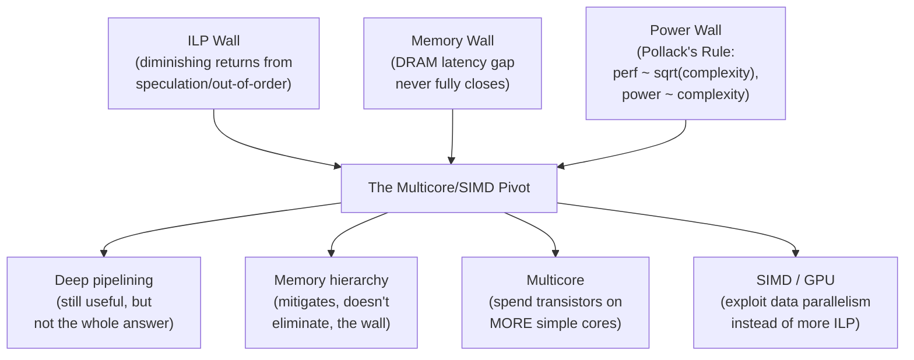

## Learning Objectives

- Name and explain, in one sentence each, the ILP wall, the memory wall, and the power wall.
- Explain how each wall connects to a specific, earlier concept in this discipline, using the Iron Law's vocabulary throughout.
- Explain why these three walls, arriving at roughly the same historical moment, together forced a genuine architectural pivot rather than an incremental adjustment.
- Trace, for a concrete workload, which of this discipline's four major techniques (pipelining, memory hierarchy, multicore, SIMD/GPU) would actually help, and which wouldn't.
- Explicitly identify what this discipline has deliberately left out (Amdahl's Law, and the parallel programming model), and where that material is reserved.

## Context & Motivation

This discipline opened with a single equation — the Iron Law, CPU time = Instruction Count × CPI × Clock Cycle Time — and every concept since has been an attempt to move one of its three factors in a favorable direction: pipelining shortened clock cycle time; branch prediction and the memory hierarchy reduced CPI; multicore and SIMD reduced effective work per core, or effective instruction count per data element. This capstone's job is to step back and show that these techniques were not independently invented, unrelated tools reached for one at a time — they are, historically and technically, connected responses to three specific limits that arrived at roughly the same moment and, together, forced the entire industry to change direction.

## Core Theory

### The ILP wall

Speculative and Out-of-Order Execution described techniques for extracting more instruction-level parallelism (ILP) from a single instruction stream — executing past unconfirmed branches, letting independent instructions run ahead of stalled ones. These techniques have a real limit: real programs only contain so much genuinely independent, simultaneously-executable work at any given point, and the hardware needed to find and exploit ever more of it (bigger reorder buffers, more aggressive speculation, wider issue) grows in cost and complexity faster than the diminishing returns it produces. This is the **ILP wall**: pushing single-instruction-stream parallelism further and further eventually runs out of independent work to exploit, no matter how much hardware is thrown at finding it.

### The memory wall

Average Memory Access Time and Multilevel Caches showed that AMAT, even with a well-designed multilevel hierarchy, is never fully insulated from DRAM's real, physical latency — a cache miss at the deepest level still costs on the order of hundreds of cycles, a gap that has, historically, grown rather than shrunk, because processor clock speeds improved far faster over the decades than DRAM latency did. This is the **memory wall**: no matter how clever the cache hierarchy, some fraction of accesses will always pay a real, large, and (relative to processor speed) worsening penalty to reach main memory.

### The power wall

Why Multicore: The Power Wall developed this one directly: Pollack's Rule means a single core's performance scales only with the square root of its added complexity, while its power draw scales linearly — a genuine physical constraint (heat dissipation, not merely cost) on how much further a single core can be usefully scaled.

### Why three walls arriving together forced a pivot, not an adjustment



Any *one* of these three walls, in isolation, might have been answered by pushing harder on the same single-core techniques that had worked for decades — a bigger cache to fight the memory wall alone, more aggressive speculation to fight the ILP wall alone. What made the mid-2000s a genuine pivot, not an incremental tuning exercise, was that all three walls arrived at close to the same time, each independently reducing the payoff of "make the single core bigger and smarter" — which is exactly what made "build more, simpler cores, and exploit data parallelism within each" (multicore plus SIMD/GPU, this discipline's last two clusters) the industry's actual, historically documented answer, as Herb Sutter's essay named directly.

### Where each of this discipline's techniques fits into this story

```text
Technique                    Which wall it responds to         Concept(s)
---------------------------  ---------------------------------  --------------------------
Pipelining                    (predates the "wall" era —          the-5-stage-risc-pipeline,
                               a foundational technique, not      and the hazard concepts
                               itself a response to a wall)
Branch prediction,            ILP wall — extracts more            branch-prediction,
speculative/OoO execution     parallelism from ONE stream,        speculative-and-out-of-
                               until it runs out                  order-execution
Memory hierarchy / cache      Memory wall — mitigates, but        the-memory-hierarchy-and-
                               never fully eliminates, the        locality through cache-
                               DRAM latency gap                    friendly-code
Multicore                     Power wall — better performance-    why-multicore-the-power-
                               per-watt from several simple        wall through false-sharing
                               cores than one complex one
SIMD / GPU                    ILP wall (differently) — exploits   flynns-taxonomy-and-simd,
                               DATA parallelism instead of         gpu-architecture-and-the-
                               instruction-level parallelism        simt-execution-model
```

## Worked Examples

### Example 1: Diagnosing which techniques help a specific workload

A workload performs a long, inherently sequential chain of dependent computations (each step needs the previous step's result), on a modest amount of data.

```text
Pipelining:            Helps some (every workload benefits from a shorter
                        clock cycle, within hazard limits already covered).
Branch prediction/OoO:  Limited help — a truly sequential dependency chain
                        has little independent work for OoO execution to
                        find, hitting the ILP wall directly.
Memory hierarchy:       Helps if the modest data fits comfortably in cache
                        (likely, given "modest amount of data").
Multicore:              LITTLE TO NO HELP — this workload is inherently
                        sequential; extra cores sit idle with nothing
                        independent to run (exactly Example 2's caveat
                        from why-multicore-the-power-wall).
SIMD/GPU:               LITTLE TO NO HELP — no data-level parallelism to
                        exploit; each step depends on the last.
```

This workload is precisely the case Herb Sutter's essay warned software developers about: a program that benefited automatically from every single-core-focused technique in this discipline's first two-thirds will see almost none of the gains multicore or SIMD hardware can offer, unless it is fundamentally restructured — exactly the software-side burden the power wall shifted onto programmers.

### Example 2: The same diagnosis for a different workload

A workload independently processes each of one million unrelated images with the identical filter operation.

```text
Pipelining, branch prediction, memory hierarchy: all still help, as always.
Multicore:    Substantial help — a million genuinely independent units
              of work can be split across every available core.
SIMD/GPU:     Substantial help — the identical operation applied uniformly
              across huge amounts of data is exactly SIMD's and a GPU's
              sweet spot, as both prior concepts established directly.
```

The contrast with Example 1 is the entire point of this capstone: this discipline's later techniques (multicore, SIMD/GPU) are not universal accelerants that help every program equally — they specifically reward workloads with real independent or data-parallel structure, and Example 1's inherently sequential workload has none to exploit.

### Example 3: What this discipline has deliberately not covered

```text
Amdahl's Law — quantifying exactly how much a fixed sequential portion of
a program limits the maximum possible speedup from adding more parallel
resources — is real, essential material for reasoning precisely about
cases like Example 1 and Example 2, but is reserved for
`systems/parallel-computing`, not yet reached in this curriculum, which
also covers the actual PROGRAMMING models (threads, OpenMP, CUDA/OpenCL
kernels) needed to exploit the hardware capabilities this discipline
described only at the architecture level.
```

This discipline has built the hardware vocabulary — what multicore and SIMD/GPU architecture actually provide, and why they exist — precisely so that `systems/parallel-computing`'s later, more quantitative and programming-focused treatment has a solid foundation to build on, rather than needing to re-explain cache coherence or SIMT from scratch.

## Common Misconceptions & Pitfalls

- **"Multicore and SIMD/GPU hardware automatically speed up any program."** Example 1 is the direct counterexample — hardware capable of massive parallelism provides zero benefit to a workload with no independent or data-parallel structure to exploit, a genuine, important limitation this capstone makes explicit rather than glossing over.
- **"The ILP wall, memory wall, and power wall are three names for the same underlying problem."** They are three genuinely distinct technical limits (diminishing returns on extracting parallelism from one instruction stream; DRAM's stubborn physical latency; power/heat constraints on single-core complexity) that happened to converge historically — understanding them as three separate, specific pressures, each tied to a specific earlier concept in this table, is more useful than treating "things got hard around 2005" as one vague, undifferentiated wall.
- **"This discipline has now covered everything needed to write fast parallel programs."** Example 3 states directly what remains: Amdahl's Law's precise speedup-limiting math, and the entire practical programming model (threads, synchronization, CUDA/OpenCL) — real, substantial, separate material this discipline has deliberately deferred, not forgotten.
- **"Pipelining was invented in response to these three walls, just like multicore and SIMD were."** Pipelining (this discipline's very first cluster) predates the mid-2000s power-wall era by decades — it's a foundational single-core technique, not itself a response to any of the three walls this capstone names, which is why the summary table above marks it separately from the other four techniques.

## Summary

Three real, historically convergent limits — the ILP wall (diminishing returns from extracting more parallelism out of one instruction stream, developed through this discipline's speculative/out-of-order concept), the memory wall (DRAM latency that no cache hierarchy fully hides, developed through the AMAT concept), and the power wall (Pollack's Rule's performance-vs-power scaling, developed through the multicore-motivation concept) — together made "build one increasingly complex core" a worsening trade, and made "build several simpler cores, and exploit data parallelism within each" (this discipline's multicore and SIMD/GPU clusters) the industry's actual, historically documented answer. That answer is not universal: workloads with genuine independent or data-parallel structure benefit enormously (Example 2); inherently sequential workloads see almost none of it (Example 1) — precisely the software-side consequence Herb Sutter's essay warned about at the start of the multicore cluster. This discipline has built the architectural vocabulary — pipelining, the memory hierarchy, multicore coherence, and SIMD/GPU execution — that the curriculum's later, more advanced `systems/parallel-computing` discipline will build directly on top of, adding the precise mathematics (Amdahl's Law) and the practical programming models this discipline deliberately left for that later, dedicated treatment.

## Documentation Links

- [Herb Sutter — The Free Lunch Is Over](http://www.gotw.ca/publications/concurrency-ddj.htm) — the historical essay this capstone's three-walls narrative is built around, naming the industry's pivot directly.
- [ACM/IEEE CS2013 — Architecture and Organization Knowledge Area](https://csed.acm.org/knowledge-areas-architecture-and-organization-ar-cs2013-version/) — the curriculum framework whose Performance Enhancements and Multiprocessing units this discipline's later clusters are organized around.
