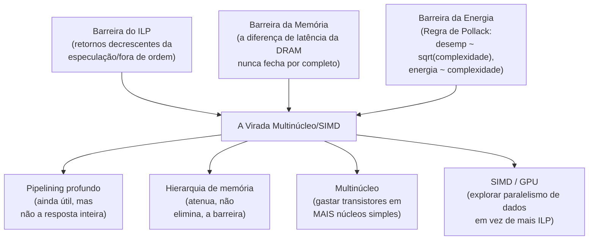

## Objetivos de Aprendizagem

- Nomear e explicar, numa frase cada, a barreira do ILP, a barreira da memória e a barreira da energia.
- Explicar como cada barreira se liga a um conceito específico anterior desta disciplina, usando o vocabulário da Lei de Ferro o tempo todo.
- Explicar por que essas três barreiras, chegando mais ou menos no mesmo momento histórico, juntas forçaram uma virada arquitetural genuína, e não um ajuste incremental.
- Rastrear, para uma carga de trabalho concreta, quais das quatro grandes técnicas desta disciplina (pipelining, hierarquia de memória, multinúcleo, SIMD/GPU) de fato ajudariam e quais não.
- Identificar explicitamente o que esta disciplina deixou de fora de propósito (a Lei de Amdahl e o modelo de programação paralela) e onde esse material está reservado.

## Contexto e Motivação

Esta disciplina começou com uma única equação, a Lei de Ferro, tempo de CPU = Contagem de Instruções × CPI × Tempo de Ciclo de Clock, e todo conceito desde então foi uma tentativa de mover um dos seus três fatores numa direção favorável: o pipelining encurtou o tempo de ciclo de clock; a previsão de desvios e a hierarquia de memória reduziram o CPI; o multinúcleo e o SIMD reduziram o trabalho efetivo por núcleo, ou a contagem efetiva de instruções por elemento de dado. O trabalho deste projeto final é dar um passo atrás e mostrar que essas técnicas não foram inventadas de forma independente, como ferramentas sem relação usadas uma de cada vez: elas são, histórica e tecnicamente, respostas conectadas a três limites específicos que chegaram mais ou menos ao mesmo tempo e, juntos, forçaram a indústria inteira a mudar de direção.

## Teoria Central

### A barreira do ILP

Execução Especulativa e Fora de Ordem descreveu técnicas para extrair mais paralelismo em nível de instrução (ILP) de um único fluxo de instruções: executar além de desvios não confirmados, deixar instruções independentes correrem à frente de instruções paradas. Essas técnicas têm um limite real: programas reais só contêm uma certa quantidade de trabalho genuinamente independente e executável ao mesmo tempo em qualquer ponto, e o hardware necessário para encontrar e explorar cada vez mais dele (reorder buffers maiores, especulação mais agressiva, emissão mais larga) cresce em custo e complexidade mais rápido do que os retornos decrescentes que produz. Essa é a **barreira do ILP**: levar o paralelismo de fluxo único de instruções cada vez mais longe acaba esgotando o trabalho independente a explorar, não importa quanto hardware seja jogado na tarefa de encontrá-lo.

### A barreira da memória

Tempo Médio de Acesso à Memória e Caches Multinível mostrou que o AMAT, mesmo com uma hierarquia multinível bem projetada, nunca fica totalmente isolado da latência física real da DRAM: uma falha de cache no nível mais profundo ainda custa na ordem de centenas de ciclos, uma diferença que, historicamente, cresceu em vez de diminuir, porque as velocidades de clock dos processadores melhoraram muito mais rápido ao longo das décadas do que a latência da DRAM. Essa é a **barreira da memória**: por mais engenhosa que seja a hierarquia de cache, alguma fração dos acessos sempre vai pagar uma penalidade real, grande e (em relação à velocidade do processador) cada vez pior para chegar à memória principal.

### A barreira da energia

Por que Multinúcleo: a Barreira da Energia desenvolveu esta diretamente: a Regra de Pollack significa que o desempenho de um único núcleo escala só com a raiz quadrada da complexidade acrescentada, enquanto seu consumo de energia escala linearmente. É uma restrição física genuína (dissipação de calor, e não só custo) sobre o quanto um único núcleo ainda pode ser escalado de forma útil.

### Por que três barreiras chegando juntas forçaram uma virada, e não um ajuste



*Uma* só dessas três barreiras, isolada, talvez pudesse ter sido respondida forçando mais as mesmas técnicas de núcleo único que tinham funcionado por décadas: uma cache maior para combater só a barreira da memória, especulação mais agressiva para combater só a barreira do ILP. O que fez de meados dos anos 2000 uma virada genuína, e não um exercício de ajuste incremental, foi que as três barreiras chegaram quase ao mesmo tempo, cada uma reduzindo de forma independente o retorno de "fazer o núcleo único maior e mais esperto". Foi exatamente isso que fez de "construir mais núcleos, mais simples, e explorar o paralelismo de dados dentro de cada um" (multinúcleo mais SIMD/GPU, os dois últimos blocos desta disciplina) a resposta real e historicamente documentada da indústria, como o ensaio de Herb Sutter nomeou diretamente.

### Onde cada técnica desta disciplina se encaixa nesta história

```text
Técnica                        A que barreira responde                Conceito(s)
-----------------------------  -------------------------------------  ---------------------------
Pipelining                      (anterior à era das "barreiras":       the-5-stage-risc-pipeline,
                                 uma técnica fundamental, e não         e os conceitos de hazards
                                 ela própria uma resposta a uma barreira)
Previsão de desvios,            Barreira do ILP: extrai mais           branch-prediction,
execução especulativa/OoO       paralelismo de UM fluxo,               speculative-and-out-of-
                                 até ele se esgotar                     order-execution
Hierarquia de memória / cache   Barreira da memória: atenua, mas       the-memory-hierarchy-and-
                                 nunca elimina por completo, a          locality até cache-
                                 diferença de latência da DRAM          friendly-code
Multinúcleo                     Barreira da energia: melhor            why-multicore-the-power-
                                 desempenho por watt com vários         wall até false-sharing
                                 núcleos simples do que com um complexo
SIMD / GPU                      Barreira do ILP (de outro jeito):      flynns-taxonomy-and-simd,
                                 explora paralelismo de DADOS em vez    gpu-architecture-and-the-
                                 de paralelismo em nível de instrução   simt-execution-model
```

## Exemplos Resolvidos

### Exemplo 1: diagnosticando quais técnicas ajudam uma carga de trabalho específica

Uma carga de trabalho faz uma longa cadeia inerentemente sequencial de cálculos dependentes (cada passo precisa do resultado do anterior), sobre uma quantidade modesta de dados.

```text
Pipelining:             Ajuda um pouco (toda carga de trabalho se beneficia de um ciclo
                        de clock mais curto, dentro dos limites de hazards já vistos).
Previsão de desvios/OoO: Ajuda limitada: uma cadeia de dependências de fato sequencial
                        tem pouco trabalho independente para a execução OoO
                        encontrar, batendo direto na barreira do ILP.
Hierarquia de memória:  Ajuda se os dados modestos couberem com folga na cache
                        (provável, dada a "quantidade modesta de dados").
Multinúcleo:            POUCA OU NENHUMA AJUDA: esta carga de trabalho é inerentemente
                        sequencial; núcleos extras ficam parados sem nada
                        independente para rodar (exatamente a ressalva do Exemplo 2
                        de why-multicore-the-power-wall).
SIMD/GPU:               POUCA OU NENHUMA AJUDA: não há paralelismo de dados para
                        explorar; cada passo depende do anterior.
```

Esta carga de trabalho é precisamente o caso sobre o qual o ensaio de Herb Sutter alertou os desenvolvedores de software: um programa que se beneficiava automaticamente de toda técnica focada em núcleo único dos primeiros dois terços desta disciplina vai ver quase nenhum dos ganhos que o hardware multinúcleo ou SIMD pode oferecer, a menos que seja fundamentalmente reestruturado; exatamente o fardo, do lado do software, que a barreira da energia transferiu para os programadores.

### Exemplo 2: o mesmo diagnóstico para outra carga de trabalho

Uma carga de trabalho processa de forma independente cada uma de um milhão de imagens sem relação entre si com a mesma operação de filtro.

```text
Pipelining, previsão de desvios, hierarquia de memória: todos ainda ajudam, como sempre.
Multinúcleo:    Ajuda substancial: um milhão de unidades de trabalho genuinamente
                independentes podem ser divididas entre todos os núcleos disponíveis.
SIMD/GPU:       Ajuda substancial: a mesma operação aplicada de forma uniforme
                sobre enormes quantidades de dados é exatamente o ponto forte do SIMD e de
                uma GPU, como os dois conceitos anteriores estabeleceram diretamente.
```

O contraste com o Exemplo 1 é todo o ponto deste projeto final: as técnicas posteriores desta disciplina (multinúcleo, SIMD/GPU) não são aceleradores universais que ajudam todo programa por igual; elas recompensam especificamente cargas de trabalho com estrutura real independente ou de paralelismo de dados, e a carga inerentemente sequencial do Exemplo 1 não tem nenhuma para explorar.

### Exemplo 3: o que esta disciplina deliberadamente não cobriu

```text
A Lei de Amdahl (quantificar exatamente quanto uma porção sequencial fixa de
um programa limita o ganho máximo possível ao acrescentar mais recursos
paralelos) é material real e essencial para raciocinar com precisão sobre
casos como o Exemplo 1 e o Exemplo 2, mas está reservada para
`systems/parallel-computing`, ainda não alcançada neste currículo, que
também cobre os modelos de PROGRAMAÇÃO reais (threads, OpenMP, kernels
CUDA/OpenCL) necessários para explorar as capacidades de hardware que esta
disciplina descreveu só no nível da arquitetura.
```

Esta disciplina construiu o vocabulário de hardware (o que a arquitetura multinúcleo e SIMD/GPU de fato oferece, e por que existe) justamente para que o tratamento posterior, mais quantitativo e focado em programação, de `systems/parallel-computing` tenha uma base sólida sobre a qual construir, em vez de precisar reexplicar coerência de cache ou SIMT do zero.

## Equívocos Comuns e Armadilhas

- **"Hardware multinúcleo e SIMD/GPU acelera automaticamente qualquer programa."** O Exemplo 1 é o contraexemplo direto: hardware capaz de paralelismo massivo não traz benefício algum a uma carga de trabalho sem estrutura independente ou de paralelismo de dados para explorar, uma limitação genuína e importante que este projeto final torna explícita, em vez de varrer para debaixo do tapete.
- **"A barreira do ILP, a da memória e a da energia são três nomes para o mesmo problema de fundo."** São três limites técnicos genuinamente distintos (retornos decrescentes ao extrair paralelismo de um fluxo de instruções; a latência física teimosa da DRAM; restrições de energia/calor sobre a complexidade de um núcleo único) que por acaso convergiram historicamente. Entendê-los como três pressões separadas e específicas, cada uma ligada a um conceito anterior específico desta tabela, é mais útil do que tratar "as coisas ficaram difíceis por volta de 2005" como uma barreira única, vaga e indiferenciada.
- **"Esta disciplina já cobriu tudo o que é preciso para escrever programas paralelos rápidos."** O Exemplo 3 diz diretamente o que falta: a matemática precisa da Lei de Amdahl que limita o ganho e todo o modelo prático de programação (threads, sincronização, CUDA/OpenCL), material real, substancial e separado que esta disciplina adiou de propósito, e não esqueceu.
- **"O pipelining foi inventado em resposta a essas três barreiras, assim como o multinúcleo e o SIMD."** O pipelining (o primeiríssimo bloco desta disciplina) é décadas anterior à era da barreira da energia de meados dos anos 2000: é uma técnica fundamental de núcleo único, e não ela própria uma resposta a nenhuma das três barreiras que este projeto final nomeia, e é por isso que a tabela-resumo acima o marca separado das outras quatro técnicas.

## Resumo

Três limites reais e historicamente convergentes (a barreira do ILP, os retornos decrescentes ao extrair mais paralelismo de um fluxo de instruções, desenvolvida pelo conceito de execução especulativa/fora de ordem desta disciplina; a barreira da memória, a latência da DRAM que nenhuma hierarquia de cache esconde por completo, desenvolvida pelo conceito de AMAT; e a barreira da energia, a escala desempenho-contra-energia da Regra de Pollack, desenvolvida pelo conceito de motivação do multinúcleo) juntos tornaram "construir um núcleo cada vez mais complexo" uma troca cada vez pior, e fizeram de "construir vários núcleos mais simples e explorar o paralelismo de dados dentro de cada um" (os blocos de multinúcleo e SIMD/GPU desta disciplina) a resposta real e historicamente documentada da indústria. Essa resposta não é universal: cargas de trabalho com estrutura genuína independente ou de paralelismo de dados se beneficiam enormemente (Exemplo 2); cargas inerentemente sequenciais quase não veem benefício (Exemplo 1), precisamente a consequência do lado do software sobre a qual o ensaio de Herb Sutter alertou no início do bloco de multinúcleo. Esta disciplina construiu o vocabulário arquitetural (pipelining, a hierarquia de memória, a coerência multinúcleo e a execução SIMD/GPU) sobre o qual a disciplina posterior e mais avançada do currículo, `systems/parallel-computing`, vai construir diretamente, acrescentando a matemática precisa (a Lei de Amdahl) e os modelos práticos de programação que esta disciplina deixou de propósito para esse tratamento posterior e dedicado.

## Documentation Links

- [Herb Sutter: The Free Lunch Is Over](http://www.gotw.ca/publications/concurrency-ddj.htm): o ensaio histórico em torno do qual a narrativa das três barreiras deste projeto final é construída, nomeando diretamente a virada da indústria.
- [ACM/IEEE CS2013: Architecture and Organization Knowledge Area](https://csed.acm.org/knowledge-areas-architecture-and-organization-ar-cs2013-version/): o arcabouço curricular em torno de cujas unidades de Performance Enhancements e Multiprocessing os blocos posteriores desta disciplina se organizam.
