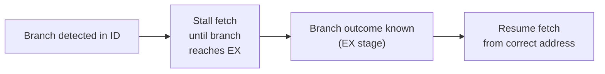

## Learning Objectives

- Explain why a branch instruction's outcome is not known until later in the pipeline than the instructions fetched immediately after it.
- Distinguish a control hazard from a data hazard: what is uncertain in each case.
- Compute the branch penalty (in stall/flush cycles) for a naive "always stall until resolved" policy, given the pipeline stage at which the branch outcome becomes known.
- Explain the "flush" mechanism: discarding incorrectly fetched instructions and refetching from the correct address.
- Explain why branches are common enough in real code that even a modest per-branch penalty becomes a serious aggregate cost, motivating branch prediction as the next concept.

## Context & Motivation

The two hazard types covered so far — structural and data — share a common shape: some instruction produces or needs a physical resource or a value, and the pipeline's job is to route it correctly and on time. A control hazard is a different kind of problem entirely, one that has nothing to do with values or resources and everything to do with *which instructions the pipeline should even be fetching in the first place*.

Instruction Formats and Addressing Modes, back in Digital Logic & Computer Organization, already established that a conditional branch instruction decides at runtime whether execution continues to the next sequential instruction or jumps to some other target address. In an unpipelined, single-cycle CPU this decision and the fetch of whatever instruction comes next happen in the same clock cycle, so there is no ambiguity to speak of. The moment instructions are pipelined, though, the CPU must fetch new instructions on every single cycle to keep the pipeline full — including cycles that occur *before* a branch a few stages back has even finished being decoded, let alone evaluated. The pipeline is forced to guess what to fetch next, before it has any principled way of knowing.

## Core Theory

### Where the branch outcome actually becomes known

In this discipline's 5-stage pipeline, a branch instruction's condition (is a register equal to zero? is one value less than another?) is evaluated using the ALU in the **EX** stage — the third stage, the same place ordinary arithmetic happens. But by the time a branch reaches EX, the pipeline has already fetched two more instructions behind it (one in ID, one in IF), under the default assumption that execution simply continues sequentially:

```text
Cycle:              1    2    3    4    5    6
beq x1,x2,target:   IF   ID   EX   MEM  WB
Instr right after:       IF   ID   EX   MEM  WB     ← fetched before branch outcome known
Instr 2 after:                 IF   ID   EX   MEM  WB    ← fetched before branch outcome known
```

If the branch turns out to be taken (the condition holds), both of those already-fetched instructions were fetched from the *wrong* place — the sequential path, not the branch target — and must be discarded.

### Control hazard vs. data hazard, precisely

A data hazard is about a *value* not yet being ready; the identity of which instructions to execute next was never in question. A control hazard is about *not yet knowing which instructions are even the correct ones to be fetching* — a strictly different kind of uncertainty, and one forwarding (which only routes already-known values) cannot help with at all.

### The naive fix: stall until resolved

The simplest possible correct policy is to stop fetching any new instructions the moment a branch is detected (in ID, once it's recognized as a branch), and wait until the branch reaches EX and its outcome is known before fetching anything further:



This is always correct — it never fetches from the wrong place — but it is expensive: in this pipeline, a branch takes 2 cycles (from ID, where it's recognized, to EX, where its outcome is known) before the pipeline can safely resume fetching, meaning 2 stall cycles are paid on **every single branch**, taken or not.

### The alternative: predict, fetch anyway, and flush if wrong

A less conservative, and far more common, real design instead **predicts** a direction (most simply: always assume "not taken," i.e., keep fetching sequentially) and speculatively continues fetching and even executing those instructions. If the prediction turns out correct, no time was lost at all — this is the entire appeal of the approach. If the prediction turns out wrong, the pipeline must **flush** — discard — every instruction fetched based on the wrong guess (setting their control signals so they behave as no-ops, as if they were never fetched) and refetch from the actually correct address:

```text
Cycle:              1    2    3    4    5    6    7
beq x1,x2,target:   IF   ID   EX   MEM  WB
(predicted) next:        IF   ID   EX  (flushed if misprediction, i.e. branch taken)
(predicted) next+1:            IF  (flushed if misprediction)
correct target instr:               IF   ID   EX   MEM  WB   (refetched)
```

Here, guessing "not taken" and being wrong costs exactly 2 flushed instructions and a 2-cycle penalty before the correct instruction stream resumes — the same 2-cycle cost as the naive always-stall policy, but paid **only when the prediction is wrong**, not on every single branch. This is the entire point of branch prediction, the next concept: if most branches are predictable, the *average* penalty across many branches drops far below the naive policy's guaranteed 2 cycles every time.

### Why this matters at all: how common branches really are

Real programs branch extremely often — conditional statements, loop backedges, and function calls and returns are all realized as branches or jumps, and empirical measurements of real code commonly find roughly one branch or jump for every 5 to 6 instructions executed. Even a modest 2-cycle penalty, applied to even a fraction of that many instructions, measurably raises the effective CPI from the Iron Law — which is exactly why this hazard, more than the structural or ordinary data hazards already covered, is worth an entire dedicated technique (branch prediction) rather than being absorbed as a fixed, accepted cost.

## Worked Examples

### Example 1: CPI cost of the naive always-stall policy

Suppose 15% of all instructions in a program are branches, and the naive policy stalls exactly 2 cycles on every single one, regardless of outcome:

```text
Extra cycles per instruction, on average = 0.15 × 2 = 0.30
Effective CPI (base CPI 1, ignoring other hazards) = 1 + 0.30 = 1.30
```

A 30% CPI increase purely from branches, under the pessimistic always-stall policy — a serious cost that directly motivates finding something better.

### Example 2: CPI cost with prediction and a known misprediction rate

Suppose the same 15%-branch program instead predicts every branch (fetch continues speculatively) and is correct 80% of the time, paying the same 2-cycle flush penalty only on the 20% it gets wrong:

```text
Extra cycles per instruction, on average = 0.15 × (0.20 × 2) = 0.15 × 0.40 = 0.06
Effective CPI = 1 + 0.06 = 1.06
```

Compared to Example 1's 1.30, an 80%-accurate predictor drops the effective CPI to 1.06 — the branch-related cost falls by roughly 5×, using the exact same 2-cycle hardware penalty per misprediction, purely because most guesses turn out correct and cost nothing at all. This concrete gap is the entire motivation for the next concept.

### Example 3: Tracing a specific flush

```text
beq x1, x2, LOOP_START    # predicted "not taken"; branch actually taken
addi x3, x3, 1             # fetched speculatively — must be flushed
sub  x4, x4, x5             # fetched speculatively — must be flushed
LOOP_START:
mul  x6, x6, x7             # the actually correct next instruction
```

```text
Cycle:            1    2    3    4    5
beq:              IF   ID   EX   MEM  WB
addi (wrong):          IF   ID   EX*  (flushed — turned into a bubble/no-op)
sub  (wrong):               IF   (flushed before it even reaches ID)
mul  (correct):                  IF   ID   EX   MEM  WB   (refetched from LOOP_START)
```

Both `addi` and `sub` were legitimately fetched — the hardware had no way yet to know the branch would be taken — and both are discarded the instant the branch's true outcome is known in EX (cycle 3), at which point the fetch unit is redirected to `LOOP_START` and `mul` is fetched correctly starting the next cycle.

## Common Misconceptions & Pitfalls

- **"A control hazard is just a slower version of a data hazard."** They are fundamentally different: a data hazard is about a known-to-exist value not yet being ready; a control hazard is about not yet knowing *which instructions are even correct to fetch*. Forwarding, the fix for data hazards, has no application here at all.
- **"Stalling and flushing cost the same thing."** They can end up costing the same number of cycles in a specific case (Examples 1 and 3 both show a 2-cycle cost here), but they are mechanically different: stalling never fetches wrong instructions in the first place; flushing fetches speculatively and discards work already done if the guess was wrong — which is why flushing can, in principle, cost *nothing* when the guess is right, while stalling always costs the full penalty every time.
- **"Branches are rare enough that this hazard doesn't matter much in practice."** Example 1's 15%-branch, 30%-CPI-increase result, and the widely cited real-world figure of roughly one branch per 5-6 instructions, show the opposite — control hazards are one of the most consequential hazard categories in real pipelined processors, which is precisely why branch prediction, the next concept, is such a heavily studied technique.
- **"A flushed instruction has already changed the register file or memory and needs to be undone."** In this simple in-order pipeline, a flushed instruction is caught before it reaches its WB (or, for a store, MEM) stage — it is turned into a no-op before it can commit any state change, so nothing needs to be "undone," only discarded. Undoing already-committed state is a much harder problem that only arises in the more aggressive speculative designs previewed two concepts from now.

## Summary

A control hazard arises because a branch's true outcome isn't known until its EX stage, several cycles after instructions following it have already had to be fetched under some assumption — a fundamentally different kind of uncertainty than a data hazard, since the question here is which instructions are even correct to fetch, not whether a known value is ready in time. A naive always-stall policy pays a fixed 2-cycle penalty on every single branch; the standard alternative predicts a direction, continues fetching speculatively, and flushes (discards, before any state is committed) the wrong guesses — paying that same 2-cycle penalty only when the prediction is wrong, which for a reasonably accurate predictor is a small fraction of the time. Given how frequently real programs branch, the gap between a naive policy's guaranteed cost and a good predictor's occasional cost is large enough (Example 2) to justify the entire next concept: branch prediction, which develops exactly how a real predictor decides which direction to guess.

## Documentation Links

- [Harris & Harris — Digital Design and Computer Architecture, RISC-V Edition](https://shop.elsevier.com/books/digital-design-and-computer-architecture-risc-v-edition/harris/978-0-12-820064-3) — covers control hazards, the stall-vs-predict-and-flush tradeoff, and branch penalty computation for the pipelined RISC-V processor.
- [MIT 6.004 — Pipelining the Beta](https://ocw.mit.edu/courses/6-004-computation-structures-spring-2017/pages/c15/) — covers control hazards and flush handling for the pipelined Beta.
