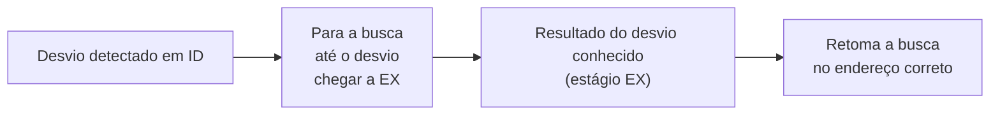

## Objetivos de Aprendizagem

- Explicar por que o resultado de uma instrução de desvio só é conhecido num ponto do pipeline posterior às instruções buscadas logo depois dela.
- Distinguir um hazard de controle de um hazard de dados: o que é incerto em cada caso.
- Calcular a penalidade de desvio (em ciclos de parada/descarte) para uma política ingênua de "sempre parar até resolver", dado o estágio do pipeline em que o resultado do desvio passa a ser conhecido.
- Explicar o mecanismo de "flush": descartar instruções buscadas incorretamente e buscar de novo a partir do endereço correto.
- Explicar por que desvios são comuns o bastante no código real para que até uma penalidade modesta por desvio vire um custo agregado sério, motivando a previsão de desvios como o próximo conceito.

## Contexto e Motivação

Os dois tipos de hazard vistos até agora (estrutural e de dados) compartilham uma forma comum: alguma instrução produz ou precisa de um recurso físico ou de um valor, e o trabalho do pipeline é encaminhá-lo corretamente e a tempo. Um hazard de controle é um tipo de problema totalmente diferente, que não tem nada a ver com valores ou recursos e tudo a ver com *quais instruções o pipeline deveria sequer estar buscando*, para começo de conversa.

Instruction Formats and Addressing Modes, lá em Lógica Digital e Organização de Computadores, já estabeleceu que uma instrução de desvio condicional decide em tempo de execução se a execução continua na próxima instrução sequencial ou salta para algum outro endereço de destino. Numa CPU sem pipeline, de ciclo único, essa decisão e a busca da próxima instrução, qualquer que seja, acontecem no mesmo ciclo de clock, então não há ambiguidade alguma. No momento em que as instruções entram num pipeline, porém, a CPU precisa buscar instruções novas a cada ciclo para manter o pipeline cheio, incluindo ciclos que acontecem *antes* que um desvio alguns estágios atrás tenha sequer terminado de ser decodificado, quanto mais avaliado. O pipeline é forçado a adivinhar o que buscar em seguida, antes de ter qualquer forma fundamentada de saber.

## Teoria Central

### Onde o resultado do desvio de fato passa a ser conhecido

No pipeline de 5 estágios desta disciplina, a condição de uma instrução de desvio (um registrador é igual a zero? um valor é menor que outro?) é avaliada usando a ULA no estágio **EX**, o terceiro estágio, o mesmo lugar onde acontece a aritmética comum. Mas, quando um desvio chega a EX, o pipeline já buscou mais duas instruções atrás dele (uma em ID, uma em IF), sob a suposição padrão de que a execução simplesmente continua em sequência:

```text
Ciclo:              1    2    3    4    5    6
beq x1,x2,target:   IF   ID   EX   MEM  WB
Instr logo depois:       IF   ID   EX   MEM  WB     ← buscada antes de o resultado do desvio ser conhecido
Instr 2 depois:                IF   ID   EX   MEM  WB    ← buscada antes de o resultado do desvio ser conhecido
```

Se o desvio acabar sendo tomado (a condição vale), as duas instruções já buscadas vieram do lugar *errado* (o caminho sequencial, e não o destino do desvio) e precisam ser descartadas.

### Hazard de controle vs. hazard de dados, com precisão

Um hazard de dados trata de um *valor* que ainda não está pronto; a identidade de quais instruções executar em seguida nunca esteve em questão. Um hazard de controle trata de *ainda não saber quais instruções são sequer as corretas para buscar*, um tipo de incerteza estritamente diferente, e com o qual o forwarding (que só encaminha valores já conhecidos) não ajuda em nada.

### A correção ingênua: parar até resolver

A política correta mais simples possível é parar de buscar qualquer instrução nova no momento em que um desvio é detectado (em ID, quando é reconhecido como desvio) e esperar até o desvio chegar a EX e seu resultado ser conhecido antes de buscar qualquer outra coisa:



Isso é sempre correto (nunca busca do lugar errado), mas é caro: neste pipeline, um desvio leva 2 ciclos (de ID, onde é reconhecido, até EX, onde seu resultado é conhecido) antes que o pipeline possa retomar a busca com segurança, o que significa que 2 ciclos de parada são pagos em **todo desvio**, tomado ou não.

### A alternativa: prever, buscar mesmo assim e descartar se errar

Um projeto real menos conservador, e muito mais comum, em vez disso **prevê** uma direção (no caso mais simples: sempre supor "não tomado", ou seja, continuar buscando em sequência) e continua especulativamente buscando, e até executando, essas instruções. Se a previsão se mostrar correta, nenhum tempo foi perdido; esse é todo o atrativo da abordagem. Se a previsão se mostrar errada, o pipeline precisa fazer **flush**, descartar toda instrução buscada com base no palpite errado (definindo seus sinais de controle para que se comportem como no-ops, como se nunca tivessem sido buscadas), e buscar de novo a partir do endereço de fato correto:

```text
Ciclo:              1    2    3    4    5    6    7
beq x1,x2,target:   IF   ID   EX   MEM  WB
próxima (prevista):      IF   ID   EX  (descartada se houver erro de previsão, ou seja, desvio tomado)
próxima+1 (prevista):          IF  (descartada se houver erro de previsão)
instr do destino correto:           IF   ID   EX   MEM  WB   (buscada de novo)
```

Aqui, apostar em "não tomado" e errar custa exatamente 2 instruções descartadas e uma penalidade de 2 ciclos antes que o fluxo correto de instruções seja retomado: o mesmo custo de 2 ciclos da política ingênua de sempre parar, mas pago **só quando a previsão erra**, e não em todo desvio. Esse é todo o ponto da previsão de desvios, o próximo conceito: se a maioria dos desvios for previsível, a penalidade *média* ao longo de muitos desvios cai muito abaixo dos 2 ciclos garantidos toda vez da política ingênua.

### Por que isso sequer importa: quão comuns os desvios realmente são

Programas reais desviam com muita frequência: comandos condicionais, desvios de volta de laços e chamadas e retornos de função são todos realizados como desvios ou saltos, e medições empíricas de código real costumam encontrar mais ou menos um desvio ou salto a cada 5 a 6 instruções executadas. Até uma penalidade modesta de 2 ciclos, aplicada a uma fração dessa quantidade de instruções, aumenta de forma mensurável o CPI efetivo da Lei de Ferro, e é exatamente por isso que este hazard, mais que os hazards estruturais ou de dados comuns já vistos, merece uma técnica dedicada inteira (a previsão de desvios), em vez de ser absorvido como um custo fixo e aceito.

## Exemplos Resolvidos

### Exemplo 1: o custo em CPI da política ingênua de sempre parar

Suponha que 15% de todas as instruções de um programa sejam desvios e que a política ingênua pare exatamente 2 ciclos em cada um deles, qualquer que seja o resultado:

```text
Ciclos extras por instrução, em média = 0.15 × 2 = 0.30
CPI efetivo (CPI base 1, ignorando outros hazards) = 1 + 0.30 = 1.30
```

Um aumento de 30% no CPI só por causa dos desvios, sob a política pessimista de sempre parar: um custo sério que motiva diretamente procurar algo melhor.

### Exemplo 2: o custo em CPI com previsão e uma taxa de erro de previsão conhecida

Suponha que o mesmo programa com 15% de desvios, em vez disso, preveja todo desvio (a busca continua especulativamente) e acerte 80% das vezes, pagando a mesma penalidade de flush de 2 ciclos só nos 20% em que erra:

```text
Ciclos extras por instrução, em média = 0.15 × (0.20 × 2) = 0.15 × 0.40 = 0.06
CPI efetivo = 1 + 0.06 = 1.06
```

Comparado com o 1.30 do Exemplo 1, um preditor com 80% de precisão derruba o CPI efetivo para 1.06: o custo relacionado a desvios cai cerca de 5×, usando exatamente a mesma penalidade de hardware de 2 ciclos por erro de previsão, só porque a maioria dos palpites se mostra correta e não custa nada. Essa diferença concreta é toda a motivação do próximo conceito.

### Exemplo 3: rastreando um flush específico

```text
beq x1, x2, LOOP_START    # previsto "não tomado"; o desvio é de fato tomado
addi x3, x3, 1             # buscada especulativamente: precisa ser descartada
sub  x4, x4, x5             # buscada especulativamente: precisa ser descartada
LOOP_START:
mul  x6, x6, x7             # a próxima instrução de fato correta
```

```text
Ciclo:            1    2    3    4    5
beq:              IF   ID   EX   MEM  WB
addi (errada):         IF   ID   EX*  (descartada: virou bolha/no-op)
sub  (errada):              IF   (descartada antes mesmo de chegar a ID)
mul  (correta):                  IF   ID   EX   MEM  WB   (buscada de novo a partir de LOOP_START)
```

Tanto `addi` quanto `sub` foram buscadas legitimamente (o hardware ainda não tinha como saber que o desvio seria tomado), e as duas são descartadas no instante em que o resultado real do desvio é conhecido em EX (ciclo 3), momento em que a unidade de busca é redirecionada para `LOOP_START` e `mul` é buscada corretamente a partir do ciclo seguinte.

## Equívocos Comuns e Armadilhas

- **"Um hazard de controle é só uma versão mais lenta de um hazard de dados."** Eles são fundamentalmente diferentes: um hazard de dados trata de um valor que sabidamente existe e ainda não está pronto; um hazard de controle trata de ainda não saber *quais instruções são sequer corretas para buscar*. O forwarding, a correção dos hazards de dados, não tem aplicação nenhuma aqui.
- **"Parar e descartar custam a mesma coisa."** Podem acabar custando o mesmo número de ciclos num caso específico (os Exemplos 1 e 3 mostram um custo de 2 ciclos aqui), mas são mecanicamente diferentes: parar nunca busca instruções erradas, para começo de conversa; descartar busca especulativamente e joga fora o trabalho já feito se o palpite estava errado. É por isso que descartar pode, em princípio, custar *nada* quando o palpite está certo, enquanto parar sempre custa a penalidade inteira toda vez.
- **"Desvios são raros o bastante para que este hazard não importe muito na prática."** O resultado do Exemplo 1 (15% de desvios, 30% de aumento de CPI) e o número real amplamente citado de cerca de um desvio a cada 5-6 instruções mostram o contrário: os hazards de controle são uma das categorias de hazard com mais consequências em processadores reais com pipeline, e é justamente por isso que a previsão de desvios, o próximo conceito, é uma técnica tão estudada.
- **"Uma instrução descartada já mudou o banco de registradores ou a memória e precisa ser desfeita."** Neste pipeline simples em ordem, uma instrução descartada é pega antes de chegar ao seu estágio WB (ou, num store, MEM): ela vira um no-op antes de poder efetivar qualquer mudança de estado, então nada precisa ser "desfeito", só descartado. Desfazer um estado já efetivado é um problema bem mais difícil, que só surge nos projetos especulativos mais agressivos antecipados dois conceitos adiante.

## Resumo

Um hazard de controle surge porque o resultado real de um desvio só é conhecido no seu estágio EX, vários ciclos depois de as instruções que o seguem já terem tido de ser buscadas sob alguma suposição: um tipo de incerteza fundamentalmente diferente de um hazard de dados, já que a pergunta aqui é quais instruções são sequer corretas para buscar, e não se um valor conhecido fica pronto a tempo. Uma política ingênua de sempre parar paga uma penalidade fixa de 2 ciclos em todo desvio; a alternativa padrão prevê uma direção, continua buscando especulativamente e descarta (antes de qualquer estado ser efetivado) os palpites errados, pagando essa mesma penalidade de 2 ciclos só quando a previsão erra, o que, para um preditor razoavelmente preciso, é uma pequena fração das vezes. Dada a frequência com que programas reais desviam, a diferença entre o custo garantido de uma política ingênua e o custo ocasional de um bom preditor é grande o bastante (Exemplo 2) para justificar todo o próximo conceito: a previsão de desvios, que desenvolve exatamente como um preditor real decide em que direção apostar.

## Documentation Links

- [Harris & Harris: Digital Design and Computer Architecture, RISC-V Edition](https://shop.elsevier.com/books/digital-design-and-computer-architecture-risc-v-edition/harris/978-0-12-820064-3): cobre hazards de controle, a troca entre parar e prever-e-descartar e o cálculo da penalidade de desvio para o processador RISC-V com pipeline.
- [MIT 6.004: Pipelining the Beta](https://ocw.mit.edu/courses/6-004-computation-structures-spring-2017/pages/c15/): cobre hazards de controle e o tratamento de flush para o Beta com pipeline.
