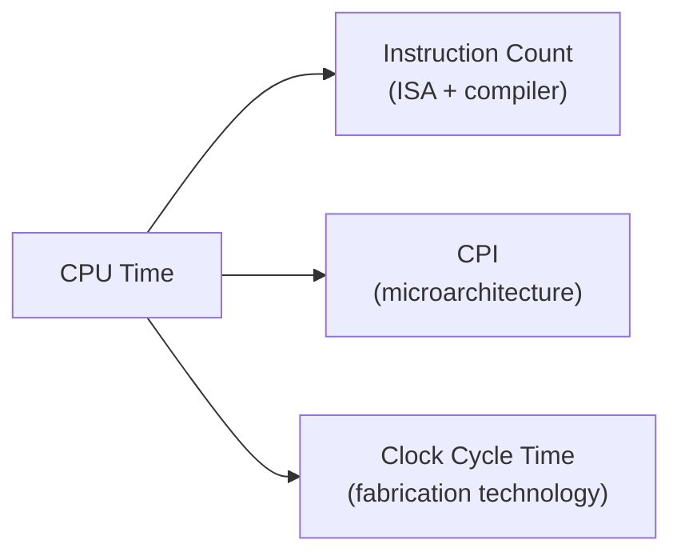

## Learning Objectives

- State the CPU performance equation (the "Iron Law") and identify the three factors it multiplies together.
- Explain which layer of the system — ISA/compiler, microarchitecture, or fabrication technology — controls each of the three factors.
- Compute CPU time from instruction count, CPI, and clock cycle time, and explain why improving one factor can silently worsen another.
- Distinguish CPU time (the only measure that actually matters to a user) from clock frequency and instruction count alone, and explain why each of those in isolation is a misleading performance metric.
- Preview how the rest of this discipline — pipelining, caching, multicore, SIMD — is organized as a set of techniques that each attack one specific factor of this same equation.

## Context & Motivation

Every technique this discipline is about to cover — pipelining, caching, branch prediction, multicore, SIMD — exists to make some real program run faster. Before any of those techniques can be evaluated, motivated, or even compared against each other, there has to be an agreed, precise definition of what "faster" means. Marketing numbers like clock frequency ("3.2 GHz!") or instruction count alone are famously misleading in isolation: a chip with a higher clock frequency can easily run a real program slower than a chip with a lower one, and a compiler that emits fewer instructions can easily produce a slower binary than one that emits more. Patterson and Hennessy's *Computer Organization and Design* — the textbook this course's teaching CPU and its successors are built to resemble — anchors the entire subject on a single equation, informally called the Iron Law of processor performance, that ties these quantities together correctly.

The reason this concept opens the discipline, rather than appearing as a footnote once pipelining is already built, is that it supplies the actual justification for everything that follows. Digital Logic & Computer Organization built a working single-cycle CPU and proved it correctly executes the teaching ISA — but it never asked whether that CPU is *fast*. This concept supplies the vocabulary to ask that question precisely, and the rest of Computer Architecture is best read as a sequence of answers: pipelining attacks one factor of the Iron Law, the memory hierarchy attacks a hidden assumption buried inside it, and multicore/SIMD attack it by changing what "one CPU" even means.

The payoff is a discipline that stays honest about tradeoffs instead of chasing a single number. Every optimization covered later in this course — a deeper pipeline, a bigger cache, branch prediction, out-of-order issue, more cores, wider SIMD lanes — will be judged by whether it actually reduces CPU time for real programs, not by whether it makes some isolated number (clock frequency, cache size, core count) look bigger on a spec sheet.

## Core Theory

### The equation

The Iron Law states:

```text
CPU time = Instruction Count × CPI × Clock Cycle Time
```

Equivalently, since clock cycle time is the reciprocal of clock frequency:

```text
CPU time = (Instruction Count × CPI) / Clock Frequency
```

Each of the three quantities on the right has a clean, separate meaning:

1. **Instruction Count (IC).** The total number of instructions a given program actually executes. This is a dynamic count (how many instructions actually run, including every loop iteration), not the static count of instructions in the compiled binary.
2. **Cycles Per Instruction (CPI).** The average number of clock cycles each executed instruction takes. In a single-cycle CPU this is trivially 1 for every instruction; the moment a CPU pipelines, stalls, or takes cache misses, CPI becomes a genuinely interesting average across instructions that individually take different numbers of cycles.
3. **Clock Cycle Time.** The duration, in seconds, of one clock cycle — the reciprocal of clock frequency. A 3.2 GHz chip has a clock cycle time of 1/(3.2×10⁹) ≈ 0.3125 nanoseconds.

### Three independently movable levers

The genuinely useful insight in the Iron Law is not the arithmetic — multiplying three numbers together is not deep — it's that each factor is controlled by a different layer of the system, and can be improved (or accidentally worsened) largely independently of the other two:

- **Instruction Count** is controlled mainly by the **ISA and the compiler**. A richer ISA, or a smarter compiler, can reduce the number of instructions needed to express the same program logic. This is the same territory covered by Instruction Formats and Addressing Modes and Assembly-to-Machine-Code Translation in Digital Logic & Computer Organization.
- **CPI** is controlled mainly by the **microarchitecture** — how the same ISA is actually implemented in hardware. A single-cycle design, a pipelined design, and a design with cache misses and branch mispredictions all execute the identical program (identical Instruction Count) with very different average CPI.
- **Clock Cycle Time** is controlled mainly by the **fabrication technology and circuit design** — transistor speed, wire delay, and how much combinational logic is crammed into a single pipeline stage between two clocked registers.

### Why the levers fight each other

The reason this equation drives an entire discipline rather than being solved once and forgotten is that these three levers are not free to move independently in practice — improving one very often actively worsens another, and every technique in this course is a specific answer to that tension:

- A pipelined CPU can lower clock cycle time (a shorter combinational path per stage means a faster clock), but only at the cost of raising CPI whenever a hazard forces a stall or a flush — exactly the tradeoff **Pipelining** analyzes stage by stage in the concepts that follow this one.
- A richer, more powerful instruction (lower Instruction Count) is often slower to decode and execute (higher CPI per instruction) and can lengthen the critical path that sets the clock cycle time — the real tension between RISC and CISC philosophies already named in Digital Logic & Computer Organization's `what-is-an-isa`.
- Adding more cores does nothing at all to the Iron Law for a program that only ever runs on one of them; it only helps once work is actually split across cores, which is a question about Instruction Count and CPI within *each* core running its own share of the program, and about a completely different metric (aggregate throughput) covered starting in `why-multicore-the-power-wall`.



## Worked Examples

### Example 1: Comparing two machines with different tradeoffs

Two machines run the identical compiled program, which executes exactly 2,000,000,000 (2 × 10⁹) instructions on both.

```text
Machine A: CPI = 1.0, clock frequency = 2.0 GHz (clock cycle time = 0.5 ns)
Machine B: CPI = 1.5, clock frequency = 3.6 GHz (clock cycle time ≈ 0.278 ns)
```

CPU time for Machine A:
```text
CPU time_A = IC × CPI × Clock Cycle Time
           = (2 × 10⁹) × 1.0 × 0.5 ns
           = 1.0 × 10⁹ ns = 1.0 second
```

CPU time for Machine B:
```text
CPU time_B = (2 × 10⁹) × 1.5 × 0.278 ns
           ≈ (2 × 10⁹) × 0.417 ns
           ≈ 0.833 second
```

Despite having a substantially higher CPI (1.5 versus 1.0), Machine B is faster overall, because its higher clock frequency more than compensates. A reader looking only at CPI would wrongly conclude Machine A is faster; a reader looking only at clock frequency would correctly guess B is faster here, but only by coincidence — the Iron Law is what actually proves it, and would just as easily have gone the other way with different numbers.

### Example 2: A "smaller" program that runs slower

A compiler optimization reduces a loop's Instruction Count from 5,000,000 to 4,000,000 by replacing several simple instructions with one more powerful (but more expensive to execute) instruction, raising the average CPI from 1.0 to 1.4. Clock cycle time is unchanged at 1 ns for both versions.

```text
Before: CPU time = 5,000,000 × 1.0 × 1 ns = 5,000,000 ns = 5.0 ms
After:  CPU time = 4,000,000 × 1.4 × 1 ns = 5,600,000 ns = 5.6 ms
```

The "optimization" that reduced instruction count by 20% actually made the program 12% slower, because it raised CPI by more than enough to offset the saved instructions. This is exactly why Instruction Count alone — the number a naive reading of assembly output might celebrate — is not a valid performance metric on its own; only the full product tells the truth.

### Example 3: Reading the rest of this discipline through the Iron Law

Given the technique, name which Iron Law factor it primarily targets:

```text
Technique                          Primary factor targeted
----------------------------------  ------------------------
Pipelining (5-stage pipeline)       Clock Cycle Time (↓, shorter per-stage logic)
                                     — at some CPI cost from hazards
Branch prediction                   CPI (↓, fewer stall/flush cycles)
Cache hierarchy                     CPI (↓, fewer stall cycles waiting on memory)
Multicore                           Neither, for one program on one core —
                                     changes the unit of "CPU time" being measured
SIMD / GPU                          Effective Instruction Count (↓ per data
                                     element, one instruction covers many)
```

The pattern to notice: nothing in this discipline is a free lunch that improves all three factors at once. Every technique studied from here forward is best understood as "which factor does this move, and what does it cost elsewhere" — precisely the analysis this concept exists to make possible.

## Common Misconceptions & Pitfalls

- **"A higher clock frequency always means a faster CPU."** Only if CPI and Instruction Count are held equal, which they almost never are between two different real designs — Example 1 shows a lower-frequency machine can still win, and a higher-frequency one can lose, depending on CPI.
- **"CPI below 1 is impossible."** It's impossible for a simple pipeline that issues at most one instruction per cycle, but real superscalar processors (briefly previewed in `speculative-and-out-of-order-execution`) can complete more than one instruction per cycle, giving CPI values below 1 (often expressed as IPC, instructions per cycle, above 1).
- **"Fewer instructions always means a faster program."** Example 2 shows a smaller Instruction Count can still lose if it comes with a large enough CPI increase — Instruction Count is only one of three multiplied factors, never a metric on its own.
- **"CPU time is the only thing that ever matters."** For a single sequential program, yes — but once multiple programs or multiple cores are involved (starting with `why-multicore-the-power-wall`), throughput (total work completed per unit time across everything running) becomes an equally real, sometimes more relevant, metric that the Iron Law as stated here does not by itself capture.
- **"Instruction count is a static property of the compiled binary."** It is a dynamic count of instructions actually executed at runtime, which depends on the specific input data (loop iteration counts, branches taken) — the same binary can have wildly different Instruction Counts on different inputs.

## Summary

The Iron Law — CPU time = Instruction Count × CPI × Clock Cycle Time — is the single equation this entire discipline is organized around: Instruction Count is set mainly by the ISA and compiler, CPI by the microarchitecture, and Clock Cycle Time by the fabrication technology, and no real design can move one of these factors without risking a cost to another. Every technique studied in the concepts that follow — pipelining, the memory hierarchy, branch prediction, multicore, SIMD, and GPU architecture — is best understood as a specific, deliberate move against one of these three factors, always paying attention to what it costs elsewhere. The next concept, `why-pipeline-latency-vs-throughput`, opens that sequence by asking exactly this question of the single-cycle CPU already built in Digital Logic & Computer Organization.

## Documentation Links

- [Cornell CS3410 — Pipelining & Performance Notes](https://www.cs.cornell.edu/courses/cs3410/2025sp/notes/pipelining.html) — course notes deriving and applying the CPU performance equation before introducing pipelining.
- [Harris & Harris — Digital Design and Computer Architecture, RISC-V Edition](https://shop.elsevier.com/books/digital-design-and-computer-architecture-risc-v-edition/harris/978-0-12-820064-3) — textbook building the same single-cycle CPU this discipline starts from, then analyzing and improving its performance.
