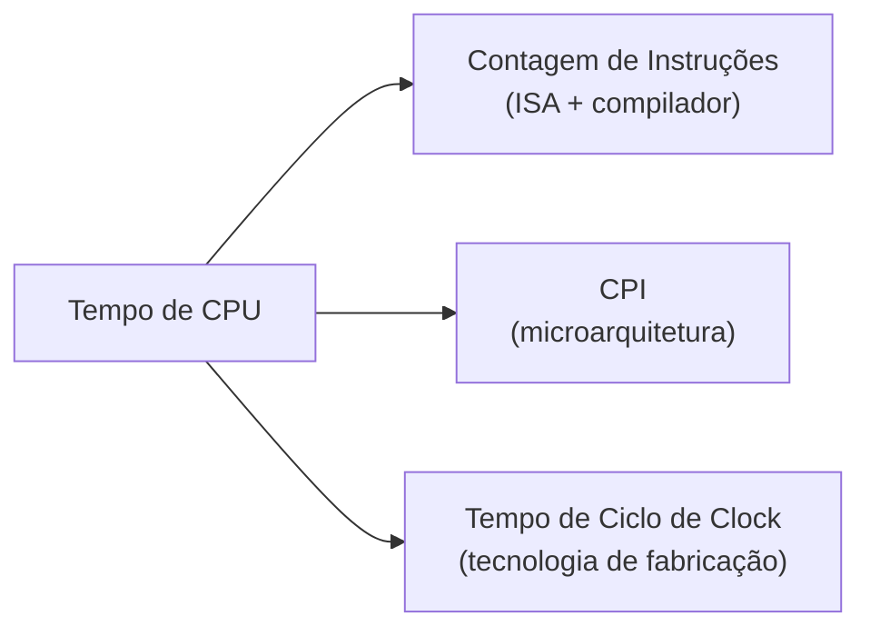

## Objetivos de Aprendizagem

- Enunciar a equação de desempenho da CPU (a "Lei de Ferro") e identificar os três fatores que ela multiplica.
- Explicar qual camada do sistema (ISA/compilador, microarquitetura ou tecnologia de fabricação) controla cada um dos três fatores.
- Calcular o tempo de CPU a partir da contagem de instruções, do CPI e do tempo de ciclo de clock, e explicar por que melhorar um fator pode piorar outro silenciosamente.
- Distinguir o tempo de CPU (a única medida que de fato importa para um usuário) da frequência de clock e da contagem de instruções isoladas, e explicar por que cada uma delas, isolada, é uma métrica de desempenho enganosa.
- Antecipar como o resto desta disciplina (pipelining, cache, multinúcleo, SIMD) se organiza como um conjunto de técnicas que atacam, cada uma, um fator específico desta mesma equação.

## Contexto e Motivação

Toda técnica que esta disciplina está prestes a cobrir (pipelining, cache, previsão de desvios, multinúcleo, SIMD) existe para fazer algum programa real rodar mais rápido. Antes que qualquer uma dessas técnicas possa ser avaliada, motivada ou sequer comparada com as outras, é preciso uma definição combinada e precisa do que "mais rápido" significa. Números de marketing como a frequência de clock ("3.2 GHz!") ou a contagem de instruções, isolados, são famosos por enganar: um chip com frequência de clock maior pode facilmente rodar um programa real mais devagar que um chip com frequência menor, e um compilador que emite menos instruções pode facilmente produzir um binário mais lento que um que emite mais. O *Computer Organization and Design* de Patterson e Hennessy (o livro-texto ao qual a CPU didática deste curso e suas sucessoras são construídas para se assemelhar) ancora todo o assunto numa única equação, chamada informalmente de Lei de Ferro do desempenho de processadores, que liga essas quantidades corretamente.

O motivo pelo qual este conceito abre a disciplina, em vez de aparecer como nota de rodapé depois de o pipelining já estar construído, é que ele fornece a justificativa de tudo o que vem a seguir. Lógica Digital e Organização de Computadores construiu uma CPU de ciclo único que funciona e provou que ela executa corretamente a ISA didática, mas nunca perguntou se essa CPU é *rápida*. Este conceito fornece o vocabulário para fazer essa pergunta com precisão, e o resto de Arquitetura de Computadores é mais bem lido como uma sequência de respostas: o pipelining ataca um fator da Lei de Ferro, a hierarquia de memória ataca uma suposição escondida dentro dela, e multinúcleo/SIMD a atacam mudando o que "uma CPU" sequer significa.

O retorno é uma disciplina que se mantém honesta sobre trocas, em vez de perseguir um único número. Toda otimização vista mais adiante neste curso (um pipeline mais profundo, uma cache maior, previsão de desvios, emissão fora de ordem, mais núcleos, faixas SIMD mais largas) será julgada por de fato reduzir o tempo de CPU de programas reais, e não por fazer algum número isolado (frequência de clock, tamanho de cache, contagem de núcleos) parecer maior numa ficha técnica.

## Teoria Central

### A equação

A Lei de Ferro afirma:

```text
Tempo de CPU = Contagem de Instruções × CPI × Tempo de Ciclo de Clock
```

Equivalentemente, como o tempo de ciclo de clock é o inverso da frequência de clock:

```text
Tempo de CPU = (Contagem de Instruções × CPI) / Frequência de Clock
```

Cada uma das três quantidades à direita tem um significado limpo e separado:

1. **Contagem de Instruções (IC).** O número total de instruções que um dado programa de fato executa. É uma contagem dinâmica (quantas instruções de fato rodam, incluindo cada iteração de laço), e não a contagem estática de instruções no binário compilado.
2. **Ciclos Por Instrução (CPI).** O número médio de ciclos de clock que cada instrução executada leva. Numa CPU de ciclo único isso é trivialmente 1 para toda instrução; no momento em que uma CPU usa pipeline, sofre paradas ou tem falhas de cache, o CPI se torna uma média genuinamente interessante entre instruções que, individualmente, levam números diferentes de ciclos.
3. **Tempo de Ciclo de Clock.** A duração, em segundos, de um ciclo de clock: o inverso da frequência de clock. Um chip de 3.2 GHz tem um tempo de ciclo de clock de 1/(3.2×10⁹) ≈ 0.3125 nanossegundos.

### Três alavancas que se movem de forma independente

A percepção genuinamente útil da Lei de Ferro não é a aritmética (multiplicar três números não é profundo), e sim que cada fator é controlado por uma camada diferente do sistema e pode ser melhorado (ou piorado sem querer) em grande parte de forma independente dos outros dois:

- A **Contagem de Instruções** é controlada principalmente pela **ISA e pelo compilador**. Uma ISA mais rica, ou um compilador mais esperto, pode reduzir o número de instruções necessárias para expressar a mesma lógica de programa. É o mesmo território coberto por Instruction Formats and Addressing Modes e Assembly-to-Machine-Code Translation em Lógica Digital e Organização de Computadores.
- O **CPI** é controlado principalmente pela **microarquitetura**: como a mesma ISA é de fato implementada em hardware. Um projeto de ciclo único, um projeto com pipeline e um projeto com falhas de cache e erros de previsão de desvio executam todos o programa idêntico (Contagem de Instruções idêntica) com CPIs médios muito diferentes.
- O **Tempo de Ciclo de Clock** é controlado principalmente pela **tecnologia de fabricação e pelo projeto de circuitos**: velocidade dos transistores, atraso dos fios e quanta lógica combinacional é espremida num único estágio de pipeline entre dois registradores com clock.

### Por que as alavancas brigam entre si

O motivo pelo qual esta equação conduz uma disciplina inteira, em vez de ser resolvida uma vez e esquecida, é que essas três alavancas não estão livres para se mover de forma independente na prática: melhorar uma muitas vezes piora ativamente outra, e toda técnica deste curso é uma resposta específica a essa tensão:

- Uma CPU com pipeline pode reduzir o tempo de ciclo de clock (um caminho combinacional mais curto por estágio significa um clock mais rápido), mas só ao custo de aumentar o CPI sempre que um hazard forçar uma parada ou um flush, exatamente a troca que o **Pipelining** analisa estágio por estágio nos conceitos que seguem este.
- Uma instrução mais rica e poderosa (menor Contagem de Instruções) muitas vezes é mais lenta de decodificar e executar (maior CPI por instrução) e pode alongar o caminho crítico que define o tempo de ciclo de clock: a tensão real entre as filosofias RISC e CISC já nomeada em `what-is-an-isa` de Lógica Digital e Organização de Computadores.
- Acrescentar mais núcleos não faz absolutamente nada pela Lei de Ferro para um programa que só roda num deles; só ajuda quando o trabalho é de fato dividido entre núcleos, o que é uma questão sobre a Contagem de Instruções e o CPI dentro de *cada* núcleo rodando sua parte do programa, e sobre uma métrica completamente diferente (vazão agregada), vista a partir de `why-multicore-the-power-wall`.



## Exemplos Resolvidos

### Exemplo 1: comparando duas máquinas com trocas diferentes

Duas máquinas rodam o programa compilado idêntico, que executa exatamente 2.000.000.000 (2 × 10⁹) instruções em ambas.

```text
Máquina A: CPI = 1.0, frequência de clock = 2.0 GHz (tempo de ciclo de clock = 0.5 ns)
Máquina B: CPI = 1.5, frequência de clock = 3.6 GHz (tempo de ciclo de clock ≈ 0.278 ns)
```

Tempo de CPU da Máquina A:
```text
Tempo de CPU_A = IC × CPI × Tempo de Ciclo de Clock
               = (2 × 10⁹) × 1.0 × 0.5 ns
               = 1.0 × 10⁹ ns = 1.0 segundo
```

Tempo de CPU da Máquina B:
```text
Tempo de CPU_B = (2 × 10⁹) × 1.5 × 0.278 ns
               ≈ (2 × 10⁹) × 0.417 ns
               ≈ 0.833 segundo
```

Apesar de ter um CPI substancialmente maior (1.5 contra 1.0), a Máquina B é mais rápida no geral, porque sua frequência de clock maior mais do que compensa. Um leitor olhando só o CPI concluiria erroneamente que a Máquina A é mais rápida; um leitor olhando só a frequência de clock adivinharia corretamente que B é mais rápida aqui, mas só por coincidência. É a Lei de Ferro que de fato prova isso, e o resultado poderia facilmente ter ido para o outro lado com números diferentes.

### Exemplo 2: um programa "menor" que roda mais devagar

Uma otimização de compilador reduz a Contagem de Instruções de um laço de 5.000.000 para 4.000.000 substituindo várias instruções simples por uma instrução mais poderosa (mas mais cara de executar), elevando o CPI médio de 1.0 para 1.4. O tempo de ciclo de clock fica inalterado em 1 ns nas duas versões.

```text
Antes:  Tempo de CPU = 5.000.000 × 1.0 × 1 ns = 5.000.000 ns = 5.0 ms
Depois: Tempo de CPU = 4.000.000 × 1.4 × 1 ns = 5.600.000 ns = 5.6 ms
```

A "otimização" que reduziu a contagem de instruções em 20% na verdade deixou o programa 12% mais lento, porque elevou o CPI mais do que o suficiente para compensar as instruções economizadas. É exatamente por isso que a Contagem de Instruções isolada (o número que uma leitura ingênua da saída em assembly poderia comemorar) não é uma métrica de desempenho válida por si só; só o produto completo diz a verdade.

### Exemplo 3: lendo o resto desta disciplina pela Lei de Ferro

Dada a técnica, diga qual fator da Lei de Ferro ela visa principalmente:

```text
Técnica                             Fator visado principalmente
----------------------------------  ---------------------------------------------
Pipelining (pipeline de 5 estágios)  Tempo de Ciclo de Clock (↓, lógica mais curta por estágio),
                                     com algum custo de CPI pelos hazards
Previsão de desvios                  CPI (↓, menos ciclos de parada/flush)
Hierarquia de cache                  CPI (↓, menos ciclos de parada esperando a memória)
Multinúcleo                          Nenhum, para um programa num núcleo:
                                     muda a unidade de "tempo de CPU" medida
SIMD / GPU                           Contagem de Instruções efetiva (↓ por elemento
                                     de dado, uma instrução cobre muitos)
```

O padrão a observar: nada nesta disciplina é um almoço grátis que melhora os três fatores ao mesmo tempo. Toda técnica estudada daqui em diante é mais bem entendida como "qual fator isto move, e quanto custa em outro lugar", precisamente a análise que este conceito existe para tornar possível.

## Equívocos Comuns e Armadilhas

- **"Uma frequência de clock maior sempre significa uma CPU mais rápida."** Só se o CPI e a Contagem de Instruções forem mantidos iguais, o que quase nunca acontece entre dois projetos reais diferentes. O Exemplo 1 mostra que uma máquina de frequência menor ainda pode vencer, e uma de frequência maior pode perder, dependendo do CPI.
- **"CPI abaixo de 1 é impossível."** É impossível para um pipeline simples que emite no máximo uma instrução por ciclo, mas processadores superescalares reais (antecipados brevemente em `speculative-and-out-of-order-execution`) conseguem completar mais de uma instrução por ciclo, dando valores de CPI abaixo de 1 (muitas vezes expressos como IPC, instruções por ciclo, acima de 1).
- **"Menos instruções sempre significam um programa mais rápido."** O Exemplo 2 mostra que uma Contagem de Instruções menor ainda pode perder se vier com um aumento de CPI grande o bastante; a Contagem de Instruções é só um de três fatores multiplicados, nunca uma métrica por si só.
- **"O tempo de CPU é a única coisa que sempre importa."** Para um único programa sequencial, sim, mas, quando vários programas ou vários núcleos estão envolvidos (a partir de `why-multicore-the-power-wall`), a vazão (o trabalho total concluído por unidade de tempo em tudo o que está rodando) se torna uma métrica igualmente real, às vezes mais relevante, que a Lei de Ferro como enunciada aqui não captura sozinha.
- **"A contagem de instruções é uma propriedade estática do binário compilado."** É uma contagem dinâmica das instruções de fato executadas em tempo de execução, que depende dos dados de entrada específicos (número de iterações de laços, desvios tomados): o mesmo binário pode ter Contagens de Instruções muito diferentes com entradas diferentes.

## Resumo

A Lei de Ferro (Tempo de CPU = Contagem de Instruções × CPI × Tempo de Ciclo de Clock) é a única equação em torno da qual toda esta disciplina se organiza: a Contagem de Instruções é definida principalmente pela ISA e pelo compilador, o CPI pela microarquitetura e o Tempo de Ciclo de Clock pela tecnologia de fabricação, e nenhum projeto real consegue mover um desses fatores sem arriscar um custo em outro. Toda técnica estudada nos conceitos seguintes (pipelining, a hierarquia de memória, previsão de desvios, multinúcleo, SIMD e arquitetura de GPU) é mais bem entendida como um movimento específico e deliberado contra um desses três fatores, sempre atento ao que custa em outro lugar. O próximo conceito, `why-pipeline-latency-vs-throughput`, abre essa sequência fazendo exatamente essa pergunta à CPU de ciclo único já construída em Lógica Digital e Organização de Computadores.

## Documentation Links

- [Cornell CS3410: Pipelining & Performance Notes](https://www.cs.cornell.edu/courses/cs3410/2025sp/notes/pipelining.html): notas de curso que derivam e aplicam a equação de desempenho da CPU antes de apresentar o pipelining.
- [Harris & Harris: Digital Design and Computer Architecture, RISC-V Edition](https://shop.elsevier.com/books/digital-design-and-computer-architecture-risc-v-edition/harris/978-0-12-820064-3): livro-texto que constrói a mesma CPU de ciclo único da qual esta disciplina parte e depois analisa e melhora seu desempenho.
