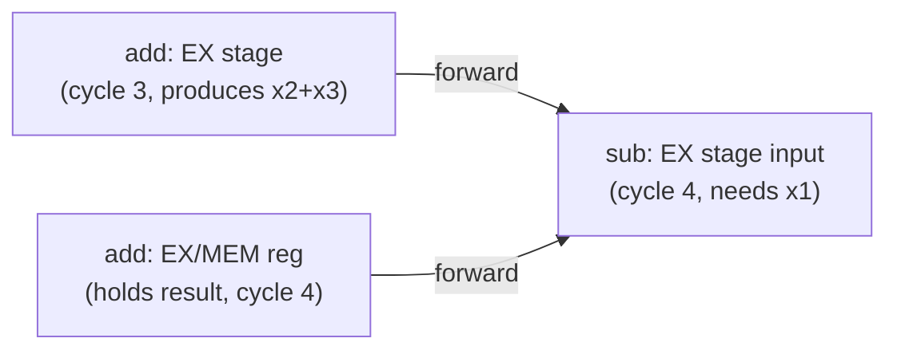

## Learning Objectives

- Define a read-after-write (RAW) data hazard precisely, in terms of pipeline stages, and explain why it is the only data hazard type this simple in-order pipeline can actually produce.
- Trace, cycle by cycle, why naively reading the register file in ID would return a stale value for a dependent instruction.
- Explain forwarding (bypassing): what it routes, from which pipeline stage to which, and why it eliminates the hazard without any stall cycles in the common case.
- Identify from which stages forwarding is possible, and preview (without fully solving) the one case forwarding alone cannot fix.
- Explain why a compiler or assembler cannot generally solve this hazard by reordering instructions alone, without hardware support.

## Context & Motivation

The previous concept resolved conflicts over physical hardware resources by duplicating hardware. Data hazards are a different animal entirely: even with a perfectly resourced pipeline (separate instruction/data memory, a properly ported register file), two instructions that are logically related through the values they compute can still produce a wrong answer, purely because of *when* in the pipeline each one's data becomes available relative to when another instruction needs it.

This is the single most common hazard in real code, because it is triggered by an extremely ordinary pattern: one instruction computes a value, and the very next instruction (or the one after that) uses it. `add x1, x2, x3` immediately followed by `sub x4, x1, x5` is not a contrived example — it's what a compiler emits constantly, for anything as simple as `a = b + c; d = a - e;`. If the pipeline did nothing special about this pattern, it would silently compute the wrong answer on some of the most ordinary code imaginable, which is exactly why forwarding — the fix this concept develops — is not an optional performance tweak but a correctness requirement for any pipelined processor claiming to correctly execute this ISA.

## Core Theory

### The problem, traced cycle by cycle

Consider this two-instruction sequence, entered into the pipeline back to back:

```text
add x1, x2, x3      # x1 := x2 + x3
sub x4, x1, x5       # x4 := x1 − x5   (needs the x1 just computed above)
```

```text
Cycle:          1    2    3    4    5    6
add x1,x2,x3:   IF   ID   EX   MEM  WB
sub x4,x1,x5:        IF   ID   EX   MEM  WB
```

`sub` reads its source registers (x1 and x5) during its ID stage, which happens in cycle 3. But `add`'s result — the new value of x1 — is not written into the register file until `add`'s own WB stage, which happens in cycle 5. If the register file is read in the ordinary way during `sub`'s ID stage (cycle 3), it will return whatever value x1 held *before* `add` executed — two full cycles too early. This is a read-after-write (RAW) hazard: `sub` is trying to read a register that an earlier, still-in-flight instruction is going to write, and reads it before that write has actually landed.

RAW is the only data hazard category this simple in-order, single-issue pipeline can produce, because instructions are fetched, decoded, and written back in the exact order they were issued — a later instruction can only ever be waiting on an *earlier* one's result, never the reverse (write-after-read or write-after-write hazards are a concern only for the out-of-order designs briefly previewed in `speculative-and-out-of-order-execution`, not for this in-order pipeline).

### The fix: forwarding (bypassing)

The key insight is that `add`'s correct result — x2 + x3 — is already computed and sitting in the EX/MEM pipeline register by the end of cycle 3 (`add`'s own EX stage), a full two cycles before it's officially written back to the register file. Forwarding (also called bypassing) adds extra wires and multiplexers that route a value directly from a later pipeline stage's output back to an earlier stage's input, so a dependent instruction can use the correct, freshly computed value the moment it exists, without waiting for the formal register-file write-back.



Concretely: `add` finishes EX in cycle 3, and its result sits in the EX/MEM pipeline register during cycle 4 — which is exactly the cycle `sub` is *itself* in EX and needs a value for x1. A forwarding path routes the value straight from the EX/MEM register into the ALU's input multiplexer for the instruction currently in EX, completely bypassing the register file. Because this happens through pure combinational wiring (no clock cycle spent waiting), forwarding costs **zero stall cycles** for this exact pattern — the pipeline continues at its full, unbroken one-instruction-per-cycle rate.

### Where forwarding can source a value from

Forwarding can supply a value from any later pipeline stage that already holds it, back to an earlier stage's input, as long as the timing lines up: from the EX/MEM register (a value one instruction ahead computed last cycle) and from the MEM/WB register (a value two instructions ahead computed two cycles ago) are the two standard forwarding paths in this 5-stage design, both feeding into the ALU's input multiplexers at the start of EX. A hardware hazard-detection unit compares the destination register of instructions ahead in the pipeline against the source registers of the instruction currently entering EX, and steers the forwarding multiplexers accordingly, entirely automatically and transparently to software.

### Why the compiler can't just fix this by reordering

A compiler could, in principle, try to reorder instructions to put unrelated work between a producer and its dependent consumer, hiding the hazard by the time the value is actually needed — and real compilers do this where they can. But this only *reduces* how often the hazard-handling hardware has to act; it cannot eliminate the need for forwarding hardware entirely, because real programs are full of genuinely tight, unavoidable dependency chains (`a = b + c; d = a * a;` has no unrelated instruction to insert in between) where the very next instruction *must* use the immediately preceding result. Forwarding is a hardware guarantee of correctness that holds regardless of what the compiler manages to schedule; compiler scheduling is a genuine optimization on top of it, not a substitute for it.

## Worked Examples

### Example 1: Three back-to-back dependent instructions

```text
add x1, x2, x3       # x1 := x2 + x3
add x4, x1, x1       # x4 := x1 + x1   (needs x1, produced 1 instruction earlier)
add x5, x4, x1       # x5 := x4 + x1   (needs x4, produced 1 instruction earlier)
```

```text
Cycle:            1    2    3    4    5    6    7
add x1,x2,x3:     IF   ID   EX   MEM  WB
add x4,x1,x1:          IF   ID   EX   MEM  WB
add x5,x4,x1:               IF   ID   EX   MEM  WB
```

For the second instruction, x1's value is available in the EX/MEM register at exactly the cycle (4) the second `add`'s EX stage runs — an EX/MEM-to-EX forward, zero stalls. For the third instruction, x4's value (produced by the second `add`'s EX in cycle 4) is available in *that* instruction's EX/MEM register during cycle 5 — exactly when the third `add`'s EX stage runs in cycle 5 — again an EX/MEM-to-EX forward, zero stalls. Every dependency in this chain is resolved purely through forwarding, with the pipeline never once stopping.

### Example 2: A hazard that forwards from two instructions back

```text
add x1, x2, x3       # x1 := x2 + x3
or  x9, x9, x9        # unrelated instruction (no dependency on x1)
sub x4, x1, x5        # x4 := x1 − x5   (needs x1, produced 2 instructions earlier)
```

```text
Cycle:            1    2    3    4    5    6    7
add x1,x2,x3:     IF   ID   EX   MEM  WB
or x9,x9,x9:           IF   ID   EX   MEM  WB
sub x4,x1,x5:               IF   ID   EX   MEM  WB
```

By the time `sub` reaches EX (cycle 5), `add`'s result has already advanced past the EX/MEM register into the MEM/WB register (cycle 5). The forwarding path here sources from MEM/WB instead of EX/MEM — a different physical wire, but the same principle: grab the value from wherever in the pipeline it currently, correctly resides, and route it to where it's needed, before the formal register-file write-back ever happens.

### Example 3: Identifying which instructions in a sequence need forwarding

```text
lw  x1, 0(x2)         # load: x1's value not ready until MEM (cycle 4), not EX (cycle 3)
add x3, x1, x4         # needs x1 — but is this instruction's EX in time for a normal forward?
```

```text
Cycle:            1    2    3    4    5    6
lw x1,0(x2):      IF   ID   EX   MEM  WB
add x3,x1,x4:          IF   ID   EX   MEM  WB
```

Here, `add`'s EX stage (needing x1) runs in cycle 4 — but `lw`'s value isn't available until `lw`'s own MEM stage, which *also* runs in cycle 4, the very same cycle. The value physically cannot be forwarded from a stage that hasn't finished computing it yet in the same cycle it's needed. This specific case — a load immediately followed by an instruction that uses its result — is the one genuine gap forwarding alone cannot close, and is exactly the subject of the next concept, the load-use hazard.

## Common Misconceptions & Pitfalls

- **"Forwarding means the pipeline has to stall while it copies the value."** The opposite is true for the cases this concept covers: forwarding is pure combinational routing (wires and multiplexers), adding zero stall cycles — it is precisely the mechanism that lets the pipeline *avoid* stalling for the ordinary case of one instruction depending on a value one or two instructions back.
- **"A dependent instruction always has to wait for the register file write-back."** Only without forwarding. With forwarding, the value reaches the dependent instruction directly from an earlier pipeline stage's output, often several cycles before the register file write actually occurs.
- **"Forwarding can fix every data hazard."** Example 3 shows a genuine limit: when the producing instruction's own value isn't ready until the exact same cycle the consumer needs it (the load-use case), there is nothing yet in any pipeline register to forward — a real stall is unavoidable there, which the next concept addresses directly.
- **"This pipeline can have write-after-read or write-after-write data hazards too."** Not in this simple in-order, single-issue design — every instruction is fetched, decoded, executed, and written back in the exact order it entered the pipeline, so a later instruction can only ever be waiting on an *earlier* one's write, never racing to overtake it. These other hazard types become real concerns only in the out-of-order designs previewed later in this discipline.

## Summary

A data hazard occurs when one instruction needs a value that an earlier, still-in-flight instruction is going to produce, but hasn't yet written back to the register file — the read-after-write (RAW) pattern, the only kind possible in this in-order pipeline, and one triggered by extremely ordinary code. Forwarding (bypassing) solves this for the common case by routing a value directly from a later pipeline stage's output (the EX/MEM or MEM/WB register) straight into an earlier stage's ALU input, entirely through combinational hardware, costing zero stall cycles. The one genuine gap this leaves — a load immediately followed by an instruction using its result, where the loaded value isn't ready until the same cycle it's needed — is exactly what the next concept, the load-use hazard, exists to resolve.

## Documentation Links

- [Bryant & O'Hallaron — Computer Systems: A Programmer's Perspective (CS:APP)](https://csapp.cs.cmu.edu/) — builds a pipelined Y86-64 processor (PIPE) with real forwarding logic for exactly this class of hazard.
- [Harris & Harris — Digital Design and Computer Architecture, RISC-V Edition](https://shop.elsevier.com/books/digital-design-and-computer-architecture-risc-v-edition/harris/978-0-12-820064-3) — derives the forwarding paths and hazard-detection logic for the same 5-stage pipeline structure.
