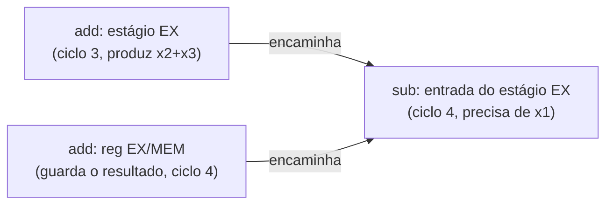

## Objetivos de Aprendizagem

- Definir com precisão um hazard de dados de leitura após escrita (RAW), em termos de estágios do pipeline, e explicar por que ele é o único tipo de hazard de dados que este pipeline simples em ordem consegue produzir.
- Rastrear, ciclo a ciclo, por que ler ingenuamente o banco de registradores em ID devolveria um valor velho para uma instrução dependente.
- Explicar o forwarding (bypassing): o que ele encaminha, de qual estágio do pipeline para qual, e por que elimina o hazard sem nenhum ciclo de parada no caso comum.
- Identificar de quais estágios o forwarding é possível e antecipar (sem resolver por completo) o único caso que o forwarding sozinho não corrige.
- Explicar por que um compilador ou montador, em geral, não consegue resolver este hazard só reordenando instruções, sem suporte do hardware.

## Contexto e Motivação

O conceito anterior resolveu conflitos por recursos físicos de hardware duplicando o hardware. Os hazards de dados são um bicho totalmente diferente: mesmo com um pipeline perfeitamente provido de recursos (memória de instruções e de dados separadas, um banco de registradores com portas suficientes), duas instruções logicamente relacionadas pelos valores que calculam ainda podem produzir uma resposta errada, só por causa de *quando*, no pipeline, os dados de cada uma ficam disponíveis em relação a quando outra instrução precisa deles.

Este é o hazard mais comum no código real, porque é disparado por um padrão extremamente comum: uma instrução calcula um valor, e a instrução seguinte (ou a depois dela) o usa. `add x1, x2, x3` seguido imediatamente de `sub x4, x1, x5` não é um exemplo artificial: é o que um compilador emite o tempo todo, para algo tão simples quanto `a = b + c; d = a - e;`. Se o pipeline não fizesse nada de especial com esse padrão, calcularia silenciosamente a resposta errada em alguns dos códigos mais comuns que se pode imaginar, e é exatamente por isso que o forwarding (a correção que este conceito desenvolve) não é um ajuste opcional de desempenho, e sim uma exigência de correção para qualquer processador com pipeline que afirme executar corretamente esta ISA.

## Teoria Central

### O problema, rastreado ciclo a ciclo

Considere esta sequência de duas instruções, que entram no pipeline uma logo atrás da outra:

```text
add x1, x2, x3      # x1 := x2 + x3
sub x4, x1, x5       # x4 := x1 − x5   (precisa do x1 recém-calculado acima)
```

```text
Ciclo:          1    2    3    4    5    6
add x1,x2,x3:   IF   ID   EX   MEM  WB
sub x4,x1,x5:        IF   ID   EX   MEM  WB
```

`sub` lê seus registradores de origem (x1 e x5) durante seu estágio ID, que acontece no ciclo 3. Mas o resultado de `add` (o novo valor de x1) só é escrito no banco de registradores no próprio estágio WB de `add`, que acontece no ciclo 5. Se o banco de registradores for lido da forma comum durante o estágio ID de `sub` (ciclo 3), ele vai devolver o valor que x1 guardava *antes* de `add` executar, dois ciclos inteiros cedo demais. Isso é um hazard de leitura após escrita (RAW): `sub` tenta ler um registrador que uma instrução anterior, ainda em andamento, vai escrever, e o lê antes de essa escrita de fato chegar.

O RAW é a única categoria de hazard de dados que este pipeline simples, em ordem e de emissão única consegue produzir, porque as instruções são buscadas, decodificadas e escritas de volta exatamente na ordem em que foram emitidas: uma instrução posterior só pode estar esperando o resultado de uma *anterior*, nunca o contrário (hazards de escrita após leitura ou de escrita após escrita só são preocupação nos projetos fora de ordem antecipados brevemente em `speculative-and-out-of-order-execution`, e não neste pipeline em ordem).

### A correção: forwarding (bypassing)

A percepção-chave é que o resultado correto de `add` (x2 + x3) já está calculado e guardado no registrador de pipeline EX/MEM ao fim do ciclo 3 (o próprio estágio EX de `add`), dois ciclos inteiros antes de ser oficialmente escrito de volta no banco de registradores. O forwarding (também chamado de bypassing) acrescenta fios e multiplexadores extras que encaminham um valor diretamente da saída de um estágio posterior do pipeline de volta para a entrada de um estágio anterior, para que uma instrução dependente possa usar o valor correto, recém-calculado, no momento em que ele existe, sem esperar a escrita formal no banco de registradores.



Concretamente: `add` termina EX no ciclo 3, e seu resultado fica no registrador de pipeline EX/MEM durante o ciclo 4, que é exatamente o ciclo em que o *próprio* `sub` está em EX e precisa de um valor para x1. Um caminho de forwarding encaminha o valor direto do registrador EX/MEM para o multiplexador de entrada da ULA da instrução que está em EX no momento, contornando por completo o banco de registradores. Como isso acontece por fiação puramente combinacional (nenhum ciclo de clock gasto esperando), o forwarding custa **zero ciclos de parada** para exatamente esse padrão: o pipeline continua na sua taxa completa e ininterrupta de uma instrução por ciclo.

### De onde o forwarding pode obter um valor

O forwarding pode fornecer um valor de qualquer estágio posterior do pipeline que já o guarde, de volta para a entrada de um estágio anterior, desde que o tempo bata: a partir do registrador EX/MEM (um valor de uma instrução à frente, calculado no ciclo anterior) e a partir do registrador MEM/WB (um valor de duas instruções à frente, calculado dois ciclos antes) são os dois caminhos de forwarding padrão neste projeto de 5 estágios, ambos alimentando os multiplexadores de entrada da ULA no início de EX. Uma unidade de hardware de detecção de hazards compara o registrador de destino das instruções à frente no pipeline com os registradores de origem da instrução que está entrando em EX e direciona os multiplexadores de forwarding de acordo, de forma totalmente automática e transparente para o software.

### Por que o compilador não consegue simplesmente corrigir isso reordenando

Um compilador poderia, em princípio, tentar reordenar instruções para colocar trabalho sem relação entre quem produz e quem consome um valor, escondendo o hazard até o valor de fato ser necessário, e compiladores reais fazem isso onde conseguem. Mas isso só *reduz* com que frequência o hardware de tratamento de hazards precisa agir; não consegue eliminar por completo a necessidade de hardware de forwarding, porque programas reais estão cheios de cadeias de dependência genuinamente apertadas e inevitáveis (`a = b + c; d = a * a;` não tem nenhuma instrução sem relação para inserir no meio), em que a instrução seguinte *precisa* usar o resultado imediatamente anterior. O forwarding é uma garantia de correção do hardware que vale independentemente do que o compilador consiga escalonar; o escalonamento do compilador é uma otimização genuína por cima dele, e não um substituto.

## Exemplos Resolvidos

### Exemplo 1: três instruções dependentes uma atrás da outra

```text
add x1, x2, x3       # x1 := x2 + x3
add x4, x1, x1       # x4 := x1 + x1   (precisa de x1, produzido 1 instrução antes)
add x5, x4, x1       # x5 := x4 + x1   (precisa de x4, produzido 1 instrução antes)
```

```text
Ciclo:            1    2    3    4    5    6    7
add x1,x2,x3:     IF   ID   EX   MEM  WB
add x4,x1,x1:          IF   ID   EX   MEM  WB
add x5,x4,x1:               IF   ID   EX   MEM  WB
```

Para a segunda instrução, o valor de x1 está disponível no registrador EX/MEM exatamente no ciclo (4) em que roda o estágio EX do segundo `add`: um forward de EX/MEM para EX, zero paradas. Para a terceira instrução, o valor de x4 (produzido pelo EX do segundo `add` no ciclo 4) está disponível no registrador EX/MEM *daquela* instrução durante o ciclo 5, exatamente quando roda o estágio EX do terceiro `add`, no ciclo 5: de novo um forward de EX/MEM para EX, zero paradas. Toda dependência desta cadeia é resolvida puramente por forwarding, sem o pipeline parar nenhuma vez.

### Exemplo 2: um hazard com forward a partir de duas instruções atrás

```text
add x1, x2, x3       # x1 := x2 + x3
or  x9, x9, x9        # instrução sem relação (nenhuma dependência de x1)
sub x4, x1, x5        # x4 := x1 − x5   (precisa de x1, produzido 2 instruções antes)
```

```text
Ciclo:            1    2    3    4    5    6    7
add x1,x2,x3:     IF   ID   EX   MEM  WB
or x9,x9,x9:           IF   ID   EX   MEM  WB
sub x4,x1,x5:               IF   ID   EX   MEM  WB
```

Quando `sub` chega a EX (ciclo 5), o resultado de `add` já passou do registrador EX/MEM para o registrador MEM/WB (ciclo 5). O caminho de forwarding aqui obtém o valor de MEM/WB em vez de EX/MEM: um fio físico diferente, mas o mesmo princípio de pegar o valor de onde quer que ele esteja corretamente no pipeline naquele momento e encaminhá-lo para onde é necessário, antes de a escrita formal no banco de registradores sequer acontecer.

### Exemplo 3: identificando quais instruções de uma sequência precisam de forwarding

```text
lw  x1, 0(x2)         # load: o valor de x1 só fica pronto em MEM (ciclo 4), e não em EX (ciclo 3)
add x3, x1, x4         # precisa de x1, mas o EX desta instrução chega a tempo de um forward normal?
```

```text
Ciclo:            1    2    3    4    5    6
lw x1,0(x2):      IF   ID   EX   MEM  WB
add x3,x1,x4:          IF   ID   EX   MEM  WB
```

Aqui, o estágio EX de `add` (que precisa de x1) roda no ciclo 4, mas o valor de `lw` só fica disponível no próprio estágio MEM de `lw`, que *também* roda no ciclo 4, exatamente o mesmo ciclo. O valor não tem como ser encaminhado fisicamente de um estágio que ainda não terminou de calculá-lo no mesmo ciclo em que ele é necessário. Esse caso específico (um load seguido imediatamente de uma instrução que usa seu resultado) é a única lacuna genuína que o forwarding sozinho não consegue fechar, e é exatamente o tema do próximo conceito, o hazard de load-use.

## Equívocos Comuns e Armadilhas

- **"Forwarding significa que o pipeline precisa parar enquanto copia o valor."** É o contrário, nos casos que este conceito cobre: o forwarding é encaminhamento puramente combinacional (fios e multiplexadores), acrescentando zero ciclos de parada. É precisamente o mecanismo que permite ao pipeline *evitar* parar no caso comum de uma instrução que depende de um valor de uma ou duas instruções atrás.
- **"Uma instrução dependente sempre precisa esperar a escrita no banco de registradores."** Só sem forwarding. Com forwarding, o valor chega à instrução dependente diretamente da saída de um estágio anterior do pipeline, muitas vezes vários ciclos antes de a escrita no banco de registradores de fato acontecer.
- **"O forwarding consegue corrigir todo hazard de dados."** O Exemplo 3 mostra um limite genuíno: quando o próprio valor da instrução produtora só fica pronto no mesmíssimo ciclo em que o consumidor precisa dele (o caso do load-use), ainda não há nada em nenhum registrador de pipeline para encaminhar; uma parada real é inevitável ali, o que o próximo conceito trata diretamente.
- **"Este pipeline também pode ter hazards de dados de escrita após leitura ou de escrita após escrita."** Não neste projeto simples, em ordem e de emissão única: toda instrução é buscada, decodificada, executada e escrita de volta exatamente na ordem em que entrou no pipeline, então uma instrução posterior só pode estar esperando a escrita de uma *anterior*, nunca correndo para ultrapassá-la. Esses outros tipos de hazard só viram preocupação real nos projetos fora de ordem antecipados mais adiante nesta disciplina.

## Resumo

Um hazard de dados ocorre quando uma instrução precisa de um valor que uma instrução anterior, ainda em andamento, vai produzir, mas ainda não escreveu de volta no banco de registradores: o padrão de leitura após escrita (RAW), o único possível neste pipeline em ordem, e disparado por código extremamente comum. O forwarding (bypassing) resolve isso no caso comum encaminhando um valor diretamente da saída de um estágio posterior do pipeline (o registrador EX/MEM ou MEM/WB) para a entrada da ULA de um estágio anterior, inteiramente por hardware combinacional, a um custo de zero ciclos de parada. A única lacuna genuína que isso deixa (um load seguido imediatamente de uma instrução que usa seu resultado, em que o valor carregado só fica pronto no mesmo ciclo em que é necessário) é exatamente o que o próximo conceito, o hazard de load-use, existe para resolver.

## Documentation Links

- [Bryant & O'Hallaron: Computer Systems: A Programmer's Perspective (CS:APP)](https://csapp.cs.cmu.edu/): constrói um processador Y86-64 com pipeline (PIPE) com lógica de forwarding real para exatamente esta classe de hazard.
- [Harris & Harris: Digital Design and Computer Architecture, RISC-V Edition](https://shop.elsevier.com/books/digital-design-and-computer-architecture-risc-v-edition/harris/978-0-12-820064-3): deriva os caminhos de forwarding e a lógica de detecção de hazards para a mesma estrutura de pipeline de 5 estágios.
