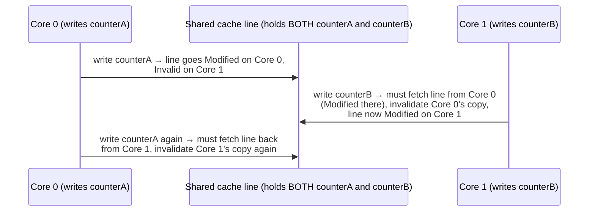

## Learning Objectives

- Define false sharing precisely: a performance problem caused by cache-line granularity, not a correctness bug.
- Trace, using MESI states, exactly why two threads writing to unrelated variables on the same cache line repeatedly invalidate each other.
- Distinguish false sharing (two unrelated variables coincidentally sharing a line) from true sharing (two threads genuinely cooperating on the same variable).
- Identify false sharing in a concrete code layout, and explain the standard fix (padding or alignment).
- Explain why false sharing is often invisible to a correctness-only review of code, and why performance profiling is what actually surfaces it.

## Context & Motivation

The previous concept built MESI specifically to guarantee correctness: no matter how cores' private caches interact, every core always sees a consistent, agreed-upon view of memory. False sharing is what happens when that correctness guarantee works exactly as designed — nothing is ever wrong, no core ever reads a stale value — and yet performance suffers badly anyway, purely because of a detail MESI's correctness guarantee has no reason to care about: the fixed size of a cache line, and which unrelated variables happen to fall inside the same one.

This is one of the most practically important lessons in the entire discipline for anyone who will later write real multithreaded code (in `systems/parallel-computing` or beyond): a program can be reviewed for correctness, pass every test, and never once produce a wrong answer, and still run dramatically slower than it should, for a reason that has nothing to do with the program's logic and everything to do with cache-line granularity interacting with MESI.

## Core Theory

### The setup: two unrelated variables, one cache line

Recall that a cache does not track individual variables — it tracks fixed-size blocks (commonly 64 bytes on real hardware). If two genuinely unrelated variables — say, two separate counters, each incremented independently by a different thread on a different core, with no logical connection between them at all — happen to be laid out close enough in memory to land in the *same* 64-byte block, the cache (and MESI) has no way to know or care that the program never intended them to be related.

### Tracing the coherence traffic MESI is forced to generate

Suppose Thread 0 (on Core 0) repeatedly increments `counterA`, and Thread 1 (on Core 1) repeatedly increments `counterB`, and both variables live in the same cache line:



Every single write — even though it only ever touches `counterA` or `counterB`, never both — forces the *entire line* to bounce, via MESI's real invalidation and re-fetch machinery from the previous concept, back and forth between the two cores' private caches. Neither thread's write is logically related to the other's variable at all, yet each one pays the full cost of an inter-core cache-line transfer on essentially every single increment.

### Why this is a performance bug, not a correctness bug

At no point in this sequence does either thread ever read a stale or wrong value for its own variable — MESI's coherence guarantee holds perfectly throughout. `counterA` and `counterB` are completely independent, unshared data from the program's point of view; nothing about their *values* is ever at risk. The entire cost is the coherence *traffic* itself — repeatedly transferring an entire cache line between cores' private caches, on every single write, purely because of where the compiler or programmer happened to place these two unrelated variables in memory.

### The fix: padding or alignment

The standard fix is to ensure the two independently-written variables don't share a cache line in the first place — either by inserting unused padding bytes between them (enough to push the second variable into a different 64-byte-aligned block), or, in languages that support it, explicitly aligning each variable to its own cache line boundary. This adds a small amount of wasted memory (the padding itself is never used for anything) in exchange for eliminating the repeated cross-core line transfers entirely, since each variable now lives in a line no other core's actively-written variable shares.

## Worked Examples

### Example 1: A struct laid out to cause false sharing

```c
struct Counters {
    long counterA;   /* written only by thread 0 */
    long counterB;   /* written only by thread 1 */
};
```

On a system with an 8-byte `long` and a 64-byte cache line, `counterA` and `counterB` are only 8 bytes apart — comfortably within the same 64-byte line (which could hold up to 8 such `long` values). Every write to either field, by either thread, forces the entire line — including the *other* thread's unrelated field — to ping-pong between the two cores' caches, exactly as traced in the Core Theory section.

### Example 2: The same struct, fixed with padding

```c
struct Counters {
    long counterA;
    char padding[56];   /* pushes counterB onto a NEW 64-byte line */
    long counterB;
};
```

With 56 bytes of unused padding inserted between the two fields, `counterA` (at offset 0) and `counterB` (at offset 64) now fall into two entirely different 64-byte cache lines. Thread 0's writes to `counterA` only ever affect the first line; Thread 1's writes to `counterB` only ever affect the second — no coherence traffic is exchanged between them at all, since MESI (from the previous concept) never needs to invalidate a line the other core was never even touching.

### Example 3: True sharing vs. false sharing, side by side

```text
Scenario A — TRUE sharing:
  Two threads both read AND write the SAME logical counter (e.g. a shared
  total both threads increment). Coherence traffic here is unavoidable and
  CORRECT — the threads genuinely need to see each other's updates to that
  one shared value; the cost is real, but eliminating it would break
  correctness, not just performance.

Scenario B — FALSE sharing (this concept):
  Two threads write to DIFFERENT, logically unrelated counters that merely
  happen to share a cache line. Coherence traffic here is a pure
  performance accident — eliminating it (via padding, as in Example 2)
  changes nothing about the program's correctness, since the two
  variables were never logically related in the first place.
```

The distinction matters because the fix is completely different in each case: true sharing's cost can only be reduced by changing the *algorithm* (fewer actual shared updates, different synchronization strategy — genuinely `systems/parallel-computing` territory); false sharing's cost is eliminated purely by changing *memory layout*, with zero change to what the program logically does.

## Common Misconceptions & Pitfalls

- **"False sharing means the program computes a wrong answer."** It never does — MESI's coherence guarantee (previous concept) holds throughout; false sharing is purely a performance cost from unnecessary cache-line transfers, not a correctness defect of any kind.
- **"Padding to avoid false sharing is always worth doing everywhere, defensively."** Padding costs real memory, and is only worth adding where profiling has actually shown a measurable false-sharing cost — reflexively padding every struct field defensively wastes memory for a problem that, per Example 3, only exists specifically when independently-written variables happen to collide on the same line.
- **"A code reviewer reading the source for logical correctness would naturally catch this."** This is precisely why false sharing is a notoriously easy bug to miss — Example 1's struct is completely correct as written, and nothing about reading the code reveals the memory-layout coincidence; it typically surfaces only through performance profiling tools that can observe cache-line-level coherence traffic directly.
- **"This only matters for exotic, unusual code."** Two independent counters incremented by different threads — the exact pattern in this concept's examples — is an extremely common real pattern (per-thread statistics, sharded counters, parallel accumulation), which is exactly why false sharing is a well-known, frequently rediscovered performance bug in real multithreaded systems.

## Summary

False sharing occurs when two threads write to logically unrelated variables that happen to share a single cache line — MESI's coherence protocol (previous concept) correctly and necessarily forces that shared line to bounce between the writing cores' private caches on every write, even though neither thread's data is ever actually at risk of a stale read, making this purely a performance cost with no correctness implication at all. The standard fix — padding or explicit alignment to separate the colliding variables onto different cache lines — eliminates the unnecessary coherence traffic with zero change to the program's logic, in sharp contrast to true sharing's genuinely unavoidable, correctness-necessary coherence cost. Having now covered pipelining, the memory hierarchy, and multicore coherence — three of this discipline's four major techniques for improving on a single simple pipeline — the discipline turns to the fourth: a completely different axis of parallelism, SIMD, starting with Flynn's Taxonomy.

## Documentation Links

- [CoffeeBeforeArch — Performance Implications of False Sharing](https://coffeebeforearch.github.io/2019/12/28/false-sharing-tutorial.html) — a real, measured tutorial demonstrating false sharing's performance cost and the padding fix on actual hardware.
- [CMU 15-418 — Snooping Cache Coherence Lecture](https://www.cs.cmu.edu/afs/cs/academic/class/15418-s12/www/lectures/11_coherence2.pdf) — the same MESI coherence mechanics this concept traces as the underlying cause of false sharing's cost.
