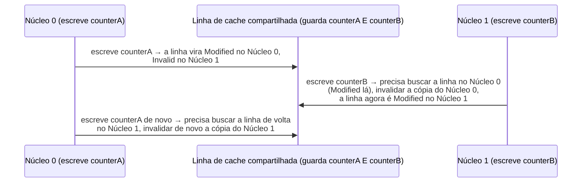

## Objetivos de Aprendizagem

- Definir com precisão o falso compartilhamento: um problema de desempenho causado pela granularidade da linha de cache, e não um bug de correção.
- Rastrear, usando os estados MESI, exatamente por que duas threads que escrevem em variáveis sem relação na mesma linha de cache invalidam uma à outra repetidamente.
- Distinguir o falso compartilhamento (duas variáveis sem relação dividindo uma linha por coincidência) do compartilhamento verdadeiro (duas threads cooperando de fato sobre a mesma variável).
- Identificar o falso compartilhamento num layout de código concreto e explicar a correção padrão (padding ou alinhamento).
- Explicar por que o falso compartilhamento costuma ser invisível numa revisão de código focada só em correção e por que é o profiling de desempenho que de fato o revela.

## Contexto e Motivação

O conceito anterior construiu o MESI especificamente para garantir a correção: não importa como as caches privadas dos núcleos interajam, todo núcleo sempre vê uma visão consistente e combinada da memória. O falso compartilhamento é o que acontece quando essa garantia de correção funciona exatamente como projetada (nada nunca está errado, nenhum núcleo jamais lê um valor velho) e, mesmo assim, o desempenho sofre muito, só por causa de um detalhe com o qual a garantia de correção do MESI não tem motivo para se importar: o tamanho fixo de uma linha de cache e quais variáveis sem relação por acaso caem dentro da mesma linha.

Esta é uma das lições mais importantes na prática de toda a disciplina para quem vai escrever código multithread real depois (em `systems/parallel-computing` ou além): um programa pode ser revisado quanto à correção, passar em todo teste e nunca produzir uma resposta errada, e ainda assim rodar drasticamente mais devagar do que deveria, por um motivo que não tem nada a ver com a lógica do programa e tudo a ver com a granularidade da linha de cache interagindo com o MESI.

## Teoria Central

### O cenário: duas variáveis sem relação, uma linha de cache

Lembre que uma cache não acompanha variáveis individuais: ela acompanha blocos de tamanho fixo (comumente 64 bytes em hardware real). Se duas variáveis genuinamente sem relação (digamos, dois contadores separados, cada um incrementado de forma independente por uma thread diferente num núcleo diferente, sem nenhuma ligação lógica entre eles) por acaso forem dispostas perto o bastante na memória para cair no *mesmo* bloco de 64 bytes, a cache (e o MESI) não tem como saber nem como se importar com o fato de que o programa nunca pretendeu que elas fossem relacionadas.

### Rastreando o tráfego de coerência que o MESI é forçado a gerar

Suponha que a Thread 0 (no Núcleo 0) incremente repetidamente `counterA` e que a Thread 1 (no Núcleo 1) incremente repetidamente `counterB`, e que as duas variáveis morem na mesma linha de cache:



Cada escrita (mesmo que só toque `counterA` ou `counterB`, nunca os dois) força a *linha inteira* a quicar, pela maquinaria real de invalidação e nova busca do MESI do conceito anterior, de um lado para o outro entre as caches privadas dos dois núcleos. A escrita de nenhuma das threads tem qualquer relação lógica com a variável da outra, e ainda assim cada uma paga o custo completo de uma transferência de linha de cache entre núcleos em praticamente todo incremento.

### Por que isso é um bug de desempenho, e não de correção

Em nenhum ponto desta sequência alguma das threads lê um valor velho ou errado da sua própria variável: a garantia de coerência do MESI vale perfeitamente o tempo todo. `counterA` e `counterB` são dados completamente independentes e não compartilhados do ponto de vista do programa; nada sobre os seus *valores* corre risco. Todo o custo é o próprio *tráfego* de coerência: transferir repetidamente uma linha de cache inteira entre as caches privadas dos núcleos, a cada escrita, só por causa de onde o compilador ou o programador por acaso colocou essas duas variáveis sem relação na memória.

### A correção: padding ou alinhamento

A correção padrão é garantir que as duas variáveis escritas de forma independente não dividam uma linha de cache, para começo de conversa: ou inserindo bytes de preenchimento (padding) não usados entre elas (o suficiente para empurrar a segunda variável para outro bloco alinhado de 64 bytes), ou, em linguagens que suportam isso, alinhando explicitamente cada variável à sua própria fronteira de linha de cache. Isso acrescenta uma pequena quantidade de memória desperdiçada (o próprio padding nunca é usado para nada) em troca de eliminar por completo as transferências repetidas de linha entre núcleos, já que agora cada variável mora numa linha que nenhuma variável escrita ativamente por outro núcleo compartilha.

## Exemplos Resolvidos

### Exemplo 1: uma struct disposta de forma a causar falso compartilhamento

```c
struct Counters {
    long counterA;   /* escrito só pela thread 0 */
    long counterB;   /* escrito só pela thread 1 */
};
```

Num sistema com `long` de 8 bytes e linha de cache de 64 bytes, `counterA` e `counterB` estão a só 8 bytes de distância, confortavelmente dentro da mesma linha de 64 bytes (que poderia guardar até 8 desses `long`). Cada escrita em qualquer um dos campos, por qualquer uma das threads, força a linha inteira (incluindo o campo sem relação da *outra* thread) a pingar entre as caches dos dois núcleos, exatamente como rastreado na seção de Teoria Central.

### Exemplo 2: a mesma struct, corrigida com padding

```c
struct Counters {
    long counterA;
    char padding[56];   /* empurra counterB para uma NOVA linha de 64 bytes */
    long counterB;
};
```

Com 56 bytes de padding não usado inseridos entre os dois campos, `counterA` (no deslocamento 0) e `counterB` (no deslocamento 64) agora caem em duas linhas de cache de 64 bytes totalmente diferentes. As escritas da Thread 0 em `counterA` só afetam a primeira linha; as escritas da Thread 1 em `counterB` só afetam a segunda; nenhum tráfego de coerência é trocado entre elas, já que o MESI (do conceito anterior) nunca precisa invalidar uma linha que o outro núcleo nem estava tocando.

### Exemplo 3: compartilhamento verdadeiro vs. falso compartilhamento, lado a lado

```text
Cenário A: compartilhamento VERDADEIRO:
  Duas threads leem E escrevem o MESMO contador lógico (por exemplo, um total
  compartilhado que as duas threads incrementam). O tráfego de coerência aqui é
  inevitável e CORRETO: as threads de fato precisam ver as atualizações uma da outra
  nesse único valor compartilhado; o custo é real, mas eliminá-lo quebraria a
  correção, e não só o desempenho.

Cenário B: FALSO compartilhamento (este conceito):
  Duas threads escrevem em contadores DIFERENTES, logicamente sem relação, que só
  por acaso dividem uma linha de cache. O tráfego de coerência aqui é um puro
  acidente de desempenho: eliminá-lo (com padding, como no Exemplo 2)
  não muda nada na correção do programa, já que as duas
  variáveis nunca foram logicamente relacionadas, para começo de conversa.
```

A distinção importa porque a correção é completamente diferente em cada caso: o custo do compartilhamento verdadeiro só pode ser reduzido mudando o *algoritmo* (menos atualizações compartilhadas de fato, outra estratégia de sincronização, território genuíno de `systems/parallel-computing`); o custo do falso compartilhamento é eliminado puramente mudando o *layout de memória*, sem nenhuma mudança no que o programa faz logicamente.

## Equívocos Comuns e Armadilhas

- **"Falso compartilhamento significa que o programa calcula uma resposta errada."** Nunca: a garantia de coerência do MESI (conceito anterior) vale o tempo todo; o falso compartilhamento é puramente um custo de desempenho por transferências desnecessárias de linhas de cache, e não um defeito de correção de qualquer tipo.
- **"Vale sempre a pena acrescentar padding contra falso compartilhamento em todo lugar, de forma defensiva."** O padding custa memória real, e só vale a pena acrescentá-lo onde o profiling de fato mostrou um custo mensurável de falso compartilhamento. Acrescentar padding a todo campo de struct por reflexo desperdiça memória por um problema que, conforme o Exemplo 3, só existe especificamente quando variáveis escritas de forma independente por acaso colidem na mesma linha.
- **"Um revisor de código lendo o fonte para verificar a correção lógica pegaria isso naturalmente."** É justamente por isso que o falso compartilhamento é um bug notoriamente fácil de deixar passar: a struct do Exemplo 1 está completamente correta como escrita, e nada na leitura do código revela a coincidência de layout de memória; ele normalmente só aparece por meio de ferramentas de profiling de desempenho capazes de observar diretamente o tráfego de coerência no nível das linhas de cache.
- **"Isso só importa para código exótico e incomum."** Dois contadores independentes incrementados por threads diferentes (exatamente o padrão dos exemplos deste conceito) é um padrão real extremamente comum (estatísticas por thread, contadores fragmentados, acumulação paralela), e é exatamente por isso que o falso compartilhamento é um bug de desempenho bem conhecido e redescoberto com frequência em sistemas multithread reais.

## Resumo

O falso compartilhamento ocorre quando duas threads escrevem em variáveis logicamente sem relação que por acaso dividem uma única linha de cache. O protocolo de coerência MESI (conceito anterior) força, corretamente e por necessidade, essa linha compartilhada a quicar entre as caches privadas dos núcleos que escrevem a cada escrita, mesmo que os dados de nenhuma das threads corram de fato risco de uma leitura velha, o que torna isso puramente um custo de desempenho, sem implicação nenhuma de correção. A correção padrão (padding ou alinhamento explícito para separar as variáveis que colidem em linhas de cache diferentes) elimina o tráfego de coerência desnecessário sem nenhuma mudança na lógica do programa, em nítido contraste com o custo de coerência genuinamente inevitável, e necessário para a correção, do compartilhamento verdadeiro. Tendo coberto o pipelining, a hierarquia de memória e a coerência multinúcleo (três das quatro grandes técnicas desta disciplina para melhorar um único pipeline simples), a disciplina se volta para a quarta: um eixo completamente diferente de paralelismo, o SIMD, começando pela Taxonomia de Flynn.

## Documentation Links

- [CoffeeBeforeArch: Performance Implications of False Sharing](https://coffeebeforearch.github.io/2019/12/28/false-sharing-tutorial.html): um tutorial real, com medições, que demonstra o custo de desempenho do falso compartilhamento e a correção com padding em hardware de verdade.
- [CMU 15-418: Snooping Cache Coherence Lecture](https://www.cs.cmu.edu/afs/cs/academic/class/15418-s12/www/lectures/11_coherence2.pdf): a mesma mecânica de coerência MESI que este conceito rastreia como a causa subjacente do custo do falso compartilhamento.
