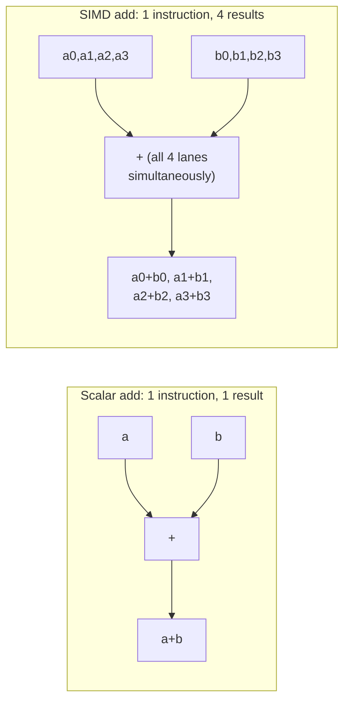

## Learning Objectives

- State Flynn's four categories (SISD, SIMD, MISD, MIMD) in terms of instruction streams and data streams.
- Classify the single-cycle/pipelined CPU from earlier in this discipline, and the multicore chip from the previous cluster, correctly within Flynn's taxonomy.
- Explain what a SIMD instruction does differently from an ordinary scalar instruction, using a concrete vector-add example.
- Explain data-level parallelism as a distinct axis from the thread-level parallelism (MIMD) just covered, and why a program can exploit both simultaneously.
- Identify a real, named SIMD instruction set extension, and connect it to a specific kind of workload it suits well.

## Context & Motivation

Every technique in the Multicore & Cache Coherence cluster attacked the same kind of parallelism: several independent streams of instructions (one per core, or one per thread), each potentially doing completely different work, coordinated through shared memory and MESI. Flynn's taxonomy, a classification scheme dating back to 1966 and still the standard vocabulary ACM/IEEE CS2013's Architecture and Organization Knowledge Area uses for this exact distinction, makes explicit that this is only *one* of several fundamentally different ways a machine can be parallel — and this concept opens a cluster about a genuinely different one: SIMD, where a *single* instruction stream operates on many data elements simultaneously.

Understanding this distinction precisely matters because the two forms of parallelism are not competitors — a real modern processor almost always exploits both at once (several cores, each also capable of SIMD instructions), and confusing them (or assuming a solution to one automatically solves the other) is a common, avoidable source of misunderstanding about what a given piece of hardware, or a given optimization, actually does.

## Core Theory

### Flynn's four categories

Flynn's taxonomy classifies a machine by two independent axes: how many **instruction streams** it processes, and how many **data streams** each instruction stream operates on:

```text
                    Single Data Stream        Multiple Data Streams
Single Instruction   SISD                      SIMD
  Stream              (ordinary sequential      (one instruction, many
                       CPU — this discipline's   data lanes at once)
                       single-cycle/pipelined
                       CPU)

Multiple Instruction MISD                      MIMD
  Streams              (rare — no mainstream     (multicore/multiprocessor
                        real design fits this     — the previous cluster's
                        cleanly)                  entire subject)
```

- **SISD** (Single Instruction, Single Data): one instruction stream, operating on one piece of data at a time — the pipelined RISC-V CPU built across this discipline's very first cluster, before multicore was ever introduced, is a textbook SISD machine.
- **SIMD** (Single Instruction, Multiple Data): one instruction stream, but each instruction operates on several data elements simultaneously, in lockstep — this concept's subject.
- **MISD** (Multiple Instruction, Single Data): multiple instruction streams operating on the *same* single data stream — a genuinely rare category with essentially no mainstream real processor design, included in the taxonomy mostly for logical completeness.
- **MIMD** (Multiple Instruction, Multiple Data): multiple independent instruction streams, each with its own data — precisely what the entire Multicore & Cache Coherence cluster just covered: several cores, each fetching and executing its own instructions on its own data, coordinated only through shared memory and coherence.

### SIMD: one instruction, many data lanes

An ordinary scalar instruction — every instruction this discipline's pipeline has built and traced so far — operates on a single pair of operands: `add x1, x2, x3` computes exactly one sum. A SIMD instruction, by contrast, packs several data elements into one wide register and applies the *same* operation to all of them simultaneously, in a single instruction:



A single SIMD add instruction operating on 4-element vectors performs the equivalent of 4 separate scalar additions, but issues and executes as one instruction — reducing effective Instruction Count (from this discipline's very first concept, the Iron Law) by roughly a factor of 4 for exactly this kind of uniform, per-element work, with no change needed to CPI or clock cycle time at all.

### Data-level parallelism: a genuinely different axis from MIMD

The parallelism SIMD exploits — called **data-level parallelism** — is fundamentally different from the **thread-level parallelism** MIMD/multicore exploits. MIMD parallelism comes from having *multiple independent instruction streams* doing potentially unrelated work; SIMD parallelism comes from having *one* instruction stream apply the *same* operation uniformly across many data elements at once. A real modern processor combines both freely and simultaneously: an 8-core chip where each core also supports 4-wide SIMD instructions can, in principle, be operating on 32 data elements at once (8 cores × 4 SIMD lanes each) — MIMD and SIMD parallelism multiply together rather than substituting for each other.

### Real SIMD instruction set extensions

Real processors expose SIMD through named instruction set extensions — x86-64 processors (already covered in `c-and-assembly`) support extensions like SSE and AVX, adding wide vector registers and instructions that operate on several packed integers or floating-point values at once; ARM processors have their own equivalent (NEON). These extensions suit **data-parallel workloads** especially well — code where the exact same simple operation is applied uniformly across a large array of independent data, such as image processing (the same brightness adjustment applied to every pixel), audio processing, and the numerical inner loops of scientific and machine-learning code.

## Worked Examples

### Example 1: Classifying three machines from this discipline using Flynn's taxonomy

```text
Machine                                    Flynn classification
------------------------------------------  ------------------------
The single-cycle CPU from Digital Logic     SISD (one instruction
& Computer Organization                      stream, one datum at a time)

The 8-core multicore chip from the          MIMD (multiple independent
Multicore & Cache Coherence cluster          instruction streams, each
                                              with its own data)

A single core executing a 4-wide SIMD       SIMD (one instruction
add instruction                              stream, 4 data elements
                                              processed per instruction)
```

The same physical 8-core chip, if each core also supports SIMD instructions, is genuinely both MIMD (across cores) and SIMD (within each core) at the same time — these classifications describe different aspects of the same machine, not mutually exclusive categories for the whole system.

### Example 2: Instruction count savings from vectorizing a loop

A loop adds two 1,000-element arrays element-by-element, currently compiled to scalar instructions:

```text
Scalar version: 1,000 add instructions (one per pair of elements)
SIMD version (4-wide): 1,000 / 4 = 250 add instructions
                        (each instruction adds 4 pairs simultaneously)
```

Applying this discipline's very first Iron Law concept: this reduces the effective Instruction Count for this loop's arithmetic by 4×, with no change to CPI or clock cycle time — a direct, quantifiable performance gain from data-level parallelism alone, achievable without adding a single additional core.

### Example 3: A workload that suits SIMD poorly

```python
def process(x):
    if x > 0:
        return expensive_positive_path(x)
    else:
        return expensive_negative_path(x)

results = [process(x) for x in huge_array]   # each element may take a
                                               # DIFFERENT code path
```

SIMD's core assumption — that the *same* operation applies uniformly to every data lane in a single instruction — breaks down when different elements need genuinely different operations, as this branching example shows. Some elements would need `expensive_positive_path` executed for their lane while others simultaneously need `expensive_negative_path` — a single SIMD instruction cannot express two different operations for two different lanes at once. This exact limitation, and how GPU hardware specifically handles this case (at some real cost), is precisely what the next concept, GPU Architecture and the SIMT Execution Model, addresses.

## Common Misconceptions & Pitfalls

- **"SIMD and multicore are two ways of describing the same kind of parallelism."** They are genuinely different axes — MIMD (multicore) exploits independent instruction streams doing potentially unrelated work; SIMD exploits one instruction stream applying uniform work across many data elements. Example 1 shows the same chip can be classified as both simultaneously, for different reasons.
- **"Using more cores automatically also gives you SIMD parallelism, or vice versa."** They are independent hardware features that must each be explicitly exploited — a program using multiple threads (MIMD) gets no SIMD speedup unless its per-thread code is also vectorized (as in Example 2), and a program relying purely on SIMD instructions within one thread gets no benefit from the chip's other cores sitting idle.
- **"SIMD makes any loop faster, automatically."** Example 3 shows a genuine limitation — data-dependent branching, where different elements need different operations, doesn't map cleanly onto SIMD's "one instruction, many uniform lanes" model at all, which is exactly the gap the next concept's SIMT model exists to narrow (at a real cost, not for free).
- **"MISD is a common, important category that real designs use."** It is included in Flynn's taxonomy mostly for logical completeness — genuinely mainstream MISD hardware essentially does not exist in practice, unlike the other three categories, which all correspond to real, widely deployed designs already covered in this discipline.

## Summary

Flynn's taxonomy classifies machines by instruction and data stream count — SISD (this discipline's original single-core pipeline), SIMD (one instruction, many data lanes at once), MISD (a rare, mostly theoretical category), and MIMD (the multicore architecture the previous cluster covered in full) — and SIMD's data-level parallelism is a genuinely different axis from MIMD's thread-level parallelism, one a real processor exploits simultaneously and independently, reducing effective Instruction Count (the Iron Law's first factor) for uniform, per-element workloads without needing any additional cores at all. SIMD's core limitation — every lane must perform the same operation in lockstep — breaks down for data-dependent branching, exactly the problem the next concept, GPU Architecture and the SIMT Execution Model, takes up directly, showing how GPU hardware extends this same data-parallel idea to handle divergent per-element control flow.

## Documentation Links

- [ACM/IEEE CS2013 — Architecture and Organization Knowledge Area](https://csed.acm.org/knowledge-areas-architecture-and-organization-ar-cs2013-version/) — introduces Flynn's taxonomy (SISD/SIMD/MIMD) as a required Architecture and Organization topic.
- [Harris & Harris — Digital Design and Computer Architecture, RISC-V Edition](https://shop.elsevier.com/books/digital-design-and-computer-architecture-risc-v-edition/harris/978-0-12-820064-3) — covers SIMD instruction extensions and Flynn's classification alongside the pipelined processor design this discipline builds on.
