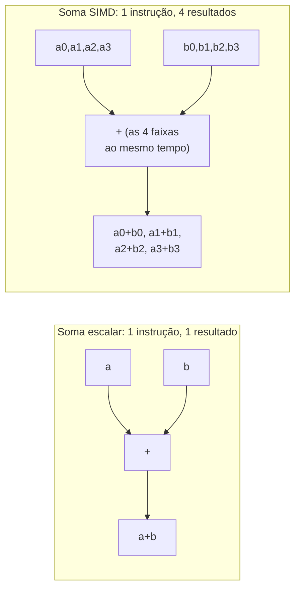

## Objetivos de Aprendizagem

- Enunciar as quatro categorias de Flynn (SISD, SIMD, MISD, MIMD) em termos de fluxos de instruções e fluxos de dados.
- Classificar corretamente na taxonomia de Flynn a CPU de ciclo único/com pipeline vista antes nesta disciplina e o chip multinúcleo do bloco anterior.
- Explicar o que uma instrução SIMD faz de diferente de uma instrução escalar comum, usando um exemplo concreto de soma de vetores.
- Explicar o paralelismo em nível de dados como um eixo distinto do paralelismo em nível de threads (MIMD) recém-visto e por que um programa pode explorar os dois ao mesmo tempo.
- Identificar uma extensão real e nomeada de conjunto de instruções SIMD e ligá-la a um tipo específico de carga de trabalho a que ela se adapta bem.

## Contexto e Motivação

Toda técnica do bloco de Multinúcleo e Coerência de Cache atacou o mesmo tipo de paralelismo: vários fluxos independentes de instruções (um por núcleo, ou um por thread), cada um fazendo potencialmente um trabalho completamente diferente, coordenados por meio da memória compartilhada e do MESI. A taxonomia de Flynn, um esquema de classificação de 1966 que ainda é o vocabulário padrão que a área de conhecimento Architecture and Organization do ACM/IEEE CS2013 usa exatamente para essa distinção, deixa explícito que essa é só *uma* entre várias formas fundamentalmente diferentes de uma máquina ser paralela, e este conceito abre um bloco sobre uma forma genuinamente diferente: o SIMD, em que um *único* fluxo de instruções opera sobre muitos elementos de dados ao mesmo tempo.

Entender essa distinção com precisão importa porque as duas formas de paralelismo não são concorrentes: um processador moderno real quase sempre explora as duas ao mesmo tempo (vários núcleos, cada um também capaz de executar instruções SIMD), e confundi-las (ou supor que uma solução para uma resolve automaticamente a outra) é uma fonte comum e evitável de mal-entendidos sobre o que um dado hardware, ou uma dada otimização, de fato faz.

## Teoria Central

### As quatro categorias de Flynn

A taxonomia de Flynn classifica uma máquina por dois eixos independentes: quantos **fluxos de instruções** ela processa e sobre quantos **fluxos de dados** cada fluxo de instruções opera:

```text
                       Fluxo de Dados Único       Múltiplos Fluxos de Dados
Fluxo de Instruções    SISD                       SIMD
  Único                 (CPU sequencial comum:     (uma instrução, muitas
                         a CPU de ciclo único/      faixas de dados ao mesmo tempo)
                         com pipeline desta
                         disciplina)

Múltiplos Fluxos de    MISD                       MIMD
  Instruções            (raro: nenhum projeto      (multinúcleo/multiprocessador:
                         real de uso geral se       todo o tema do
                         encaixa nisto de forma     bloco anterior)
                         limpa)
```

- **SISD** (Single Instruction, Single Data): um fluxo de instruções, operando sobre um dado por vez. A CPU RISC-V com pipeline construída ao longo do primeiríssimo bloco desta disciplina, antes de o multinúcleo sequer ser apresentado, é uma máquina SISD clássica.
- **SIMD** (Single Instruction, Multiple Data): um fluxo de instruções, mas cada instrução opera sobre vários elementos de dados ao mesmo tempo, em sincronia: o tema deste conceito.
- **MISD** (Multiple Instruction, Single Data): vários fluxos de instruções operando sobre o *mesmo* fluxo único de dados. Uma categoria genuinamente rara, sem praticamente nenhum projeto de processador real de uso geral, incluída na taxonomia principalmente por completude lógica.
- **MIMD** (Multiple Instruction, Multiple Data): vários fluxos de instruções independentes, cada um com seus próprios dados. Precisamente o que todo o bloco de Multinúcleo e Coerência de Cache acabou de cobrir: vários núcleos, cada um buscando e executando suas próprias instruções sobre seus próprios dados, coordenados só por meio da memória compartilhada e da coerência.

### SIMD: uma instrução, muitas faixas de dados

Uma instrução escalar comum (toda instrução que o pipeline desta disciplina construiu e rastreou até agora) opera sobre um único par de operandos: `add x1, x2, x3` calcula exatamente uma soma. Uma instrução SIMD, em contraste, empacota vários elementos de dados num registrador largo e aplica a *mesma* operação a todos eles ao mesmo tempo, numa única instrução:



Uma única instrução SIMD de soma operando sobre vetores de 4 elementos faz o equivalente a 4 somas escalares separadas, mas é emitida e executada como uma instrução, reduzindo a Contagem de Instruções efetiva (do primeiríssimo conceito desta disciplina, a Lei de Ferro) em cerca de 4× para exatamente esse tipo de trabalho uniforme, por elemento, sem precisar mudar em nada o CPI nem o tempo de ciclo de clock.

### Paralelismo em nível de dados: um eixo genuinamente diferente do MIMD

O paralelismo que o SIMD explora, chamado de **paralelismo em nível de dados**, é fundamentalmente diferente do **paralelismo em nível de threads** que o MIMD/multinúcleo explora. O paralelismo MIMD vem de ter *vários fluxos de instruções independentes* fazendo um trabalho potencialmente sem relação; o paralelismo SIMD vem de ter *um* fluxo de instruções aplicando a *mesma* operação de forma uniforme a muitos elementos de dados de uma vez. Um processador moderno real combina os dois livremente e ao mesmo tempo: um chip de 8 núcleos em que cada núcleo também suporta instruções SIMD de 4 faixas pode, em princípio, estar operando sobre 32 elementos de dados de uma vez (8 núcleos × 4 faixas SIMD cada); o paralelismo MIMD e o SIMD se multiplicam, em vez de se substituírem.

### Extensões reais de conjunto de instruções SIMD

Processadores reais expõem o SIMD por meio de extensões nomeadas de conjunto de instruções. Processadores x86-64 (já vistos em `c-and-assembly`) suportam extensões como SSE e AVX, que acrescentam registradores vetoriais largos e instruções que operam sobre vários inteiros ou valores de ponto flutuante empacotados de uma vez; processadores ARM têm seu próprio equivalente (NEON). Essas extensões servem especialmente bem a **cargas de trabalho com paralelismo de dados**: código em que exatamente a mesma operação simples é aplicada de forma uniforme a um grande array de dados independentes, como processamento de imagens (o mesmo ajuste de brilho aplicado a todo pixel), processamento de áudio e os laços internos numéricos de código científico e de machine learning.

## Exemplos Resolvidos

### Exemplo 1: classificando três máquinas desta disciplina pela taxonomia de Flynn

```text
Máquina                                       Classificação de Flynn
--------------------------------------------  ---------------------------
A CPU de ciclo único de Lógica Digital e       SISD (um fluxo de
Organização de Computadores                     instruções, um dado por vez)

O chip multinúcleo de 8 núcleos do bloco de    MIMD (vários fluxos de
Multinúcleo e Coerência de Cache                instruções independentes, cada
                                                 um com seus próprios dados)

Um único núcleo executando uma instrução de    SIMD (um fluxo de
soma SIMD de 4 faixas                           instruções, 4 elementos de dados
                                                 processados por instrução)
```

O mesmo chip físico de 8 núcleos, se cada núcleo também suportar instruções SIMD, é genuinamente MIMD (entre os núcleos) e SIMD (dentro de cada núcleo) ao mesmo tempo: essas classificações descrevem aspectos diferentes da mesma máquina, e não categorias mutuamente exclusivas para o sistema inteiro.

### Exemplo 2: economia na contagem de instruções ao vetorizar um laço

Um laço soma dois arrays de 1.000 elementos elemento a elemento, compilado hoje para instruções escalares:

```text
Versão escalar: 1.000 instruções add (uma por par de elementos)
Versão SIMD (4 faixas): 1.000 / 4 = 250 instruções add
                        (cada instrução soma 4 pares ao mesmo tempo)
```

Aplicando o primeiríssimo conceito desta disciplina, a Lei de Ferro: isso reduz em 4× a Contagem de Instruções efetiva da aritmética deste laço, sem nenhuma mudança no CPI nem no tempo de ciclo de clock. É um ganho de desempenho direto e quantificável vindo só do paralelismo em nível de dados, alcançável sem acrescentar um único núcleo.

### Exemplo 3: uma carga de trabalho que se adapta mal ao SIMD

```python
def process(x):
    if x > 0:
        return expensive_positive_path(x)
    else:
        return expensive_negative_path(x)

results = [process(x) for x in huge_array]   # cada elemento pode seguir um
                                               # caminho de código DIFERENTE
```

A suposição central do SIMD (a de que a *mesma* operação se aplica de forma uniforme a toda faixa de dados numa única instrução) desmorona quando elementos diferentes precisam de operações genuinamente diferentes, como mostra este exemplo com desvio. Alguns elementos precisariam que `expensive_positive_path` fosse executado na sua faixa, enquanto outros, ao mesmo tempo, precisariam de `expensive_negative_path`; uma única instrução SIMD não consegue expressar duas operações diferentes para duas faixas diferentes de uma vez. Essa limitação exata, e como o hardware de GPU trata especificamente esse caso (a um custo real), é precisamente o que o próximo conceito, Arquitetura de GPU e o Modelo de Execução SIMT, aborda.

## Equívocos Comuns e Armadilhas

- **"SIMD e multinúcleo são duas formas de descrever o mesmo tipo de paralelismo."** São eixos genuinamente diferentes: o MIMD (multinúcleo) explora fluxos de instruções independentes fazendo um trabalho potencialmente sem relação; o SIMD explora um fluxo de instruções aplicando trabalho uniforme a muitos elementos de dados. O Exemplo 1 mostra que o mesmo chip pode ser classificado como os dois ao mesmo tempo, por motivos diferentes.
- **"Usar mais núcleos também dá paralelismo SIMD automaticamente, ou vice-versa."** São recursos de hardware independentes que precisam ser explorados explicitamente, cada um: um programa que usa várias threads (MIMD) não ganha nenhum aumento de velocidade SIMD a menos que o código de cada thread também seja vetorizado (como no Exemplo 2), e um programa que depende só de instruções SIMD dentro de uma thread não se beneficia dos outros núcleos do chip, que ficam parados.
- **"O SIMD deixa qualquer laço mais rápido, automaticamente."** O Exemplo 3 mostra uma limitação genuína: desvios dependentes dos dados, em que elementos diferentes precisam de operações diferentes, não se encaixam de forma limpa no modelo "uma instrução, muitas faixas uniformes" do SIMD, e é exatamente essa lacuna que o modelo SIMT do próximo conceito existe para estreitar (a um custo real, e não de graça).
- **"O MISD é uma categoria comum e importante que projetos reais usam."** Ele está na taxonomia de Flynn principalmente por completude lógica: hardware MISD genuinamente de uso geral praticamente não existe na prática, ao contrário das outras três categorias, que correspondem todas a projetos reais e amplamente usados já vistos nesta disciplina.

## Resumo

A taxonomia de Flynn classifica máquinas pelo número de fluxos de instruções e de dados: SISD (o pipeline de núcleo único original desta disciplina), SIMD (uma instrução, muitas faixas de dados ao mesmo tempo), MISD (uma categoria rara, sobretudo teórica) e MIMD (a arquitetura multinúcleo que o bloco anterior cobriu por completo). O paralelismo em nível de dados do SIMD é um eixo genuinamente diferente do paralelismo em nível de threads do MIMD, que um processador real explora ao mesmo tempo e de forma independente, reduzindo a Contagem de Instruções efetiva (o primeiro fator da Lei de Ferro) em cargas de trabalho uniformes, por elemento, sem precisar de nenhum núcleo adicional. A limitação central do SIMD (toda faixa precisa fazer a mesma operação em sincronia) desmorona diante de desvios dependentes dos dados, exatamente o problema que o próximo conceito, Arquitetura de GPU e o Modelo de Execução SIMT, retoma diretamente, mostrando como o hardware de GPU estende essa mesma ideia de paralelismo de dados para tratar fluxos de controle divergentes por elemento.

## Documentation Links

- [ACM/IEEE CS2013: Architecture and Organization Knowledge Area](https://csed.acm.org/knowledge-areas-architecture-and-organization-ar-cs2013-version/): apresenta a taxonomia de Flynn (SISD/SIMD/MIMD) como tema obrigatório de Architecture and Organization.
- [Harris & Harris: Digital Design and Computer Architecture, RISC-V Edition](https://shop.elsevier.com/books/digital-design-and-computer-architecture-risc-v-edition/harris/978-0-12-820064-3): cobre extensões de instruções SIMD e a classificação de Flynn junto com o projeto de processador com pipeline sobre o qual esta disciplina se constrói.
