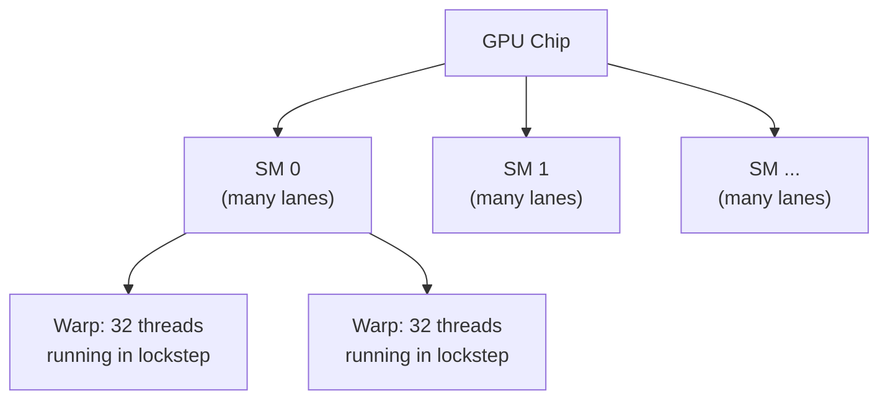
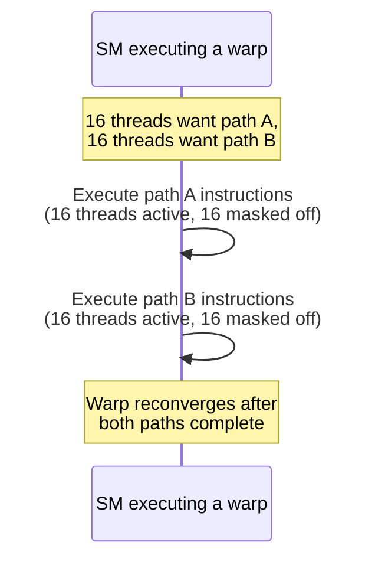

## Learning Objectives

- Describe the high-level structure of a GPU: many simple lanes organized into streaming multiprocessors (SMs).
- Define a warp, and explain why 32 threads executing in lockstep is the fundamental unit of GPU scheduling.
- Explain SIMT precisely, and how it differs from the strict SIMD model from the previous concept — specifically regarding per-thread predication.
- Trace what happens, step by step, when threads within a single warp take different branches (warp divergence), and compute its real performance cost.
- State explicitly what this concept does and does not cover, distinguishing GPU architecture (this concept) from the CUDA/OpenCL programming model (`systems/parallel-computing`).

## Context & Motivation

The previous concept ended with a genuine limitation of strict SIMD: every lane in a SIMD instruction must perform the exact same operation, which breaks down the moment a data-parallel workload contains a data-dependent branch — some elements needing one code path, others needing a different one. GPUs are built to run exactly this kind of workload — massively data-parallel code, but with real, if usually limited, per-element branching — and their architecture is the direct hardware answer to that gap: SIMT, "Single Instruction, Multiple Threads," NVIDIA's own term (used throughout its official CUDA documentation) for a model that is SIMD's close cousin, extended with a real mechanism for divergent branches.

This concept is scoped deliberately narrowly: it covers the GPU's *hardware execution model* — how it's actually structured to run many threads efficiently, and what that structure costs when threads disagree about which branch to take — and stops there. Writing actual GPU programs (CUDA, OpenCL kernels, the whole programming model of launching thousands of threads and reasoning about their cooperation) is real, substantial material this curriculum reserves for `systems/parallel-computing`, not yet reached.

## Core Theory

### GPU structure: thousands of simple lanes, organized into SMs

A GPU packs a very large number of simple processing lanes — far more, and individually far simpler, than the small number of complex, out-of-order-capable cores a CPU has — organized into groups called **streaming multiprocessors (SMs)**. Each SM manages many lanes and schedules work onto them; a GPU chip typically contains many SMs, each capable of running a substantial number of threads concurrently.



### The warp: the real unit of GPU scheduling

When a large number of threads is assigned to run on an SM, the SM subdivides them into fixed-size groups of 32 threads called **warps**. Every thread within a single warp executes the *exact same instruction*, at the *exact same time*, on its own individual piece of data — a warp is, mechanically, exactly a 32-wide SIMD unit, and this is precisely why the SIMD concepts from the previous concept generalize so directly to GPU architecture: a warp behaves like one very wide SIMD instruction stream, applied to 32 lanes simultaneously.

### SIMT vs. SIMD: per-thread predication for divergent branches

The genuine architectural addition SIMT makes over strict SIMD is a mechanism for handling the case the previous concept's Example 3 identified as SIMD's core weakness: what happens when different lanes (threads within a warp) need to take different branches? SIMT's answer is **predication with serialization**: when threads in a warp diverge (some taking one branch, others taking a different one), the hardware does *not* execute both paths truly in parallel — instead, it executes each divergent path **serially**, once per distinct path taken, with only the threads that actually need that specific path active (their results kept), while the other threads are masked off (disabled, doing no useful work, though the *instruction* still issues for them).



### The real cost: warp divergence

This mechanism is what lets SIMT tolerate genuinely per-thread branching, unlike strict SIMD — but it is not free. A warp that diverges into two distinct paths takes, in the worst case, the *combined* time of executing both paths serially, even though at any given moment half the lanes are doing no useful work at all. A warp where every thread takes the *same* path (the common case for genuinely uniform, embarrassingly data-parallel code) pays no divergence cost whatsoever and runs at full SIMD efficiency — which is exactly why GPU programming favors code structured to minimize divergence within a warp, even though the hardware can technically tolerate it when it occurs.

## Worked Examples

### Example 1: A warp with no divergence — full efficiency

```c
// GPU kernel: each thread adds one pair of array elements
result[i] = a[i] + b[i];
```

Every thread in every warp executes the identical single instruction (the add), with no branch at all — this runs at full SIMT/SIMD efficiency, every lane doing useful work on every cycle, exactly matching the previous concept's ideal SIMD case.

### Example 2: A warp with divergence — quantifying the cost

```c
// GPU kernel: threads take different paths based on their own data
if (x[i] > 0) {
    result[i] = expensive_positive_path(x[i]);   // takes 100 cycles
} else {
    result[i] = expensive_negative_path(x[i]);    // takes 80 cycles
}
```

Suppose, within one 32-thread warp, 16 threads have `x[i] > 0` and 16 don't:

```text
Without divergence handling (impossible under SIMT, shown for contrast):
  if all threads could somehow take their own path truly in parallel,
  total time ≈ max(100, 80) = 100 cycles

WITH real SIMT serialization:
  Path A (16 threads active, 16 masked): 100 cycles
  Path B (16 threads active, 16 masked): 80 cycles
  Total warp time = 100 + 80 = 180 cycles
```

The divergent warp takes 180 cycles — nearly double the 100 cycles it would take if every thread in the warp had happened to agree on the same path — a real, direct, and entirely typical cost of warp divergence, paid specifically because the hardware must serialize distinct paths rather than genuinely run them concurrently.

### Example 3: Distinguishing what this concept covers from what it doesn't

```text
This concept (GPU architecture / SIMT):
  - What a warp is, and why 32 threads run in lockstep
  - How divergence is handled (serialization + masking) and what it costs
  - Why uniform, non-divergent code runs at full efficiency

NOT this concept — reserved for `systems/parallel-computing`:
  - How to actually WRITE a CUDA or OpenCL kernel
  - How to launch a grid of thread blocks, and reason about their sizing
  - Memory management between a CPU host and GPU device
  - Synchronization primitives specific to GPU programming
```

A reader who understands this concept fully can explain *why* a given GPU kernel might run slower than expected (divergence, from Example 2) without yet knowing how to write that kernel in the first place — exactly the intended, deliberately architecture-only scope of this concept.

## Common Misconceptions & Pitfalls

- **"SIMT is just another name for SIMD."** SIMT specifically adds per-thread predication and serialized divergent-path execution, a real mechanism strict SIMD (as covered in the previous concept) has no equivalent for at all — this is the genuine, substantive difference, not a naming preference.
- **"A GPU always executes every thread truly independently and in parallel, regardless of branching."** Example 2 shows the opposite: threads within the *same warp* that diverge are serialized, each path executed with the other lanes masked off — true independent execution only happens *across* different warps, not within one diverging warp.
- **"Warp divergence causes incorrect results."** It never does — every thread's correct path is eventually executed with correct results for that thread; the cost is purely in time (Example 2's near-doubling), exactly parallel to how false sharing (an earlier concept) was a real performance cost with zero correctness impact.
- **"Understanding this concept means you know how to write GPU code."** As Example 3 makes explicit, this concept covers only the hardware execution model — the actual programming model (CUDA/OpenCL, kernel launches, host/device memory management) is real, substantial, separate material for `systems/parallel-computing`.

## Summary

A GPU organizes many simple lanes into streaming multiprocessors, which schedule threads in fixed groups of 32 called warps — mechanically a 32-wide SIMD unit, extended by SIMT's real addition: per-thread predication that lets divergent branches within a warp be handled by serializing each distinct path with the uninvolved threads masked off, at a real, quantifiable time cost (Example 2) rather than true parallel execution of both paths. Uniform, non-divergent code runs at full SIMD-equivalent efficiency, making GPU architecture a natural fit for exactly the embarrassingly data-parallel workloads (image and audio processing, numerical inner loops) the previous SIMD concept already identified as SIMD's sweet spot, extended to tolerate the occasional real branch. Having now covered all four of this discipline's major techniques beyond the basic single-cycle CPU — pipelining, the memory hierarchy, multicore/coherence, and SIMD/GPU architecture — the discipline closes with a capstone tying the historical and technical threads between them together.

## Documentation Links

- [NVIDIA CUDA Programming Guide — Advanced Kernel Programming (SIMT/Warps)](https://docs.nvidia.com/cuda/cuda-programming-guide/03-advanced/advanced-kernel-programming.html) — NVIDIA's own primary documentation defining SIMT, warps, and warp divergence.
- [ACM/IEEE CS2013 — Architecture and Organization Knowledge Area](https://csed.acm.org/knowledge-areas-architecture-and-organization-ar-cs2013-version/) — lists vector processors and GPUs as a required Performance Enhancements topic.
